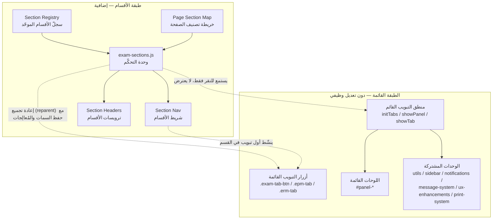
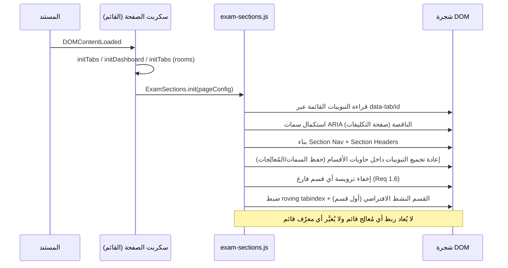

# Design Document — إعادة تصميم مركز الامتحان (Exam Center Redesign)

## Overview

هذه الوثيقة تصف التصميم التقني لإعادة تنظيم هندسة المعلومات والواجهة (UI/UX + IA) لثلاث صفحات قائمة لتدبير مركز الامتحان، اعتمادًا على المتطلّبات المعتمدة في `requirements.md`. العمل **واجهة أمامية بالكامل**: إعادة تصنيف العناصر القائمة ضمن ثلاثة أقسام مفاهيمية موحّدة (المدخلات / الإعدادات / الإنتاج)، وإضافة طبقة عرض وتنقّل فوق آلية التبويبات القائمة، **دون أي تعديل** على منطق العمل أو نموذج البيانات أو استدعاءات الواجهة الخلفية.

### المبدأ التصميمي الأساسي

الفكرة المحورية: **طبقة أقسام (Sections Layer) تُغلِّف التبويبات القائمة دون استبدالها**. نُبقي على أزرار التبويب ولوحاتها ومعرّفاتها ومُعالِجات أحداثها كما هي، ونضيف فوقها:

1. **سجلّ أقسام موحّد (Section Registry)** — مصدر وحيد للحقيقة (single source of truth) يعرّف الأقسام الثلاثة (المفتاح، الأيقونة، العنوان العربي، الوصف، لون مستمدّ من متغيّرات CSS).
2. **خريطة تصنيف لكل صفحة (Page Section Map)** — تربط كل تبويب قائم بالقسم الذي ينتمي إليه.
3. **شريط الأقسام (Section Nav)** — مكوّن تنقّل علوي يعرض الأقسام المرئية ويبرز القسم النشط.
4. **ترويسات الأقسام (Section Headers)** — عنوان بصري (أيقونة + عنوان + وصف + لون) يتصدّر مجموعة تبويبات كل قسم.
5. **وحدة تحكّم مشتركة (`js/exam-sections.js`)** — تبني هذه المكوّنات وتزامن القسم النشط وتضيف تنقّل لوحة المفاتيح، دون استبدال دوال التبويب القائمة (`initTabs` / `showPanel` / `showTab`).

### قرارات تصميمية رئيسية ومخاطر موثّقة

| # | القرار / المسألة | الحل المعتمد |
|---|---|---|
| D1 | **تعارض في الترتيب**: المتطلّب 1.4 يفرض الترتيب_المعياري (المدخلات ← الإعدادات ← الإنتاج)، بينما المتطلّب 3.3 يفرض في صفحة_المدخلات عرض الإعدادات أولًا ثم المدخلات. | يُعتمد المتطلّب الأخصّ (3.3) لصفحة_المدخلات عبر **تجاوز ترتيب على مستوى الصفحة (per-page order override)**. يبقى الترتيب_المعياري هو الافتراضي لبقية الصفحات. **هذا التعارض موثّق ويُعرض على المستخدم لإقراره أو تعديل المتطلّبات.** |
| D2 | تبويبات صفحة_التكليفات (`.erm-tab`) تفتقر إلى `id` و`role="tab"` و`aria-controls` و`aria-selected`، بينما يتطلّب المتطلّب 9 أدوار ARIA كاملة. | تُضاف هذه السمات **إضافةً (additive)** بمعرّفات اشتقاقية ثابتة (`tab-btn-summary`، `tab-btn-invitations`، `tab-btn-attendance`) دون حذف أو تغيير أي معرّف قائم، فلا يقع انحدار بالنسبة للمتطلّب 6.1. |
| D3 | إعادة جمع التبويبات داخل حاويات أقسام تتطلّب نقلها في شجرة DOM (reparenting). | نقل العقد عبر `appendChild`/`insertBefore` **يحافظ على مُعالِجات الأحداث المربوطة بـ `addEventListener` وعلى كل السمات**؛ والدوال القائمة تستعلم عن العناصر بالأصناف/المعرّفات عالميًا فتظل تعمل. يُغطّى هذا باختبارات عدم انحدار صريحة (المتطلّب 6.2/6.3). |
| D4 | إضافة ملف JS جديد. | `js/exam-sections.js` وحدة **طرف أول (first-party)**، وليست تبعية خارجية، فلا تخالف المتطلّب 10.3 (صفر تبعيات خارجية جديدة)، ولا تعدّل الوحدات المشتركة المذكورة في المتطلّب 6.4. |
| D5 | منطق تبديل اللوحات قائم بثلاث نسخ مختلفة عبر الصفحات. | لا نوحّده ولا نعيد كتابته (تجنّبًا للانحدار). تكتفي طبقة الأقسام بمزامنة إبراز القسم النشط بالاستماع لنقرات التبويب القائمة، دون اعتراض سلوكها. |

## Architecture

### المخطّط الطبقي



### تسلسل التهيئة عند تحميل الصفحة



### استراتيجية التخطيط (Layout) عبر الصفحات

- كل قسم يُعرض ككتلة: `Section Header` (ترويسة) يليها `role="tablist"` خاص بتبويبات القسم، مع ربط `aria-labelledby` من القائمة إلى ترويستها.
- يُعرض `Section Nav` أعلى الكتل لإتاحة التنقّل السريع بين الأقسام وإبراز القسم النشط.
- التدفّق كله ضمن `main.main-content` القائم، مع الإبقاء على `header.header` و`aside.sidebar` و`#theme-toggle` في مواضعها وسلوكها (المتطلّب 2.5، 10.5).

## Components and Interfaces

### 1) سجلّ الأقسام الموحّد (Section Registry) — مصدر الحقيقة الوحيد

يُعرّف مرة واحدة داخل `js/exam-sections.js` ويُستخدم في الصفحات الثلاث دون تكرار (يطابق نمط «مصدر وحيد للحقيقة» المتبع في المشروع).

| المفتاح | العنوان (عربي) | الوصف | أيقونة FontAwesome | لون القسم (متغيّر CSS) |
|---|---|---|---|---|
| `inputs` | المدخلات | إدخال البيانات الخام | `fa-keyboard` | `var(--color-primary)` |
| `settings` | الإعدادات | ضبط القواعد والمعايير | `fa-sliders` | `var(--color-warning)` |
| `production` | الإنتاج | معاينة المخرجات وطباعتها | `fa-print` | `var(--color-success)` |

- الأيقونات والعناوين والألوان مختلفة بين الأقسام الثلاثة (المتطلّب 1.2، 1.3).
- الألوان الثلاثة (أزرق/كهرماني/أخضر) متغيّرات قائمة تتبدّل قيمها مع `data-theme` (المتطلّب 8.1).
- لون القسم يُستعمل للأيقونة وللحدّ/المؤشّر فقط (عنصر غير نصّي ⇒ تباين ≥ 3:1)، بينما يبقى نصّ العنوان بلون `var(--color-text-main)` لضمان تباين ≥ 4.5:1 (المتطلّب 8.4، 8.5).

### 2) شريط الأقسام (Section Nav)

- عنصر `<nav aria-label="التنقّل بين أقسام الصفحة">` يحوي زرًّا واحدًا لكل قسم مرئي: أيقونة + عنوان عربي + لون القسم.
- القسم النشط يُعلَّم بـ `aria-current="true"` ومؤشّر بصري موحّد (شريط/خلفية بلون القسم) **مصحوب بدلالة غير لونية** (الأيقونة + النص + `aria-current`) (المتطلّب 2.4، 9.8).
- النقر على عنصر قسم ينشّط أول تبويب في ذلك القسم (تنقّل داخل الصفحة) عبر استدعاء `.click()` على التبويب القائم — فيستفيد من المنطق القائم دون اعتراضه.
- ترتيب المكوّنات وتباعدها وأحجامها متطابق عبر الصفحات الثلاث (المتطلّب 2.1) لأنه يُبنى من نفس الوحدة والقالب.

### 3) ترويسة القسم (Section Header)

- بنية: `<h2 class="exam-section-header">` (عنوان دلالي يسمح بربط `aria-labelledby`) يحوي `<i>` الأيقونة (`aria-hidden="true"`) + نص العنوان + وصفًا اختياريًا.
- تُشتقّ ألوانها وحوافها وظلالها من المتغيّرات القائمة فقط (`--color-surface`، `--color-text-main`، `--radius-md`، `--shadow-card`…) دون أي قيمة ثابتة خارجها (المتطلّب 2.2، 10.2).
- تُخفى ترويسة القسم الفارغ (لا يحوي أي تبويب مُصنّف) مع الحفاظ على ترتيب الأقسام المتبقّية (المتطلّب 1.6).

### 4) واجهة وحدة التحكّم `ExamSections`

```js
// js/exam-sections.js  (first-party، صفر تبعيات خارجية جديدة)
window.ExamSections = {
  /**
   * @param {Object}   cfg
   * @param {string[]} cfg.order      ترتيب عرض الأقسام في هذه الصفحة (تجاوز الترتيب_المعياري عند اللزوم)
   * @param {Array<{tab:string, section:'inputs'|'settings'|'production'}>} cfg.map
   *        خريطة تصنيف التبويبات: tab = قيمة data-tab للتبويب القائم
   * @param {string}   cfg.tabSelector    محدِّد أزرار التبويب القائمة (مثل '.exam-tab-btn')
   * @param {string}   cfg.tablistSelector محدِّد حاوية التبويبات القائمة
   * @param {boolean} [cfg.ensureAria=false] استكمال سمات ARIA الناقصة (صفحة التكليفات)
   */
  init(cfg) { /* idempotent: يُنفَّذ مرة واحدة فقط */ },

  /** يعيد مفتاح القسم النشط حاليًا بناءً على التبويب النشط */
  getActiveSection() { /* ... */ },
};
```

#### مسؤوليات الوحدة

1. قراءة التبويبات القائمة عبر `cfg.tabSelector` و`data-tab`.
2. استكمال سمات ARIA الناقصة عند `ensureAria` (صفحة التكليفات): إضافة `id`، `role="tab"`، `aria-controls`، `aria-selected`، و`role="tabpanel"` + `aria-labelledby` على اللوحات (إضافةً فقط، دون تغيير القائم).
3. بناء `Section Nav` و`Section Headers` وفق `cfg.order` و`Section Registry`.
4. إعادة تجميع كل تبويب داخل `role="tablist"` الخاص بقسمه (مع حفظ كل السمات والمُعالِجات).
5. إخفاء ترويسة أي قسم لا يحوي تبويبات (المتطلّب 1.6).
6. مزامنة القسم النشط: الاستماع لنقر التبويبات القائمة وتحديث إبراز `Section Nav` (دون اعتراض منطق اللوحات).
7. إدارة تنقّل لوحة المفاتيح (roving tabindex) عبر كامل حلقة التبويبات في الصفحة وفق اتجاه RTL مع التفاف دائري (المتطلّب 9.3، 9.4، 9.5).

### 5) أنماط CSS الخاصّة بالصفحة

- تُضاف ضمن كتلة `<style>` في كل صفحة (المتطلّب 10.4) متبعةً أسلوب التسمية القائم (`exam-section-*`)، مع اشتقاق كل القيم من المتغيّرات القائمة. لا تُعدَّل `css/tailwind-output.css` (المتطلّب 10.1).
- استعلامات الوسائط للتجاوب: ≥ 1024px صفّ واحد؛ 768–1023px قابلية وصول كاملة دون تمرير أفقي على مستوى الصفحة؛ < 768px (حتى 320px) التفاف أو تمرير داخلي ضمن الشريط؛ الجداول العريضة ضمن `.table-scroll-wrapper` القائم (المتطلّب 11).

## Data Models

> لا توجد بيانات أعمال؛ «نموذج البيانات» هنا هو عقد بنية الواجهة (UI contract) المستخدَم وقت التشغيل فقط.

### نموذج تعريف القسم (Section descriptor)

```js
{
  key: 'inputs' | 'settings' | 'production',
  title: string,        // عربي
  desc: string,         // عربي
  icon: string,         // صنف FontAwesome، مثل 'fa-keyboard'
  colorVar: string      // متغيّر CSS، مثل 'var(--color-primary)'
}
```

### إعداد كل صفحة (Page configuration)

```js
// exams-schedule.html  — تجاوز الترتيب (الإعدادات قبل المدخلات) حسب Req 3.3 [القرار D1]
{
  order: ['settings', 'inputs'],
  tabSelector: '.exam-tab-btn',
  tablistSelector: '.exam-tabs-header',
  map: [
    { tab: 'add-exam',    section: 'settings' },
    { tab: 'branches',    section: 'inputs' },
    { tab: 'rooms',       section: 'inputs' },
    { tab: 'supervisors', section: 'inputs' },
    { tab: 'candidates',  section: 'inputs' },
    { tab: 'team',        section: 'inputs' }
  ]
}

// exams-proctors.html — الترتيب_المعياري (الإعدادات ← الإنتاج)
{
  order: ['settings', 'production'],
  tabSelector: '.epm-tab',
  tablistSelector: '#epm-tabs',
  map: [
    { tab: 'scheduling', section: 'settings' },
    { tab: 'proctors',   section: 'settings' },   // يضمّ #dist-stepper دون تغيير
    { tab: 'candidates', section: 'settings' },
    { tab: 'attendance', section: 'production' }
  ]
}

// exams-rooms.html — قسم الإنتاج وحده (ensureAria لاستكمال ARIA الناقص) [القرار D2]
{
  order: ['production'],
  tabSelector: '.erm-tab',
  tablistSelector: '.erm-tabs',
  ensureAria: true,
  map: [
    { tab: 'summary',     section: 'production' },
    { tab: 'invitations', section: 'production' },
    { tab: 'attendance',  section: 'production' }
  ]
}
```

### ثوابت بنيوية يجب أن تظلّ صحيحة (Structural Invariants)

تُتحقَّق باختبارات DOM مثالية/تكاملية (وليست خصائص PBT — انظر استراتيجية الاختبار):

- I1: في كل لحظة يوجد تبويب نشط واحد فقط (`aria-selected="true"`) ولوحة ظاهرة واحدة فقط (المتطلّب 2.3، 3.6، 4.6، 5.5، 9.2).
- I2: كل تبويب موجود في قسم واحد فقط من الأقسام المعرّفة في خريطة الصفحة (المتطلّب 1.1).
- I3: تتطابق مجموعة معرّفات العناصر بعد إعادة التصميم مع المجموعة قبله، مضافًا إليها فقط المعرّفات الاشتقاقية الجديدة لتبويبات صفحة_التكليفات (المتطلّب 6.1، 6.6).
- I4: لكل تبويب رابط `aria-controls` يشير إلى لوحة موجودة، ولكل لوحة `aria-labelledby` يشير إلى تبويبها (ربط واحد-لواحد) (المتطلّب 9.1).
- I5: الأقسام المعروضة مرتّبة وفق `cfg.order`، وأي قسم بلا تبويبات تُخفى ترويسته (المتطلّب 1.4، 1.6).

## Correctness Properties

**هذا القسم مُستثنى عمدًا.** الميزة هي إعادة تصميم واجهة وهندسة معلومات (UI/UX + IA rendering/layout) دون منطق دالّي ذي مدخلات/مخرجات شاملة. وفق إرشادات المنهجية، الاختبار القائم على الخصائص (PBT) **غير مناسب** لإعادة تصميم العرض والتخطيط؛ البديل الأنسب هو اختبارات DOM المثالية واختبارات اللقطات (snapshot) واختبارات عدم الانحدار والفحوص الآلية لإمكانية الوصول والتباين. الثوابت البنيوية (I1–I5) ليست خصائص كميّة على فضاء مدخلات كبير بل تأكيدات بنيوية على DOM ثابت، وتُغطّى في «استراتيجية الاختبار» أدناه.

## Error Handling

| الحالة | المعالجة | المتطلّب |
|---|---|---|
| نص عربي مفقود لعنصر في شريط/ترويسة القسم | عرض نص عربي بديل افتراضي من `Section Registry` دون كسر تخطيط RTL | 7.5 |
| `data-theme` غائبة أو بقيمة غير معرّفة | تُطبَّق ألوان المظهر الفاتح الافتراضية تلقائيًا (سلوك المتغيّرات القائم) | 8.6 |
| تبويب في الخريطة لا يطابق أي عنصر قائم | تخطّيه بأمان وتسجيل تحذير `console.warn` دون استثناء غير مُلتقَط | 6.4، 6.6 |
| قسم بلا تبويبات | إخفاء ترويسته مع حفظ ترتيب الباقي | 1.6 |
| تهيئة مكرّرة لـ `ExamSections.init` | عملية idempotent: تنفيذ فعلي مرة واحدة فقط (علامة على الجذر) لتفادي تكرار المُعالِجات/العناصر | 6.2 |
| تفعيل طباعة الاستدعاءات بلا بيانات قابلة للطباعة | رسالة «لا توجد معطيات للطباعة» عبر النظام القائم دون إنتاج مستند فارغ ودون تغيير حالة العرض | 5.7 |
| `window.PrintSystem` غير متاح | رسالة خطأ عبر `showToast` دون كسر الصفحة (سلوك قائم يُحافَظ عليه) | 5.6 |

## Testing Strategy

### لماذا لا نستخدم الاختبار القائم على الخصائص (PBT)

الميزة إعادة تنظيم بصري وهندسة معلومات لواجهة قائمة، لا دوالّ نقيّة ذات خصائص شاملة «لكل المدخلات». لذلك نعتمد مقاربة مناسبة لإعادة تصميم الواجهات: اختبارات مثالية على DOM، ولقطات (snapshots)، واختبارات عدم انحدار، وفحوص آلية لإمكانية الوصول والتباين.

### 1) اختبارات عدم الانحدار (الأهم — المتطلّب 6)

- **حفظ المعرّفات**: التقاط مجموعة كل `id` في كل صفحة قبل/بعد التهيئة، والتأكّد أن المجموعة بعد التهيئة = قبلها + المعرّفات الاشتقاقية الجديدة لصفحة_التكليفات فقط (لا حذف، لا تغيير).
- **حفظ المُعالِجات والسلوك**: اختبارات سلوكية تنقر كل تبويب وتؤكّد ظهور اللوحة الصحيحة وإخفاء الباقي، وتشغيل التأثيرات الجانبية القائمة (تحديث `renderRoomsTable`، `loadSummaryTab`، الشارات والعدّادات) بنفس النتائج لنفس حالة البيانات.
- **سلامة الوحدات المشتركة**: تحميل كل صفحة والتأكّد من خلوّ سجلّ الـ console من الأخطاء واستدعاء دوال الوحدات المشتركة دون استثناء (المتطلّب 6.4).
- **سلامة `#dist-stepper`**: بقاء المراحل الثلاث وترتيبها وانتقالات التقدّم/الرجوع في صفحة_التوزيع (المتطلّب 4.3).
- **الطباعة**: التأكّد أن طباعة الاستدعاءات تستدعي `PrintSystem` بنفس المحتوى/التنسيق، وأن حالة «لا بيانات» تُظهر رسالة دون مستند فارغ (المتطلّب 5.6، 5.7).

### 2) اختبارات بنيوية ومثالية على DOM (الثوابت I1–I5)

تأكيدات على: تبويب/لوحة نشطة واحدة فقط؛ تصنيف كل تبويب لقسم واحد؛ ترتيب الأقسام وفق `cfg.order`؛ إخفاء القسم الفارغ؛ ربط `aria-controls`/`aria-labelledby` واحد-لواحد.

### 3) اختبارات إمكانية الوصول (المتطلّب 9)

- آلي عبر `axe-core`: أدوار ARIA، الأسماء المتاحة غير الفارغة، التباين.
- تفاعلي: تنقّل Tab/Shift+Tab وفق ترتيب RTL؛ أسهم التنقّل مع الالتفاف الدائري؛ تفعيل Enter/Space؛ ظهور مؤشّر التركيز (`--focus-ring`) بتباين ≥ 3:1؛ `aria-selected` صحيح؛ دلالة غير لونية مرافقة للون.

### 4) اختبارات المظهر والتباين (المتطلّب 8)

- تبديل `data-theme` وتأكّد تحديث ألوان المكوّنات دون إعادة تحميل وضمن ≤ 1000ms.
- قياس تباين النص ≥ 4.5:1 والعناصر غير النصّية ≥ 3:1 في المظهرين.
- حالة `data-theme` غائبة ⇒ ألوان فاتحة افتراضية.

### 5) اختبارات RTL واللغة العربية (المتطلّب 7)

- بقاء `dir="rtl"` و`lang="ar"`؛ بدء المحتوى من اليمين؛ توجيه سهم الرجوع يمينًا والتقدّم يسارًا؛ خلوّ النصوص الجديدة من نص لاتيني غير مترجَم (عدا الأرقام وأسماء العَلَم).

### 6) اختبارات التجاوب (المتطلّب 11) واللقطات (snapshots)

- لقطات HTML لمكوّنات الأقسام للكشف عن أي انحراف غير مقصود.
- فحص عند 320 / 768 / 1024px لانعدام التمرير الأفقي على مستوى الصفحة وبقاء عناصر التنقّل قابلة للوصول.

### أدوات مقترحة

بيئة اختبار DOM (مثل Jest + jsdom للوحدات البنيوية، وPlaywright/تشغيل Electron للسلوك والتباين والتجاوب)، و`axe-core` لإمكانية الوصول. لا تُضاف أي تبعية تشغيل (runtime) جديدة؛ أدوات الاختبار تطويرية فقط (المتطلّب 10.3).
