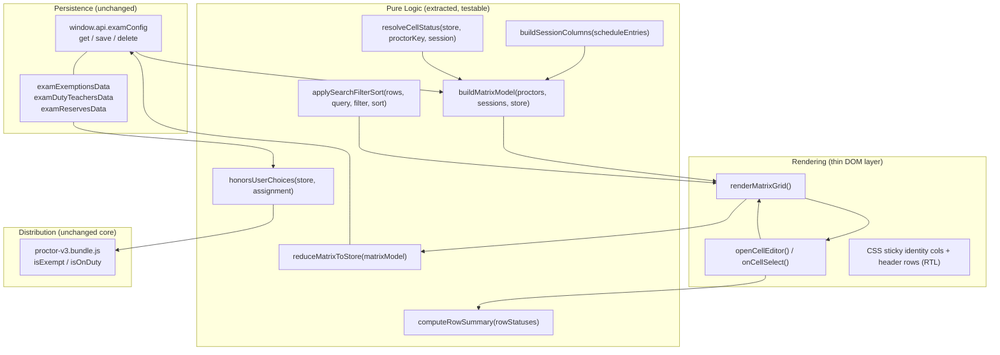

# Design Document

## Overview

This feature redesigns the "الإعفاءات والمداومة" (Exemptions & Duty) sub-panel inside `exams-proctors.html`. The current implementation (`initExemptionsDutyPanel` / `renderEdTable`) forces the user to pick one session (day + period + session) from dropdowns and then edit a flat list of proctors — one status `<select>` per proctor — for that one session only. To set statuses across the whole exam, the coordinator must repeatedly change the dropdowns, edit, and save, once per session.

The redesign replaces the single-session flat list with a **Matrix Grid**: one row per proctor and one column per exam session, with session columns grouped under their exam date. Each cell shows the proctor's status for that session as a short, color-coded code and is editable inline. Identity columns (order, name, registration number, institution, specialty) and per-row summary/total columns stay frozen while the user scrolls the wide grid horizontally; the date and session header rows stay frozen while scrolling vertically.

This is a **UI/display change over the same underlying data**. It does not introduce a new storage format, IPC channel, or database table. It continues to read and write `examExemptionsData`, `examDutyTeachersData`, and `examReservesData` through `window.api.examConfig`, and continues to key every status by `getProctorExemptionKey(proc, idx)` (`proc.cin || proc.som || ('idx_' + idx)`). It also makes explicit two behavioral guarantees the distribution algorithm must honor and that already exist in the algorithm's predicates: user-selected exempt/duty/reserve statuses are hard constraints, and any proctor/session with no recorded entry defaults to guard (حراسة).

Because the change is large but self-contained, the design favors **extracting the pure logic** (key derivation, status resolution, summary counting, status-to-store reduction, search/filter/sort, default-guard resolution, and the distribution constraint predicates) into testable functions, while keeping the DOM rendering layer thin. The pure functions are where property-based testing applies; the rendering and persistence wiring are covered by example and integration tests.

### Research summary

Key findings from reading the existing `exams-proctors.html` and the v3 distribution bundle (`js/algorithms/proctor-v3.bundle.js`):

- **Proctor records** (`loadProctors`) carry: `id`, `teacher_name`, `teacher_name_fr`, `specialty`, `cin`, `som`, `gender`, `room`, and (on import) `workplace`. The requirements' Identity_Columns map as: ترتيب → computed display index, الاسم → `teacher_name`, رقم التأجير → `som`, المؤسسة → `workplace`, مادة التخصص → `specialty`.
- **Proctor key**: `getProctorExemptionKey(proc, idx) = proc.cin || proc.som || ('idx_' + idx)`. This is the canonical store key and is preserved unchanged.
- **Exemptions store shape**: `examExemptionsData[exemptKey][proctorKey] = 'no'` where `exemptKey = ['session', day, period, session].join('|')`. Presence with value `'no'` encodes exempt.
- **Duty / reserve store shape**: `examDutyTeachersData[sessionKey|subject][proctorKey] = true` and `examReservesData[sessionKey|subject][proctorKey] = true`, where `sessionKey = getScheduleSessionKey(entry) = [dateKey, day, period, session].join('|')` and `subject = entry.subject_name`. A legacy key shape (`getLegacyScheduleSessionKey`, no date prefix) also exists and the current save path migrates legacy buckets into the dated shape.
- **Status precedence** (existing `getProctorEdStatus`): reserve → duty → exempt → guard (default). The matrix preserves this precedence so reloads round-trip.
- **Schedule entries** carry `date_year`, `date_month`, `date_day`, `day`, `period` (صباحا/زوالا), `session` (الحصة الأولى/الثانية/الثالثة), `subject_name`, `order`, and time fields. `getScheduleSortKey` already orders by date, then period (صباحا before زوالا), then session sequence.
- **Distribution algorithm** (`proctor-v3.bundle.js`) already treats exemptions/duty as hard constraints via `isExempt` / `isOnDuty` predicates over canonical-keyed normalized maps, and treats absence of an entry as eligible-for-guard. The feature formalizes this as correctness properties rather than changing the algorithm's core.

## Architecture

The feature is structured in three layers inside the existing `exams-proctors.html` renderer, plus the unchanged persistence and algorithm layers.



### Layer responsibilities

- **Pure logic layer** (new, extracted functions): all decisions that map data → status, status → store, and statuses → summaries. No DOM, no IPC. This is the property-tested surface.
- **Rendering layer** (new/replacing `renderEdTable`): builds the matrix DOM from the matrix model, wires inline cell editing, applies sticky CSS for RTL frozen identity columns and header rows. Delegates all computation to the pure layer.
- **Persistence layer** (unchanged): `window.api.examConfig.get/save/delete` over the three config keys.
- **Distribution layer** (unchanged core): the v3 bundle already honors exempt/duty as hard constraints; the feature adds verification properties and ensures the store the matrix writes is exactly what the algorithm reads.

### Key design decisions

1. **Preserve the store shape, not just the API.** Rather than introduce a unified per-cell store, the matrix continues to write the three legacy maps with their existing key shapes. Rationale: the distribution algorithm and other panels read these maps directly; a migration is out of scope and explicitly excluded by the requirements.
2. **Guard is never persisted.** Per Requirement 6.3, a guard cell produces no store entry. The store therefore only ever contains exempt/duty/reserve entries, and `resolveCellStatus` returns guard for any missing/unrecognized entry. This keeps the store minimal and makes "default guard" a single source of truth on read.
3. **Status precedence is fixed and shared.** `resolveCellStatus` uses reserve → duty → exempt → guard, the same order as the existing `getProctorEdStatus`, so a save followed by a reload is an identity round-trip.
4. **Pure model, thin view.** The matrix model is a plain data structure computed independent of the DOM, so summaries, filtering, sorting, and store reduction are all unit/property testable without a browser.
5. **In-memory edit buffer.** Inline edits mutate an in-memory matrix model and re-render the affected row's cell + summaries immediately; persistence happens only on explicit Save, matching the existing Save/Reset button model.

## Components and Interfaces

### Session column model

```js
/**
 * A single matrix column = one exam session.
 * sessionKey matches getScheduleSessionKey(entry) for store lookups.
 * exemptKey matches the ['session', day, period, session].join('|') exempt scope.
 */
// SessionColumn: {
//   sessionKey: string,        // "YYYY-MM-DD|day|period|session"
//   exemptKey: string,         // "session|day|period|session"
//   dateKey: string,           // "YYYY-MM-DD" (group id)
//   dateLabel: string,         // display date
//   day: string, period: string, session: string,
//   subjects: string[],        // subject_name(s) scheduled in this session
//   sortKey: string            // chronological + period + session ordering
// }

function buildSessionColumns(scheduleEntries) { /* ... */ }
function buildDateGroups(sessionColumns) { /* groups columns by dateKey, ordered asc */ }
```

`buildSessionColumns` collapses schedule entries into distinct (date, period, session) tuples, attaches the matching subjects, and orders them by `getScheduleSortKey` semantics (date asc, صباحا before زوالا, session sequence). `buildDateGroups` produces the Date_Group_Header spans.

### Proctor row model

```js
// ProctorRow: {
//   proctor: object,           // original proctor record
//   proctorKey: string,        // getProctorExemptionKey(proc, idx)
//   identity: {
//     name: string|null, registration: string|null,
//     institution: string|null, specialty: string|null
//   },
//   cells: Map<sessionKey, ProctorStatus>,   // resolved status per session
//   summary: { guard, exempt, duty, reserve },
//   hasAnyIdentity: boolean   // false => row omitted (Req 2.3)
// }

function buildProctorRows(proctorsList, sessionColumns, store) { /* ... */ }
```

### Status resolution

```js
const STATUS = { GUARD: 'guard', EXEMPT: 'exempt', DUTY: 'duty', RESERVE: 'reserve' };

const STATUS_CODE = { guard: 'ك', exempt: 'معفى', duty: 'م', reserve: 'إح' };
const STATUS_COLOR = {            // four distinct backgrounds
  guard:   'var(--ed-guard-bg)',
  exempt:  'var(--ed-exempt-bg)',
  duty:    'var(--ed-duty-bg)',
  reserve: 'var(--ed-reserve-bg)'
};

/**
 * Resolve the status for one proctor in one session from the store.
 * Precedence: reserve > duty > exempt > guard(default).
 * Returns 'guard' for any missing or unrecognized entry (Req 4.1, 4.3).
 */
function resolveCellStatus(store, proctorKey, sessionColumn) { /* ... */ }
```

`store` is the in-memory triple `{ exemptionsData, dutyData, reservesData }`. Duty/reserve are looked up by `sessionKey|subject` across the session's subjects (and legacy key shape, as the existing code does); exempt by `exemptKey`.

### Summary computation

```js
/**
 * Count statuses across a row's cells.
 * Invariant: guard + exempt + duty + reserve === totalSessions (Req 8.7).
 */
function computeRowSummary(cellStatuses /* iterable of ProctorStatus */) {
  // returns { guard, exempt, duty, reserve }
}
```

### Store reduction (Save)

```js
/**
 * Convert the full in-memory matrix model back into the three store maps.
 * - guard cells produce NO entry (Req 6.3)
 * - exempt -> exemptionsData[exemptKey][proctorKey] = 'no'
 * - duty   -> dutyData[sessionKey|subject][proctorKey] = true
 * - reserve-> reservesData[sessionKey|subject][proctorKey] = true
 * Keys come exclusively from getProctorExemptionKey (Req 6.2).
 */
function reduceMatrixToStore(matrixModel) {
  // returns { exemptionsData, dutyData, reservesData }
}
```

### Search / filter / sort

```js
function applySearchFilterSort(rows, { searchText, statusFilter, sort }) {
  // 1. search: trim, case-insensitive, match name OR specialty (Req 9.1)
  // 2. statusFilter: keep rows with >=1 cell of that status (Req 9.3)
  // 3. sort: by identity column, asc first then toggle (Req 9.5)
  // returns the visible, ordered subset (Req 9.7: statuses untouched)
}
```

### Distribution constraint adapter

The algorithm core is unchanged. The feature exposes a verification-friendly predicate that mirrors the algorithm's existing behavior:

```js
/**
 * True iff the resulting assignment leaves every user-selected
 * exempt/duty/reserve status identical to the store, and assigns
 * generated guard duty only to guard-status cells (Req 7.1-7.4).
 */
function honorsUserChoices(storeBefore, assignmentResult) { /* ... */ }
```

### Rendering interface

```js
async function initExemptionsDutyMatrix() { /* load store + proctors + schedule, render */ }
function renderMatrixGrid(matrixModel, viewState) { /* build DOM, sticky CSS, RTL */ }
function openCellEditor(rowKey, sessionKey) { /* present 4 options for that cell only */ }
function onCellStatusSelected(rowKey, sessionKey, newStatus) { /* update model, recompute summary, re-render cell */ }
async function saveMatrix() { /* reduceMatrixToStore -> examConfig.save x3 -> refresh */ }
async function resetMatrix(scope) { /* confirm -> clear scope -> save -> render guard */ }
```

## Data Models

### Persisted store (unchanged)

```js
// examExemptionsData
{ "session|الأول|صباحا|الحصة الأولى": { "<proctorKey>": "no" } }

// examDutyTeachersData
{ "2025-06-10|الأول|صباحا|الحصة الأولى|الرياضيات": { "<proctorKey>": true } }

// examReservesData
{ "2025-06-10|الأول|صباحا|الحصة الأولى|الرياضيات": { "<proctorKey>": true } }
```

- `<proctorKey>` = `getProctorExemptionKey(proc, idx)` = `proc.cin || proc.som || ('idx_' + idx)`.
- Guard status is represented by **absence** from all three maps.

### In-memory matrix model (new, transient)

```js
// MatrixModel
{
  sessions: SessionColumn[],          // ordered columns
  dateGroups: { dateKey, dateLabel, span, columns }[],
  rows: ProctorRow[],                 // ordered, identity-filtered rows
  totalSessions: number
}
```

The matrix model is derived on open and on every edit; it is never persisted. On Save it is reduced back to the three store maps.

### Status enumeration

| Proctor_Status | Status_Code | Background token | Persisted in |
|----------------|-------------|------------------|--------------|
| guard (حراسة)  | `ك`         | `--ed-guard-bg`  | (none — default) |
| exempt (معفى)  | `معفى`      | `--ed-exempt-bg` | examExemptionsData |
| duty (مداومة)  | `م`         | `--ed-duty-bg`   | examDutyTeachersData |
| reserve (احتياط)| `إح`       | `--ed-reserve-bg`| examReservesData |


## Correctness Properties

*A property is a characteristic or behavior that should hold true across all valid executions of a system — essentially, a formal statement about what the system should do. Properties serve as the bridge between human-readable specifications and machine-verifiable correctness guarantees.*

These properties target the pure logic layer (matrix model construction, status resolution, summary counting, store reduction, search/filter/sort, and the distribution constraint predicates). UI layout (sticky columns, RTL, timing) and side-effect wiring (toast, IPC success/failure) are validated by example and integration tests in the Testing Strategy, not by properties.

### Property 1: One row per identity-bearing proctor

*For any* proctors list and schedule, the matrix model contains exactly one Proctor_Row for each proctor that has at least one non-empty Identity_Column field, and none for proctors whose five identity fields are all empty.

**Validates: Requirements 1.1, 2.3**

### Property 2: One column per distinct session

*For any* set of schedule entries, the matrix model contains exactly one Session_Column for each distinct (date, period, session) tuple present in the schedule.

**Validates: Requirements 1.2**

### Property 3: Session columns are grouped and chronologically ordered

*For any* set of schedule entries, the Date_Group_Headers are ordered by date ascending and partition all Session_Columns, and within each date group the columns are ordered by period (صباحا before زوالا) then by session sequence (الحصة الأولى, الثانية, الثالثة).

**Validates: Requirements 1.3, 1.4**

### Property 4: Missing identity fields render an identical placeholder

*For any* proctor and any Identity_Column field that is empty or null, the rendered identity cell shows one fixed placeholder marker, and that marker is identical across all missing Identity_Column fields.

**Validates: Requirements 2.2**

### Property 5: Order column is a gapless 1..n sequence in display order

*For any* set of visible Proctor_Rows in any display order (initial, sorted, filtered, or searched), the ترتيب column values equal the sequence 1, 2, …, n top-to-bottom with no gaps and no repeats.

**Validates: Requirements 2.4, 2.5**

### Property 6: Status code is a one-to-one mapping

*For any* Proctor_Status, the Status_Cell displays exactly one Status_Code equal to the fixed mapping (guard→`ك`, exempt→`معفى`, duty→`م`, reserve→`إح`), and the mapping is injective so no two statuses share a code.

**Validates: Requirements 3.1**

### Property 7: Status background colors are pairwise distinct

*For any* two distinct Proctor_Status values among the four (guard, exempt, duty, reserve), their background colors are different (the status→color mapping is injective).

**Validates: Requirements 3.2**

### Property 8: A status change fully replaces code and color

*For any* Status_Cell and any pair of statuses (from, to), changing the cell's status to `to` results in the cell displaying exactly `to`'s Status_Code and `to`'s background color, with no Status_Code or background color of `from` remaining.

**Validates: Requirements 3.3**

### Property 9: Absent or unrecognized store entry resolves to guard (display)

*For any* proctor and session, if the Exemptions_Duty_Store has no entry for that proctor's Proctor_Key in that session, or has a value that is not one of exempt/duty/reserve, then `resolveCellStatus` returns guard and the cell displays Status_Code `ك`.

**Validates: Requirements 4.1, 4.3**

### Property 10: Absent or unrecognized store entry resolves to guard (distribution)

*For any* proctor and session, if the Exemptions_Duty_Store has no exempt/duty/reserve entry for that proctor's Proctor_Key in that session, the Distribution_Algorithm treats that proctor as guard-eligible for that session (neither `isExempt` nor `isOnDuty` matches).

**Validates: Requirements 4.2, 4.4**

### Property 11: Selecting a status sets the cell to that status

*For any* Status_Cell and any selected status (including the cell's current status, which leaves it unchanged), after selection the in-memory matrix cell holds exactly the selected status.

**Validates: Requirements 5.2, 5.5**

### Property 12: Save routes each non-guard status to its own store map

*For any* matrix model, reducing it to the store places every exempt cell under `examExemptionsData`, every duty cell under `examDutyTeachersData`, and every reserve cell under `examReservesData`, each at the cell's session scope.

**Validates: Requirements 6.1**

### Property 13: Persisted statuses are keyed by getProctorExemptionKey

*For any* matrix model, every inner key written to the three store maps during reduction equals `getProctorExemptionKey(proctor, index)` for the corresponding Proctor_Row.

**Validates: Requirements 6.2**

### Property 14: Guard cells are never persisted

*For any* matrix model, no guard Status_Cell produces an entry in any of the three store maps after reduction.

**Validates: Requirements 6.3**

### Property 15: Save then reload is an identity round-trip

*For any* matrix model, reducing it to the store and then rebuilding the matrix rows from that store yields, for every proctor/session, the exact same Proctor_Status, with no conversion between status values.

**Validates: Requirements 6.4**

### Property 16: Distribution preserves user-selected statuses

*For any* Exemptions_Duty_Store and distribution run, every proctor/session whose recorded status is exempt, duty, or reserve has the identical status after the run, and no generated guard assignment is made to such a proctor/session.

**Validates: Requirements 7.1, 7.2, 7.4**

### Property 17: Generated guard duties target only guard-status proctors

*For any* distribution run, every generated guard assignment targets a proctor whose pre-run Proctor_Status for that session is guard.

**Validates: Requirements 7.3**

### Property 18: Row summaries equal the live cell counts

*For any* Proctor_Row in any state (on open or after any edit), each of the guard, exempt, duty, and reserve Summary_Columns equals the number of that row's Status_Cells currently holding the corresponding status, with each count in the range 0..totalSessions.

**Validates: Requirements 8.1, 8.2, 8.3, 8.4, 8.5, 8.6**

### Property 19: Row summary counts conserve to the session total

*For any* Proctor_Row, the sum of the guard, exempt, duty, and reserve Summary_Column counts equals the total number of Session_Columns.

**Validates: Requirements 8.7**

### Property 20: Search shows rows matching name or specialty

*For any* set of rows and any search text, the visible rows are exactly those whose name (الاسم) or specialty (مادة التخصص) contains the trimmed, case-insensitively matched search text; an empty or whitespace-only search text imposes no search restriction (visibility then determined by the active status filter).

**Validates: Requirements 9.1, 9.2**

### Property 21: Status filter shows rows with a matching cell

*For any* set of rows and any selected status filter, the visible rows are exactly those with at least one Status_Cell of that status; an "all statuses"/cleared filter imposes no status restriction (visibility then determined by the active search text).

**Validates: Requirements 9.3, 9.4**

### Property 22: Sorting orders by column and toggles direction

*For any* set of rows and any sortable Identity_Column, activating that column's header sorts the visible rows ascending by that column on the first activation and toggles between ascending and descending on each subsequent activation of the same header.

**Validates: Requirements 9.5**

### Property 23: Search, filter, and sort preserve cell statuses

*For any* set of rows and any sequence of search, filter, and sort operations, the Proctor_Status of every Status_Cell is identical before and after the operations.

**Validates: Requirements 9.7**

### Property 24: Reset clears the scope to guard

*For any* Exemptions_Duty_Store and reset scope, removing all exempt, duty, and reserve entries in that scope leaves every proctor/session in the scope resolving to guard (Status_Code `ك`), while entries outside the scope are unchanged.

**Validates: Requirements 11.1, 11.2**

## Error Handling

- **Empty proctors list (Req 1.5, 1.7):** `buildProctorRows` returns no rows; `renderMatrixGrid` shows the "add proctors first" message. When both proctors and sessions are empty, only the "add proctors first" message is shown (it takes precedence over "no sessions available").
- **No sessions defined (Req 1.6):** `buildSessionColumns` returns an empty array; the grid shows the "no sessions available to edit" message and renders no session column (only when proctors exist).
- **Unrecognized status value (Req 3.4, 4.3):** `resolveCellStatus` returns guard for any value not in {exempt, duty, reserve}. The display layer renders the guard code; if a raw in-memory cell ever holds a non-enum value, the cell renderer shows an explicit "unrecognized" marker and none of the four valid codes.
- **Summary recompute failure (Req 5.4):** `onCellStatusSelected` wraps the recompute in try/catch. On failure it reverts the cell to its previous status, retains the previous summary values, and surfaces an error indication (toast); no persistence occurs.
- **Persistence failure on Save (Req 6.6):** Saves go through `window.api.examConfig.save` for the three keys. If any save rejects, the in-memory pre-save store snapshot is restored, the distribution status view is not refreshed, and an error toast is shown. Save is attempted on a cloned store so a partial failure does not leave the in-memory store half-updated.
- **Persistence failure on Reset (Req 11.5):** Reset computes the cleared store on a clone, persists it, and only commits to the in-memory store and re-renders on success. On rejection the prior store and all cell statuses are retained and an error toast is shown.
- **Reset confirmation (Req 11.3, 11.4):** Reset always presents a confirmation prompt (`showConfirm`) and makes no store change until the user explicitly confirms; cancel leaves store and cells unchanged.
- **Legacy / orphan store keys:** Duty and reserve lookups check both the dated `sessionKey|subject` shape and the legacy shape, matching the existing code, so pre-existing data renders correctly without migration.

## Testing Strategy

### Dual approach

- **Property-based tests** verify the 24 universal properties above across many generated inputs (matrices, stores, schedules, search/filter/sort sequences, distribution runs with mocked room needs).
- **Unit / example tests** cover concrete scenarios, edge cases, and UI interactions that are not universal: the two empty-state messages and their precedence (1.5, 1.6, 1.7), identity column order (2.1), the unrecognized-status display marker (3.4), opening the inline editor and presenting four options (5.1), dismiss-without-select (5.6), summary-recompute-failure revert (5.4), the no-match message (9.6), and the reset confirmation/cancel flow (11.3, 11.4).
- **Integration tests** cover the persistence wiring with a mocked `window.api.examConfig`: save success refreshes the distribution view and shows success (6.5); save failure retains the store, skips refresh, and shows an error (6.6); reset failure retains the store (11.5).
- **Smoke / visual checks** cover the sticky-layout and RTL requirements (10.1–10.4) and the within-1-second timing requirements (8.5, 10.2), which are layout/performance behaviors not expressible as logic properties — verified by asserting the presence of the sticky/RTL CSS classes and by manual visual inspection.

### Property-based testing setup

- **Library:** `fast-check` with the existing test runner used by `npm test` (do not hand-roll generators or a PBT harness).
- **Iterations:** each property test runs a minimum of 100 generated cases.
- **Generators:** custom arbitraries for proctor records (random `cin`/`som`/`teacher_name`/`specialty`/`workplace`, including empty fields and all-empty proctors), schedule entries (random dates, periods صباحا/زوالا, sessions, subjects), store maps (random exempt/duty/reserve entries plus injected unrecognized values), and search/filter/sort operation sequences.
- **Distribution properties (16, 17):** run the existing `proctor-v3.bundle.js` against generated stores and schedules with mocked room/quota needs so 100+ iterations stay cheap; assert against the algorithm result rather than a real cloud/DB.
- **Tags:** every property test is tagged with a comment of the form
  `// Feature: exemptions-duty-matrix-grid, Property {number}: {property_text}`
  referencing the matching property in this document.

### Commands

- `npm test` runs the unit, property, and integration suites.
- `npm run lint` validates style.
