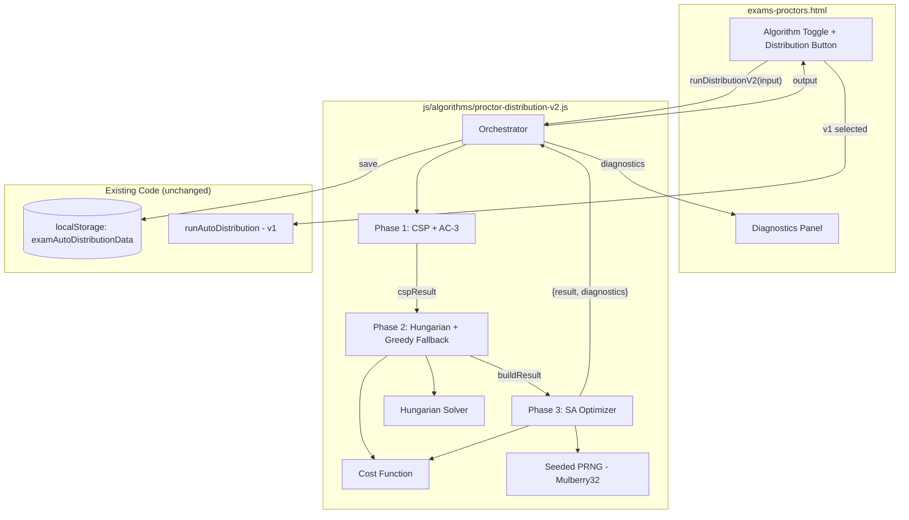
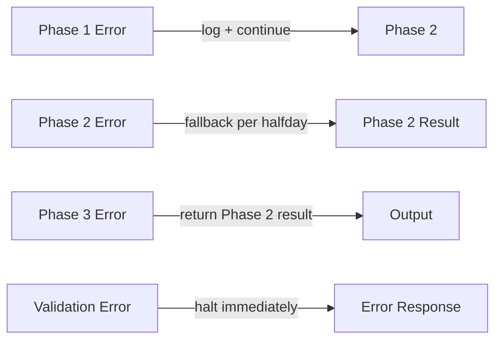

# Design Document: Proctor Distribution Algorithm v2

## Overview

This design specifies a hybrid three-phase proctor distribution algorithm that replaces the current greedy constructive heuristic in `exams-proctors.html`. The new algorithm lives in `js/algorithms/proctor-distribution-v2.js` as a standalone ES2019+ module (no external dependencies) and integrates with the existing UI via an Algorithm Toggle.

**Architecture Summary:**
1. **Phase 1 — Pre-pass (CSP + AC-3):** Builds a constraint satisfaction model, propagates arc consistency to prune infeasible assignments, identifies singletons, and computes load bounds.
2. **Phase 2 — Build (Hungarian per half-day + Greedy Fallback):** Constructs an optimal local assignment for each half-day using the Hungarian/Munkres algorithm on a weighted cost matrix. Falls back to the existing greedy approach when Hungarian cannot produce a valid assignment.
3. **Phase 3 — Optimize (Simulated Annealing):** Refines the Phase 2 solution via lightweight SA with configurable weights, respecting hard constraints at all times.

The algorithm accepts the same `GS2_Input_Contract` as v1, produces output in the same row format (plus `algorithmVersion` and `diagnostics` fields), and stores results under the same `localStorage` key `examAutoDistributionData`.

**Design Rationale:**
- Hungarian provides provably optimal local assignments per half-day (minimizes total cost).
- CSP pre-pass reduces the search space and detects infeasibility early.
- SA provides global refinement across half-days without the computational cost of a full ILP solver.
- Greedy fallback ensures the algorithm always produces a result, even in degenerate cases.
- No external dependencies keeps the Electron bundle lightweight.

## Architecture



### Module Boundary

The file `js/algorithms/proctor-distribution-v2.js` exports a single entry point:

```javascript
// js/algorithms/proctor-distribution-v2.js
window.ProctorDistributionV2 = { run: orchestrator };
```

The HTML page loads it via `<script src="js/algorithms/proctor-distribution-v2.js"></script>` and calls `window.ProctorDistributionV2.run(input)`.

## Components and Interfaces

### 1. Orchestrator

```javascript
/**
 * Main entry point for v2 algorithm.
 * @param {GS2Input} input - The input contract (same fields as v1)
 * @returns {{ result: AssignmentRow[], diagnostics: DiagnosticsReport }}
 */
function orchestrator(input) { ... }
```

**Responsibilities:**
- Validates `GS2_Input_Contract` fields (fails fast with descriptive error if missing)
- Initializes seeded PRNG (from `input.randomSeed` or `Date.now()`)
- Executes Phase 1 → Phase 2 → Phase 3 in sequence
- Enforces Phase 2 timeout (1500ms) and Phase 3 budget (500ms, 1000 iterations)
- Assembles final `{result, diagnostics}` output
- Guards against re-entrancy (ignores concurrent calls)

### 2. Phase 1: Pre-pass (CSP + AC-3)

```javascript
/**
 * @param {GS2Input} input
 * @returns {Phase1Result}
 */
function phase1PrePass(input) { ... }
```

**Internal functions:**

```javascript
function buildCSPModel(scheduleEntries, proctorsList, exemptionsData, dutyData, rules)
  // Returns: { variables: Variable[], constraints: Constraint[], domains: Map<varId, Set<proctorKey>> }

function runAC3(cspModel, maxIterations = 1000)
  // Returns: { stable: boolean, iterations: number, emptyDomains: VarId[] }

function extractSingletons(domains)
  // Returns: Map<varId, proctorKey>  (domain size === 1)

function computeBounds(totalTasks, fixedReservedTasks, numEligibleTeachers)
  // Returns: { lowerBound: number, upperBound: number }
```

**CSP Variable definition:**
```javascript
// Each variable represents one proctor slot in one room for one schedule entry
{ id: `${scheduleEntryId}|${roomKey}|${slotIndex}`, scheduleEntryId, roomKey, slotIndex }
```

**AC-3 Constraints:**
- **Unary:** Exemption (proctor exempt for this session), Duty (proctor is duty teacher for this subject)
- **Binary:** No same-proctor-in-same-session, no same-proctor-in-same-halfday (if `allowHalfdayReuse` disabled), no same-proctor-in-same-day (if `allowDayReuse` disabled)

### 3. Phase 2: Hungarian Build

```javascript
/**
 * @param {Phase1Result} phase1Result
 * @param {GS2Input} input
 * @param {SeededRNG} rng
 * @returns {Phase2Result}
 */
function phase2Build(phase1Result, input, rng) { ... }
```

**Internal functions:**

```javascript
function buildCostMatrix(tasks, availableProctors, loadState, options, weights, lowerBound)
  // Returns: number[][] (square matrix, padded with dummies if needed)

function hungarianSolver(costMatrix)
  // Returns: number[] (assignment[row] = col) or throws on failure

function greedyFallback(tasks, availableProctors, loadState, options)
  // Returns: Assignment[] (uses existing v1 greedy logic adapted)

function costFunction(proctorKey, task, loadState, options, weights, lowerBound)
  // Returns: number (Infinity_Sentinel = 1e9 for hard violations)
```

**Cost Function Formula:**
```
cost(proctor, task) =
  IF hard_constraint_violated → 1e9
  ELSE:
    + 5 × (group_mismatch ? 1 : 0)
    + 3 × (same_room_repeat ? 1 : 0)
    + 2 × (subject_specialty ? 1 : 0)
    + 1 × (no_gender_pair ? 1 : 0)
    + 4 × max(0, guardLoad - lowerBound)
```

**Dual-proctor rooms:** For rooms requiring 2 proctors, Hungarian runs twice per half-day:
1. First pass: select primary proctor (standard cost)
2. Second pass: select complement proctor (cost += 3 if same gender as primary)

### 4. Phase 3: SA Optimizer

```javascript
/**
 * @param {Phase2Result} phase2Result
 * @param {GS2Input} input
 * @param {SeededRNG} rng
 * @param {SAConfig} config
 * @returns {Phase3Result}
 */
function phase3Optimize(phase2Result, input, rng, config) { ... }
```

**SA Configuration:**
```javascript
const SA_DEFAULTS = {
  T0: 1.0,
  T_min: 0.01,
  coolingRate: 0.95,
  maxIterations: 1000,
  maxDurationMs: 500,
  stagnationLimit: 100
};
```

**Neighborhood Moves:**

| Move Type | Description | Selection |
|-----------|-------------|-----------|
| `swap_guards` | Swap two guards between rooms in the same session | Random session, random pair |
| `swap_roles` | Swap a guard and a reserve in the same half-day | Random half-day, random pair |
| `reassign_reserve` | Move a reserve from one session to another available session | Random reserve, random target |

**Objective Function:**
```
f(solution) = α × std(guardLoads) + β × totalSoftViolations + γ × morningEveningImbalance
```

Where `morningEveningImbalance = Σ |meanMorningLoad_i - meanAfternoonLoad_i|` for each proctor `i`.

**Weights Presets:**

| Preset | α | β | γ |
|--------|---|---|---|
| توازن (Balance) | 3 | 1 | 2 |
| احترام المجموعات (Groups) | 1 | 1 | 5 |
| تنوع القاعات (Room Variety) | 1 | 4 | 1 |

### 5. Hungarian Solver (Munkres Algorithm)

```javascript
/**
 * O(n³) implementation of the Hungarian/Munkres algorithm.
 * @param {number[][]} costMatrix - Square cost matrix (n×n)
 * @returns {number[]} assignment - assignment[row] = column index
 */
function hungarianSolver(costMatrix) { ... }
```

**Pseudocode:**

```
function hungarianSolver(cost):
  n = cost.length
  u = new Array(n+1).fill(0)  // row potentials
  v = new Array(n+1).fill(0)  // col potentials
  p = new Array(n+1).fill(0)  // col→row assignment
  way = new Array(n+1).fill(0)

  for i = 1 to n:
    p[0] = i
    j0 = 0
    minv = new Array(n+1).fill(Infinity)
    used = new Array(n+1).fill(false)

    repeat:
      used[j0] = true
      i0 = p[j0]
      delta = Infinity
      j1 = -1

      for j = 1 to n:
        if not used[j]:
          cur = cost[i0-1][j-1] - u[i0] - v[j]
          if cur < minv[j]:
            minv[j] = cur
            way[j] = j0
          if minv[j] < delta:
            delta = minv[j]
            j1 = j

      for j = 0 to n:
        if used[j]:
          u[p[j]] += delta
          v[j] -= delta
        else:
          minv[j] -= delta

      j0 = j1
    until p[j0] == 0

    // Trace back
    while j0 != 0:
      p[j0] = p[way[j0]]
      j0 = way[j0]

  result = new Array(n)
  for j = 1 to n:
    result[p[j]-1] = j-1

  return result
```

### 6. Seeded PRNG

Reuses the existing Mulberry32 implementation from v1:

```javascript
function buildSeededPRNG(seed) {
  let t = (seed >>> 0) || 1;
  return function() {
    t = (t + 0x6D2B79F5) >>> 0;
    let r = t;
    r = Math.imul(r ^ (r >>> 15), r | 1);
    r ^= r + Math.imul(r ^ (r >>> 7), r | 61);
    return ((r ^ (r >>> 14)) >>> 0) / 4294967296;
  };
}
```

### 7. AC-3 Implementation

```
function runAC3(cspModel, maxIterations):
  queue = all arcs (Xi, Xj) from constraints
  iterations = 0

  while queue not empty AND iterations < maxIterations:
    iterations++
    (Xi, Xj) = queue.dequeue()

    if revise(Xi, Xj):
      if domain(Xi) is empty:
        record infeasibility for Xi
        continue  // don't halt — record and continue
      for each Xk neighbor of Xi (k ≠ j):
        queue.enqueue((Xk, Xi))

  return { stable: queue.isEmpty(), iterations, emptyDomains }

function revise(Xi, Xj):
  revised = false
  for each value x in domain(Xi):
    if no value y in domain(Xj) satisfies constraint(Xi=x, Xj=y):
      remove x from domain(Xi)
      revised = true
  return revised
```

## Data Models

### GS2_Input_Contract

```javascript
/**
 * @typedef {Object} GS2Input
 * @property {Proctor[]} proctorsList - Array of proctor objects
 * @property {Object} exemptionsData - Exemptions keyed by scope
 * @property {Object} dutyData - Duty teachers keyed by session+subject
 * @property {Object} meAssignments - Morning/Evening group assignments (key → 1|2)
 * @property {Object} examDistributionRules - { proctorsPerRoom, reservesPerSession }
 * @property {ScheduleEntry[]} scheduleEntries - Exam schedule entries
 * @property {Room[]} roomsList - Available rooms per level (from getRoomRowsForLevel)
 * @property {number|null} randomSeed - Optional seed for reproducibility
 * @property {string} weightsPreset - "توازن"|"احترام المجموعات"|"تنوع القاعات"
 * @property {Object|null} customWeights - { alpha, beta, gamma } overrides preset
 * @property {Object} options - Same as AUTO_DISTRIBUTION_OPTION_DEFAULTS
 * @property {boolean} enablePhase3 - Whether SA optimization is enabled (default: true)
 */
```

### Proctor Object

```javascript
/**
 * @typedef {Object} Proctor
 * @property {number} id
 * @property {string} teacher_name - Arabic name
 * @property {string} teacher_name_fr - French name
 * @property {string} specialty - Subject specialty
 * @property {string} cin - National ID
 * @property {string} som - Employee number
 * @property {string} gender - "ذكر"|"أنثى"|"M"|"F"
 * @property {string} room - Assigned room (if any)
 */
```

### ScheduleEntry Object

```javascript
/**
 * @typedef {Object} ScheduleEntry
 * @property {string} day - Day name (e.g., "الأول")
 * @property {string} period - "صباحا"|"مساء"
 * @property {string} session - Session name (e.g., "الحصة الأولى")
 * @property {string} level_name - Level/class name
 * @property {string} subject_name - Subject being examined
 * @property {string} date_day - Day of month
 * @property {string} date_month - Month number
 * @property {string} date_year - Year
 * @property {string} time_from - Start time "HH:MM"
 * @property {string} time_to - End time "HH:MM"
 */
```

### AssignmentRow (Output)

```javascript
/**
 * @typedef {Object} AssignmentRow
 * @property {string} session_key
 * @property {string} session_label
 * @property {string} halfday_key
 * @property {number} group_number - Expected alternating group (1|2|0)
 * @property {string} group_label
 * @property {string} day
 * @property {string} period
 * @property {string} session
 * @property {Object} schedule_entry - Original schedule entry reference
 * @property {string} level_name
 * @property {string} subject_name
 * @property {string[]} duty_teachers
 * @property {string[]} duty_teacher_keys
 * @property {string} room_name
 * @property {string} room_number
 * @property {string} room_key
 * @property {string} room_place
 * @property {string[]} proctors - Assigned proctor names
 * @property {string[]} proctor_keys - Assigned proctor keys
 * @property {string[]} proctor_groups - Group labels for assigned proctors
 * @property {string[]} reserves - Reserve proctor names
 * @property {string[]} reserve_keys - Reserve proctor keys
 * @property {string} notes - Assignment notes
 * @property {string[]} softViolations - List of soft constraints violated (NEW in v2)
 */
```

### DiagnosticsReport

```javascript
/**
 * @typedef {Object} DiagnosticsReport
 * @property {string} orchestratorState - "COMPLETED"|"ERROR"|"TIMEOUT"
 * @property {number} seedUsed - The PRNG seed used
 * @property {string} weightsUsed - Preset name or "custom"
 * @property {{ alpha: number, beta: number, gamma: number }} weightValues
 *
 * // Phase 1
 * @property {number} phase1DurationMs
 * @property {number} lowerBound
 * @property {number} upperBound
 * @property {number} singletonCount
 * @property {number} domainReductionPercent
 * @property {Array<{variable: string, reason: string}>} infeasibilities
 * @property {string[]} warnings
 *
 * // Phase 2
 * @property {number} phase2DurationMs
 * @property {number} fallbackCount
 * @property {number} totalHalfdaysProcessed
 * @property {number} averageCostPerAssignment
 * @property {string[]} fallbackHalfdays - List of halfday keys that used fallback
 *
 * // Phase 3
 * @property {number} phase3DurationMs
 * @property {number} iterationsExecuted
 * @property {number} acceptedMoves
 * @property {number} rejectedMoves
 * @property {boolean} earlyStop
 * @property {number} initialObjective
 * @property {number} finalObjective
 * @property {string} preset
 * @property {boolean} phase3Skipped
 *
 * // Summary
 * @property {number} totalDurationMs
 * @property {{ std: number, min: number, max: number, giniCoefficient: number }} loadBalance
 * @property {{ sameRoomRepeats: number, subjectConflicts: number, groupMismatches: number, genderImbalances: number }} softViolationsByType
 * @property {Array<{halfdayKey: string, count: number}>} shortages
 * @property {number} totalInfeasibleSlots
 * @property {string[]} errors
 */
```

### LoadState (Internal)

```javascript
/**
 * Reuses existing v1 structure:
 * @typedef {Object.<string, TeacherLoad>} LoadState
 *
 * @typedef {Object} TeacherLoad
 * @property {string} teacherName
 * @property {Set<string>} dutyHalfdays
 * @property {Set<string>} guardHalfdays
 * @property {Set<string>} reserveHalfdays
 */
```

### CSP Model (Internal)

```javascript
/**
 * @typedef {Object} CSPModel
 * @property {CSPVariable[]} variables
 * @property {Map<string, Set<string>>} domains - varId → Set of eligible proctorKeys
 * @property {CSPConstraint[]} constraints
 */

/**
 * @typedef {Object} CSPVariable
 * @property {string} id - "${scheduleEntryId}|${roomKey}|${slotIndex}"
 * @property {string} scheduleEntryId
 * @property {string} roomKey
 * @property {number} slotIndex - 0-based slot within the room
 */

/**
 * @typedef {Object} CSPConstraint
 * @property {string} type - "unary"|"binary"
 * @property {string[]} scope - [varId] for unary, [varId1, varId2] for binary
 * @property {Function} check - (value1, value2?) => boolean
 */
```

## Correctness Properties

*A property is a characteristic or behavior that should hold true across all valid executions of a system — essentially, a formal statement about what the system should do. Properties serve as the bridge between human-readable specifications and machine-verifiable correctness guarantees.*

### Property 1: Hard Constraint Preservation

*For any* valid `GS2_Input_Contract`, the output of the Orchestrator SHALL contain no assignment where: (a) a proctor is exempt for that session, (b) a proctor is a duty teacher for that subject, (c) a proctor appears twice in the same session, (d) a proctor appears twice in the same half-day when `allowHalfdayReuse` is disabled, or (e) a proctor appears twice in the same day when `allowDayReuse` is disabled. Slots that cannot be filled without violating these constraints SHALL be left empty.

**Validates: Requirements 5.1, 5.2, 5.3, 5.4, 5.5, 5.6, 5.7, 10.1**

### Property 2: Deterministic Reproducibility (Idempotence)

*For any* valid input and *any* fixed `randomSeed`, running the Orchestrator twice with identical inputs and the same seed SHALL produce byte-identical `result` arrays.

**Validates: Requirements 10.5, 12.2, 12.3**

### Property 3: Hungarian Optimality over Greedy

*For any* randomly generated square cost matrix (with finite values), the total assignment cost produced by `hungarianSolver` SHALL be less than or equal to the total assignment cost produced by a greedy column-minimum assignment on the same matrix.

**Validates: Requirements 10.6**

### Property 4: AC-3 Soundness

*For any* CSP model, after running `runAC3`, every value removed from a variable's domain SHALL be provably inconsistent — meaning there exists no valid assignment of the remaining variables that includes that value without violating at least one constraint.

**Validates: Requirements 10.7**

### Property 5: Cost Function Correctness

*For any* proctor-task pair, the `costFunction` SHALL return `Infinity_Sentinel` (1e9) if and only if the assignment violates a hard constraint. For non-violating assignments, the cost SHALL equal `5×groupMismatch + 3×sameRoomRepeat + 2×subjectSpecialty + 1×noGenderPair + 4×max(0, guardLoad - lowerBound)` where each violation flag is 0 or 1.

**Validates: Requirements 3.6, 3.7, 3.8**

### Property 6: Load Balance Improvement

*For any* randomly generated valid input with ≥10 proctors and ≥5 sessions, `std(guardLoads)` in the v2 result SHALL be less than or equal to `std(guardLoads)` in the v1 result for the same input in at least 95% of generated test cases.

**Validates: Requirements 10.2**

### Property 7: Alternating Group Compliance Improvement

*For any* randomly generated valid input where alternating groups are configured, the proportion of proctors assigned outside their designated alternating group in v2 SHALL be less than or equal to the same proportion in v1 for the same input in at least 95% of generated test cases.

**Validates: Requirements 10.3**

### Property 8: Gender Pair Rate Improvement

*For any* randomly generated valid input where both genders are sufficiently represented (≥30% each), the proportion of rooms receiving a mixed-gender pair in v2 SHALL be greater than or equal to the same proportion in v1 in at least 95% of generated test cases.

**Validates: Requirements 10.4**

### Property 9: Output Format Backward Compatibility

*For any* valid input, every row in the v2 `result` array SHALL contain all fields present in v1 output rows (`session_key`, `room_name`, `proctors`, `proctor_keys`, `reserves`, `reserve_keys`, `notes`, etc.) with the same types, plus the additional `softViolations` array field.

**Validates: Requirements 9.1, 9.4**

### Property 10: Graceful Degradation on Infeasibility

*For any* input containing at least one task with zero eligible proctors (after exemptions and duty filtering), the Orchestrator SHALL complete execution without throwing, SHALL leave infeasible slots empty, and SHALL record `totalInfeasibleSlots > 0` in `diagnostics`. The SA phase, if it throws, SHALL return the Phase 2 result unchanged.

**Validates: Requirements 5.6, 13.1, 13.3**

## Error Handling

### Error Categories and Responses

| Error Scenario | Component | Response |
|---|---|---|
| Missing/empty GS2_Input_Contract field | Orchestrator | Return descriptive error, halt before Phase 1 |
| Invalid `randomSeed` type | Orchestrator | Return error, halt before Phase 2 |
| AC-3 exceeds 1000 iterations | Phase 1 | Stop AC-3, log warning, continue to Phase 2 |
| Empty domain detected in AC-3 | Phase 1 | Log infeasibility, continue (don't halt) |
| Hungarian throws exception | Phase 2 | Catch, use Greedy Fallback for that half-day, log error |
| Hungarian assigns dummy (cost ≥ 1e9) | Phase 2 | Use Greedy Fallback for unresolved tasks only |
| Phase 2 exceeds 1500ms timeout | Orchestrator | Stop Phase 2, use partial solution, log warning |
| SA throws exception | Phase 3 | Return Phase 2 result unchanged, log error |
| SA stagnates 100 iterations | Phase 3 | Early stop, log `earlyStop: true` |
| Reference to non-existent proctor | Orchestrator | Ignore reference, log warning |
| Diagnostics Panel DOM failure | UI Integration | Stop subsequent processing, show toast error |

### Error Propagation Strategy



**Principle:** The algorithm always produces a result (possibly with empty slots) rather than crashing. Errors are accumulated in `diagnostics.errors` and displayed prominently in the Diagnostics Panel.

## Testing Strategy

### Property-Based Tests (PBT)

**Library:** `fast-check` (added to `devDependencies` only)

**Configuration:**
- Minimum 100 iterations per property test
- Each test tagged with: `Feature: proctor-distribution-algorithm-v2, Property {N}: {title}`
- Tests run via `npm test`

**Test File:** `tests/proctor-distribution-v2.property.test.js`

**Generators needed:**
- `arbitraryProctor()` — generates random proctor objects with valid fields
- `arbitraryScheduleEntry()` — generates random schedule entries with consistent dates/times
- `arbitraryGS2Input(config)` — composes a full valid input with configurable size bounds
- `arbitraryCostMatrix(n)` — generates n×n matrices with finite positive values
- `arbitraryCSPModel()` — generates random CSP models with known solutions

**Properties to implement:**
1. Hard Constraint Preservation (Property 1)
2. Deterministic Reproducibility (Property 2)
3. Hungarian Optimality (Property 3)
4. AC-3 Soundness (Property 4)
5. Cost Function Correctness (Property 5)
6. Load Balance Improvement (Property 6) — statistical, 95% threshold
7. Alternating Group Compliance (Property 7) — statistical, 95% threshold
8. Gender Pair Rate (Property 8) — statistical, 95% threshold
9. Output Format Compatibility (Property 9)
10. Graceful Degradation (Property 10)

### Unit Tests

**Test File:** `tests/proctor-distribution-v2.unit.test.js`

Focus areas:
- Specific edge cases: 0 proctors, 0 sessions, 1 proctor 1 room
- Weights preset mapping (exact α/β/γ values)
- SA early stop at exactly 100 stagnant iterations
- Timeout behavior at boundary (1500ms for Phase 2)
- Diagnostics field completeness for each phase
- Greedy fallback invocation when Hungarian assigns dummies
- PRNG determinism with known seed values

### Integration Tests

**Test File:** `tests/proctor-distribution-v2.integration.test.js`

Focus areas:
- Full orchestrator run with realistic school data (50 proctors, 20 sessions, 8 rooms)
- localStorage persistence format verification
- Toggle behavior (v1 ↔ v2 switching)
- Diagnostics Panel rendering with real diagnostics data

### Performance Tests

- Phase 2 timing with 50 proctors × 30 sessions < 1000ms
- Full orchestrator with 100 proctors × 50 sessions × 10 rooms < 2000ms
- Phase 3 always < 500ms regardless of input size
