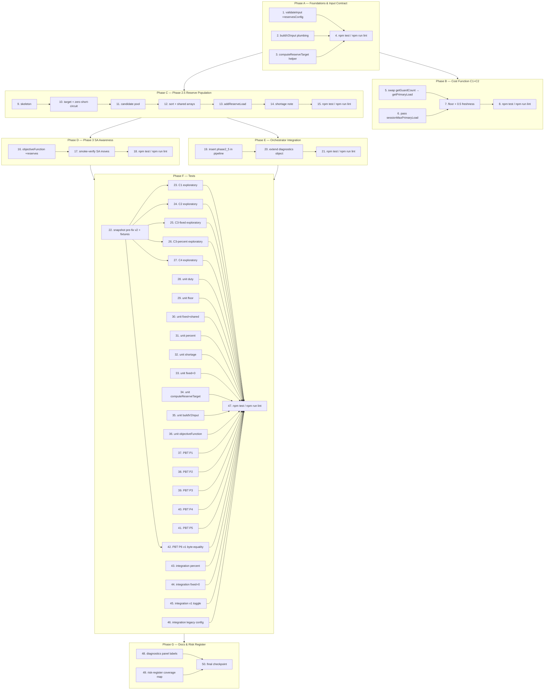

# Implementation Plan — Proctor v2 Fairness, Duty & Reserves

> Source documents: `bugfix.md` (Bug Condition C1–C4, Properties P1–P6, Requirements 1.x / 2.x / 3.x), `design.md` (Architecture overview edit sites §1–§5, pseudocode §3, edge cases §3, data contract §"Data contract changes").
>
> Project commands (per `AGENTS.md`): `npm test; npm run lint`. Every task that adds or changes tests MUST end with `npm test` to verify, and changes to source files SHOULD also pass `npm run lint`.
>
> Atomicity: every leaf task is scoped to ≤ 1 hour of focused work. Tasks marked `[parallel]` have no dependency on their sibling tasks within the same phase and may be executed concurrently by separate workers.
>
> Annotation legend on each task line:
> - `_Validates:` — sub-conditions C1–C4 and/or properties P1–P6 the task contributes to (from `bugfix.md`)
> - `_Edit site:` — row number in the `design.md` "Architecture overview" table (1–5), or `n/a` for tests/docs
> - `_File:` — concrete file path the executor will touch
> - `_Requirements:` — clause numbers from `bugfix.md` §"Current Behavior" (1.x), §"Expected Behavior" (2.x), §"Unchanged Behavior" (3.x)

---

## Phase A — Foundations & Input Contract

Goal: get `reservesConfig` flowing end-to-end before any algorithmic change. Required by every later phase.

- [x] 1. Extend `validateInput` to accept and default `reservesConfig`
  - Add an optional `input.reservesConfig` check: if present, assert `mode IN ('fixed','percent')`, `fixed >= 0`, `percent IN [0,100]`.
  - If absent, default in place to `{ mode: 'fixed', fixed: 0, percent: 0 }` so older callers and existing fixtures keep working.
  - Do NOT make the field required; do NOT throw for legacy fixtures.
  - _Validates: C4_
  - _Edit site: design.md §5 (validation half)_
  - _File: `js/algorithms/proctor-distribution-v2.js` (function `validateInput`)_
  - _Requirements: 2.8, 3.10_

- [x] 2. Plumb `reservesConfig` through `buildV2Input` in `exams-proctors.html`
  - Read `examCenterConfig.max_reserves_mode`, `examCenterConfig.max_reserves`, `examCenterConfig.max_reserves_percent`.
  - When `max_reserves_mode` is set: derive `{ mode: 'percent' if value === 'percent' else 'fixed', fixed: max(0, Number(max_reserves)||0), percent: clamp(Number(max_reserves_percent)||0, 0, 100) }`.
  - When `max_reserves_mode` is absent: fall back to `{ mode:'fixed', fixed: max(0, Number(rules.reservesPerSession)||0), percent: 0 }` per Requirement 3.10.
  - Attach `reservesConfig` on the input object returned from `buildV2Input`. Do not remove `examDistributionRules`.
  - _Validates: C4, P5_
  - _Edit site: design.md §5_
  - _File: `exams-proctors.html` (function `buildV2Input`, around line ≈2620)_
  - _Requirements: 1.4, 2.4, 2.5, 2.8, 3.10_

- [x] 3. Add `computeReserveTarget(cfg, guardCount)` helper in `proctor-distribution-v2.js`
  - Implement exactly the pseudocode from `design.md` §3:
    - `cfg.mode === 'percent'` → `Math.ceil(cfg.percent * guardCount / 100)`
    - otherwise → `cfg.fixed`
  - Handle `cfg == null` defensively → return `0` (matches the §3 edge-case row `cfg undefined`).
  - Export it on the module-internal namespace so unit tests and `phase2_5PopulateReserves` can both reach it.
  - _Validates: C3, P3, P4_
  - _Edit site: design.md §3 (helper)_
  - _File: `js/algorithms/proctor-distribution-v2.js`_
  - _Requirements: 2.3, 2.4, 2.5, 3.9_

- [x] 4. Run `npm test` and `npm run lint` after Phase A
  - Confirm no regressions from validation/plumbing/helper additions.
  - _Validates: P6_
  - _Edit site: n/a_
  - _File: n/a (CI/local run only)_
  - _Requirements: 3.5, 3.8_

---

## Phase B — Cost Function Fairness & Duty (C1, C2)

Goal: Phase 2 Hungarian cost reflects primary load (guards + duty) and resists piling onto already-used teachers when `lowerBound = 0`. Depends on Phase A only because of `reservesConfig` defaulting; this phase does not yet read `reservesConfig`.

- [x] 5. Swap `getGuardCount` → `getPrimaryLoad` in `costFunction`
  - Replace the `guardLoad` read with `primaryLoad = getPrimaryLoad(loadState, proctorKey)`. Use the same name in subsequent expressions in the function.
  - Confirm `addDutyLoad` populates `loadState.dutyCount` before Phase 2 (per design §"Hypothesized Root Cause" #2). No new plumbing.
  - _Validates: C2, P2_
  - _Edit site: design.md §1_
  - _File: `js/algorithms/proctor-distribution-v2.js` (function `costFunction`, line ≈1167)_
  - _Requirements: 1.2, 2.2_

- [x] 6. Pass `sessionMaxPrimaryLoad` through `costOptions` to `costFunction`
  - At the Hungarian invocation site (line ≈1623) compute, once per call: `sessionMaxPrimaryLoad = max( getPrimaryLoad(loadState, k) for k in usedInSession )`. If `usedInSession` is empty, use `0`.
  - Attach to the existing `costOptions` object (do not introduce a new parameter).
  - _Validates: C1, P1_
  - _Edit site: design.md §2_
  - _File: `js/algorithms/proctor-distribution-v2.js` (Phase 2 build, around the existing `costOptions` plumbing)_
  - _Requirements: 1.1, 2.1_

- [x] 7. Add `floor` term and `0.5` freshness bonus inside `costFunction`
  - Replace the load penalty with: `floor = max(lowerBound, sessionMaxPrimaryLoad − 1); loadPenalty = max(0, primaryLoad − floor); cost += 4 * loadPenalty;`
  - Append a uniform freshness bonus: `cost += primaryLoad > 0 ? 0.5 : 0`.
  - Add an inline comment noting the invariant `0.5 < min(softPenalty) = 1`, per design §1 (B).
  - _Validates: C1, P1_
  - _Edit site: design.md §1, §2_
  - _File: `js/algorithms/proctor-distribution-v2.js` (function `costFunction`)_
  - _Requirements: 1.1, 2.1_

- [x] 8. Run `npm test` and `npm run lint` after Phase B
  - Existing cost/Hungarian unit tests should still pass (preservation). New tests come in Phase F.
  - _Validates: P6_
  - _Edit site: n/a_
  - _File: n/a_
  - _Requirements: 3.5, 3.8_

---

## Phase C — Phase 2.5 Reserve Population (C3)

Goal: implement the new pass that fills `reserves` / `reserve_keys` per session using the v1 shared-reference invariant. Depends on Phase A (helper + config) but is independent of Phase B.

- [x] 9. Skeleton of `phase2_5PopulateReserves(phase2Result, input, rng)`
  - Create the function alongside `phase2Build`.
  - Inputs/outputs exactly as design.md §3 Inputs/Outputs.
  - Group rows by `session_key`; iterate sessions sorted by `halfdayKey` ASC then `sessionKey` ASC.
  - Initialize the diagnostics object `{ phase2_5DurationMs, sessionsProcessed, totalReservesPlaced, sessionsWithShortage, percentRoundedToZero }` and return it.
  - _Validates: C3_
  - _Edit site: design.md §3_
  - _File: `js/algorithms/proctor-distribution-v2.js`_
  - _Requirements: 1.3, 2.3_

- [x] 10. Compute target per session and short-circuit zero target with shared empty arrays
  - Call `computeReserveTarget(cfg, sessionGuards.length)`.
  - When `target === 0`: create a single shared `[]` for `reserves` and a single shared `[]` for `reserve_keys`, assign the SAME references to every row of the session, then `continue`.
  - When `cfg.mode === 'percent'` and the rounded target is 0 despite `guardCount > 0`, increment `percentRoundedToZero`.
  - _Validates: C3, P3, P4_
  - _Edit site: design.md §3 (target step + edge-case table)_
  - _File: `js/algorithms/proctor-distribution-v2.js`_
  - _Requirements: 2.3, 2.4, 2.5, 3.9_

- [x] 11. Build candidate pool with all four hard-constraint filters
  - Skip if proctor key is already in `sessionGuards`.
  - Skip if exempt for any row in the session (use `isExemptForAnyRow(proc, idx, rows, input.exemptionsData)`).
  - Skip if on duty during `halfdayKey` (use `loadState`/`dutyData` consistent with existing helpers).
  - Honour `allowHalfdayReuse` and `allowDayReuse` flags exactly like guard placement.
  - Each candidate carries `{ key, proc, idx, finalLoad: getFinalLoad(loadState, key), tiebreak: rng() }`.
  - _Validates: C3, P5_
  - _Edit site: design.md §3 (candidate pool step)_
  - _File: `js/algorithms/proctor-distribution-v2.js`_
  - _Requirements: 2.6, 2.7, 3.1, 3.2, 3.6_

- [x] 12. Sort, slice, and write SHARED reserve arrays back to every row of the session
  - Sort candidates by `finalLoad` ASC then `tiebreak` ASC (deterministic under seeded `rng`).
  - `chosen = candidates.slice(0, min(target, candidates.length))`.
  - Build `sharedReserves` (names) and `sharedReserveKeys` (keys) once; assign the SAME array references to every `row.reserves` and `row.reserve_keys` for the session. This invariant must hold (mitigates the High-impact risk in `design.md` §"Risk Register").
  - _Validates: C3, P3, P4, P5_
  - _Edit site: design.md §3, §"Data contract changes"_
  - _File: `js/algorithms/proctor-distribution-v2.js`_
  - _Requirements: 2.3, 2.6, 2.9, 3.8_

- [x] 13. Update `loadState` via `addReserveLoad` for every chosen reserve
  - Call `addReserveLoad(loadState, c.key, halfdayKey, c.proc.teacher_name || '')` for each chosen.
  - Increment `totalReservesPlaced` by `chosen.length`.
  - _Validates: C3_
  - _Edit site: design.md §3_
  - _File: `js/algorithms/proctor-distribution-v2.js`_
  - _Requirements: 2.3_

- [x] 14. Handle `eligibleAvailable < target` and append v1-style shortage note on first row
  - Detect `chosen.length < target`; increment `sessionsWithShortage`.
  - Append `'خصاص N احتياطي للحصة'` to `rows[0].notes` (or equivalent existing notes field) — match v1 exactly per the §3 edge-case table.
  - Do NOT throw, do NOT pad.
  - _Validates: C3, P3, P4_
  - _Edit site: design.md §3 (edge case "eligibleAvailable < target")_
  - _File: `js/algorithms/proctor-distribution-v2.js`_
  - _Requirements: 2.3, 2.6_

- [x] 15. Run `npm test` and `npm run lint` after Phase C
  - _Validates: P6_
  - _Edit site: n/a_
  - _File: n/a_
  - _Requirements: 3.5, 3.8_

---

## Phase D — Phase 3 SA Awareness (supports C1/C2 in optimization)

Goal: Phase 3 simulated annealing measures combined load so its `swap_roles` / `reassign_reserve` moves actually flatten the load curve. Depends on Phase C (otherwise SA still sees empty reserves) and is otherwise independent of Phase B. Phase D and Phase E may proceed in parallel; the diagram below shows them as `C → E` and `C → D` joining at Phase F.

- [x] 16. Update `objectiveFunction` to count reserves in the per-proctor load
  - In the load-aggregation block (line ≈1953), walk `row.reserve_keys` in addition to `row.proctor_keys` and increment a combined counter per proctor.
  - Compute the α-weighted standard deviation on the combined counts (matches `getFinalLoad` semantics).
  - Keep duty contribution consistent with how `loadState` already tracks it; do not double-count.
  - _Validates: C1, C2, P1, P2_
  - _Edit site: design.md §4_
  - _File: `js/algorithms/proctor-distribution-v2.js` (function `objectiveFunction`)_
  - _Requirements: 2.1, 2.2, 2.9_

- [x] 17. Smoke-verify `swap_roles` and `reassign_reserve` interact with populated reserves
  - Read `applyMove` for `swap_roles` (line ≈2255) and `reassign_reserve` (line ≈2310). Confirm both still pass `violatesHardConstraints` after Phase 2.5 populates non-empty reserves; do NOT change their generators.
  - Add a one-line comment near each move generator pointing at the v1 shared-reference invariant established by `phase2_5PopulateReserves` (helps the reviewer trace the contract).
  - _Validates: C1, C2, P1, P2, P5_
  - _Edit site: design.md §4 (Phase 3 caveat in §"Data contract changes")_
  - _File: `js/algorithms/proctor-distribution-v2.js`_
  - _Requirements: 2.9, 3.6_

- [x] 18. Run `npm test` and `npm run lint` after Phase D
  - _Validates: P6_
  - _Edit site: n/a_
  - _File: n/a_
  - _Requirements: 3.5, 3.8_

---

## Phase E — Orchestrator Integration

Goal: insert Phase 2.5 into the pipeline and surface the new diagnostics. Depends on Phase C (function exists) and ideally Phase D (so the wired SA sees reserves). May run in parallel with Phase D after task 9–14 land.

- [x] 19. Insert `phase2_5PopulateReserves` between Phase 2 and Phase 3 in the orchestrator
  - Order must be exactly `phase1PrePass → phase2Build → phase2_5PopulateReserves → phase3Optimize` per design.md §3.
  - Pass through the same `rng` instance so determinism under `randomSeed` is preserved.
  - _Validates: C3_
  - _Edit site: design.md §3 (pipeline position)_
  - _File: `js/algorithms/proctor-distribution-v2.js` (orchestrator function)_
  - _Requirements: 1.3, 1.6, 2.3, 2.9_

- [x] 20. Extend the diagnostics object emitted by the orchestrator
  - Merge the Phase 2.5 return value into the existing diagnostics object: `phase2_5DurationMs`, `totalReservesPlaced`, `sessionsWithShortage`, `percentRoundedToZero`.
  - Keep all existing diagnostic fields untouched (per design.md §"Migration / Backward Compatibility" → Diagnostics panel additive).
  - _Validates: C3_
  - _Edit site: design.md §3, §"Migration / Backward Compatibility"_
  - _File: `js/algorithms/proctor-distribution-v2.js` (orchestrator)_
  - _Requirements: 2.3, 3.8_

- [x] 21. Run `npm test` and `npm run lint` after Phase E
  - _Validates: P6_
  - _Edit site: n/a_
  - _File: n/a_
  - _Requirements: 3.5, 3.8_

---

## Phase F — Tests

Goal: lock in the fix with exploratory (pre-fix), unit, property-based, and integration tests. Tasks within this phase are mostly independent and marked `[parallel]`. They depend on Phase E (orchestrator wired) for end-to-end runs; the pre-fix exploratory snapshots in 22 must run BEFORE Phases B–E if the executor wants to see them fail.

> Note: pre-fix exploratory tests (task 22) are intentionally written first against UNFIXED code. If the executor reaches Phase F after already merging Phases B–E, run them against the saved pre-fix snapshot module instead.

### F.1 — Exploratory tests on UNFIXED v2 (must surface counterexamples before any fix)

- [x] 22. Snapshot the pre-fix v2 module and freeze a fixture set
  - Save a copy of `js/algorithms/proctor-distribution-v2.js` as `tests/__snapshots__/proctor-distribution-v2.pre-fix.js` (frozen module). Do not import from production from this snapshot.
  - Add a small fixture builder in `tests/fixtures/proctor-v2-bug-fixtures.js` that produces inputs targeting C1, C2, C3-fixed, C3-percent, C4.
  - _Validates: C1, C2, C3, C4, P6_
  - _Edit site: n/a_
  - _File: `tests/__snapshots__/proctor-distribution-v2.pre-fix.js`, `tests/fixtures/proctor-v2-bug-fixtures.js`_
  - _Requirements: 1.1, 1.2, 1.3, 1.4, 3.5_

- [x] 23. **Property 1: Bug Condition** — Exploratory C1 fairness counterexample [parallel]
  - **CRITICAL**: This test MUST FAIL on UNFIXED code — failure confirms the bug exists.
  - **DO NOT attempt to fix the test or the code when it fails.**
  - **GOAL**: Surface counterexamples that demonstrate the fairness bug.
  - **Scoped PBT Approach**: scope to the concrete failing case `{ N=30 proctors, M=8 guard tasks, no soft constraints }`.
  - Property assertion: for any teacher with `finalLoad ≥ 2`, no peer with overlapping eligibility has `finalLoad = 0` (encodes Expected Behavior P1).
  - Run on the UNFIXED snapshot from task 22.
  - **EXPECTED OUTCOME**: Test FAILS — document the counterexample (e.g., `{T1: finalLoad=2, T2: finalLoad=0}`) in the test file as a comment.
  - End by running `npm test` to confirm failure on pre-fix snapshot.
  - _Validates: C1, P1_
  - _Edit site: design.md §"Exploratory Bug Condition Checking" row 1_
  - _File: `tests/proctor-v2-bug-c1-fairness.test.js`_
  - _Requirements: 1.1, 2.1_

- [x] 24. **Property 1: Bug Condition** — Exploratory C2 duty-aware peers counterexample [parallel]
  - **CRITICAL**: MUST FAIL on UNFIXED code.
  - **Scoped PBT Approach**: 2 proctors with identical eligibility set, T1 has 2 duty halfdays, T2 has 0.
  - Assertion: `|finalLoad(T1) − finalLoad(T2)| ≤ 1`.
  - **EXPECTED OUTCOME**: Test FAILS with counterexample `finalLoad(T1) − finalLoad(T2) ≥ 2`. Document.
  - _Validates: C2, P2_
  - _Edit site: design.md §"Exploratory Bug Condition Checking" row 2_
  - _File: `tests/proctor-v2-bug-c2-duty.test.js`_
  - _Requirements: 1.2, 2.2_

- [x] 25. **Property 1: Bug Condition** — Exploratory C3-fixed empty reserves counterexample [parallel]
  - **CRITICAL**: MUST FAIL on UNFIXED code.
  - Input: `reservesConfig = { mode:'fixed', fixed:4 }`, `eligibleAvailable(S) ≥ 4` for every session.
  - Assertion: `|reserves(S)| === 4` for every session S.
  - **EXPECTED OUTCOME**: Fails because pre-fix v2 emits `reserves: []` everywhere.
  - _Validates: C3, P3_
  - _Edit site: design.md §"Exploratory Bug Condition Checking" row 3_
  - _File: `tests/proctor-v2-bug-c3-fixed.test.js`_
  - _Requirements: 1.3, 1.5, 2.3, 2.5_

- [x] 26. **Property 1: Bug Condition** — Exploratory C3-percent counterexample [parallel]
  - **CRITICAL**: MUST FAIL on UNFIXED code.
  - Input: `reservesConfig = { mode:'percent', percent:25 }`, 8 guards/session.
  - Assertion: `|reserves(S)| === 2` for every session.
  - **EXPECTED OUTCOME**: Fails (pre-fix emits 0).
  - _Validates: C3, P4_
  - _Edit site: design.md §"Exploratory Bug Condition Checking" row 4_
  - _File: `tests/proctor-v2-bug-c3-percent.test.js`_
  - _Requirements: 1.3, 1.4, 2.3, 2.4_

- [x] 27. **Property 1: Bug Condition** — Exploratory C4 plumbing counterexample [parallel]
  - **CRITICAL**: MUST FAIL on UNFIXED code.
  - Input: stub `examCenterConfig.max_reserves_mode = 'percent'`, legacy `reservesPerSession = 0`.
  - Assertion on the OUTPUT of `buildV2Input`: `input.reservesConfig.mode === 'percent'`.
  - **EXPECTED OUTCOME**: Fails because pre-fix `buildV2Input` never reads `max_reserves_mode`.
  - _Validates: C4, P5_
  - _Edit site: design.md §"Exploratory Bug Condition Checking" row 5_
  - _File: `tests/proctor-v2-bug-c4-plumbing.test.js`_
  - _Requirements: 1.4, 2.8_

### F.2 — Unit tests (run AFTER Phases A–E)

- [x] 28. Unit test — `costFunction` duty contribution [parallel]
  - Two synthetic teachers, identical state except `dutyCount`. Assert higher-duty teacher has higher cost.
  - Run `npm test`.
  - _Validates: C2, P2_
  - _Edit site: design.md §"Unit Tests" item 1_
  - _File: `tests/proctor-distribution-v2-cost.test.js` (extend)_
  - _Requirements: 2.2_

- [x] 29. Unit test — `costFunction` floor / freshness term [parallel]
  - One teacher with `primaryLoad = 1`, another with `primaryLoad = 0`. Assert zero-load teacher has lower cost regardless of `lowerBound`. Cover both `lowerBound = 0` and `lowerBound > 0`.
  - _Validates: C1, P1_
  - _Edit site: design.md §"Unit Tests" item 2_
  - _File: `tests/proctor-distribution-v2-cost.test.js` (extend)_
  - _Requirements: 2.1_

- [x] 30. Unit test — `phase2_5PopulateReserves` fixed mode + shared reference [parallel]
  - `cfg.fixed = 4`, plenty of eligible candidates. Assert `reserves.length === 4` and that `row1.reserves === row2.reserves` and `row1.reserve_keys === row2.reserve_keys` for any two rows in the same session.
  - _Validates: C3, P3, P5_
  - _Edit site: design.md §"Unit Tests" items 3,7 + §"Data contract changes" shared-reference invariant_
  - _File: `tests/proctor-distribution-v2-phase2_5.test.js` (new)_
  - _Requirements: 2.3, 2.5, 3.8_

- [x] 31. Unit test — `phase2_5PopulateReserves` percent mode [parallel]
  - `cfg.percent = 25`, 8 guards. Assert `reserves.length === 2`.
  - _Validates: C3, P4_
  - _Edit site: design.md §"Unit Tests" item 4_
  - _File: `tests/proctor-distribution-v2-phase2_5.test.js`_
  - _Requirements: 2.3, 2.4_

- [x] 32. Unit test — `phase2_5PopulateReserves` shortage [parallel]
  - `eligibleAvailable < target`. Assert `reserves.length === eligibleAvailable`, shortage note appended on first row, `sessionsWithShortage` increments.
  - _Validates: C3, P3, P4_
  - _Edit site: design.md §"Unit Tests" item 5 + §3 edge-case row_
  - _File: `tests/proctor-distribution-v2-phase2_5.test.js`_
  - _Requirements: 2.3, 2.6_

- [x] 33. Unit test — `phase2_5PopulateReserves` `fixed = 0` opt-out [parallel]
  - `cfg.fixed = 0`. Assert `reserves.length === 0` AND arrays still SHARED references across rows of the session.
  - _Validates: C3, P3_
  - _Edit site: design.md §"Unit Tests" item 6 + §3 edge-case row "fixed=0"_
  - _File: `tests/proctor-distribution-v2-phase2_5.test.js`_
  - _Requirements: 3.9_

- [x] 34. Unit test — `computeReserveTarget` boundaries [parallel]
  - Cover: `percent=0`, `percent=100`, `guardCount=0`, `guardCount=1`, `mode='fixed' fixed=0`, `mode='fixed' fixed=10 guardCount=0`. Confirm rounding behaviour matches `Math.ceil(percent * guardCount / 100)`.
  - _Validates: C3, P3, P4_
  - _Edit site: design.md §"Unit Tests" item 7_
  - _File: `tests/proctor-distribution-v2-utils.test.js` (extend)_
  - _Requirements: 2.3, 2.4, 2.5, 3.9_

- [x] 35. Unit test — `buildV2Input` plumbing [parallel]
  - `max_reserves_mode='percent'` propagates correctly.
  - Absence of `max_reserves_mode` falls back to `reservesPerSession` as `{ mode:'fixed', fixed:N, percent:0 }`.
  - `max_reserves_mode='fixed'` with `max_reserves=0` propagates `{ mode:'fixed', fixed:0, percent:0 }`.
  - _Validates: C4, P5_
  - _Edit site: design.md §"Unit Tests" item 8_
  - _File: `tests/exams-proctors-buildV2Input.test.js` (new)_
  - _Requirements: 2.8, 3.10_

- [x] 36. Unit test — `objectiveFunction` reserves-aware [parallel]
  - Assert that assigning a reserve to a busy teacher increases the metric; reassigning to an idle teacher decreases it.
  - _Validates: C1, C2, P1, P2_
  - _Edit site: design.md §"Unit Tests" item 9_
  - _File: `tests/proctor-distribution-v2-objective.test.js` (extend)_
  - _Requirements: 2.1, 2.2, 2.9_

### F.3 — Property-based tests (seeded PRNG, fixtures bounded ≤ 30 proctors / ≤ 20 sessions)

> All PBT tasks use the same seeded PRNG plumbed via `randomSeed` so failures are reproducible. Generators live in `tests/fixtures/proctor-v2-bug-fixtures.js` (task 22).

- [x] 37. **Property 1: Expected Behavior** — P1 Fairness range [parallel]
  - Generator: random `(N proctors ≤ 30, M tasks ≤ 20)` with `M < N`, no soft constraints.
  - Assertion: `max(finalLoad) − min(finalLoad) ≤ (upperBound − lowerBound) + 1` over eligible teachers.
  - Run against FIXED code; expect PASS.
  - _Validates: C1, P1_
  - _Edit site: design.md §"Property-Based Tests" P1_
  - _File: `tests/proctor-v2-property-p1-fairness.test.js`_
  - _Requirements: 2.1_

- [x] 38. **Property 1: Expected Behavior** — P2 Duty-aware peers [parallel]
  - Generator: random eligibility classes; pick two teachers in the same class with random `dutyCount` injection.
  - Assertion: `|finalLoad(T1) − finalLoad(T2)| ≤ 1`.
  - _Validates: C2, P2_
  - _Edit site: design.md §"Property-Based Tests" P2_
  - _File: `tests/proctor-v2-property-p2-duty.test.js`_
  - _Requirements: 2.2_

- [x] 39. **Property 1: Expected Behavior** — P3 Fixed mode count [parallel]
  - Generator: random `cfg.fixed ∈ [0, 10]` and random eligibility.
  - Assertion: `|reserves(S)| === min(cfg.fixed, eligibleAvailable(S))` for every S.
  - _Validates: C3, P3_
  - _Edit site: design.md §"Property-Based Tests" P3_
  - _File: `tests/proctor-v2-property-p3-fixed.test.js`_
  - _Requirements: 2.3, 2.5_

- [x] 40. **Property 1: Expected Behavior** — P4 Percent mode count [parallel]
  - Generator: random `cfg.percent ∈ [0, 100]` and random `|guards(S)|`.
  - Assertion: `|reserves(S)| === min(ceil(cfg.percent × |guards(S)| / 100), eligibleAvailable(S))`.
  - _Validates: C3, P4_
  - _Edit site: design.md §"Property-Based Tests" P4_
  - _File: `tests/proctor-v2-property-p4-percent.test.js`_
  - _Requirements: 2.3, 2.4_

- [x] 41. **Property 1: Expected Behavior** — P5 Reserve eligibility [parallel]
  - Generator: random exemptions and duty data.
  - Assertion: every reserve passes all four hard constraints — not exempt, not on duty during the halfday, not already a guard, halfday/day reuse honoured.
  - _Validates: C3, C4, P5_
  - _Edit site: design.md §"Property-Based Tests" P5_
  - _File: `tests/proctor-v2-property-p5-eligibility.test.js`_
  - _Requirements: 2.6, 2.7, 2.8, 2.9, 3.1, 3.2, 3.6_

- [x] 42. **Property 2: Preservation** — P6 v1 byte-equality snapshot [parallel]
  - **IMPORTANT**: Follow observation-first methodology. Snapshot pre-fix `runAutoDistribution` outputs for a curated set of fixtures, save as JSON.
  - Generator: random valid input.
  - Assertion: `runAutoDistribution(input)` post-fix produces JSON byte-identical to the pre-fix snapshot for the same inputs.
  - **EXPECTED OUTCOME**: PASSES on UNFIXED code (baseline) AND on FIXED code (no regressions).
  - _Validates: P6_
  - _Edit site: design.md §"Property-Based Tests" P6_
  - _File: `tests/proctor-v2-property-p6-v1-byte-equality.test.js`, `tests/__snapshots__/v1-byte-equality.json`_
  - _Requirements: 3.5, 3.8_

### F.4 — Integration tests against `exams-proctors.html` page flow

- [x] 43. Integration — percent mode end-to-end [parallel]
  - Configure `examCenterConfig.max_reserves_mode = 'percent'`, `max_reserves_percent = 20`.
  - Run v2; assert every session row shows reserves in the rendered table; save the output; reload; verify the saved blob round-trips.
  - _Validates: C3, C4, P4, P5, P6_
  - _Edit site: design.md §"Integration Tests" bullet 1_
  - _File: `tests/integration/exams-proctors-percent.test.js`_
  - _Requirements: 2.3, 2.4, 2.6, 2.8, 3.8_

- [x] 44. Integration — fixed=0 explicit opt-out [parallel]
  - Configure `max_reserves_mode = 'fixed'`, `max_reserves = 0`. Run v2; assert zero reserves per session and no crash.
  - _Validates: C3, P3, P6_
  - _Edit site: design.md §"Integration Tests" bullet 2_
  - _File: `tests/integration/exams-proctors-fixed-zero.test.js`_
  - _Requirements: 3.9_

- [x] 45. Integration — v1 toggle byte-equality [parallel]
  - Switch the algorithm toggle to v1; run; assert byte-identical output to a pre-fix snapshot.
  - _Validates: P6_
  - _Edit site: design.md §"Integration Tests" bullet 3_
  - _File: `tests/integration/exams-proctors-v1-byte-equality.test.js`_
  - _Requirements: 3.5_

- [x] 46. Integration — legacy config without `max_reserves_mode` [parallel]
  - Run with `examCenterConfig.max_reserves_mode` absent; assert `reservesPerSession` is honoured (mode='fixed', fixed=`reservesPerSession`).
  - _Validates: C4, P5, P6_
  - _Edit site: design.md §"Integration Tests" bullet 4_
  - _File: `tests/integration/exams-proctors-legacy-config.test.js`_
  - _Requirements: 2.8, 3.10_

- [x] 47. Run `npm test` and `npm run lint` after Phase F
  - All exploratory tests on UNFIXED snapshots SHOULD FAIL (or be skipped via env flag if the executor saved them and tagged them `@pre-fix`).
  - All unit, PBT, and integration tests on FIXED code SHOULD PASS.
  - _Validates: P1, P2, P3, P4, P5, P6_
  - _Edit site: n/a_
  - _File: n/a_
  - _Requirements: 3.5, 3.8_

---

## Phase G — Documentation & Risk Register Confirmation

Goal: surface the new diagnostics and confirm risk-register mitigations are testable. Lightweight; no new product code.

- [x] 48. Add diagnostics panel labels for the new fields IF they should appear in the UI [parallel]
  - Inspect the existing diagnostics rendering block in `exams-proctors.html`. If the panel renders algorithm diagnostics, append rows for `phase2_5DurationMs`, `totalReservesPlaced`, `sessionsWithShortage`, `percentRoundedToZero`. Otherwise just confirm the diagnostics object is `console.log`ged or stored in `examConfig.examAutoDistributionData`.
  - Do NOT alter the saved blob structure beyond additive fields (per design.md §"Migration / Backward Compatibility").
  - _Validates: C3, P6_
  - _Edit site: design.md §"Migration / Backward Compatibility" → Diagnostics panel_
  - _File: `exams-proctors.html` (diagnostics rendering, if present)_
  - _Requirements: 3.8_

- [x] 49. Confirm risk-register mitigations have a corresponding test [parallel]
  - Map each row of design.md §"Risk Register" to a task above:
    - "Shared-reference invariant" → task 30.
    - "0.5 freshness constant" → task 29.
    - "Percent rounding inflates reserves" → task 32 + 40.
    - "objectiveFunction perturbs SA acceptance rate" → add a check inside task 43 that asserts the SA `acceptedMoves / iterationsExecuted` ratio is within ±10% of the pre-fix value (recorded once in task 22's snapshot).
    - "validateInput rejects fixtures" → task 35.
  - Document the mapping in a short comment block at the top of `tests/proctor-v2-property-p1-fairness.test.js` (or a dedicated `tests/RISK_REGISTER_COVERAGE.md` if preferred).
  - _Validates: P6_
  - _Edit site: n/a_
  - _File: `tests/RISK_REGISTER_COVERAGE.md` (new) or top-of-file comment in an existing test_
  - _Requirements: 3.5, 3.8_

- [x] 50. Final checkpoint — full suite green
  - Run `npm test; npm run lint`. Confirm all FIXED-mode tests pass. Confirm exploratory pre-fix tests are either green-against-snapshot or correctly tagged as expected-fail.
  - Ask the user if any exploratory test still fails unexpectedly OR if any property test surfaces a new counterexample.
  - _Validates: P1, P2, P3, P4, P5, P6_
  - _Edit site: n/a_
  - _File: n/a_
  - _Requirements: 3.5, 3.8_

---

## Task Dependency Graph

### Notes on parallelism

- Phase B and Phase C can be developed by different workers concurrently after Phase A lands (they touch different functions in the same file; coordinate merge order to avoid conflicts).
- All tasks in Phase F.1 (tasks 23–27), F.2 (tasks 28–36), F.3 (tasks 37–42), and F.4 (tasks 43–46) are independent of each other once their dependencies in earlier phases are met. They are marked `[parallel]` and may run on separate CI shards.
- Task 22 is a hard prerequisite for Phase F.1 and Phase F.3-P6 because it captures the pre-fix behaviour; if the executor skips task 22 and later tries to write F.1 against already-fixed code, those tests will not surface the bug (running them against the snapshot module from task 22 is required).
