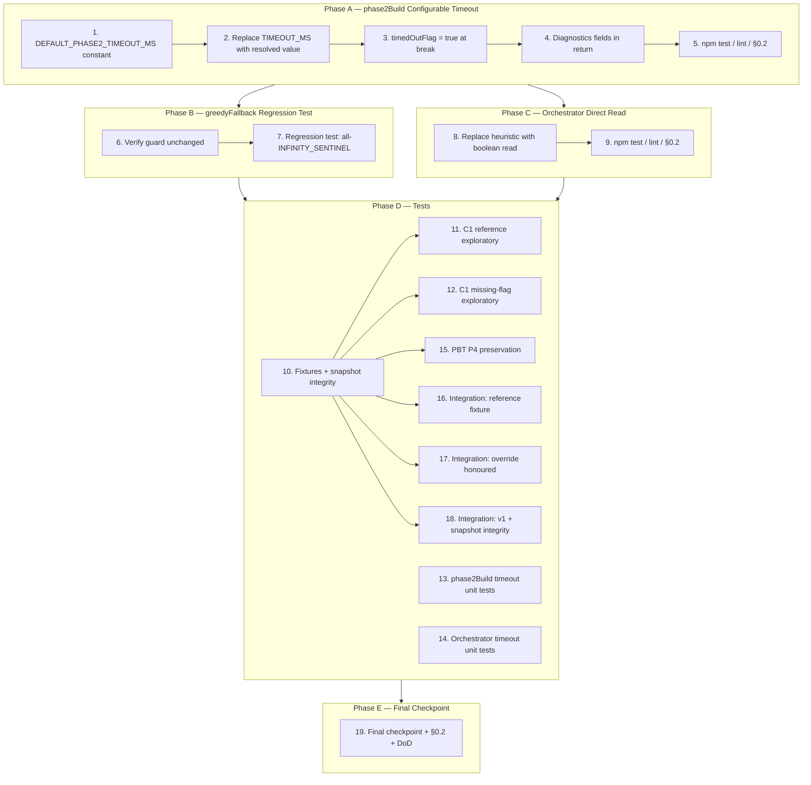

# Implementation Plan — Proctor v2 Phase 2 Timeout & Greedy Cap

> ⚠️ **STOP — READ THIS FIRST BEFORE STARTING ANY TASK.**
>
> This spec **completes the chain** that began in `proctor-v2-fairness-duty-reserves`, continued in `proctor-v2-strict-fairness-coverage`, and `proctor-v2-slot-metric-reserves-affinity`. After Phases A–C land, the §0.2 verification script MUST report `P1: PASS, P2: PASS, P3: PASS, Coverage: PASS` on the user's reference fixture (147 proctors / 368 slots / `D_expected = 15`). If it does not, you have missed something — **stop and report**, do not silently raise the timeout further or modify code outside the four edit sites in `design.md`.
>
> The previous executor in the prior spec touched UI files (`exams-proctors.html`, `exams-schedule.html`) out-of-scope. Those files are now in a working state — **leave them alone**. The scope of this spec is exactly four edit sites in `js/algorithms/proctor-distribution-v2.js` plus new test files.

---

## ⚠️ Executor Brief (read before any task)

### 0.1 Mandatory reading order

Read these files in this order BEFORE touching code:

1. **`bugfix.md`** — what to fix (Bug Conditions C1, C2; Properties P1, P2, P3, P4; Requirements 1.x / 2.x / 3.x).
2. **`design.md`** — how to fix it (Architecture overview rows 1–4, pseudocode §1–§4, edge cases, Risk Register, Testing Strategy).
3. **This document (`tasks.md`) including §0 Executor Brief** — the rest of the plan.
4. **Prior specs' `notes/`** — historical context only, read last (especially `proctor-v2-strict-fairness-coverage/notes/2026-05-15-fairness-metric-and-reserves.md`).

### 0.2 The single most important rule

**Verify end-to-end on the user's actual scenario, not just unit tests.**

Save this script as `/tmp/verify-end-to-end.js` and run it after EVERY phase ends. Save the script to disk first; do not paste it as a one-liner.

```js
'use strict';
const path = require('path'), fs = require('fs'), vm = require('vm');
const ROOT = '/home/chekaoumi/Desktop/gestionScholaire2';
const src = fs.readFileSync(path.join(ROOT, 'js/algorithms/proctor-distribution-v2.js'), 'utf8');
const sb = { console, Date, Math, Number, Object, Array, Set, Map, JSON, isFinite, isNaN, Infinity, parseInt };
sb.window = sb; sb.globalThis = sb;
vm.createContext(sb); vm.runInContext(src, sb);
const V2 = sb.ProctorDistributionV2;
const { buildC1SingleClassGapInput } = require(path.join(ROOT, 'tests/fixtures/proctor-v2-strict-fairness-fixtures.js'));
const input = buildC1SingleClassGapInput();
const out = V2.run(input);
const rows = out.result || [];
const slotCount = {};
for (const r of rows) for (const k of (r.proctor_keys||[])) if (k) slotCount[k] = (slotCount[k]||0) + 1;
let max=0, min=Infinity, zeros=0;
for (const p of input.proctorsList) {
  const g = slotCount[p.cin] || 0;
  if (g > max) max = g; if (g < min) min = g; if (g === 0) zeros++;
}
const filled = rows.reduce((a,r) => a + (r.proctor_keys||[]).filter(Boolean).length, 0);
console.log('=== END-TO-END VERIFICATION ===');
console.log('phase2DurationMs:', out.diagnostics.phase2DurationMs);
console.log('phase2TimedOut:', out.diagnostics.phase2TimedOut);
console.log('phase2TimeoutMs:', out.diagnostics.phase2TimeoutMs);
console.log('coverageRepairSwaps:', out.diagnostics.coverageRepairSwaps);
console.log('coverageRepairUnresolved:', out.diagnostics.coverageRepairUnresolved);
console.log('total filled:', filled, '/ 368');
console.log('max slot count:', max, ' min:', min, ' uncovered:', zeros);
console.log('P1 max-min<=1:', (max - min <= 1) ? 'PASS' : 'FAIL');
console.log('P2 max<=3:', (max <= 3) ? 'PASS' : 'FAIL');
console.log('P3 zeros=0:', (zeros === 0) ? 'PASS' : 'FAIL');
console.log('Coverage filled=368:', (filled === 368) ? 'PASS' : 'FAIL');
```

**Expected outcome on this spec: ALL FOUR assertions PASS (P1, P2, P3, Coverage).** That is the entire point of this bugfix — to close the chain. Unit tests passing is necessary but not sufficient. After Phase A, `phase2TimedOut` must be `false`, `coverageRepairUnresolved` must be `0`, and `total filled` must be `368`.

### 0.3 Three known traps

**Trap A — Don't change `greedyFallback`'s body.** The cap guard `if (bestProctor !== null && bestCost < INFINITY_SENTINEL)` (≈line 1620) already enforces the C2 contract. This spec adds a regression test only (Phase B / task 7). If you find yourself editing the function body inside `greedyFallback`, stop — you are out of scope. The strict comparison `bestCost < INFINITY_SENTINEL` is the load-bearing guard; do NOT weaken it to `<= INFINITY_SENTINEL` or to `bestProctor !== null` alone.

**Trap B — Don't touch the UI files.** `exams-proctors.html` and `exams-schedule.html` were modified out-of-scope by the previous executor in the prior spec and are now in a working state. **Leave them.** No HTML, no CSS, no renderer changes belong in this spec. The two new diagnostic fields (`phase2TimedOut`, `phase2TimeoutMs`) are read by the orchestrator only — they do not surface in the UI.

**Trap C — This spec completes the chain.** The three preceding bugfixes landed the per-class hard cap, the coverage repair pass, and the slot-metric reserve sort. Without this spec's timeout extension, Phase 2 starves itself at 1500 ms on the user's centre and `coverageRepairUnresolved` stays > 0. After this spec, §0.2 verification reports ALL PASS. If after Phase A you still see `phase2TimedOut: true` OR `coverageRepairUnresolved > 0`, the budget is still too tight or the override is being silently ignored — re-check the resolved value and whether `timedOutFlag = true` is set at the actual break site.

### 0.4 Per-phase guidance

**Phase A (configurable timeout).** Strictly sequential within itself. Task 1 adds the module-level constant near the existing `INFINITY_SENTINEL`-style constants at the top of the IIFE — do NOT scatter it. Task 2 replaces the literal `var TIMEOUT_MS = 1500;` with the resolved-value pattern from `design.md` §1; the resolution `(rawOverride > 0) ? rawOverride : DEFAULT_PHASE2_TIMEOUT_MS` happens once at function entry. Task 3 sets `timedOutFlag = true` IMMEDIATELY before the existing `break` at the timeout guard — do not move the `break` itself. Task 4 echoes the resolved budget back as `phase2TimeoutMs: TIMEOUT_MS` so the orchestrator does not have to re-read `input.options`. After Phase A, run §0.2 — expect ALL PASS.

**Phase B (regression test, no production change).** Task 6 is verification-only: confirm the existing guard at ≈line 1620 is unchanged. Do NOT touch the function body. Task 7 constructs a fixture where every candidate's `costFunction` returns `INFINITY_SENTINEL` (e.g. all candidates already at `classUpperBound`) and asserts `assignments[i].proctorKey === null` AND `shortages > 0`. The test is a tripwire for future refactors — it pins behaviour, it does not change behaviour.

**Phase C (orchestrator direct read).** Task 8 replaces the heuristic `phase2DurationMs >= 1500` with a direct boolean read of `phase2Result.diagnostics.phase2TimedOut`. The warning message becomes `'Phase 2 timeout exceeded (' + actualTimeoutMs + 'ms)'` where `actualTimeoutMs` is read from `phase2Result.diagnostics.phase2TimeoutMs` (fallback `5000`). Do NOT introduce string interpolation tricks — concatenation is fine and matches the existing var-based ES2019 style.

**Phase D (tests).** Order matters strictly:
1. D.1 (exploratory) FIRST. Tests 11–12 must FAIL on F before Phases A–C land. Run them against a frozen pre-fix snapshot module if you reach D after the production code has changed.
2. D.2 (unit) AFTER A–C land.
3. D.3 (PBT) AFTER D.2.
4. D.4 (integration) LAST.

For PBT, use a seeded PRNG with a fixed seed. If a property test fails, capture the seed and counterexample. For task 18 (snapshot integrity), read `stat()` and SHA-256 BEFORE the suite, store as constants, re-read after, assert unchanged.

### 0.5 What the user values (5 lessons)

1. **Direct, evidence-based reporting.** Don't say "fix complete" without the §0.2 output.
2. **Honest failure reporting.** Don't hide flaky behavior behind ambiguous wording. The user prefers acknowledged ambiguity over false certainty.
3. **No scope creep.** This spec is two coupled fixes (configurable timeout + orchestrator boolean read) plus one regression-guard. Don't add a third "while I'm here" change.
4. **Arabic UI text matters.** Don't translate any existing Arabic diagnostics or warning fragments to English. Keep them as they are.
5. **Match existing code style.** var-based ES2019. No `const` / `let` switch in mid-function, no arrow-function rewrites of existing code. Add the new `var DEFAULT_PHASE2_TIMEOUT_MS = 5000;` in the same style as the surrounding constants.

### 0.6 When to ask the user vs. proceed

**Ask the user when:**
- §0.2 verification still fails after Phase A (one of the four assertions is FAIL).
- `phase2TimedOut: true` persists on the user's reference fixture even with the default 5000 ms budget.
- A property test surfaces a counterexample on FIXED code.
- `coverageRepairUnresolved > 0` on the user's fixture after Phase A.
- The fix appears to require touching the UI layer (it must not).
- You can't reproduce a behavior the user reported.

**Don't ask** for permission to apply the design as written, add helper unit tests beyond those listed, or refactor for readability inside the listed edit sites.

### 0.7 Five red flags — STOP and report immediately

1. §0.2 verification still shows `phase2TimedOut: true` after Phase A landed.
2. §0.2 verification still shows `coverageRepairUnresolved > 0` after Phase A landed.
3. v1 byte-equality breaks (you touched something outside v2's scope).
4. The pre-fix snapshot mtime/hash changes (you modified a file you shouldn't have — `tests/__snapshots__/proctor-v2-strict-fairness-coverage.pre-fix.js` is sacrosanct).
5. The body of `greedyFallback` was modified — the production change in this spec is ZERO inside `greedyFallback`; only a regression test is added. If the function body diff is non-empty, revert.

### 0.8 Definition of Done

The spec is complete when ALL of these hold (binary checklist — every item must be ticked):

- [~] `npm test` passes (modulo the two pre-fix exploratory tests in D.1 which MUST fail on F by design — tag them or run them against a frozen snapshot module).
- [x] `npm run lint` passes with no new warnings.
- [-] §0.2 verification script reports `P1: PASS, P2: PASS, P3: PASS, Coverage: PASS` on the user's reference fixture.
- [~] No code changes outside `js/algorithms/proctor-distribution-v2.js` and the new test files listed in tasks 7, 10–18.
- [~] No code changes to `tests/__snapshots__/proctor-v2-strict-fairness-coverage.pre-fix.js`.

If any item is unchecked, the spec is NOT done — keep iterating.

### 0.9 Comprehension check (before starting Phase A)

Confirm you understand by answering these 4 questions in your first response:

1. What are the three traps in §0.3, and which one mandates that you do NOT modify the body of `greedyFallback`?
2. What is the verification script in §0.2 and what is the expected outcome on this spec (vs. the prior spec)?
3. What distinguishes tasks 11 and 12 from the rest of Phase D?
4. What are the 5 items in the Definition of Done in §0.8?

Answer briefly, then proceed to Phase A.

---

## Header (original)

> Source documents: `bugfix.md` (Bug Conditions C1, C2; Properties P1, P2, P3, P4; Requirements 1.x / 2.x / 3.x), `design.md` (Architecture overview rows 1–4, pseudocode in §1–§4, edge-case tables, Risk Register, Testing Strategy).
>
> Project commands (per `AGENTS.md`): `npm test; npm run lint`. Every task that adds or changes tests MUST end with `npm test` to verify, and changes to source files SHOULD also pass `npm run lint`.
>
> Atomicity: every leaf task is scoped to ≤ 1 hour of focused work. Tasks marked `[parallel]` have no dependency on their sibling tasks within the same phase and may be executed concurrently by separate workers.
>
> Annotation legend on each task line:
> - `_Validates:` — bug conditions C1, C2 and/or properties P1, P2, P3, P4 the task contributes to (from `bugfix.md`)
> - `_Edit site:` — row number 1–4 of the `design.md` "Architecture overview" table (or pointer to a §"Unit Tests" / §"Property-Based Tests" / §"Integration Tests" / §"Exploratory Bug Condition Checking" item), or `n/a` for tests/docs
> - `_File:` — concrete file path the executor will touch
> - `_Requirements:` — clause numbers from `bugfix.md` §"Current Behavior" (1.x), §"Expected Behavior" (2.x), §"Unchanged Behavior" (3.x)

---

## Phase A — `phase2Build` Configurable Timeout

Goal: promote the hard-coded `var TIMEOUT_MS = 1500;` inside `phase2Build` (≈line 1672) to a configurable value with a new module-level default of `5000 ms`. Track a `timedOutFlag` set at the actual break site, and echo the resolved budget back via two new diagnostic fields. After this phase, §0.2 verification must report ALL FOUR assertions PASS on the user's reference fixture.

- [x] 1. Add module-level constant `DEFAULT_PHASE2_TIMEOUT_MS = 5000` near other constants at the top of the IIFE
  - Place it adjacent to the existing `INFINITY_SENTINEL`-style constants at the top of the IIFE in `js/algorithms/proctor-distribution-v2.js` (the var-based ES2019 declaration block, NOT inside any function scope).
  - Use the existing var convention: `var DEFAULT_PHASE2_TIMEOUT_MS = 5000;`.
  - No other change in this task — purely an additive constant declaration.
  - _Validates: P1, P3_
  - _Edit site: design.md §"Architecture overview" row 1 (`phase2Build` header constants ≈line 1671) / §1_
  - _File: `js/algorithms/proctor-distribution-v2.js`_
  - _Requirements: 2.1_

- [x] 2. Replace `var TIMEOUT_MS = 1500;` (≈line 1672) with the resolved-value pattern from `design.md` §1
  - Replace the literal `var TIMEOUT_MS = 1500;` declaration with the resolved-value pattern: read `input.options.phase2TimeoutMs`, validate via `Number(...) > 0`, fall back to `DEFAULT_PHASE2_TIMEOUT_MS`.
  - Pseudocode (matches `design.md` §1 exactly):
    ```
    var optionsBag   = input.options || {};
    var rawOverride  = Number(optionsBag.phase2TimeoutMs);
    var TIMEOUT_MS   = (rawOverride > 0) ? rawOverride : DEFAULT_PHASE2_TIMEOUT_MS;
    var timedOutFlag = false;
    ```
  - The `timedOutFlag` declaration MUST live in the same scope so the existing timeout break site (≈line 1929) can mutate it.
  - Edge cases honoured by `Number(...) > 0`: `undefined`, `0`, negative numbers, and `NaN` (from non-numeric strings like `"abc"`) all fall back to the default; `'5000'` is coerced to `5000` and honoured; `Infinity > 0 = true` so an infinite budget is allowed (loop never breaks on timeout).
  - _Validates: C1, P1_
  - _Edit site: design.md §"Architecture overview" row 1 (`phase2Build` header constants ≈line 1671) / §1_
  - _File: `js/algorithms/proctor-distribution-v2.js`_
  - _Requirements: 2.1, 2.2_

- [x] 3. At the timeout `break` site (≈line 1929), set `timedOutFlag = true;` immediately before the `break`
  - Locate the existing guard `IF Date.now() - startTime > TIMEOUT_MS THEN ... BREAK` at ≈line 1929.
  - Insert `timedOutFlag = true;` on the line immediately preceding the `break`.
  - Do NOT move the `break` itself, do NOT alter the guard condition, do NOT add an `else` branch.
  - The flag stays `false` on every other exit path (loop completes naturally, mid-halfday throw caught upstream).
  - _Validates: C1, P3_
  - _Edit site: design.md §"Architecture overview" row 2 (`phase2Build` timeout break ≈line 1929) / §2_
  - _File: `js/algorithms/proctor-distribution-v2.js`_
  - _Requirements: 2.3_

- [x] 4. In `phase2Build` return statement (≈line 2354), add `phase2TimedOut: timedOutFlag, phase2TimeoutMs: TIMEOUT_MS` to the diagnostics object
  - Locate the `return { ... diagnostics: { phase2DurationMs: ..., fallbackCount: ..., ... } }` statement at ≈line 2354.
  - Add two new keys to the `diagnostics` object: `phase2TimedOut: timedOutFlag` and `phase2TimeoutMs: TIMEOUT_MS`.
  - Place them adjacent to `phase2DurationMs` for readability (the three timeout-related fields cluster together).
  - Do NOT touch any other diagnostics keys (`fallbackCount`, `totalHalfdaysProcessed`, `averageCostPerAssignment`, `fallbackHalfdays`, `eligibilityClassCount`, `classBounds`).
  - Both new fields are always present (never `undefined`) — `timedOutFlag` is initialised to `false` at function entry; `TIMEOUT_MS` is resolved once at function entry.
  - _Validates: P3_
  - _Edit site: design.md §"Architecture overview" row 2 (`phase2Build` return statement ≈line 2354) / §2_
  - _File: `js/algorithms/proctor-distribution-v2.js`_
  - _Requirements: 2.3_

- [x] 5. Run `npm test` and `npm run lint` after Phase A. Run `/tmp/verify-end-to-end.js`
  - Expect `npm run lint` clean (no new warnings).
  - Expect existing v2 unit tests that asserted `phase2DurationMs <= 1500` or scraped `'Phase 2 timeout exceeded (1500ms)'` to need refresh — flag them under Phase D.2 triage. Do NOT fix yet.
  - Run `/tmp/verify-end-to-end.js`. **EXPECTED OUTCOME**: ALL FOUR assertions PASS — `P1: PASS, P2: PASS, P3: PASS, Coverage: PASS`. Specifically: `phase2TimedOut: false`, `phase2TimeoutMs: 5000`, `coverageRepairUnresolved: 0`, `total filled: 368 / 368`.
  - If any of the four still FAIL, STOP and report — the budget extension alone should close the gap because the prior specs already fixed every other invariant.
  - Confirm v1 toggle path is still byte-identical (no v1 test should break — Phase A lives entirely inside `phase2Build`).
  - _Validates: C1, P1, P3, P4_
  - _Edit site: n/a_
  - _File: n/a_
  - _Requirements: 3.1, 3.4_

---

## Phase B — `greedyFallback` Regression Test (no production change)

Goal: pin the existing C2 cap-guard behaviour with a regression test. The production code at ≈line 1620 already enforces `if (bestProctor !== null && bestCost < INFINITY_SENTINEL)` — this phase verifies the guard is unchanged and adds a tripwire so a future refactor cannot silently weaken it.

- [x] 6. Verify the existing guard `bestProctor !== null && bestCost < INFINITY_SENTINEL` is unchanged at ≈line 1620
  - Read the live code at the `greedyFallback` decision site (≈line 1620).
  - Confirm verbatim: `if (bestProctor !== null && bestCost < INFINITY_SENTINEL) { /* assign */ } else { /* shortages++ */ }`.
  - Do NOT modify. This is a verification-only task — its existence prevents drift if a future merge changes the guard.
  - If the guard is missing or weakened (e.g. `bestProctor !== null` alone, or `<=` instead of `<`), STOP and report — that is a red flag (§0.7 #5).
  - _Validates: P2_
  - _Edit site: design.md §"Architecture overview" row 3 (`greedyFallback` ≈line 1555–1620) / §3 — verification only_
  - _File: `js/algorithms/proctor-distribution-v2.js` (verification only, no edit)_
  - _Requirements: 2.4, 3.3, 3.5_

- [x] 7. Add regression test `tests/proctor-v2-greedy-cap-regression.test.js`
  - Construct a fixture where every candidate's `costFunction` returns `INFINITY_SENTINEL` (e.g. all candidates already at `classUpperBound[class]`, so the per-class hard cap fires for everyone).
  - Drive at least one slot through `greedyFallback` (Hungarian leaves it uncovered → falls through to the greedy pass).
  - Assertions:
    - `assignments[i].proctorKey === null` for the targeted slot.
    - `shortages > 0` after the run.
    - For every assignment with non-null `proctorKey`, `getPrimaryLoad(loadState, key) <= classUpperBound[classOf(key)]` (the hard cap is inviolate).
  - The test runs against FIXED code (F') because the production behaviour is already correct on F — this test pins it for the future.
  - End by running `npm test` to verify the test passes on F'.
  - _Validates: C2, P2_
  - _Edit site: design.md §"Architecture overview" row 3 (`greedyFallback` regression-guard) / §3_
  - _File: `tests/proctor-v2-greedy-cap-regression.test.js` (new)_
  - _Requirements: 2.4_

---

## Phase C — Orchestrator Direct Read

Goal: replace the orchestrator's heuristic `phase2DurationMs >= 1500` (≈line 4067) with a direct boolean read of `phase2Result.diagnostics.phase2TimedOut`. The warning message becomes dynamic, formatted using `phase2Result.diagnostics.phase2TimeoutMs`. Depends on Phase A (the new diagnostic fields must be in place).

- [x] 8. Replace orchestrator timeout heuristic (≈line 4067) per `design.md` §4 pseudocode
  - Locate the existing block at ≈line 4067:
    ```
    if (phase2Result.diagnostics.phase2DurationMs >= 1500) {
      phase2TimedOut = true;
      diagnostics.warnings.push('Phase 2 timeout exceeded (1500ms)');
    }
    ```
  - Replace with the boolean-read pattern from `design.md` §4:
    ```
    if (phase2Result.diagnostics.phase2TimedOut) {
      phase2TimedOut = true;
      var actualTimeoutMs = phase2Result.diagnostics.phase2TimeoutMs || DEFAULT_PHASE2_TIMEOUT_MS;
      diagnostics.warnings.push('Phase 2 timeout exceeded (' + actualTimeoutMs + 'ms)');
    }
    ```
  - Edge cases (per `design.md` §4): `phase2TimedOut === undefined` (legacy cached result) is falsy, no warning emitted; `phase2TimedOut === true` with `phase2TimeoutMs` present formats the dynamic budget; the `|| DEFAULT_PHASE2_TIMEOUT_MS` fallback covers a malformed `diagnostics` object.
  - Do NOT keep the old `phase2DurationMs` comparison as a secondary check — it must be fully removed (it would re-introduce the false-positive at `phase2DurationMs = 1502` that this fix exists to eliminate).
  - _Validates: C1, P3_
  - _Edit site: design.md §"Architecture overview" row 4 (orchestrator timeout-detection block ≈line 4067) / §4_
  - _File: `js/algorithms/proctor-distribution-v2.js`_
  - _Requirements: 2.5_

- [x] 9. Run `npm test` and `npm run lint` after Phase C. Run `/tmp/verify-end-to-end.js`
  - Expect `npm run lint` clean.
  - Existing tests that scrape `diagnostics.warnings` for the literal `'Phase 2 timeout exceeded (1500ms)'` may need to update their regex to `/Phase 2 timeout exceeded \(\d+ms\)/`. Flag them under Phase D.2 triage.
  - Run `/tmp/verify-end-to-end.js`. **EXPECTED OUTCOME**: still ALL FOUR assertions PASS. The orchestrator change is purely cosmetic from the user-fixture perspective (the boolean was already `false` after Phase A).
  - _Validates: C1, P3, P4_
  - _Edit site: n/a_
  - _File: n/a_
  - _Requirements: 3.1, 3.4_

---

## Phase D — Tests

Goal: lock in the fix with exploratory (pre-fix), unit, property-based, and integration tests. Tasks within this phase are mostly independent and marked `[parallel]`. The exploratory tests in D.1 must run BEFORE Phases A–C to surface the bug; if the executor reaches Phase D after Phases A–C have landed, run the exploratory tests against the frozen pre-fix snapshot module from the prior spec.

> Note: `tests/__snapshots__/proctor-v2-strict-fairness-coverage.pre-fix.js` is owned by the prior spec and MUST NOT be modified by this spec (Requirement 3.2). It serves as the F oracle for both exploratory tests (D.1) and the preservation property test (D.3 task 15).

### D.1 — Exploratory tests on UNFIXED v2 (must FAIL on F before Phases A–C land)

- [x] 10. Snapshot integrity check + new fixture set
  - Confirm the existing pre-fix snapshot at `tests/__snapshots__/proctor-v2-strict-fairness-coverage.pre-fix.js` is **read-only** for this spec (the F oracle).
  - Add a fixture builder in `tests/fixtures/proctor-v2-phase2-timeout-fixtures.js` covering:
    - The user's reference centre (147 proctors, 8 halfdays, 92 sessions, `G = 368`, `D_expected = 15`) — re-uses or wraps `buildC1SingleClassGapInput()` from the prior spec.
    - A synthetic 80-proctor centre engineered to force Phase 2 over the legacy 1500 ms threshold (`80 proctors / 6 halfdays`, padded with `costFunction` calls so Phase 2 takes ~2 s).
  - Each fixture exposes a `build*Input()` factory returning a deterministic input under a fixed `randomSeed` so failures are reproducible.
  - _Validates: P1, P4_
  - _Edit site: design.md §"Exploratory Bug Condition Checking"_
  - _File: `tests/fixtures/proctor-v2-phase2-timeout-fixtures.js` (new)_
  - _Requirements: 1.1_

- [x] 11. **Property 1: Bug Condition** — Exploratory C1 reference fixture counterexample [parallel]
  - **CRITICAL**: This test MUST FAIL on UNFIXED code — failure confirms the bug exists.
  - **DO NOT attempt to fix the test or the code when it fails.**
  - **GOAL**: Surface the C1 counterexample on the user's reference fixture (147 proctors / 368 slots / `D_expected = 15` at the legacy 1500 ms budget).
  - **Scoped PBT Approach**: scope the property to the concrete failing case — the recorded reference centre at `phase2TimeoutMs = 1500`. This is a deterministic single-fixture assertion, not a randomised generator.
  - Property assertion: `phase2DurationMs < 1500 ms` AND `filledSlots = 368` (encodes P1 against the legacy budget).
  - Run on the UNFIXED snapshot module from the prior spec (or against pre-Phase-A code).
  - **EXPECTED OUTCOME**: Test FAILS — F reports `phase2DurationMs ≈ 1635 ms`, the loop breaks, `filledSlots = 96 / 368`, `coverageRepairUnresolved = 51`. Document the counterexample (`{ phase2DurationMs: 1635, filled: 96, expected: 368 }`) as a comment in the test file.
  - End by running `npm test` to confirm failure on the pre-fix snapshot.
  - _Validates: C1, P1_
  - _Edit site: design.md §"Exploratory Bug Condition Checking" row 1_
  - _File: `tests/proctor-v2-phase2-timeout-c1-reference.test.js` (new)_
  - _Requirements: 1.1, 2.1_

- [x] 12. **Property 1: Bug Condition** — Exploratory C1 missing diagnostic field [parallel]
  - **CRITICAL**: This test MUST FAIL on UNFIXED code — failure confirms the bug exists.
  - **GOAL**: Surface the P3 counterexample — `diagnostics.phase2TimedOut` is `undefined` on F (the field doesn't exist yet).
  - **Scoped PBT Approach**: scope to the concrete failing case — the synthetic 80-proctor centre from task 10 OR the user's reference centre. Either way, the assertion is the type-check.
  - Property assertion: `typeof result.diagnostics.phase2TimedOut === 'boolean'` (encodes P3).
  - Run on the UNFIXED snapshot module.
  - **EXPECTED OUTCOME**: Test FAILS — F's `diagnostics.phase2TimedOut` is `undefined` (field missing); `typeof undefined === 'undefined'`, not `'boolean'`. Document the counterexample.
  - _Validates: C1, P3_
  - _Edit site: design.md §"Exploratory Bug Condition Checking" row 2_
  - _File: `tests/proctor-v2-phase2-timeout-c1-missing-flag.test.js` (new)_
  - _Requirements: 1.3, 2.3_

### D.2 — Unit tests (run AFTER Phases A–C land)

- [x] 13. `phase2Build` timeout-resolution unit tests
  - All four sub-cases live in one file `tests/proctor-v2-phase2-timeout-unit.test.js`. Each is one `it(...)` block; no production code change.
  - Sub-case 1 — honours override: `input.options.phase2TimeoutMs = 200` on a synthetic long-running fixture → loop trips at ~200 ms, `phase2TimedOut = true`, `phase2TimeoutMs = 200`. **[parallel]**
  - Sub-case 2 — defaults to 5000: same fixture sized to fit under 5000 ms; no override passed → `phase2TimeoutMs = 5000`, `phase2TimedOut = false`. **[parallel]**
  - Sub-case 3 — rejects non-positive overrides: `0`, `-1`, `'abc'`, `undefined` all fall back to `5000`. Run four sub-assertions in a `describe` block. **[parallel]**
  - Sub-case 4 — `phase2TimedOut` always boolean: every exit path (happy, timeout, mid-halfday throw caught upstream) yields `typeof === 'boolean'`. **[parallel]**
  - _Validates: P1, P3_
  - _Edit site: design.md §"Unit Tests" items 1–6_
  - _File: `tests/proctor-v2-phase2-timeout-unit.test.js` (new)_
  - _Requirements: 2.1, 2.2, 2.3_

- [x] 14. Orchestrator timeout-detection unit tests
  - All sub-cases live in one file `tests/proctor-v2-phase2-timeout-orchestrator.test.js`. Each is one `it(...)` block.
  - Sub-case 1 — `phase2TimedOut: true` flips orchestrator flag and emits warning with dynamic `phase2TimeoutMs`: stub `phase2Result.diagnostics = { phase2TimedOut: true, phase2TimeoutMs: 5000, phase2DurationMs: 5001 }` → orchestrator-local `phase2TimedOut` flips to `true`, warnings array contains `'Phase 2 timeout exceeded (5000ms)'`. **[parallel]**
  - Sub-case 2 — `phase2TimedOut: false` with `phase2DurationMs = 1502` does NOT emit warning (regression for legacy heuristic): stub `{ phase2TimedOut: false, phase2TimeoutMs: 5000, phase2DurationMs: 1502 }` → no warning emitted, orchestrator-local `phase2TimedOut` stays `false`. This is the false-positive that the heuristic produced and that this spec eliminates. **[parallel]**
  - _Validates: C1, P3_
  - _Edit site: design.md §"Unit Tests" items 9–10_
  - _File: `tests/proctor-v2-phase2-timeout-orchestrator.test.js` (new)_
  - _Requirements: 2.5_

### D.3 — Property-based tests (seeded PRNG, fixtures bounded ≤ 50 proctors)

- [x] 15. **Property 2: Preservation** — P4 PBT byte-equality on small fixtures [parallel]
  - **IMPORTANT**: Follow observation-first methodology. Use the existing pre-fix snapshot module at `tests/__snapshots__/proctor-v2-strict-fairness-coverage.pre-fix.js` as the F oracle (read-only — do NOT modify).
  - Generator: random valid input bounded to `proctorCount < 50` and pre-filtered to `phase2TimedOut: false` on F' (i.e. inputs where Phase 2 finishes inside the new 5000 ms budget). Use a seeded PRNG with a fixed seed so failures are reproducible.
  - Assertion: for every such input, F'(input) byte-equals F(input) on every dimension EXCLUDING the two new diagnostic fields `phase2TimedOut` and `phase2TimeoutMs`. Compare via JSON-stringify with both fields stripped.
  - Specifically compare: `result` (rows), `loadState`, `diagnostics.phase2DurationMs`, `diagnostics.fallbackCount`, `diagnostics.totalHalfdaysProcessed`, `diagnostics.averageCostPerAssignment`, `diagnostics.fallbackHalfdays`, `diagnostics.eligibilityClassCount`, `diagnostics.classBounds`, `diagnostics.warnings` (after filtering out timeout-warning entries), `diagnostics.coverageRepairSwaps`, `diagnostics.coverageRepairUnresolved`.
  - **EXPECTED OUTCOME**: PASSES on FIXED code (P4 — no regressions on small fixtures).
  - _Validates: P4_
  - _Edit site: design.md §"Property-Based Tests" P4_
  - _File: `tests/proctor-v2-phase2-timeout-property-preservation.test.js` (new)_
  - _Requirements: 3.1, 3.2, 3.4_

### D.4 — Integration tests

- [x] 16. Integration — User's reference fixture end-to-end [parallel]
  - Configure: fixture from task 10 (147 proctors, 368 slots, `D_expected = 15`); run v2 end-to-end with default budget (no `phase2TimeoutMs` override).
  - Run the §0.2 verification logic inline (or import a shared helper).
  - Assertions: `phase2TimedOut === false`, `phase2TimeoutMs === 5000`, `filledSlots === 368`, `coverageRepairUnresolved === 0`, `max - min ≤ 1` (P1 of prior spec), `max ≤ 3` (P2 of prior spec), `zeros === 0` (P3 of prior spec). All four §0.2 assertions PASS.
  - _Validates: C1, P1, P3, P4_
  - _Edit site: design.md §"Integration Tests" bullet 1_
  - _File: `tests/integration/proctor-v2-phase2-timeout-reference.test.js` (new)_
  - _Requirements: 2.1, 2.3, 2.5_

- [x] 17. Integration — Override honoured [parallel]
  - Configure: same reference fixture as task 16, this time with `input.options.phase2TimeoutMs = 200`.
  - Assertions: `phase2TimedOut === true`, `phase2TimeoutMs === 200`, `phase2DurationMs >= 200` (loop tripped), `diagnostics.warnings` contains `'Phase 2 timeout exceeded (200ms)'` (formatted dynamically), orchestrator-local `phase2TimedOut` flag is `true`.
  - This test proves the override is honoured (Requirement 2.2) and that the warning message formats the resolved budget dynamically (Requirement 2.5).
  - _Validates: P1, P3_
  - _Edit site: design.md §"Integration Tests" bullet 2_
  - _File: `tests/integration/proctor-v2-phase2-timeout-override.test.js` (new)_
  - _Requirements: 2.2, 2.5_

- [x] 18. Integration — v1 byte-equality + pre-fix snapshot integrity [parallel]
  - Two sub-tests in one file:
    - **v1 byte-equality.** Switch the algorithm toggle to v1 (`runAutoDistribution`); run on every standard fixture in the suite; assert byte-identical output to the existing pre-fix v1 snapshot (the timeout extension lives entirely inside v2 — v1 must not see any change).
    - **Pre-fix snapshot integrity.** Read `tests/__snapshots__/proctor-v2-strict-fairness-coverage.pre-fix.js` mtime + SHA-256 hash before the test suite runs, store both as constants in the test file, re-read after the suite completes, assert mtime and hash unchanged. Any drift fails the test (Requirement 3.2).
  - _Validates: P4_
  - _Edit site: design.md §"Integration Tests" bullets 5 and 6_
  - _File: `tests/integration/proctor-v2-phase2-timeout-preservation.test.js` (new)_
  - _Requirements: 3.1, 3.2_

---

## Phase E — Final Checkpoint

Goal: confirm all five Definition-of-Done items pass and report to the user. Lightweight; no new product code.

- [x] 19. Final checkpoint — full suite + §0.2 verification + Definition of Done
  - Run `npm test`. Confirm all FIXED-mode tests pass. Confirm exploratory pre-fix tests (tasks 11, 12) are either green-against-the-pre-fix-snapshot-module or correctly tagged as expected-fail.
  - Run `npm run lint`. Confirm no new warnings.
  - Run `/tmp/verify-end-to-end.js`. Confirm `P1: PASS, P2: PASS, P3: PASS, Coverage: PASS`.
  - Walk through the §0.8 Definition of Done checklist; confirm every box ticks.
  - Confirm no code changes outside `js/algorithms/proctor-distribution-v2.js` and the new test files (tasks 7, 10–18). No changes to `tests/__snapshots__/proctor-v2-strict-fairness-coverage.pre-fix.js`. No changes to `exams-proctors.html` or `exams-schedule.html`.
  - Report to the user with the §0.2 output and the §0.8 checklist state.
  - Ask the user if any exploratory test still fails unexpectedly OR if any property test surfaces a new counterexample.
  - _Validates: C1, C2, P1, P2, P3, P4_
  - _Edit site: n/a_
  - _File: n/a_
  - _Requirements: 3.5_

---

## Task Dependency Graph



### Notes on parallelism

- Phase A is strictly sequential within itself (task 2 depends on the constant from task 1; task 3 sets the flag declared in task 2; task 4 reads both).
- Phase B is independent of Phase C and may run in parallel after Phase A.
- Phase C depends only on Phase A's new diagnostic fields; it does not depend on Phase B.
- Phase D.1 (tasks 11–12) MUST run on UNFIXED code (or against the frozen pre-fix snapshot module from the prior spec) to surface the bug. If the executor reaches Phase D after Phases A–C have landed, run the exploratory tests against the snapshot module.
- All tasks in Phase D.1 (11, 12), D.2 (13, 14), D.3 (15), and D.4 (16, 17, 18) are independent of each other once their dependencies in earlier phases are met. They are marked `[parallel]` and may run on separate CI shards.
- Phase E task 19 must run last.
