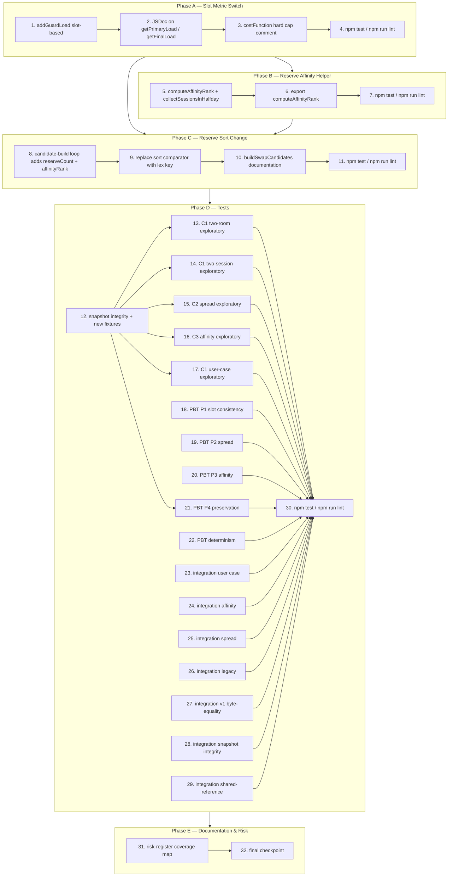

# Implementation Plan — Proctor v2 Slot Metric & Reserve Affinity

> ⚠️ **STOP — READ THIS FIRST BEFORE STARTING ANY TASK.**
>
> The previous executor (a different spec) reported "fix complete" with `[44/44 tests pass]` while the actual user scenario produced **51 uncovered teachers and `max(primaryLoad) = 11`** — a complete failure. This brief exists so you don't repeat that mistake.

---

## ⚠️ Executor Brief (read before any task)

### 0.1 Mandatory reading order

Read these files in this order BEFORE touching code:

1. **`bugfix.md`** — what to fix (Bug Conditions C1–C3, Properties P1–P4, Requirements 1.x/2.x/3.x).
2. **`design.md`** — how to fix it (Architecture overview table, pseudocode §1–§6, edge cases, Risk Register, Testing Strategy).
3. **This document (`tasks.md`) including §0 Executor Brief** — the rest of the plan.
4. **`notes/2026-05-15-fairness-metric-and-reserves.md` (in the prior spec `proctor-v2-strict-fairness-coverage/notes/`)** — historical context only, read last.

### 0.2 The single most important rule

**Verify end-to-end on the user's actual scenario, not just unit tests.**

Save this script as `/tmp/verify-end-to-end.js` and run it after EVERY phase ends. Save the script to disk first; do not paste it as a one-liner.

```js
'use strict';
const path = require('path'), fs = require('fs'), vm = require('vm');
const ROOT = '/home/chekaoumi/Desktop/gestionScholaire2';
const src = fs.readFileSync(path.join(ROOT, 'js/algorithms/proctor-distribution-v2.js'), 'utf8');
const sb = { console, Date, Math, Number, Object, Array, Set, Map, JSON, isFinite, isNaN, Infinity, parseInt };
sb.window = sb; sb.globalThis = sb;
vm.createContext(sb); vm.runInContext(src, sb);
const V2 = sb.ProctorDistributionV2;
const { buildC1SingleClassGapInput } = require(path.join(ROOT, 'tests/fixtures/proctor-v2-strict-fairness-fixtures.js'));
const input = buildC1SingleClassGapInput();
const out = V2.run(input);
const rows = out.result || [];
const slotCount = {};
for (const r of rows) for (const k of (r.proctor_keys||[])) if (k) slotCount[k] = (slotCount[k]||0) + 1;
let max=0, min=Infinity, zeros=0;
for (const p of input.proctorsList) {
  const g = slotCount[p.cin] || 0;
  if (g > max) max = g; if (g < min) min = g; if (g === 0) zeros++;
}
const filled = rows.reduce((a,r) => a + (r.proctor_keys||[]).filter(Boolean).length, 0);
console.log('=== END-TO-END VERIFICATION ===');
console.log('phase2DurationMs:', out.diagnostics.phase2DurationMs);
console.log('phase2TimedOut:', (out.diagnostics.warnings || []).some(w => typeof w === 'string' && w.includes('timeout')));
console.log('coverageRepairSwaps:', out.diagnostics.coverageRepairSwaps);
console.log('coverageRepairUnresolved:', out.diagnostics.coverageRepairUnresolved);
console.log('total filled:', filled, '/ 368');
console.log('max slot count:', max, ' min:', min, ' uncovered:', zeros);
console.log('P1 max-min<=1:', (max - min <= 1) ? 'PASS' : 'FAIL');
console.log('P2 max<=3:', (max <= 3) ? 'PASS' : 'FAIL');
console.log('P3 zeros=0:', (zeros === 0) ? 'PASS' : 'FAIL');
console.log('Coverage filled=368:', (filled === 368) ? 'PASS' : 'FAIL');
```

**All four assertions (P1, P2, P3, Coverage) MUST PASS by the end of Phase D.** Unit tests passing is necessary but not sufficient.

### 0.3 Six known traps

**Trap A — `addGuardLoad` was halfday-deduplicating.** The current code (≈line 283) gates `guardCount++` on `guardHalfdays.size` change. **Remove that gate** so `guardCount` increments on every call. The user explicitly chose option B (slot counting). Don't second-guess this.

**Trap B — Phase 2 has a hardcoded `TIMEOUT_MS = 1500`.** On the user's 147-proctor fixture, Phase 2 takes ~1640ms. This spec does NOT touch the timeout (owned by `proctor-v2-strict-fairness-coverage`). If your verification (§0.2) shows `phase2TimedOut: true`, **stop and report to the user** — don't silently raise the timeout. Test on the user's actual fixture (`buildC1SingleClassGapInput`), not just small fixtures.

**Trap C — The pre-fix snapshot is sacrosanct.** `tests/__snapshots__/proctor-v2-strict-fairness-coverage.pre-fix.js` is owned by the prior spec. **Never modify it.** Task 28 enforces this with mtime + SHA-256. If you find yourself wanting to update the snapshot to "match the new metric", stop — that's the wrong direction.

**Trap D — Exploratory tests MUST FAIL on pre-fix.** For tasks 13–17, the test failing is the SUCCESS case. Do not try to make these tests pass — they exist to prove the bug exists on F. If a test passes on pre-fix, the fixture geometry is wrong (the bug isn't being triggered). Adjust the fixture, not the assertion.

**Trap E — `unit tests passing` ≠ `bug fixed`.** The previous executor passed 44/44 unit tests and reported "fix complete". The actual scenario showed 51 uncovered teachers. Always run §0.2's end-to-end verification before declaring victory.

**Trap F — `invoke_sub_agent` may fail with "high load".** Retry up to 3 times. If still failing, do the work directly (read the design.md pseudocode, apply the change manually). Don't block on the subagent.

### 0.4 Per-phase guidance

**Phase A (Slot Metric Switch).** Strictly sequential. Tasks 2 and 3 are documentation-only — resist the temptation to "improve" code while you're there. After task 1, run §0.2; expect existing tests that asserted halfday-based `guardCount` to fail (that's task 4's purpose — flag them, don't fix yet).

**Phase B (Affinity Helper).** `collectSessionsInHalfday` must sort by `(startTime ASC, sessionKey ASC)` — both keys, in that order. Sorting only by `sessionKey` works in the common case but breaks when ordinal strings don't sort lexicographically by start time. Defensive case: missing `firstSessionRows` → log warning and return `1`. Don't throw.

**Phase C (Sort Change).** Don't introduce explicit ring loops. The lex sort `(reserveCount, affinityRank, finalLoad, tiebreak)` already handles fall-through across rings implicitly. The `tiebreak = rng()` call must stay at candidate-build time, NOT inside the comparator (calling `rng()` from a comparator yields inconsistent results because JavaScript's sort calls the comparator multiple times per pair).

**Phase D (Tests).** Order matters strictly:
1. D.1 (exploratory) FIRST. These tests must FAIL on F before you start Phase A.
2. D.2 (unit) AFTER A–C land.
3. D.3 (PBT) AFTER D.2.
4. D.4 (integration) LAST.

For PBT, use a seeded PRNG with a fixed seed. If a property test fails, capture the seed and counterexample. For task 28 (snapshot integrity), read `stat()` and SHA-256 BEFORE the suite, store as constants, re-read after, assert unchanged.

### 0.5 What the user values (5 lessons from prior sessions)

1. **Direct, evidence-based reporting.** Don't say "fix complete" without the §0.2 output.
2. **Honest failure reporting.** Don't hide flaky behavior behind ambiguous wording. The user prefers acknowledged ambiguity over false certainty.
3. **No scope creep.** This spec is two coupled fixes (metric + reserve sort). Don't add a third "while I'm here" change.
4. **Arabic UI text matters.** Don't translate `'خصاص N احتياطي للحصة'` or any existing Arabic diagnostics to English. Keep them as they are.
5. **Match existing code style.** var-based ES2019. No `const`/`let` switch in mid-function, no arrow-function rewrites of existing code.

### 0.6 When to ask the user vs. proceed

**Ask the user when:**
- You discover a fourth defect not covered by the spec.
- A property test surfaces a counterexample on FIXED code.
- §0.2 verification fails after Phase D.
- The fix appears to require touching the UI layer (it shouldn't).
- You can't reproduce a behavior the user reported.

**Don't ask** for permission to apply the design as written, add helper unit tests beyond those listed, or refactor for readability inside the listed edit sites.

### 0.7 Five red flags — STOP and report immediately

1. §0.2 verification shows `phase2TimedOut: true` even after Phase A.
2. §0.2 verification shows `coverageRepairUnresolved > 0` after Phase A.
3. v1 byte-equality breaks (you touched something outside v2's scope).
4. The pre-fix snapshot mtime/hash changes (you modified a file you shouldn't have).
5. A unit test starts asserting on `loadState.guardCount` halfday-style (someone reverted the metric switch).

### 0.8 Definition of Done

The spec is complete when ALL of these hold (binary checklist — every item must be ticked):

- [ ] `npm test` passes (modulo flagged pre-fix exploratory tests, which MUST fail).
- [ ] `npm run lint` passes with no new warnings.
- [ ] §0.2 verification script reports `P1: PASS, P2: PASS, P3: PASS, Coverage: PASS`.
- [ ] Task 28 (snapshot integrity meta-test) passes.
- [ ] Task 27 (v1 byte-equality integration test) passes.
- [ ] No code changes outside `js/algorithms/proctor-distribution-v2.js` and the new test files.
- [ ] No code changes to `tests/__snapshots__/proctor-v2-strict-fairness-coverage.pre-fix.js`.
- [ ] No code changes to `exams-proctors.html`.

If any item is unchecked, the spec is NOT done — keep iterating.

### 0.9 Comprehension check (before starting Phase A)

Confirm you understand by answering these 4 questions in your first response:

1. What are the six traps in §0.3?
2. What is the verification script in §0.2 and when do you run it?
3. What distinguishes tasks 13–17 from the rest?
4. What are the 8 items in the Definition of Done in §0.8?

Answer briefly, then proceed to Phase A.

---

## Header (original)

> Source documents: `bugfix.md` (Bug Conditions C1, C2, C3; Properties P1, P2, P3, P4; Requirements 1.x / 2.x / 3.x), `design.md` (Architecture overview rows 1–6, pseudocode in §1–§6, edge-case tables, Risk Register, Testing Strategy).
>
> Project commands (per `AGENTS.md`): `npm test; npm run lint`. Every task that adds or changes tests MUST end with `npm test` to verify, and changes to source files SHOULD also pass `npm run lint`.
>
> Atomicity: every leaf task is scoped to ≤ 1 hour of focused work. Tasks marked `[parallel]` have no dependency on their sibling tasks within the same phase and may be executed concurrently by separate workers.
>
> Annotation legend on each task line:
> - `_Validates:` — sub-conditions C1, C2, C3 and/or properties P1, P2, P3, P4 the task contributes to (from `bugfix.md`)
> - `_Edit site:` — row number 1–6 of the `design.md` "Architecture overview" table (or pointer to a §"Unit Tests" / §"Property-Based Tests" / §"Integration Tests" / §"Exploratory Bug Condition Checking" item), or `n/a` for tests/docs
> - `_File:` — concrete file path the executor will touch
> - `_Requirements:` — clause numbers from `bugfix.md` §"Current Behavior" (1.x), §"Expected Behavior" (2.x), §"Unchanged Behavior" (3.x)

---

## Phase A — Slot Metric Switch

Goal: switch `addGuardLoad` from halfday-deduplicating to slot-counting. The metric switch propagates automatically through every consumer (`getPrimaryLoad`, `getFinalLoad`, `costFunction` hard cap, `phase2_75CoverageRepair` peer eligibility, `objectiveFunction`, orchestrator diagnostics) because they all read `entry.guardCount`. This phase must land first; Phase B's helper and Phase C's sort change both build on the corrected metric.

- [ ] 1. Modify `addGuardLoad` to slot-counting semantics (≈line 283)
  - Increment `entry.guardCount` on EVERY call (drop the prior halfday-dedup gate).
  - Keep `entry.guardHalfdays.add(halfdayKey)` populated — `filterAvailableProctors` and the reserves-pass halfday-reuse check still read it for reuse-rule semantics (`bugfix.md` 2.2).
  - Update `morningCount` / `afternoonCount` to increment on every call too, matching slot semantics.
  - Preserve the early `IF NOT proctorKey OR NOT halfdayKey THEN RETURN false` guard exactly.
  - _Validates: C1, P1_
  - _Edit site: design.md §"Architecture overview" row 1 (`addGuardLoad` ≈line 283) / §1_
  - _File: `js/algorithms/proctor-distribution-v2.js`_
  - _Requirements: 2.1, 2.2_

- [ ] 2. Add JSDoc above `getPrimaryLoad` and `getFinalLoad` documenting post-fix slot semantics (≈line 359 / ≈line 370)
  - No source change to either function body.
  - Add a comment block above each stating that `entry.guardCount` is now slot-based and the function therefore returns `guardSlotCount + dutyCount` (resp. `+ reserveCount`).
  - Reference the spec name (`proctor-v2-slot-metric-reserves-affinity`) and `addGuardLoad` (Phase A task 1) so future readers find the metric switch.
  - _Validates: P1_
  - _Edit site: design.md §"Architecture overview" row 2 (`getPrimaryLoad` ≈line 359 / `getFinalLoad` ≈line 370) / §2_
  - _File: `js/algorithms/proctor-distribution-v2.js`_
  - _Requirements: 2.3_

- [ ] 3. Add comment block above the `costFunction` hard cap documenting slot-bounded behaviour (≈line 1466)
  - No source change. The cap (`postAssignmentPrimary > classBounds.classUpperBound → INFINITY_SENTINEL`) is preserved verbatim.
  - The comment must state that, post-metric-switch, the cap automatically bounds slot-level work because `getPrimaryLoad` is now slot-based — the user's intended fairness axis (Requirement 2.7).
  - Note that the cap remains inactive when `options.classBoundsByProctorKey` is absent (`bugfix.md` 3.6) and when `options.skipClassCap = true` (last-resort unconstrained-pass fallback).
  - _Validates: P1, P4_
  - _Edit site: design.md §"Architecture overview" row 3 (`costFunction` hard cap ≈line 1466) / §3_
  - _File: `js/algorithms/proctor-distribution-v2.js`_
  - _Requirements: 2.7_

- [ ] 4. Run `npm test` and `npm run lint` after Phase A
  - Expect existing v2 unit / integration tests that asserted halfday-based `guardCount` to FAIL on inputs where a proctor has multiple slots in one halfday (multi-room single-session, two-session halfday). This is intentional — the metric switch is the fix.
  - Flag every failing v2 test for triage in Phase D.2 (unit-test refresh) and Phase D.4 (integration test refresh). Do NOT touch `tests/__snapshots__/proctor-v2-strict-fairness-coverage.pre-fix.js`.
  - Confirm the v1 toggle path is still byte-identical (no v1 test should break — the metric switch lives entirely inside v2's `loadState` bookkeeping).
  - _Validates: P1, P4_
  - _Edit site: n/a_
  - _File: n/a_
  - _Requirements: 3.5, 3.10_

---

## Phase B — Reserve Affinity Helper

Goal: implement `computeAffinityRank` and prepare for the sort change in Phase C. Depends on Phase A only because the helper itself is pure and runs before the sort key consumes it; landing Phase A first keeps the metric used by `getFinalLoad` (read inside the sort key build) consistent.

- [ ] 5. Implement `computeAffinityRank(candidateKey, sessionKey, halfdayKey, sessionsBySessionKey)` per design §4 pseudocode
  - Co-locate with `phase2_5PopulateReserves` so it shares scope with the existing reserves-pass helpers.
  - Implement exactly the pseudocode in `design.md` §4: enumerate halfday sessions sorted by `(startTime ASC, sessionKey ASC)`, return `1` when `< 2` sessions, return `1` when `sessionKey` is not the second-of-halfday, otherwise scan `firstSessionRows[*].proctor_keys` and return `0` iff `candidateKey` is found.
  - Include the helper `collectSessionsInHalfday(halfdayKey, sessionsBySessionKey)` returning an array of `{ sessionKey, startTime }` filtered to rows whose `halfday_key` matches and sorted by `(startTime ASC, sessionKey ASC)`.
  - Cover every edge case from design.md §4 edge-case table: single-session halfday, first session of a 2-session halfday, second session with candidate in `S1`, second session without candidate in `S1`, halfday with > 2 sessions (data anomaly — affinity inapplicable beyond second), missing `firstSessionRows` (defensive `log_warning`, return `1`), falsy `proctor_keys` cell (`IF k AND k = candidateKey`), empty `halfdayKey` (`collectSessionsInHalfday` returns `[]` ⇒ return `1`).
  - _Validates: C3, P3_
  - _Edit site: design.md §"Architecture overview" row 4 (new `computeAffinityRank` co-located with `phase2_5PopulateReserves`) / §4_
  - _File: `js/algorithms/proctor-distribution-v2.js`_
  - _Requirements: 2.4, 2.5_

- [ ] 6. Export `computeAffinityRank` on the module-internal namespace
  - Match the convention used by `computeReserveTarget` and `computeEligibilityClasses` from prior specs.
  - Required so the unit tests in Phase D.2 (`computeAffinityRank` cases) and the property-based test in Phase D.3 task 20 (P3 PBT) can consume the helper directly.
  - Do NOT export on the public window namespace — internal-only is sufficient.
  - _Validates: C3_
  - _Edit site: design.md §"Architecture overview" row 4 / §4_
  - _File: `js/algorithms/proctor-distribution-v2.js`_
  - _Requirements: 2.4_

- [ ] 7. Run `npm test` and `npm run lint` after Phase B
  - The helper is not yet called by `phase2_5PopulateReserves` (Phase C task 8 wires it in), so existing tests must still pass — modulo the Phase A breakage already flagged in task 4.
  - Confirm the new helper is tree-shake-friendly (no side effects at module load) and lint-clean.
  - _Validates: P4_
  - _Edit site: n/a_
  - _File: n/a_
  - _Requirements: 3.5, 3.10_

---

## Phase C — Reserve Sort Change

Goal: replace the candidate sort key in `phase2_5PopulateReserves` with `(reserveCount ASC, affinityRank ASC, finalLoad ASC, tiebreak ASC)` so spread dominates affinity, affinity dominates balance, balance dominates the existing random tiebreak. Depends on Phase B (helper) and indirectly on Phase A (slot-based `finalLoad` read).

- [ ] 8. Augment the candidate-build loop in `phase2_5PopulateReserves` to compute `reserveCount` and `affinityRank` (≈line 2368)
  - Inside the existing per-eligible-proctor loop where `finalLoad` and `tiebreak = rng()` are already computed, add:
    - `reserveCount ← (loadStateForReserves[key] AND loadStateForReserves[key].reserveCount) OR 0`
    - `affinityRank ← computeAffinityRank(key, currentSessionKey, halfdayKey, sessionsBySessionKey)`
  - Push them into the candidate object alongside the existing `finalLoad` and `tiebreak` fields.
  - The `tiebreak = rng()` call MUST stay at candidate-build time so determinism under `randomSeed` is preserved (no extra `rng` call per comparator invocation).
  - _Validates: C2, C3, P2, P3_
  - _Edit site: design.md §"Architecture overview" row 5 (`phase2_5PopulateReserves` candidate-build ≈line 2368) / §5_
  - _File: `js/algorithms/proctor-distribution-v2.js`_
  - _Requirements: 2.4_

- [ ] 9. Replace the sort comparator with the new lex key
  - Replace the existing `(finalLoad, rng)` sort with the lex comparator `(reserveCount, affinityRank, finalLoad, tiebreak)`:
    1. `a.reserveCount − b.reserveCount` (spread)
    2. `a.affinityRank − b.affinityRank` (affinity, `0 < 1`)
    3. `a.finalLoad − b.finalLoad` (balance)
    4. `a.tiebreak − b.tiebreak` (rng)
  - Preserve the existing slice + apply downstream verbatim: `sliceCount = min(target, |candidates|)`, `chosen = candidates.slice(0, sliceCount)`, the `sharedReserves` / `sharedReserveKeys` build, the `addReserveLoad` update loop, the shortage-note path (`خصاص N احتياطي للحصة`), and the `reserves[]` / `reserve_keys[]` shared-reference invariant (`bugfix.md` 3.7).
  - The fall-through across spread rings (`reserveCount = 0` → `1` → `2`) is implicit in the lex order — do NOT introduce an explicit ring loop.
  - _Validates: C2, C3, P2, P3_
  - _Edit site: design.md §"Architecture overview" row 5 (`phase2_5PopulateReserves` sort ≈line 2368) / §5_
  - _File: `js/algorithms/proctor-distribution-v2.js`_
  - _Requirements: 2.4, 2.5, 2.6_

- [ ] 10. Add comment block above `phase2_75CoverageRepair`'s `buildSwapCandidates` (≈line 2867) documenting slot-based peer eligibility
  - No source change. The peer-eligibility filter inside `buildSwapCandidates` reads `getPrimaryLoad(loadState, T_over_key)` and compares against the relaxation thresholds (`classUB+1`, `classUB`, `classLB+1`). The metric switch in Phase A makes those reads slot-based automatically (`bugfix.md` 3.9).
  - The comment must reference the spec name (`proctor-v2-slot-metric-reserves-affinity`) and confirm the three-tier relaxation strategy from the prior spec (`proctor-v2-strict-fairness-coverage`) is preserved verbatim.
  - _Validates: P1, P4_
  - _Edit site: design.md §"Architecture overview" row 6 (`phase2_75CoverageRepair` peer eligibility ≈line 2867) / §6_
  - _File: `js/algorithms/proctor-distribution-v2.js`_
  - _Requirements: 3.4, 3.9_

- [ ] 11. Run `npm test` and `npm run lint` after Phase C
  - With the sort change wired in, expect the C2 / C3 exploratory tests written in Phase D.1 (tasks 15, 16) to flip from FAIL to PASS once they run against F'. The C1 exploratory tests (tasks 13, 14, 17) flipped after Phase A.
  - Existing reserves-pass unit tests that asserted exact pre-fix candidate ordering may need refresh; flag them under Phase D.2 triage.
  - _Validates: C1, C2, C3, P1, P2, P3, P4_
  - _Edit site: n/a_
  - _File: n/a_
  - _Requirements: 3.5, 3.10_

---

## Phase D — Tests

Goal: lock in the fix with exploratory (pre-fix), unit, property-based, and integration tests. Tasks within this phase are mostly independent and marked `[parallel]`. The exploratory tests in D.1 must run BEFORE Phases A–C to surface the bug; if the executor reaches Phase D after Phases A–C have landed, run the exploratory tests against the frozen pre-fix snapshot module from the prior spec.

> Note: `tests/__snapshots__/proctor-v2-strict-fairness-coverage.pre-fix.js` is owned by the prior spec and MUST NOT be modified by this spec (Requirement 3.10). It serves as the F oracle for both exploratory tests (D.1) and the preservation property test (D.3 task 21).

### D.1 — Exploratory tests on UNFIXED v2 (must FAIL on F before Phase A lands)

- [ ] 12. Snapshot integrity check + new fixture set
  - Confirm the existing pre-fix snapshot at `tests/__snapshots__/proctor-v2-strict-fairness-coverage.pre-fix.js` is **not** modified by this spec (read-only oracle for F).
  - Add a fixture builder in `tests/fixtures/proctor-v2-slot-metric-fixtures.js` covering: C1 two-room single-session, C1 two-session halfday, C2 spread violation, C3 affinity violation, the user's centre case (147 proctors / 368 slots / `D_expected = 15`).
  - Each fixture exposes a `build*Input()` factory returning a deterministic input under a fixed `randomSeed` so failures are reproducible.
  - _Validates: C1, C2, C3, P1, P2, P3_
  - _Edit site: n/a_
  - _File: `tests/fixtures/proctor-v2-slot-metric-fixtures.js`_
  - _Requirements: 1.1, 1.2, 1.3, 1.4, 1.5_

- [ ] 13. **Property 1: Bug Condition** — Exploratory C1 two-room counterexample [parallel]
  - **CRITICAL**: This test MUST FAIL on UNFIXED code — failure confirms the bug exists.
  - **DO NOT attempt to fix the test or the code when it fails.**
  - **GOAL**: Surface counterexamples that demonstrate the slot-metric mismatch.
  - **Scoped PBT Approach**: scope to the concrete failing case `{ one session, two rooms, proctorsPerRoom = 2, eligibility tightened so proctor T fills both rooms of the same session }`.
  - Property assertion: `loadState[T].guardCount === Σ over rows R: |{ i : R.proctor_keys[i] = T.key }|` (encodes P1).
  - Run on the UNFIXED snapshot from the prior spec.
  - **EXPECTED OUTCOME**: Test FAILS — F reports `guardCount = 1` while actual `Σ |proctor_keys|` for `T` is `2`. Document the counterexample (e.g., `{ T: guardCount=1, actual=2 }`) as a comment in the test file.
  - End by running `npm test` to confirm failure on the pre-fix snapshot.
  - _Validates: C1, P1_
  - _Edit site: design.md §"Exploratory Bug Condition Checking" row 1_
  - _File: `tests/proctor-v2-slot-metric-c1-two-room.test.js`_
  - _Requirements: 1.1, 2.1_

- [ ] 14. **Property 1: Bug Condition** — Exploratory C1 two-session halfday counterexample [parallel]
  - **CRITICAL**: MUST FAIL on UNFIXED code.
  - **Scoped PBT Approach**: one halfday with `S1` + `S2`, eligibility tightened to force proctor `T` into both sessions of the halfday.
  - Property assertion: `loadState[T].guardCount === 2` post-run (encodes P1 / Requirement 1.2).
  - **EXPECTED OUTCOME**: Test FAILS on F because `addGuardLoad` deduplicates by `halfdayKey` — `guardCount = 1`. Document the counterexample.
  - _Validates: C1, P1_
  - _Edit site: design.md §"Exploratory Bug Condition Checking" row 2_
  - _File: `tests/proctor-v2-slot-metric-c1-two-session.test.js`_
  - _Requirements: 1.1, 1.2_

- [ ] 15. **Property 1: Bug Condition** — Exploratory C2 spread violation counterexample [parallel]
  - **CRITICAL**: MUST FAIL on UNFIXED code.
  - **Scoped PBT Approach**: 5 sessions, `reservesPerSession = 2`, 10 reserve-eligible proctors with mild `finalLoad` differences chosen so F's `(finalLoad, rng)` sort routes 2 reserves to the same low-`finalLoad` proctor before another peer reaches `reserveCount = 1`.
  - Property assertion: `max(reserveCount) − min(reserveCount) ≤ 1` over the reserve-eligible frontier while at least one peer still had unfilled capacity (encodes P2 / Requirement 1.4).
  - **EXPECTED OUTCOME**: Test FAILS on F (one proctor at `reserveCount = 2` while another stays at `0`). Document the counterexample.
  - _Validates: C2, P2_
  - _Edit site: design.md §"Exploratory Bug Condition Checking" row 3_
  - _File: `tests/proctor-v2-slot-metric-c2-spread.test.js`_
  - _Requirements: 1.4, 2.4_

- [ ] 16. **Property 1: Bug Condition** — Exploratory C3 affinity violation counterexample [parallel]
  - **CRITICAL**: MUST FAIL on UNFIXED code.
  - **Scoped PBT Approach**: 2-session halfday, `S2` needs 1 reserve; one first-session guard `T_first` at `reserveCount = 0`; one external candidate `T_x` at `reserveCount = 0` with marginally lower `finalLoad`.
  - Property assertion: when both candidates tie on `reserveCount = 0`, the chosen reserve has `affinityRank = 0` if such a candidate exists (encodes P3 / Requirement 1.5).
  - **EXPECTED OUTCOME**: Test FAILS on F because the existing sort `(finalLoad, rng)` picks `T_x` ignoring affinity. Document the counterexample.
  - _Validates: C3, P3_
  - _Edit site: design.md §"Exploratory Bug Condition Checking" row 4_
  - _File: `tests/proctor-v2-slot-metric-c3-affinity.test.js`_
  - _Requirements: 1.5, 2.5_

- [ ] 17. **Property 1: Bug Condition** — Exploratory aggregation cross-check on user's centre [parallel]
  - **CRITICAL**: MUST FAIL on UNFIXED code.
  - **Scoped PBT Approach**: run the user's reported fixture (147 proctors, 368 slots, `D_expected = 15`) on the pre-fix snapshot.
  - Property assertion: `max(loadState.guardCount) ≤ 3` on the slot axis (encodes P1 + per-class fairness on the new metric / Requirement 1.6).
  - **EXPECTED OUTCOME**: Test FAILS — F reports `max(loadState.guardCount) ≥ 5` because the cap binds halfday-deduplicated work, not slot work. Document the counterexample (verbatim from the user's verification: one teacher at slot count 5).
  - _Validates: C1, P1_
  - _Edit site: design.md §"Exploratory Bug Condition Checking" row 5_
  - _File: `tests/proctor-v2-slot-metric-c1-user-case.test.js`_
  - _Requirements: 1.6_

### D.2 — Unit tests (run AFTER Phases A–C)

> Each unit-test entry below is its own atomic test (≤ 30 minutes focused work) and may be authored in parallel. They are not numbered in the 1..32 task list because they are written incrementally alongside the corresponding implementation phases A–C; Phase D.2 gathers them under one descriptive heading. Each test MUST end with `npm test` to verify and follow the four-field annotation pattern.

- [ ] `addGuardLoad` — same `(key, halfdayKey)` called 3 times → `guardCount = 3`, `guardHalfdays.size = 1`, M/E counter = 3 [parallel]
  - _Validates: C1, P1_
  - _Edit site: design.md §"Unit Tests" item 1_
  - _File: `tests/proctor-v2-slot-metric-add-guard-load.test.js` (new)_
  - _Requirements: 2.1, 2.2_

- [ ] `addGuardLoad` — empty `halfdayKey` → returns `false`, no mutation (regression guard for the early-guard path) [parallel]
  - _Validates: P4_
  - _Edit site: design.md §"Unit Tests" item 2_
  - _File: `tests/proctor-v2-slot-metric-add-guard-load.test.js`_
  - _Requirements: 2.1, 3.10_

- [ ] `getPrimaryLoad` / `getFinalLoad` — agree with slot count derived from `proctor_keys` aggregation [parallel]
  - Set up a `loadState` via direct `addGuardLoad` calls; assert `getPrimaryLoad === Σ proctor_keys count` + `dutyCount` and `getFinalLoad === Σ proctor_keys count` + `reserveCount + dutyCount`.
  - _Validates: P1_
  - _Edit site: design.md §"Unit Tests" item 3_
  - _File: `tests/proctor-v2-slot-metric-load-getters.test.js` (new)_
  - _Requirements: 2.3_

- [ ] `computeAffinityRank` — single-session halfday → returns `1` for everyone [parallel]
  - _Validates: P3, P4_
  - _Edit site: design.md §"Unit Tests" item 4_
  - _File: `tests/proctor-v2-slot-metric-affinity-rank.test.js` (new)_
  - _Requirements: 2.4_

- [ ] `computeAffinityRank` — first session of a 2-session halfday → returns `1` for everyone [parallel]
  - _Validates: P3, P4_
  - _Edit site: design.md §"Unit Tests" item 5_
  - _File: `tests/proctor-v2-slot-metric-affinity-rank.test.js`_
  - _Requirements: 2.4_

- [ ] `computeAffinityRank` — second session, candidate present in `S1` → returns `0` [parallel]
  - _Validates: C3, P3_
  - _Edit site: design.md §"Unit Tests" item 6_
  - _File: `tests/proctor-v2-slot-metric-affinity-rank.test.js`_
  - _Requirements: 2.5_

- [ ] `computeAffinityRank` — second session, candidate not in `S1` → returns `1` [parallel]
  - _Validates: P3_
  - _Edit site: design.md §"Unit Tests" item 7_
  - _File: `tests/proctor-v2-slot-metric-affinity-rank.test.js`_
  - _Requirements: 2.5_

- [ ] `computeAffinityRank` — defensive: missing `firstSessionRows` → returns `1` (warning logged) [parallel]
  - Stub `console.warn`; assert it was called with the expected diagnostic string and that the helper still returns `1`.
  - _Validates: P4_
  - _Edit site: design.md §"Unit Tests" item 8_
  - _File: `tests/proctor-v2-slot-metric-affinity-rank.test.js`_
  - _Requirements: 2.5, 3.6_

- [ ] `phase2_5PopulateReserves` candidate sort — 4 hand-picked candidates with permuted `(reserveCount, affinityRank, finalLoad, tiebreak)` → assert lex order [parallel]
  - _Validates: C2, C3, P2, P3_
  - _Edit site: design.md §"Unit Tests" item 9_
  - _File: `tests/proctor-v2-slot-metric-reserve-sort.test.js` (new)_
  - _Requirements: 2.4_

- [ ] `phase2_5PopulateReserves` candidate sort — all candidates tie on `reserveCount` and `affinityRank` → collapse to `(finalLoad, rng)` (regression guard) [parallel]
  - _Validates: P4_
  - _Edit site: design.md §"Unit Tests" item 10_
  - _File: `tests/proctor-v2-slot-metric-reserve-sort.test.js`_
  - _Requirements: 2.4, 3.10_

- [ ] `phase2_5PopulateReserves` shared-reference invariant — every row of one session shares the same `reserves` / `reserve_keys` array reference after the new sort [parallel]
  - _Validates: P4_
  - _Edit site: design.md §"Unit Tests" item 11_
  - _File: `tests/proctor-v2-slot-metric-shared-ref-unit.test.js` (new)_
  - _Requirements: 3.7_

- [ ] `phase2_75CoverageRepair` peer-eligibility filter — peer at slot-based `primaryLoad ≥ classUB + 1` selected; peer at `classUB` selected only in soft step [parallel]
  - _Validates: P1, P4_
  - _Edit site: design.md §"Unit Tests" item 12_
  - _File: `tests/proctor-v2-slot-metric-coverage-repair-metric.test.js` (new)_
  - _Requirements: 3.4, 3.9_

### D.3 — Property-based tests (seeded PRNG, fixtures bounded ≤ 30 proctors / ≤ 20 sessions)

> All PBT tasks use the same seeded PRNG plumbed via `randomSeed` so failures are reproducible. Generators live in `tests/fixtures/proctor-v2-slot-metric-fixtures.js` (task 12).

- [ ] 18. **Property 1: Expected Behavior** — P1 PBT slot consistency [parallel]
  - Generator: random valid input (`N ≤ 30 proctors`, `M ≤ 20 sessions`).
  - Assertion: for every eligible proctor `T`, `loadState[T].guardCount === Σ over rows R: |{ i : R.proctor_keys[i] = T.key }|`.
  - Run against FIXED code (F'); expect PASS.
  - _Validates: P1_
  - _Edit site: design.md §"Property-Based Tests" P1_
  - _File: `tests/proctor-v2-slot-metric-property-p1.test.js`_
  - _Requirements: 2.1, 2.3_

- [ ] 19. **Property 1: Expected Behavior** — P2 PBT spread invariant [parallel]
  - Generator: random `(reserveCount, finalLoad)` permutations across 5–20 candidates and 1–10 sessions with reserves.
  - Assertion: no two reserve-eligible proctors `T1`, `T2` violate `(reserveCount(T1) − reserveCount(T2) > 1) ∧ (reserveCount(T2) = 0) ∧ (∃ session S where T2 was reserve-eligible with unfilled capacity)`.
  - _Validates: P2_
  - _Edit site: design.md §"Property-Based Tests" P2_
  - _File: `tests/proctor-v2-slot-metric-property-p2.test.js`_
  - _Requirements: 2.4, 2.6_

- [ ] 20. **Property 1: Expected Behavior** — P3 PBT affinity invariant [parallel]
  - Generator: 2-session halfday fixtures with reserve-eligible first-session guard sets of varying sizes (0, 1, 2+).
  - Assertion: for every reserve filled in `S2`, the chosen candidate is in `firstGuards(S1)` whenever `firstGuards(S1) ∩ { reserveCount = min }` is non-empty.
  - _Validates: P3_
  - _Edit site: design.md §"Property-Based Tests" P3_
  - _File: `tests/proctor-v2-slot-metric-property-p3.test.js`_
  - _Requirements: 2.5_

- [ ] 21. **Property 2: Preservation** — P4 PBT byte-equality on `¬C(F(input))` inputs [parallel]
  - **IMPORTANT**: Follow observation-first methodology. Use the existing pre-fix snapshot at `tests/__snapshots__/proctor-v2-strict-fairness-coverage.pre-fix.js` as the F oracle (read-only — do NOT modify).
  - Generator: random valid input pre-filtered to `¬C(F(input))` — i.e. inputs where F already satisfies slot consistency, spread, and affinity.
  - Assertion: for every such input, F'(input) byte-equals F(input) on `proctor_keys`, `dutyCount`, `reserveCount`, `reserves`, `softViolations`. JSON-stringify and compare. `loadState.guardCount` is intentionally NOT compared because it switched axis — equivalent observable is `Σ |proctor_keys|` and that is asserted equal across F and F' on these inputs.
  - **EXPECTED OUTCOME**: PASSES on FIXED code (no regressions).
  - _Validates: P4_
  - _Edit site: design.md §"Property-Based Tests" P4_
  - _File: `tests/proctor-v2-slot-metric-property-p4-preservation.test.js`_
  - _Requirements: 3.1, 3.2, 3.3, 3.4, 3.5, 3.6, 3.7, 3.8, 3.9, 3.10, 3.11_

- [ ] 22. **Property 1: Expected Behavior** — Determinism PBT under `randomSeed` [parallel]
  - Generator: random valid input + fixed `randomSeed`.
  - Assertion: running F'(input) twice with the same `randomSeed` produces identical `proctor_keys`, `reserves`, `reserve_keys`, `loadState` (slot-based) for every row.
  - _Validates: P4_
  - _Edit site: design.md §"Property-Based Tests" Determinism_
  - _File: `tests/proctor-v2-slot-metric-property-determinism.test.js`_
  - _Requirements: 3.5_

### D.4 — Integration tests against `exams-proctors.html` page flow

- [ ] 23. Integration — User's centre case [parallel]
  - Configure the fixture from task 12 (147 proctors, 368 slots, `D_expected = 15`); run v2 end-to-end.
  - Assert `max(primaryLoad) ≤ 3`, `min(primaryLoad) ≥ 2`, `max(reserveCount) − min(reserveCount) ≤ 1` over the reserve-eligible frontier, `coverageRepairUnresolved === 0`, `maxPrimaryLoadGapWithinClass ≤ 1`.
  - _Validates: C1, C2, P1, P2, P4_
  - _Edit site: design.md §"Integration Tests" bullet 1_
  - _File: `tests/integration/proctor-v2-slot-metric-user-case.test.js`_
  - _Requirements: 2.1, 2.3, 2.7_

- [ ] 24. Integration — Affinity end-to-end [parallel]
  - Configure: 2-session halfday, `reservesPerSession = 2`, ≥ 2 first-session guards reserve-eligible at `reserveCount = 0`, ≥ 2 external candidates also at `reserveCount = 0`.
  - Assert both reserves of `S2` come from the first-session guard set.
  - _Validates: C3, P3_
  - _Edit site: design.md §"Integration Tests" bullet 2_
  - _File: `tests/integration/proctor-v2-slot-metric-affinity.test.js`_
  - _Requirements: 2.5_

- [ ] 25. Integration — Spread end-to-end [parallel]
  - Configure: 5-session run with `reservesPerSession = 2`, pool of 10 reserve-eligible proctors.
  - Assert `max(reserveCount) − min(reserveCount) ≤ 1` until the first ring is exhausted (every eligible proctor at `reserveCount ≥ 1`), then ≤ 1 inside the second ring as well.
  - _Validates: C2, P2_
  - _Edit site: design.md §"Integration Tests" bullet 3_
  - _File: `tests/integration/proctor-v2-slot-metric-spread.test.js`_
  - _Requirements: 2.4, 2.6_

- [ ] 26. Integration — Backward compatibility [parallel]
  - Legacy fixture without `D_expected` (defaults to `0`) and with single-session halfdays.
  - Assert F' output equals F output on every preserved dimension; the new sort collapses to `(reserveCount, finalLoad, rng)` — equivalent to legacy plus the spread tier — and discriminates only on inputs where the prior key was also under-determined.
  - _Validates: P4_
  - _Edit site: design.md §"Integration Tests" bullet 4_
  - _File: `tests/integration/proctor-v2-slot-metric-legacy.test.js`_
  - _Requirements: 3.1, 3.2, 3.3, 3.4, 3.5, 3.6, 3.7, 3.8, 3.9, 3.10, 3.11_

- [ ] 27. Integration — v1 byte-equality [parallel]
  - Switch the algorithm toggle to v1; run on the same fixtures used in tasks 23–25.
  - Assert byte-identical output to the existing pre-fix v1 snapshot (the metric switch lives entirely inside v2 — v1 must not see any change).
  - _Validates: P4_
  - _Edit site: design.md §"Integration Tests" bullet 5_
  - _File: `tests/integration/proctor-v2-slot-metric-v1.test.js`_
  - _Requirements: 3.8_

- [ ] 28. Integration — Pre-fix snapshot integrity meta-test [parallel]
  - Read `tests/__snapshots__/proctor-v2-strict-fairness-coverage.pre-fix.js` mtime + SHA-256 hash before the test suite runs, store both as constants in the test file, and re-read after the suite completes.
  - Assert mtime and hash unchanged. Any drift fails the test (Requirement 3.10).
  - _Validates: P4_
  - _Edit site: design.md §"Integration Tests" bullet 6_
  - _File: `tests/integration/proctor-v2-slot-metric-snapshot-integrity.test.js`_
  - _Requirements: 3.10_

- [ ] 29. Integration — Shared-reference invariant [parallel]
  - For every multi-row session in a representative fixture, after F' runs, assert `row[i].reserves === row[j].reserves` and `row[i].reserve_keys === row[j].reserve_keys` (strict identity, not deep-equality).
  - _Validates: P4_
  - _Edit site: design.md §"Integration Tests" bullet 7_
  - _File: `tests/integration/proctor-v2-slot-metric-shared-ref.test.js`_
  - _Requirements: 3.7_

- [ ] 30. Run `npm test` and `npm run lint` after Phase D
  - All exploratory tests on UNFIXED snapshot SHOULD FAIL (or be skipped via env flag if the executor saved them and tagged them `@pre-fix`).
  - All unit, PBT, and integration tests on FIXED code SHOULD PASS.
  - _Validates: C1, C2, C3, P1, P2, P3, P4_
  - _Edit site: n/a_
  - _File: n/a_
  - _Requirements: 3.5, 3.10_

---

## Phase E — Documentation & Risk Confirmation

Goal: confirm every row of design.md "Risk Register" maps to a concrete task above and run the final checkpoint. Lightweight; no new product code.

- [ ] 31. Confirm risk-register mitigations have a corresponding test [parallel]
  - Map each row of `design.md` "Risk Register" to a task above:
    - "Existing v2 unit tests break on the metric switch" → tasks 1, 4, and the Phase D.2 unit-test refresh entries.
    - "Per-class `classUpperBound` becomes too tight under the slot metric" → task 17 (user-case exploratory) + task 23 (user-case integration). The bounds computation is owned by the prior spec and re-verified end-to-end here.
    - "`computeAffinityRank` cost on large centres" → task 23 (user-case integration: implicit timing). Document acceptable runtime in the comment block.
    - "Affinity rank breaks ties unfairly when both candidates are at `reserveCount = 0` but neither guarded the previous session" → unit test "all candidates tie on `reserveCount` and `affinityRank` → collapse" + task 16 (C3 exploratory) + task 20 (P3 PBT).
    - "Halfday with > 2 sessions (data anomaly)" → unit test "`computeAffinityRank` defensive cases".
    - "Phase 2.75 coverage repair pushes a peer below `classLowerBound` after the metric switch" → task 10 (`buildSwapCandidates` documentation) + Phase D.2 unit test "peer-eligibility metric switched to slot-based" + task 23 integration assertion `coverageRepairUnresolved === 0`.
    - "`addGuardLoad` callers passing a synthetic empty `halfdayKey` accidentally inflate `guardCount`" → unit test "empty `halfdayKey` regression guard".
    - "Spread tier picks a low-`reserveCount` candidate whose affinity is wrong, missing an opportunity for proximity" → task 24 (affinity end-to-end integration) + task 20 (P3 PBT). The user explicitly chose spread > affinity — the test suite confirms affinity takes over only when spread does not discriminate.
    - "`objectiveFunction` SA score shifts because `morningCount` / `afternoonCount` are now slot-based" → task 21 (P4 preservation PBT) + task 26 (legacy compat integration).
  - Document the mapping in either a top-of-file comment block in `tests/proctor-v2-slot-metric-property-p1.test.js` (mirroring the prior spec's pattern) or extend `tests/RISK_REGISTER_COVERAGE.md` if it already exists.
  - _Validates: P4_
  - _Edit site: n/a_
  - _File: `tests/RISK_REGISTER_COVERAGE.md` (extend if exists, else top-of-file comment in `tests/proctor-v2-slot-metric-property-p1.test.js`)_
  - _Requirements: 3.5, 3.10_

- [ ] 32. Final checkpoint — full suite green
  - Run `npm test; npm run lint`. Confirm all FIXED-mode tests pass. Confirm exploratory pre-fix tests are either green-against-snapshot or correctly tagged as expected-fail.
  - Ask the user if any exploratory test still fails unexpectedly OR if any property test surfaces a new counterexample.
  - _Validates: C1, C2, C3, P1, P2, P3, P4_
  - _Edit site: n/a_
  - _File: n/a_
  - _Requirements: 3.5, 3.10_

---

## Task Dependency Graph



### Notes on parallelism

- Phase A is strictly sequential within itself (the JSDoc comments and the cap doc must follow the metric switch in task 1 to read correctly).
- Phases B and C are gated by Phase A but Phase B (helper) is independent of Phase C's sort wiring; a parallel worker may author Phase B while Phase A's lint pass runs.
- Phase D.1 (tasks 13–17) is a hard prerequisite for the property suite in D.3 because the exploratory tests anchor the F oracle. If the executor skips Phase D.1 and later tries to write D.3 against already-fixed code, those tests will not surface the bug — running them against the snapshot module from the prior spec is required.
- All tasks in Phase D.1 (13–17), D.2 (the unit-test checklist), D.3 (18–22), and D.4 (23–29) are independent of each other once their dependencies in earlier phases are met. They are marked `[parallel]` and may run on separate CI shards.
- Phase E task 31 can begin as soon as Phase D's individual tasks land (it only consumes their existence, not their pass/fail state); task 32 must run last.
