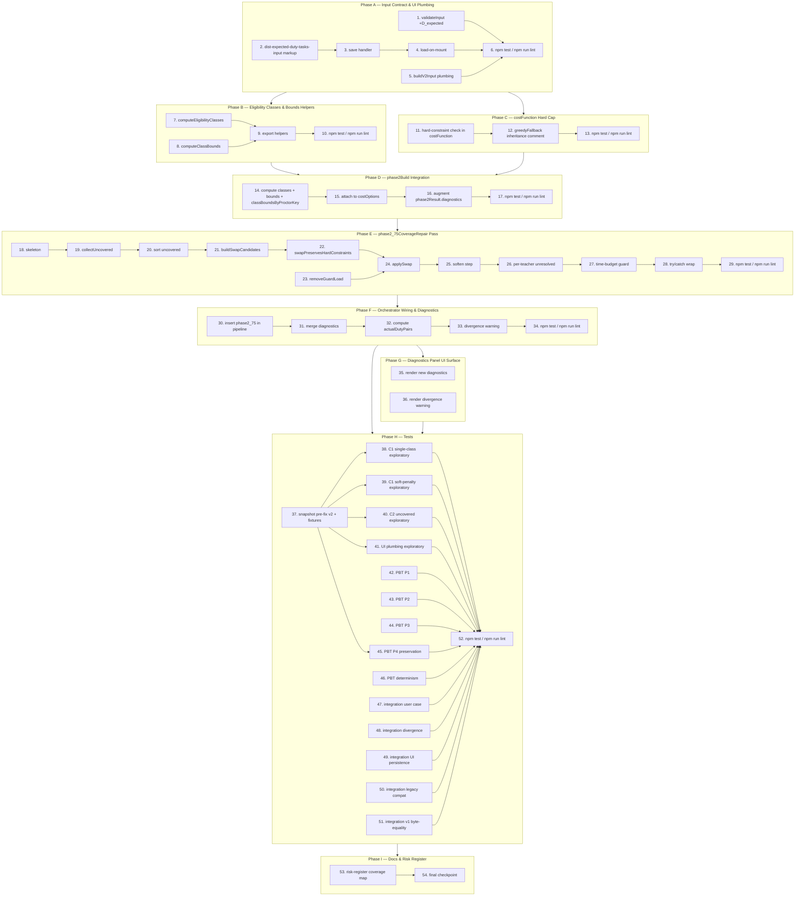

# Implementation Plan — Proctor v2 Strict Fairness & Full Coverage

> Source documents: `bugfix.md` (Bug Conditions C1–C2, Properties P1–P4, Requirements 1.x / 2.x / 3.x), `design.md` (Architecture overview rows §3.1–§3.7, pseudocode, edge-case tables, risk register).
>
> Project commands (per `AGENTS.md`): `npm test; npm run lint`. Every task that adds or changes tests MUST end with `npm test` to verify, and changes to source files SHOULD also pass `npm run lint`.
>
> Atomicity: every leaf task is scoped to ≤ 1 hour of focused work. Tasks marked `[parallel]` have no dependency on their sibling tasks within the same phase and may be executed concurrently by separate workers.
>
> Annotation legend on each task line:
> - `_Validates:` — sub-conditions C1, C2 and/or properties P1, P2, P3, P4 the task contributes to (from `bugfix.md`)
> - `_Edit site:` — row number in the `design.md` "Architecture overview" table (1–7), or `n/a` for tests/docs
> - `_File:` — concrete file path the executor will touch
> - `_Requirements:` — clause numbers from `bugfix.md` §"Current Behavior" (1.x), §"Expected Behavior" (2.x), §"Unchanged Behavior" (3.x)

---

## Phase A — Input Contract & UI Plumbing

Goal: get `D_expected` flowing end-to-end before any algorithmic change. Required by every later phase; the new fairness-bound math is a no-op until the input contract delivers `D_expected`.

- [x] 1. Extend `validateInput` to accept and default `D_expected`
  - Add an optional `input.D_expected` check: if present, assert `Number.isFinite(input.D_expected) && input.D_expected >= 0`.
  - If absent, default in place to `0` so older callers and existing fixtures keep working — bounds will collapse to the guards-only computation `floor(G/N), ceil(G/N)` exactly as today.
  - Do NOT make the field required; do NOT throw for legacy fixtures.
  - _Validates: P4_
  - _Edit site: design.md §3.6 (validateInput half)_
  - _File: `js/algorithms/proctor-distribution-v2.js` (function `validateInput`)_
  - _Requirements: 2.9, 3.10_

- [x] 2. Add the `dist-expected-duty-tasks-input` field to the distribution rules panel
  - Inside `<div id="dist-inline-rules">` at line ≈266 in `exams-proctors.html`, add a third numeric input next to `dist-proctors-per-room-input` and `dist-reserves-per-session-input`.
  - Markup: `<input type="number" id="dist-expected-duty-tasks-input" min="0" step="1" value="0" />` plus an Arabic label `<label for="dist-expected-duty-tasks-input">عدد مهام المداومة المتوقَّع</label>` and a tooltip `يستعمل لحساب متوسط حصص الحراسة لكل أستاذ عند تطبيق العدالة. لا يحدد من يداوم فعلياً — ذلك يبقى من شاشة "الأساتذة المداومون".`
  - Match the existing layout/style classes used by the two sibling inputs.
  - _Validates: P3, P4_
  - _Edit site: design.md §3.6_
  - _File: `exams-proctors.html` (panel `dist-inline-rules` ≈266)_
  - _Requirements: 2.11_

- [x] 3. Wire the save-on-change handler that persists `examCenterConfig.expected_duty_tasks`
  - Mirror the existing `dist-reserves-per-session-input` save logic at line ≈1218.
  - On `change`: read the value, normalise via `Math.max(0, Number(input.value) || 0)`, write to `examCenterConfig.expected_duty_tasks` via `window.api.examConfig.save({ school_year: year, config_key: 'examCenterConfig', data: examCenterConfig })`, then call `updateDistStatuses()` so `dist-status-...` reflects the new state.
  - _Validates: P3, P4_
  - _Edit site: design.md §3.6 (save logic ≈1218)_
  - _File: `exams-proctors.html`_
  - _Requirements: 2.11_

- [x] 4. Wire the load-on-mount that populates `dist-expected-duty-tasks-input` from `examCenterConfig`
  - Wherever the panel is initialised (next to where `dist-reserves-per-session-input` is populated), read `examCenterConfig.expected_duty_tasks` and set `input.value = String(Math.max(0, Number(value) || 0))` — falling back to `'0'` when the field is absent.
  - Verify round-trip: save → reload page → input shows the persisted number.
  - _Validates: P3, P4_
  - _Edit site: design.md §3.6_
  - _File: `exams-proctors.html`_
  - _Requirements: 2.11_

- [x] 5. Plumb `D_expected` through `buildV2Input`
  - At line ≈2590 in `exams-proctors.html`, after the existing `reservesConfig` derivation and inside the existing `examCenterConfig` read, attach `D_expected: Math.max(0, Number(examCenterConfig.expected_duty_tasks) || 0)` on the input object returned from `buildV2Input`.
  - Do not remove or rename any existing field; this is purely additive.
  - _Validates: P3, P4_
  - _Edit site: design.md §3.6_
  - _File: `exams-proctors.html` (function `buildV2Input` ≈2590)_
  - _Requirements: 2.9, 2.11, 3.10_

- [x] 6. Run `npm test` and `npm run lint` after Phase A
  - Confirm no regressions from validation/UI/plumbing additions. The new field defaults to `0` everywhere so behaviour should be byte-identical to F.
  - _Validates: P4_
  - _Edit site: n/a_
  - _File: n/a (CI/local run only)_
  - _Requirements: 3.5, 3.10_

---

## Phase B — Eligibility Classes & Bounds Helpers

Goal: produce `classBoundsByProctorKey` deterministically. Depends on Phase A only because of the `D_expected` plumbing; Hungarian/greedy still consume the old soft penalty until Phase C lands.

- [x] 7. Implement `computeEligibilityClasses(proctorsList, scheduleEntries, exemptionsData, dutyData, loadState)`
  - Implement exactly the pseudocode in `design.md` §3.1: for each `(T, idx)` in `proctorsList`, compute the eligible session-index list (skip exempt sessions and sessions where `T` is on duty during the halfday).
  - Skip proctors whose eligible set is empty (they are not in any class).
  - Compute `baselineDuty = size(loadState.dutyHalfdays(key))` and `classKey = stableHash(eligible.join(',') + '|' + baselineDuty)`; insert into a `Map<classId, { members, reachableSessionIndices, baselineDutyCount }>`.
  - Function MUST be called AFTER `phase1PrePass` so `loadState.dutyHalfdays` is populated; document this invariant in a top-of-function comment.
  - _Validates: C1, P1, P2_
  - _Edit site: design.md §3.1_
  - _File: `js/algorithms/proctor-distribution-v2.js`_
  - _Requirements: 2.4_

- [x] 8. Implement `computeClassBounds(classes, scheduleEntries, proctorsPerRoom, D_expected, N)`
  - Implement exactly the pseudocode in `design.md` §3.2.
  - Single-class fast path: when `classes.size === 1`, compute `G_class` from reachable sessions and return `{ classLowerBound: floor(G_total / |C|), classUpperBound: ceil(G_total / |C|) }`.
  - Multi-class case: compute `G_class` per class, then `D_share = floor(D_expected × |C| / N)` per class. Hand the residual `D_expected − Σ D_share` to the largest classes first (sorted by `(−size(members), classKey)`) until residual = 0.
  - Cover the edge cases listed in design.md §3.2: `D_expected = 0` (bounds collapse), singleton class (`lower = upper = G_total_class`), tiny class with `D_share` rounding to 0, `G_class = 0`, `D_expected > G + N` (bounds become arbitrarily large; cap effectively inactive — divergence warning fires later in Phase F).
  - _Validates: C1, P2_
  - _Edit site: design.md §3.2_
  - _File: `js/algorithms/proctor-distribution-v2.js`_
  - _Requirements: 2.9, 2.13_

- [x] 9. Export `computeEligibilityClasses` and `computeClassBounds` on the module-internal namespace
  - Expose both helpers so unit tests in Phase H.2 and `phase2Build` can both import them.
  - Match the convention used by `computeReserveTarget` (already exported by the prior spec).
  - _Validates: C1, P1, P2_
  - _Edit site: design.md §3.1, §3.2_
  - _File: `js/algorithms/proctor-distribution-v2.js`_
  - _Requirements: 2.4, 2.9_

- [x] 10. Run `npm test` and `npm run lint` after Phase B
  - The helpers are not yet wired into `phase2Build`, so existing tests must still pass unchanged.
  - _Validates: P4_
  - _Edit site: n/a_
  - _File: n/a_
  - _Requirements: 3.5, 3.10_

---

## Phase C — `costFunction` Hard Cap (C1, P1, P2)

Goal: lift the soft load-penalty introduced by the prior spec to a HARD per-class cap. Depends on Phase B only for the helpers; the hard cap is default-inactive when `options.classBoundsByProctorKey` is absent, so this phase can land independently of Phase D wiring.

- [x] 11. Add the hard-constraint check inside `costFunction` (≈1294)
  - Insert the new check exactly as design.md §3.3 prescribes: AFTER the existing `usedInSession` short-circuit, BEFORE the soft-penalty accumulation block (the boundary marked `// === Soft Constraint Penalties ===`).
  - Code path:
    ```
    if (options.classBoundsByProctorKey) {
      var classBounds = options.classBoundsByProctorKey[proctorKey];
      if (classBounds) {
        var postAssignmentPrimary = getPrimaryLoad(loadState, proctorKey) + 1;
        if (postAssignmentPrimary > classBounds.classUpperBound) {
          return INFINITY_SENTINEL;
        }
      }
    }
    ```
  - Default-inactive when `options.classBoundsByProctorKey` is absent (older callers, fixtures): old soft-penalty behaviour preserved (Requirement 3.6 / P4).
  - The cap is inclusive — `>` not `≥`, so post-assignment exactly at the bound is allowed.
  - _Validates: C1, P1, P2_
  - _Edit site: design.md §3.3_
  - _File: `js/algorithms/proctor-distribution-v2.js` (function `costFunction` ≈1294)_
  - _Requirements: 2.4, 2.10_

- [x] 12. Verify `greedyFallback` inherits the hard cap automatically
  - No code change to `greedyFallback` (≈1860): it calls `costFunction` and discards `INFINITY_SENTINEL` candidates exactly as it does for the existing hard rules.
  - Add an inline comment block at the top of `greedyFallback` referencing the new invariant: "Greedy inherits the per-class primaryLoad cap via costFunction; an empty candidate set falls through to the existing shortage-warning path (`shortages++`)."
  - _Validates: C1, P1, P2_
  - _Edit site: design.md §3.3 (greedyFallback inheritance)_
  - _File: `js/algorithms/proctor-distribution-v2.js` (function `greedyFallback` ≈1860)_
  - _Requirements: 2.4, 3.6_

- [x] 13. Run `npm test` and `npm run lint` after Phase C
  - The hard cap is default-inactive (no caller passes `classBoundsByProctorKey` yet), so existing tests must still pass unchanged.
  - _Validates: P4_
  - _Edit site: n/a_
  - _File: n/a_
  - _Requirements: 3.5, 3.10_

---

## Phase D — `phase2Build` Integration

Goal: wire `classBoundsByProctorKey` into the per-run `costOptions` so Hungarian and greedy actually see the cap. Depends on Phases B and C.

- [x] 14. Compute classes, bounds, and `classBoundsByProctorKey` once per `phase2Build`
  - Insert the block from design.md §3.5 just before the existing `costOptions` is built (≈line 1787 in `phase2Build`).
  - Call `computeEligibilityClasses(input.proctorsList, input.scheduleEntries, input.exemptionsData, input.dutyData, phase1Result.loadState)` then `computeClassBounds(classes, input.scheduleEntries, input.examDistributionRules.proctorsPerRoom, Number(input.D_expected) || 0, eligibleProctors(input).length)`.
  - Build `classBoundsByProctorKey` as a flat map: for each class, copy its bounds onto every member's key.
  - Store `classBoundsByProctorKey` on `phase2Result.classBoundsByProctorKey` so `phase2_75CoverageRepair` can read it later.
  - _Validates: C1, C2, P1, P2, P3_
  - _Edit site: design.md §3.5_
  - _File: `js/algorithms/proctor-distribution-v2.js` (function `phase2Build` ≈1451–1787)_
  - _Requirements: 2.3, 2.4_

- [x] 15. Attach `classBoundsByProctorKey` to `costOptions`
  - In the existing `costOptions` object built at line ≈1787, add `classBoundsByProctorKey: classBoundsByProctorKey`.
  - The bounds are STATIC for the run (they depend only on `proctorsList`, `scheduleEntries`, `exemptionsData`, `dutyData`, `D_expected`, `N`); recompute is NOT needed per session.
  - Every Hungarian and greedy invocation downstream sees the cap automatically.
  - _Validates: C1, P1, P2_
  - _Edit site: design.md §3.3, §3.5_
  - _File: `js/algorithms/proctor-distribution-v2.js`_
  - _Requirements: 2.4_

- [x] 16. Augment `phase2Result.diagnostics` with class metadata
  - Add two additive fields on `phase2Result.diagnostics`:
    - `eligibilityClassCount: classes.size`
    - `classBounds: serialiseBounds(classBounds)` — produce a plain-object snapshot `{ classId: { classLowerBound, classUpperBound, G_class, D_expected_class } }` so the diagnostics panel can render it later.
  - Do NOT change any existing diagnostic field name.
  - _Validates: P2_
  - _Edit site: design.md §3.5_
  - _File: `js/algorithms/proctor-distribution-v2.js`_
  - _Requirements: 2.3_

- [x] 17. Run `npm test` and `npm run lint` after Phase D
  - With the hard cap now wired in, Phase 2 outputs may shift on inputs where `C1` held in F — that is the intended behaviour. Existing tests that asserted exact pre-fix outputs may need to be reviewed; flag any failures for triage in Phase H.
  - _Validates: C1, P1, P2_
  - _Edit site: n/a_
  - _File: n/a_
  - _Requirements: 3.5, 3.10_

---

## Phase E — `phase2_75CoverageRepair` Pass (C2, P3)

Goal: implement the new post-Phase-2 swap pass that lifts uncovered eligible proctors onto guard slots from over-loaded peers. Depends on Phase D (needs `classBoundsByProctorKey` populated). Each leaf below maps to one piece of design.md §3.4 pseudocode.

- [x] 18. Skeleton of `phase2_75CoverageRepair(phase2Result, phase2_5Diagnostics, classBoundsByProctorKey, input, rng)`
  - Create the function alongside `phase2_5PopulateReserves`.
  - Inputs/outputs exactly as design.md §3.4. Initialise `startTime = Date.now()`, `swaps = 0`, `unresolved = 0`, `warnings = []`.
  - Define a soft time-budget constant `TIME_BUDGET_MS = 50` at the top of the function for use by step 27.
  - Plumb the seeded `rng` argument through; do NOT instantiate a new PRNG inside the function (determinism under `randomSeed`).
  - Return `{ swaps, unresolved, durationMs: Date.now() − startTime, warnings }` at the end.
  - _Validates: C2, P3_
  - _Edit site: design.md §3.4_
  - _File: `js/algorithms/proctor-distribution-v2.js`_
  - _Requirements: 2.5, 2.6, 3.6_

- [x] 19. Implement `collectUncovered(proctorsList, classBoundsByProctorKey, loadState)`
  - Returns `[{ key, proc, idx }]` for every proctor where `getPrimaryLoad(loadState, key) === 0` AND the proctor's key is present in `classBoundsByProctorKey` (i.e. they belong to a known class).
  - Proctors not in any class (skipped by `computeEligibilityClasses`) are NOT considered uncovered — they are not eligible for any session.
  - _Validates: C2, P3_
  - _Edit site: design.md §3.4_
  - _File: `js/algorithms/proctor-distribution-v2.js`_
  - _Requirements: 2.5_

- [x] 20. Sort `uncovered` deterministically by `[classIdOf, rng()]`
  - Stable sort so two uncovered teachers in the same class retain a deterministic ordering across runs with the same `randomSeed`.
  - Use a single comparator with primary key `classIdOf(t)` ascending, secondary key `rng()` for tie-break (cache the rng draw per teacher to avoid double-evaluation in the comparator).
  - _Validates: C2, P3_
  - _Edit site: design.md §3.4_
  - _File: `js/algorithms/proctor-distribution-v2.js`_
  - _Requirements: 2.5, 3.6_

- [x] 21. Implement `buildSwapCandidates(rows, T_uncov, classID, loadState, threshold, input)`
  - Iterate every `(row, slotIndex)` pair in `phase2Result.assignments`.
  - Skip when `row.proctor_keys[slotIndex]` is falsy.
  - Skip when `classIdOfKey(row.proctor_keys[slotIndex]) !== classID` (different class).
  - Skip when `getPrimaryLoad(loadState, T_over_key) < threshold`.
  - Resolve `T_over` from `input.proctorsList` and call `swapPreservesHardConstraints(row, slotIndex, T_uncov, T_over, loadState, input)` (task 22) — skip if it returns false.
  - Push `{ row, rowIndex, slotIndex, T_over }` for each surviving candidate.
  - _Validates: C2, P3_
  - _Edit site: design.md §3.4_
  - _File: `js/algorithms/proctor-distribution-v2.js`_
  - _Requirements: 2.5, 2.7, 3.11_

- [x] 22. Implement `swapPreservesHardConstraints(row, slotIndex, T_uncov, T_over, loadState, input)`
  - Returns `true` only if every constraint below holds for `T_uncov` taking over the slot vacated by `T_over`:
    1. `T_uncov` not exempt for the row's session: `!isExemptForEntry(T_uncov.proc, T_uncov.idx, row.scheduleEntry, input.exemptionsData)`.
    2. `T_uncov` not on duty during the row's halfday: `!isOnDutyDuringHalfday(T_uncov.key, row.halfday_key, loadState)`.
    3. `T_uncov` not already a guard in the row's session: `!row.proctor_keys.includes(T_uncov.key)`.
    4. `allowHalfdayReuse` flag: when `false`, `T_uncov.key` not used elsewhere in the same `halfday_key` (excluding the slot we vacate).
    5. `allowDayReuse` flag: when `false`, `T_uncov.key` not used elsewhere in the same `dayKey(halfday_key)` (excluding the slot we vacate).
  - _Validates: C2, P3, P4_
  - _Edit site: design.md §3.4_
  - _File: `js/algorithms/proctor-distribution-v2.js`_
  - _Requirements: 2.7, 3.1, 3.2, 3.4, 3.8_

- [x] 23. Implement `removeGuardLoad(loadState, key, halfdayKey)` helper
  - Symmetric counterpart of the existing `addGuardLoad`.
  - MUST decrement `loadState.guardCount[key]` by 1.
  - MUST remove `halfdayKey` from `loadState.guardHalfdays[key]` ONLY when no other slot in the same halfday still holds `key`. Implementation pattern: scan `phase2Result.assignments` filtered to rows with the same `halfday_key` and check if any `row.proctor_keys` still contains `key` after the removal of the slot being swapped.
  - MUST NOT touch `dutyCount` or `dutyHalfdays` (Requirement 2.7, 3.11).
  - _Validates: C2, P3, P4_
  - _Edit site: design.md §3.4_
  - _File: `js/algorithms/proctor-distribution-v2.js`_
  - _Requirements: 2.7, 3.11_

- [x] 24. Implement `applySwap(row, slotIndex, T_uncov, T_over, loadState)`
  - Mutate `row.proctor_keys[slotIndex] = T_uncov.key`.
  - Mutate `row.proctors[slotIndex] = T_uncov.proc.teacher_name || ''`.
  - Update `loadState`: call `removeGuardLoad(loadState, T_over.key, row.halfday_key)` then `addGuardLoad(loadState, T_uncov.key, row.halfday_key, T_uncov.proc.teacher_name || '')`.
  - Do NOT touch `loadState.dutyCount` / `loadState.dutyHalfdays` (Requirement 2.7, 3.11) — duty is user-supplied input, never algorithmically reassigned.
  - _Validates: C2, P3, P4_
  - _Edit site: design.md §3.4_
  - _File: `js/algorithms/proctor-distribution-v2.js`_
  - _Requirements: 2.7, 3.11_

- [x] 25. Soften step: retry with threshold `classUB` when no peer at `classUB + 1`
  - In the per-uncovered-teacher loop, first call `buildSwapCandidates(rows, T_uncov, classID, loadState, classUB + 1, input)`.
  - If the result is empty, retry with threshold `classUB` (peers exactly at the upper bound).
  - The soft step provably never drops `T_over` below `classLB` — see design.md §3.4 edge-case row "Soft step would push T_over from classUB to classUB − 1, dropping below classLB".
  - _Validates: C2, P3_
  - _Edit site: design.md §3.4_
  - _File: `js/algorithms/proctor-distribution-v2.js`_
  - _Requirements: 2.5, 2.6_

- [x] 26. Per-teacher unresolved branch
  - When BOTH passes (threshold `classUB + 1` then `classUB`) return empty, increment `unresolved += 1` and push `{ proctorKey: T_uncov.key, reason: 'no_swappable_peer' }` to `warnings`.
  - The pass continues to the next uncovered teacher — soft outcome, run continues, rest of the output still produced (Requirement 2.6).
  - Also handle the "no class bounds" branch from the design pseudocode: when `classBoundsByProctorKey[T_uncov.key]` is missing, push `{ proctorKey: T_uncov.key, reason: 'no_class_bounds' }` and `continue`.
  - _Validates: C2, P3_
  - _Edit site: design.md §3.4_
  - _File: `js/algorithms/proctor-distribution-v2.js`_
  - _Requirements: 2.6_

- [x] 27. Time-budget guard (50 ms soft cap)
  - At the top of every iteration in the per-uncovered-teacher loop, check `Date.now() − startTime > TIME_BUDGET_MS`.
  - When exceeded, mark every remaining uncovered teacher as `unresolved` with `reason: 'time_budget'` and break out of the loop.
  - `durationMs` in the return value reflects total wall-clock time including the budget overflow.
  - _Validates: C2, P3_
  - _Edit site: design.md §3.4_
  - _File: `js/algorithms/proctor-distribution-v2.js`_
  - _Requirements: 2.6_

- [x] 28. Wrap the pass body in `try/catch`
  - The orchestrator already calls the pass inside a try/catch (task 30); the function itself MUST also handle internal errors gracefully.
  - On any throw inside the iteration, return `{ swaps: 0, unresolved: 0, durationMs: 0, warnings: [{ reason: 'pass_threw', error: String(err) }] }` so the orchestrator's diagnostics still merges cleanly.
  - Soft failure: log via `console.warn('[V2] phase2_75CoverageRepair internal error:', err)` and continue.
  - _Validates: C2, P3, P4_
  - _Edit site: design.md §3.4, §3.7_
  - _File: `js/algorithms/proctor-distribution-v2.js`_
  - _Requirements: 2.6_

- [x] 29. Run `npm test` and `npm run lint` after Phase E
  - The pass is not yet wired into the orchestrator (Phase F task 30 does that), so existing tests still must pass unchanged.
  - _Validates: P4_
  - _Edit site: n/a_
  - _File: n/a_
  - _Requirements: 3.5, 3.10_

---

## Phase F — Orchestrator Wiring & Diagnostics

Goal: insert `phase2_75CoverageRepair` into the pipeline and surface the new diagnostics fields and the `D_expected` divergence warning. Depends on Phases D and E.

- [x] 30. Insert `phase2_75CoverageRepair` between `phase2_5PopulateReserves` and `phase3Optimize`
  - Order must be exactly `phase1PrePass → phase2Build → phase2_5PopulateReserves → phase2_75CoverageRepair → phase3Optimize` per design.md §3.7 (current orchestrator: ≈line 3505 → ≈3532).
  - Pass through the same `rng` instance used by Phase 2 / 2.5 so determinism under `randomSeed` is preserved.
  - Wrap the call in `try/catch` exactly as design.md §3.7 prescribes: on throw, set `phase2_75Diagnostics = { swaps: 0, unresolved: 0, durationMs: 0, warnings: [{ reason: 'pass_threw' }] }` and continue.
  - _Validates: C2, P3_
  - _Edit site: design.md §3.7_
  - _File: `js/algorithms/proctor-distribution-v2.js` (orchestrator function ≈3505)_
  - _Requirements: 2.5, 3.6_

- [x] 31. Merge the pass return value into the existing `diagnostics` object
  - Just before `return { result, diagnostics }` at ≈line 3677, add additive fields:
    - `diagnostics.coverageRepairSwaps = phase2_75Diagnostics.swaps`
    - `diagnostics.coverageRepairUnresolved = phase2_75Diagnostics.unresolved`
    - `diagnostics.coverageRepairDurationMs = phase2_75Diagnostics.durationMs`
    - `diagnostics.coverageRepairWarnings = phase2_75Diagnostics.warnings`
    - `diagnostics.eligibilityClassCount = phase2Result.diagnostics.eligibilityClassCount`
    - `diagnostics.maxPrimaryLoadGapWithinClass = computeMaxGapWithinClass(phase2Result.classBoundsByProctorKey, phase2Result.loadState)` — implement the helper inline or as a small private utility.
  - Do NOT change any existing diagnostic field name (additive only).
  - _Validates: P2, P3_
  - _Edit site: design.md §3.7_
  - _File: `js/algorithms/proctor-distribution-v2.js`_
  - _Requirements: 2.8_

- [x] 32. Compute `actualDutyPairs` for the divergence check
  - Right after the diagnostics merge and before the divergence check, compute `actualDutyPairs = Σ over T ∈ eligibleProctors(input): dutyCount(loadState, T.key)`.
  - Iterate `eligibleProctors(input)` (the same set used to derive `N` in Phase D); for each proctor look up `loadState.dutyCount[T.key]` (defaults to `0`) and sum.
  - _Validates: P2_
  - _Edit site: design.md §3.7_
  - _File: `js/algorithms/proctor-distribution-v2.js`_
  - _Requirements: 2.12_

- [x] 33. Emit the `D_expected` divergence warning when the threshold is crossed
  - Implement exactly the pseudocode in design.md §3.7:
    - `diff = abs((input.D_expected || 0) − actualDutyPairs)`
    - When `(input.D_expected || 0) > 0 AND diff / max(input.D_expected, 1) > 0.2`: push `{ type: 'd_expected_divergence', expected: input.D_expected, actual: actualDutyPairs, message: 'D_expected = ' + input.D_expected + '، لكن عدد أزواج المداومة الفعلي = ' + actualDutyPairs + '؛ قد تكون حدود العدالة المعروضة غير محدّثة.' }` into `diagnostics.warnings` (initialise as empty array if absent).
  - Soft outcome: run continues, rest of the output still produced.
  - Verify the edge-case rows in design.md §3.7: `D_expected = 0` ⇒ check skipped; `D_expected = 100, actual = 80` ⇒ ratio = 0.20 ⇒ no warning; `D_expected = 100, actual = 70` ⇒ ratio = 0.30 ⇒ warning emitted.
  - _Validates: P2_
  - _Edit site: design.md §3.7_
  - _File: `js/algorithms/proctor-distribution-v2.js`_
  - _Requirements: 2.12_

- [x] 34. Run `npm test` and `npm run lint` after Phase F
  - With the pipeline now fully wired, expect a small set of pre-existing tests that asserted exact pre-fix outputs to either still pass (when `D_expected` is absent / `0` and no eligible proctor was uncovered in F) or to flag genuine behavioural shifts on inputs where `C(X)` held. Triage failures in Phase H.
  - _Validates: C1, C2, P1, P2, P3, P4_
  - _Edit site: n/a_
  - _File: n/a_
  - _Requirements: 3.5, 3.10_

---

## Phase G — Diagnostics Panel UI Surface (additive)

Goal: render the new diagnostics fields in the existing diagnostics panel without changing the saved blob structure. Lightweight; no new product logic.

- [x] 35. Render new diagnostics fields in `v2-diagnostics-body` [parallel]
  - Inspect the existing diagnostics rendering block in `exams-proctors.html` (panel `v2-diagnostics-body`).
  - If the panel is already rendering algorithm diagnostics, append rows for `coverageRepairSwaps`, `coverageRepairUnresolved`, `eligibilityClassCount`, `maxPrimaryLoadGapWithinClass`. Otherwise just confirm the diagnostics object is `console.log`ged or stored in `examConfig.examAutoDistributionData`.
  - Use `diagnostics?.coverageRepairSwaps ?? 0` (or `||` fallbacks for ES5-compatible callers) so old saves render correctly.
  - Do NOT alter the saved blob structure beyond additive fields.
  - _Validates: P2, P3_
  - _Edit site: design.md §3.7_
  - _File: `exams-proctors.html` (diagnostics rendering, if present)_
  - _Requirements: 2.8, 3.10_

- [x] 36. Render the optional `D_expected` divergence warning [parallel]
  - In the same diagnostics panel, when `diagnostics.warnings` contains an entry with `type === 'd_expected_divergence'`, render an inline note showing the `message` string (already Arabic per task 33).
  - Use a subdued visual treatment (e.g. `<div class="dist-warning-note">…</div>`) so it does not clobber the rest of the panel.
  - When the panel is absent, fall back to `console.warn(message)`.
  - _Validates: P2_
  - _Edit site: design.md §3.7_
  - _File: `exams-proctors.html`_
  - _Requirements: 2.12_

---

## Phase H — Tests

Goal: lock in the fix with exploratory (pre-fix), unit, property-based, and integration tests. Tasks within this phase are mostly independent and marked `[parallel]`. They depend on Phase F (orchestrator wired) for end-to-end runs; the pre-fix exploratory snapshots in 37 must run BEFORE Phases B–F if the executor wants to see them fail.

> Note: pre-fix exploratory tests (tasks 38–41) are intentionally written first against UNFIXED code. If the executor reaches Phase H after already merging Phases B–F, run them against the saved pre-fix snapshot module instead.

### H.1 — Exploratory tests on UNFIXED v2 (must surface counterexamples before any fix)

- [x] 37. Snapshot the pre-fix v2 module and freeze a fixture set
  - Save a copy of `js/algorithms/proctor-distribution-v2.js` (post-`proctor-v2-fairness-duty-reserves`, pre-this-fix) as `tests/__snapshots__/proctor-v2-strict-fairness-coverage.pre-fix.js` (frozen module). Do not import from production from this snapshot.
  - Add a fixture builder in `tests/fixtures/proctor-v2-strict-fairness-fixtures.js` that produces inputs targeting C1 single-class gap, C1 soft-penalty-wins, C2 uncovered teacher, C2 duty-already-covered, UI plumbing.
  - _Validates: C1, C2, P1, P2, P3, P4_
  - _Edit site: n/a_
  - _File: `tests/__snapshots__/proctor-v2-strict-fairness-coverage.pre-fix.js`, `tests/fixtures/proctor-v2-strict-fairness-fixtures.js`_
  - _Requirements: 1.1, 1.2, 1.4, 1.5, 1.6_

- [x] 38. **Property 1: Bug Condition** — Exploratory C1 single-class gap counterexample [parallel]
  - **CRITICAL**: This test MUST FAIL on UNFIXED code — failure confirms the bug exists.
  - **DO NOT attempt to fix the test or the code when it fails.**
  - **GOAL**: Surface counterexamples that demonstrate the strict-fairness bug.
  - **Scoped PBT Approach**: scope to the concrete failing case `{ N=147 proctors all in one eligibility class, G=368 guard tasks, D_expected=15 }` (the user's reported run).
  - Property assertion: for any two proctors `T1, T2` in the same eligibility class, `|primaryLoad(T1) − primaryLoad(T2)| ≤ 1` (encodes Expected Behavior P1).
  - Run on the UNFIXED snapshot from task 37.
  - **EXPECTED OUTCOME**: Test FAILS — document the counterexample (e.g., `{ T1: primaryLoad=5, T2: primaryLoad=1, gap=4 }`) in the test file as a comment.
  - End by running `npm test` to confirm failure on the pre-fix snapshot.
  - _Validates: C1, P1_
  - _Edit site: design.md §"Exploratory Bug Condition Checking" row 1_
  - _File: `tests/proctor-v2-strict-bug-c1-fairness.test.js`_
  - _Requirements: 1.1, 2.1_

- [x] 39. **Property 1: Bug Condition** — Exploratory C1 soft-penalty-wins counterexample [parallel]
  - **CRITICAL**: MUST FAIL on UNFIXED code.
  - **Scoped PBT Approach**: 2-class fixture where `T_busy` has `primaryLoad = upperBound + 1` and a perfect-fit soft profile (no `groupMismatch`); `T_idle` has `primaryLoad = 0` and `groupMismatch = 5`.
  - Assertion: `T_idle` is selected for the next slot (i.e. Hungarian/greedy never picks `T_busy` while `T_idle` is feasible).
  - **EXPECTED OUTCOME**: Test FAILS on F because the soft load-penalty (`4 × 1 + 0.5 = 4.5`) is cheaper than the soft `groupMismatch` (`5`). Document.
  - _Validates: C1, P1_
  - _Edit site: design.md §"Exploratory Bug Condition Checking" row 2_
  - _File: `tests/proctor-v2-strict-bug-c1-soft-penalty.test.js`_
  - _Requirements: 1.1, 1.4, 2.4_

- [x] 40. **Property 1: Bug Condition** — Exploratory C2 uncovered-teacher counterexample [parallel]
  - **CRITICAL**: MUST FAIL on UNFIXED code.
  - **Scoped PBT Approach**: synthetic input with one eligible proctor `T_uncov` whose minimum-cost matrix cells are always lost to a marginally cheaper peer; `T_uncov.dutyCount = 0`.
  - Assertion: `primaryLoad(T_uncov) ≥ 1` after the run.
  - **EXPECTED OUTCOME**: Test FAILS on F (`primaryLoad(T_uncov) = 0`). Document the counterexample.
  - _Validates: C2, P3_
  - _Edit site: design.md §"Exploratory Bug Condition Checking" row 3_
  - _File: `tests/proctor-v2-strict-bug-c2-uncovered.test.js`_
  - _Requirements: 1.2, 1.5, 2.2_

- [ ] 41. **Property 1: Bug Condition** — Exploratory UI-plumbing counterexample [parallel]
  - **CRITICAL**: MUST FAIL on UNFIXED code.
  - Input: stub `examCenterConfig.expected_duty_tasks = 15`.
  - Assertion on the OUTPUT of `buildV2Input`: `input.D_expected === 15`.
  - **EXPECTED OUTCOME**: Fails because pre-fix `buildV2Input` never reads `expected_duty_tasks`.
  - _Validates: P3, P4_
  - _Edit site: design.md §"Exploratory Bug Condition Checking" row 4_
  - _File: `tests/proctor-v2-strict-bug-c1-ui-plumbing.test.js`_
  - _Requirements: 1.6, 2.11_

### H.2 — Unit tests (run AFTER Phases A–F)

> Each unit-test entry below is its own atomic test (≤ 30 minutes focused work) and may be authored in parallel. They are not numbered in the 1..54 task list because they are written incrementally alongside the corresponding implementation phases A–F; Phase H gathers them under one descriptive heading. Each test MUST end with `npm test` to verify and follow the four-field annotation pattern.

- [ ] `computeEligibilityClasses` — two proctors with identical eligibility but different `dutyHalfdays` land in DIFFERENT classes [parallel]
  - _Validates: C1, P1, P2_
  - _Edit site: design.md §"Unit Tests" item 1_
  - _File: `tests/proctor-v2-strict-eligibility-classes.test.js` (new)_
  - _Requirements: 2.4_

- [ ] `computeEligibilityClasses` — proctor exempt for every session is NOT in any class [parallel]
  - _Validates: P4_
  - _Edit site: design.md §"Unit Tests" item 2_
  - _File: `tests/proctor-v2-strict-eligibility-classes.test.js`_
  - _Requirements: 3.1_

- [ ] `computeClassBounds` — single-class case, `D_expected=15, G=368, N=147` returns `[2, 3]` [parallel]
  - _Validates: C1, P2_
  - _Edit site: design.md §"Unit Tests" item 3_
  - _File: `tests/proctor-v2-strict-class-bounds.test.js` (new)_
  - _Requirements: 2.9, 2.13_

- [ ] `computeClassBounds` — multi-class proportional split + residual handed to largest classes [parallel]
  - _Validates: P2_
  - _Edit site: design.md §"Unit Tests" item 4_
  - _File: `tests/proctor-v2-strict-class-bounds.test.js`_
  - _Requirements: 2.13_

- [ ] `computeClassBounds` — `D_expected=0` collapses bounds to `floor(G/|C|), ceil(G/|C|)` [parallel]
  - _Validates: P4_
  - _Edit site: design.md §"Unit Tests" item 5_
  - _File: `tests/proctor-v2-strict-class-bounds.test.js`_
  - _Requirements: 2.9, 3.10_

- [ ] `costFunction` — cap inactive when `options.classBoundsByProctorKey` is absent (regression guard for Requirement 3.6) [parallel]
  - _Validates: P4_
  - _Edit site: design.md §"Unit Tests" item 6_
  - _File: `tests/proctor-distribution-v2-cost.test.js` (extend)_
  - _Requirements: 3.6, 3.10_

- [x] `costFunction` — cap inclusive: post-assignment `primaryLoad = classUpperBound` returns finite cost [parallel]
  - _Validates: C1, P2_
  - _Edit site: design.md §"Unit Tests" item 7_
  - _File: `tests/proctor-distribution-v2-cost.test.js`_
  - _Requirements: 2.4_

- [x] `costFunction` — cap fires: post-assignment `primaryLoad = classUpperBound + 1` returns `INFINITY_SENTINEL` [parallel]
  - _Validates: C1, P1, P2_
  - _Edit site: design.md §"Unit Tests" item 8_
  - _File: `tests/proctor-distribution-v2-cost.test.js`_
  - _Requirements: 2.4, 2.10_

- [x] `phase2_75CoverageRepair` — happy-path swap with one peer above `classUB+1` [parallel]
  - Assert post-pass: `primaryLoad(T_uncov) === 1`, `primaryLoad(T_over) === classUB`, `swaps === 1`, `unresolved === 0`.
  - _Validates: C2, P3_
  - _Edit site: design.md §"Unit Tests" item 9_
  - _File: `tests/proctor-v2-strict-coverage-repair.test.js` (new)_
  - _Requirements: 2.5, 2.7_

- [ ] `phase2_75CoverageRepair` — no peer at all → `unresolved` with `reason: 'no_swappable_peer'` warning [parallel]
  - _Validates: C2, P3_
  - _Edit site: design.md §"Unit Tests" item 10_
  - _File: `tests/proctor-v2-strict-coverage-repair.test.js`_
  - _Requirements: 2.6_

- [ ] `phase2_75CoverageRepair` — swap rejected by `swapPreservesHardConstraints` (duplicate in session) [parallel]
  - _Validates: C2, P3, P4_
  - _Edit site: design.md §"Unit Tests" item 11_
  - _File: `tests/proctor-v2-strict-coverage-repair.test.js`_
  - _Requirements: 2.7, 3.2_

- [ ] `phase2_75CoverageRepair` — swap rejected by exemption [parallel]
  - _Validates: C2, P3, P4_
  - _Edit site: design.md §"Unit Tests" item 12_
  - _File: `tests/proctor-v2-strict-coverage-repair.test.js`_
  - _Requirements: 2.7, 3.1_

- [x] `buildV2Input` — propagates `D_expected = 15` when `examCenterConfig.expected_duty_tasks = 15` [parallel]
  - _Validates: P3, P4_
  - _Edit site: design.md §"Unit Tests" item 13_
  - _File: `tests/exams-proctors-buildV2Input.test.js` (extend)_
  - _Requirements: 2.11_

- [ ] `buildV2Input` — field absent → `D_expected = 0` (legacy backward-compat) [parallel]
  - _Validates: P4_
  - _Edit site: design.md §"Unit Tests" item 14_
  - _File: `tests/exams-proctors-buildV2Input.test.js`_
  - _Requirements: 3.10_

- [ ] `applySwap` — does not touch `loadState.dutyCount` / `loadState.dutyHalfdays` [parallel]
  - Snapshot `dutyCount` and `dutyHalfdays` before/after; assert byte-equal.
  - _Validates: C2, P3, P4_
  - _Edit site: design.md §"Unit Tests" item 15_
  - _File: `tests/proctor-v2-strict-coverage-repair.test.js`_
  - _Requirements: 2.7, 3.11_

- [ ] Divergence warning — fires for `D_expected=100, actual=70`; does NOT fire for `D_expected=100, actual=90` [parallel]
  - _Validates: P2_
  - _Edit site: design.md §"Unit Tests" item 16_
  - _File: `tests/proctor-v2-strict-divergence-warning.test.js` (new)_
  - _Requirements: 2.12_

### H.3 — Property-based tests (seeded PRNG, fixtures bounded ≤ 30 proctors / ≤ 20 sessions)

> All PBT tasks use the same seeded PRNG plumbed via `randomSeed` so failures are reproducible. Generators live in `tests/fixtures/proctor-v2-strict-fairness-fixtures.js` (task 37).

- [ ] 42. **Property 1: Expected Behavior** — P1 strict intra-class fairness on `primaryLoad` [parallel]
  - Generator: random `(N proctors ≤ 30, M tasks ≤ 20)` with multiple eligibility classes injected.
  - Assertion: for every pair `T1, T2` in the same eligibility class, `|primaryLoad(T1) − primaryLoad(T2)| ≤ 1`.
  - Run against FIXED code; expect PASS.
  - _Validates: C1, P1_
  - _Edit site: design.md §"Property-Based Tests" P1_
  - _File: `tests/proctor-v2-strict-property-p1.test.js`_
  - _Requirements: 2.1_

- [ ] 43. **Property 1: Expected Behavior** — P2 per-class bounds on `primaryLoad` [parallel]
  - Generator: random fixture with random `D_expected ∈ [0, 30]`.
  - Assertion: every member `T` of every eligibility class `C` satisfies `classLowerBound_primary_C ≤ primaryLoad(T) ≤ classUpperBound_primary_C`.
  - _Validates: C1, P2_
  - _Edit site: design.md §"Property-Based Tests" P2_
  - _File: `tests/proctor-v2-strict-property-p2.test.js`_
  - _Requirements: 2.3, 2.9, 2.13_

- [ ] 44. **Property 1: Expected Behavior** — P3 coverage on `primaryLoad` [parallel]
  - Generator: random fixture where at least one eligible proctor would otherwise be left at `primaryLoad = 0`.
  - Assertion: for every eligible proctor `T`, `primaryLoad(T) ≥ 1`. Counter-positive case: when the pass cannot cover a teacher, `coverageRepairUnresolved > 0` AND `coverageRepairWarnings` carries the corresponding `proctorKey` with a documented `reason`.
  - _Validates: C2, P3_
  - _Edit site: design.md §"Property-Based Tests" P3_
  - _File: `tests/proctor-v2-strict-property-p3.test.js`_
  - _Requirements: 2.2, 2.5, 2.6_

- [ ] 45. **Property 2: Preservation** — P4 byte-equality on `¬C(F(input))` inputs [parallel]
  - **IMPORTANT**: Follow observation-first methodology. Snapshot pre-fix module from task 37 as the F oracle.
  - Generator: random valid input pre-filtered to `¬C(F(input))` — i.e. inputs where F already satisfies strict fairness AND coverage.
  - Assertion: for every such input, F'(input) byte-equals F(input) on `proctor_keys`, `dutyCount`, `reserves`, `softViolations`. JSON-stringify and compare.
  - **EXPECTED OUTCOME**: PASSES on UNFIXED code (baseline) AND on FIXED code (no regressions).
  - _Validates: P4_
  - _Edit site: design.md §"Property-Based Tests" P4_
  - _File: `tests/proctor-v2-strict-property-p4-preservation.test.js`, `tests/__snapshots__/proctor-v2-strict-fairness-coverage.pre-fix.js`_
  - _Requirements: 3.1, 3.2, 3.3, 3.4, 3.5, 3.6, 3.8, 3.9, 3.10, 3.11_

- [ ] 46. **Property 1: Expected Behavior** — Determinism under `randomSeed` [parallel]
  - Generator: random valid input + fixed `randomSeed`.
  - Assertion: running F'(input) twice with the same `randomSeed` produces identical `coverageRepairSwaps`, `coverageRepairUnresolved`, and `proctor_keys` for every row.
  - _Validates: C2, P3, P4_
  - _Edit site: design.md §"Property-Based Tests" P4 (Determinism)_
  - _File: `tests/proctor-v2-strict-property-determinism.test.js`_
  - _Requirements: 3.5_

### H.4 — Integration tests against `exams-proctors.html` page flow

- [ ] 47. Integration — the user's reported case: `D_expected=15, G=368, N=147` (single class) [parallel]
  - Configure `examCenterConfig.expected_duty_tasks = 15`, generate a 147-proctor / 368-guard-task fixture with all proctors in one eligibility class.
  - Run v2; assert `max(primaryLoad) ≤ 3`, `min(primaryLoad) ≥ 2`, `coverageRepairUnresolved === 0`, `maxPrimaryLoadGapWithinClass ≤ 1`.
  - _Validates: C1, C2, P1, P2, P3_
  - _Edit site: design.md §"Integration Tests" bullet 1_
  - _File: `tests/integration/exams-proctors-strict-user-case.test.js`_
  - _Requirements: 2.1, 2.2, 2.3, 2.5_

- [ ] 48. Integration — `D_expected` divergence warning end-to-end [parallel]
  - Configure `D_expected = 15`, supply `dutyData` that produces only 8 actual `(teacher, halfday)` pairs.
  - Run v2; assert `diagnostics.warnings` contains a `{ type: 'd_expected_divergence', expected: 15, actual: 8 }` entry; assert the rest of the output is still produced (run did not abort).
  - _Validates: P2_
  - _Edit site: design.md §"Integration Tests" bullet 2_
  - _File: `tests/integration/exams-proctors-strict-divergence.test.js`_
  - _Requirements: 2.12_

- [ ] 49. Integration — UI persistence round-trip for `expected_duty_tasks` [parallel]
  - Type `15` into `dist-expected-duty-tasks-input`, trigger save, reload the page, assert the input shows `15`.
  - Assert `buildV2Input` returns `input.D_expected === 15` after the reload.
  - _Validates: P3, P4_
  - _Edit site: design.md §"Integration Tests" bullet 3_
  - _File: `tests/integration/exams-proctors-strict-persistence.test.js`_
  - _Requirements: 2.11_

- [ ] 50. Integration — backward compat: legacy fixture without `expected_duty_tasks` [parallel]
  - Run with `examCenterConfig.expected_duty_tasks` absent; assert `input.D_expected === 0`, `classBounds` collapse to guards-only `floor(G/|C|), ceil(G/|C|)`, and on `¬C(X)` inputs the F' output is byte-identical to F.
  - _Validates: P4_
  - _Edit site: design.md §"Integration Tests" bullet 4_
  - _File: `tests/integration/exams-proctors-strict-legacy.test.js`_
  - _Requirements: 3.10_

- [ ] 51. Integration — v1 toggle byte-equality [parallel]
  - Switch the algorithm toggle to v1; run; assert byte-identical output to a pre-fix v1 snapshot.
  - _Validates: P4_
  - _Edit site: design.md §"Integration Tests" bullet 5_
  - _File: `tests/integration/exams-proctors-strict-v1-byte-equality.test.js`_
  - _Requirements: 3.7_

- [ ] 52. Run `npm test` and `npm run lint` after Phase H
  - All exploratory tests on UNFIXED snapshots SHOULD FAIL (or be skipped via env flag if the executor saved them and tagged them `@pre-fix`).
  - All unit, PBT, and integration tests on FIXED code SHOULD PASS.
  - _Validates: C1, C2, P1, P2, P3, P4_
  - _Edit site: n/a_
  - _File: n/a_
  - _Requirements: 3.5, 3.10_

---

## Phase I — Documentation & Risk Register Confirmation

Goal: confirm every row of design.md "Risk Register" maps to a concrete task above and run the final checkpoint. Lightweight; no new product code.

- [ ] 53. Confirm risk-register mitigations have a corresponding test [parallel]
  - Map each row of `design.md` "Risk Register" to a task above:
    - "Swap creates infeasibility (duplicate proctor in session, exemption violation, halfday/day-reuse violation)" → task 22 (`swapPreservesHardConstraints`) + task 26 (`unresolved` warning) + unit tests under H.2 ("swap rejected by …" entries) + PBT P3 (task 44).
    - "`D_expected` divergence between user setting and actual `Σ dutyCount`" → task 33 + integration task 48.
    - "Per-class proportional split rounds to 0 for tiny classes" → task 8 + unit test "computeClassBounds multi-class proportional split residual".
    - "Hungarian becomes infeasible for a row when every candidate hits the cap" → task 12 (`greedyFallback` inheritance) + design.md §3.3 edge-case row.
    - "Soft step pushes `T_over` below `classLB`" → task 25 + design.md §3.4 edge-case proof.
    - "Time-budget overflow on large fixtures" → task 27 + integration tasks 47–48 (large-fixture timing implicit).
    - "`phase2_75CoverageRepair` throws" → task 28 (internal try/catch) + task 30 (orchestrator try/catch).
    - "v1 byte-equality regression" → integration task 51 + PBT P4 (task 45).
    - "Existing diagnostics field renamed" → task 31 ("additive only — do not change existing diagnostic field names") + integration task 50 (legacy compat).
  - Document the mapping in a short comment block at the top of `tests/proctor-v2-strict-property-p1.test.js` (or a dedicated `tests/RISK_REGISTER_COVERAGE.md` if preferred, mirroring the prior spec's task 49).
  - _Validates: P4_
  - _Edit site: n/a_
  - _File: `tests/RISK_REGISTER_COVERAGE.md` (extend if exists, else new) or top-of-file comment in an existing test_
  - _Requirements: 3.5, 3.10_

- [ ] 54. Final checkpoint — full suite green
  - Run `npm test; npm run lint`. Confirm all FIXED-mode tests pass. Confirm exploratory pre-fix tests are either green-against-snapshot or correctly tagged as expected-fail.
  - Ask the user if any exploratory test still fails unexpectedly OR if any property test surfaces a new counterexample.
  - _Validates: C1, C2, P1, P2, P3, P4_
  - _Edit site: n/a_
  - _File: n/a_
  - _Requirements: 3.5, 3.10_

---

## Task Dependency Graph



### Notes on parallelism

- Phases B and C can be developed by different workers concurrently after Phase A lands (they touch different functions in the same file; coordinate merge order to avoid conflicts). Phase C is default-inactive until Phase D wires `classBoundsByProctorKey`, so the two phases can be merged in either order.
- Phase E (tasks 18–28) is mostly sequential because each pseudocode block consumes the previous one (e.g. `applySwap` needs `removeGuardLoad`); however tasks 22 (`swapPreservesHardConstraints`) and 23 (`removeGuardLoad`) are independent of each other and may proceed in parallel.
- Phase G tasks 35 and 36 are independent and `[parallel]`.
- All tasks in Phase H.1 (38–41), H.2 (the unit-test checklist), H.3 (42–46), and H.4 (47–51) are independent of each other once their dependencies in earlier phases are met. They are marked `[parallel]` and may run on separate CI shards.
- Task 37 is a hard prerequisite for Phases H.1 and H.3-P4 because it captures the pre-fix behaviour; if the executor skips task 37 and later tries to write H.1 against already-fixed code, those tests will not surface the bug (running them against the snapshot module from task 37 is required).
