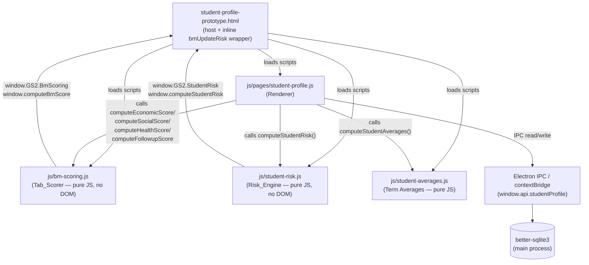
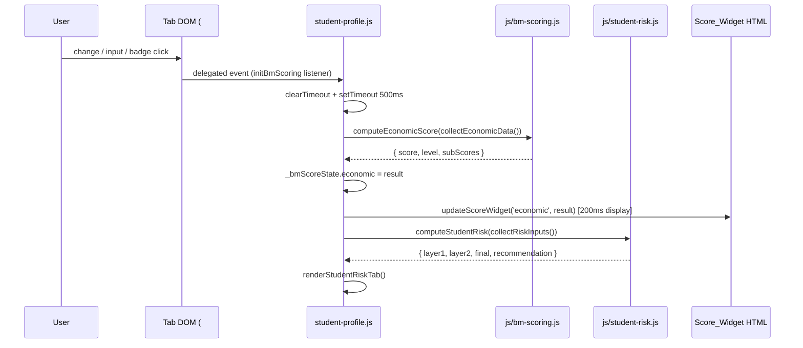
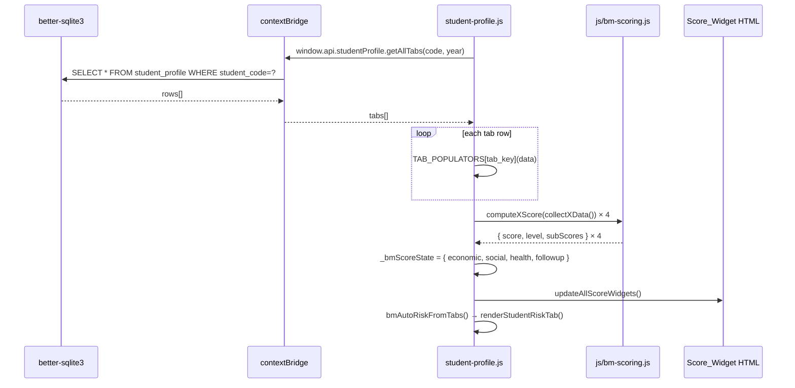

# Design Document: student-profile-bm-scoring

## Overview

This feature adds an independent **Tab_Score** (0–100) for each of the four BM tabs
(Economic, Social, Health/Psych, Followup) inside `student-profile-prototype.html`.
Each score is computed by a new pure-JS module `js/bm-scoring.js` (the Tab_Scorer),
displayed via a `Score_Widget` injected at the top of each tab, and fed into the
existing `collectRiskInputs()` / `computeStudentRisk` pipeline so the Composite_Risk
gauge stays in sync — all without any new external dependencies, DOM framework
changes, or IPC additions.

The design mirrors the established module pattern in `js/student-averages.js`
(IIFE + UMD guard) and reuses the `bm-progress-*` CSS classes and
`--color-{success,warning,danger}-solid` CSS variables already present in the
renderer.

---

## Architecture

### Component Diagram



### Module Boundaries

| Module | Responsibility | DOM access | IPC |
|--------|---------------|-----------|-----|
| `js/bm-scoring.js` | Pure scoring math; Sub_Score tables; normalization; null-detection | **None** | **None** |
| `js/pages/student-profile.js` | DOM wiring; event listeners; Score_Widget rendering; `_bmScoreState` cache; `collectRiskInputs` bridge | Yes | Read/write via `window.api` |
| `js/student-risk.js` | Two-layer Composite_Risk engine | None | None |
| `js/student-averages.js` | Term / general average computation | None | None |

---

## Data Flow

### Tab Field Change → Score_Widget Update → Risk Re-render



### Load from DB → Populate → Score



---

## `_bmScoreState` Cache

A module-level object in `student-profile.js`, parallel to the existing `_riskState`:

```javascript
// Shape mirrors _riskState; each slot holds the last BmScoring result or null.
const _bmScoreState = {
    economic: null,  // { score: number|null, level: string|null, subScores: object }
    social:   null,
    health:   null,
    followup: null
};
```

**Invariants:**
- `null` means "not yet computed or module not loaded".
- A slot is overwritten on every successful scorer call.
- `collectRiskInputs()` reads from this cache; falls back to DOM if a slot is `null`.

---

## Components and Interfaces

### Component 1: `js/bm-scoring.js` — Tab_Scorer

**Purpose:** Pure scoring math. No DOM, no IPC. Importable by Node test runner.

**Public API (exported on `window.GS2.BmScoring` and `window.computeBmScore`):**

```javascript
/**
 * @typedef {{ score: number|null, level: string|null, subScores: object }} TabScoreResult
 */

/**
 * @param {{ eco_status, income_source, distance_km, support_programs[], unmet_needs[] }} data
 * @returns {TabScoreResult}
 */
function computeEconomicScore(data) { /* ... */ }

/**
 * @param {{ family_status, parents_edu, housing, study_place,
 *           teachers_rel, peers_rel, social_risks[] }} data
 * @returns {TabScoreResult}
 */
function computeSocialScore(data) { /* ... */ }

/**
 * @param {{ health_gen, disability, learning_disorders[], sleep, nutrition,
 *           substances[], psych_symptoms[], mood, motivation, psych_referral }} data
 * @returns {TabScoreResult}
 */
function computeHealthScore(data) { /* ... */ }

/**
 * @param {{ calls_count, meetings_count, actions_taken[],
 *           next_date, guardian_phone }} data
 * @returns {TabScoreResult}
 */
function computeFollowupScore(data) { /* ... */ }

// Convenience dispatcher (used by tests only).
// axis: 'economic'|'social'|'health'|'followup'
function computeBmScore(axis, data) { /* ... */ }
```

**`level` classification rule** (shared by all four functions):
```
score in [0, 39]   → level = 'منخفض'
score in [40, 69]  → level = 'متوسط'
score in [70, 100] → level = 'مرتفع'
score === null     → level = null
```

### Component 2: Score_Widget HTML Structure

Injected once per tab by `injectScoreWidgets()` called at DOMContentLoaded, before any data is loaded. The widget sits at the top of each tab panel `#tab-{key}`.

```html
<!-- id="bm-score-widget-{key}" where key = economic|social|health|followup -->
<div id="bm-score-widget-economic"
     class="bm-score-widget"
     role="status"
     aria-live="polite"
     aria-label="سكور الجانب الاقتصادي: غير محسوب">

  <div class="bm-score-widget__header">
    <span class="bm-score-widget__label">سكور الجانب الاقتصادي</span>
    <span class="bm-score-widget__value" id="bm-score-val-economic">—</span>
    <span class="bm-score-widget__badge" id="bm-score-badge-economic"></span>
  </div>

  <div class="bm-progress-bg" style="height:8px;border-radius:4px;background:var(--color-border)">
    <div class="bm-progress-fill bm-score-widget__bar"
         id="bm-score-bar-economic"
         style="width:0%;height:100%;border-radius:4px;transition:width 0.2s ease,background 0.2s ease">
    </div>
  </div>

</div>
```

**CSS class tokens** (all reuse existing `.bm-progress-*` pattern):

| Element | Class |
|---------|-------|
| Container | `bm-score-widget` |
| Header row | `bm-score-widget__header` |
| Axis label | `bm-score-widget__label` |
| Numeric value | `bm-score-widget__value` |
| Classification badge | `bm-score-widget__badge` |
| Progress track | `bm-progress-bg` (existing) |
| Progress fill | `bm-progress-fill bm-score-widget__bar` (existing + new) |

**Color mapping** (uses existing CSS variables):

| Score_Level | CSS Variable | Applied to |
|-------------|-------------|-----------|
| `منخفض` (0–39) | `--color-success-solid` | bar fill + badge |
| `متوسط` (40–69) | `--color-warning-solid` | bar fill + badge |
| `مرتفع` (70–100) | `--color-danger-solid` | bar fill + badge |

### Component 3: Axis Summary Card (Risk_Tab)

Rendered inside `renderStudentRiskTab()` below the main gauge, using the existing `.bm-progress-row` markup pattern:

```html
<!-- id="bm-axis-summary-card" injected inside #tab-risk -->
<div id="bm-axis-summary-card" class="bm-axis-summary-card" style="display:none">
  <h4 class="sp-section-title">
    <i class="fas fa-chart-bar"></i> ملخص محاور البطاقة
  </h4>
  <!-- repeated per available axis: -->
  <div class="bm-progress-row">
    <span class="bm-progress-lbl">الجانب الاقتصادي</span>
    <div class="bm-progress-bg">
      <div class="bm-progress-fill" style="width:45%;background:var(--color-warning-solid)"></div>
    </div>
    <span style="font-size:11px;min-width:64px;text-align:start;color:var(--color-text-muted)">
      45 · متوسط
    </span>
  </div>
  <!-- ... other axes ... -->
</div>
```

The card is shown (`display:block`) only when **all four** Tab_Scores are non-null (Req 6.3).

---

## Data Models

### `TabScoreResult`

```javascript
{
  score:     number | null,   // 0–100 normalized, clamped; null when all fields absent
  level:     string | null,   // 'منخفض' | 'متوسط' | 'مرتفع' | null
  subScores: {                // raw points per field (before normalization)
    [fieldKey: string]: number
  }
}
```

### Scoring Tables

#### Economic (Req 1) — divisor 85

```javascript
const ECO_TABLE = {
  eco_status:  { good: 0, avg: 15, poor: 30, vpoor: 40 },
  income_source: { stable: 0, unstable: 10, none: 20 },
  // distance_km >10 → +5 (computed, not table lookup)
  // support_programs: each active item → -5 (floor 0)
  // unmet_needs: each item → +5 (max 20)
};
const ECO_DIVISOR = 85;
```

#### Social (Req 2) — divisor 105

```javascript
const SOC_TABLE = {
  family_status:  { complete: 0, divorced: 15, widow: 10, absent: 15 },
  parents_edu:    { high: 0, mid: 5, low: 10, none: 15 },
  housing:        { good: 0, crowded: 10, bad: 20 },
  study_place:    { yes: 0, partial: 5, no: 10 },
  teachers_rel:   { good: 0, neutral: 5, bad: 10 },
  peers_rel:      { good: 0, neutral: 5, bad: 10 },
  // social_risks[]: each item → +5 (max 25)
};
const SOC_DIVISOR = 105;
```

#### Health (Req 3) — divisor 139

```javascript
const HEALTH_TABLE = {
  health_gen:   { good: 0, avg: 10, bad: 20 },
  disability:   { none: 0, yes: 15 },
  sleep:        { good: 0, avg: 5, bad: 10 },
  nutrition:    { good: 0, avg: 5, bad: 10 },
  psych_referral: { no: 0, maybe: 5, yes: 10 },
  // learning_disorders[]: each → +8 (max 24)
  // substances[]: each → +10 (max 20)
  // psych_symptoms[]: red-flag → +12, other → +5 (max 30 total)
  // mood scale:       1→15, 2→10, 3→5, 4→2, 5→0
  // motivation scale: 1→10, 2→7,  3→4, 4→1, 5→0
};
const HEALTH_DIVISOR = 139;

// Red-flagged psych symptoms — each scores 12 pts instead of 5
const HEALTH_REDFLAG_SYMPTOMS = [
  'self_harm',       // إيذاء النفس
  'suicidal_ideation', // أفكار انتحارية
  'psychosis',       // أعراض ذهانية
  'dissociation'     // تفارق / انفصال
];
```

#### Followup (Req 4) — divisor 95 (inverse scoring)

```javascript
// Base for actions: 50pts reduced by 5 per action (min 0)
const FOLLOWUP_DIVISOR = 95;
// contacts (calls+meetings combined):
//   0       → 25 pts
//   1–2     → 15 pts
//   3+      →  5 pts
// actions_taken[]: base 50 − 5×count (floor 0)
// next_date empty  → +10 pts
// guardian_phone empty → +10 pts
```

---

## Key Functions with Formal Specifications

### `computeEconomicScore(data)`

**Preconditions:**
- `data` is a plain object (may have missing fields; treated as `null`)
- No field is required

**Postconditions:**
- Returns `{ score, level, subScores }`
- `score === null` iff `data.eco_status == null && data.income_source == null && (!data.distance_km || Number(data.distance_km) === 0) && (!data.support_programs || data.support_programs.length === 0) && (!data.unmet_needs || data.unmet_needs.length === 0)`
- `score` ∈ [0, 100] when non-null (clamped)
- Best-case (all optimal): `score === 0`
- Worst-case (all max-risk): `score === 100`

**Algorithm:**

```pascal
FUNCTION computeEconomicScore(data)
  INPUT: data object from collectEconomicData()
  OUTPUT: TabScoreResult

BEGIN
  hasAny ← false
  raw ← 0
  subs ← {}

  // eco_status
  IF data.eco_status IS NOT NULL THEN
    hasAny ← true
    pts ← ECO_TABLE.eco_status[data.eco_status] OR 0
    raw ← raw + pts
    subs.eco_status ← pts
  END IF

  // income_source
  IF data.income_source IS NOT NULL THEN
    hasAny ← true
    pts ← ECO_TABLE.income_source[data.income_source] OR 0
    raw ← raw + pts
    subs.income_source ← pts
  END IF

  // distance_km
  km ← Number(data.distance_km)
  IF isFinite(km) AND km > 0 THEN
    hasAny ← true
    pts ← (km > 10) ? 5 : 0
    raw ← raw + pts
    subs.distance_km ← pts
  END IF

  // support_programs (each reduces raw by 5, floor 0)
  programs ← arr(data.support_programs).filter(Boolean)
  IF programs.length > 0 THEN
    hasAny ← true
    reduction ← programs.length × 5
    raw ← max(0, raw - reduction)
    subs.support_programs ← -reduction
  END IF

  // unmet_needs (each +5, max 20)
  needs ← arr(data.unmet_needs).filter(Boolean)
  IF needs.length > 0 THEN
    hasAny ← true
    pts ← min(needs.length × 5, 20)
    raw ← raw + pts
    subs.unmet_needs ← pts
  END IF

  IF NOT hasAny THEN
    RETURN { score: null, level: null, subScores: {} }
  END IF

  score ← clamp100(raw / ECO_DIVISOR × 100)
  RETURN { score: round2(score), level: levelLabel(score), subScores: subs }
END
```

**Loop Invariants:** N/A (no explicit loops in the function body; array `.filter()` is pure)

---

### `computeSocialScore(data)`

**Preconditions:** `data` is a plain object with optional fields.

**Postconditions:**
- Returns null score iff all radio fields are null/empty AND `social_risks` is empty
- `score` ∈ [0, 100] when non-null

**Algorithm:**

```pascal
FUNCTION computeSocialScore(data)
BEGIN
  hasAny ← false
  raw ← 0
  subs ← {}

  FOR EACH field IN [family_status, parents_edu, housing, study_place, teachers_rel, peers_rel]
    IF data[field] IS NOT NULL AND data[field] ≠ '' THEN
      hasAny ← true
      pts ← SOC_TABLE[field][data[field]] OR 0
      raw ← raw + pts
      subs[field] ← pts
    END IF
  END FOR

  risks ← arr(data.social_risks).filter(Boolean)
  IF risks.length > 0 THEN
    hasAny ← true
    pts ← min(risks.length × 5, 25)
    raw ← raw + pts
    subs.social_risks ← pts
  END IF

  IF NOT hasAny THEN RETURN { score: null, level: null, subScores: {} }

  score ← clamp100(raw / SOC_DIVISOR × 100)
  RETURN { score: round2(score), level: levelLabel(score), subScores: subs }
END
```

---

### `computeHealthScore(data)`

**Preconditions:** `data` is a plain object; `psych_symptoms` is an array of string values.

**Postconditions:**
- `score === null` iff all radio fields absent AND all arrays empty AND mood/motivation not set
- Red-flag symptoms (in `HEALTH_REDFLAG_SYMPTOMS`) score 12 pts each; others score 5 pts each
- Total psych_symptoms contribution clamped to 30
- `score` ∈ [0, 100]

**Algorithm:**

```pascal
FUNCTION computeHealthScore(data)
BEGIN
  hasAny ← false
  raw ← 0
  subs ← {}

  FOR EACH field IN [health_gen, disability, sleep, nutrition, psych_referral]
    IF data[field] IS NOT NULL AND data[field] ≠ '' THEN
      hasAny ← true
      pts ← HEALTH_TABLE[field][data[field]] OR 0
      raw ← raw + pts ; subs[field] ← pts
    END IF
  END FOR

  // learning_disorders[] each +8, max 24
  disorders ← arr(data.learning_disorders).filter(Boolean)
  IF disorders.length > 0 THEN
    hasAny ← true
    pts ← min(disorders.length × 8, 24)
    raw ← raw + pts ; subs.learning_disorders ← pts
  END IF

  // substances[] each +10, max 20
  subs_list ← arr(data.substances).filter(Boolean)
  IF subs_list.length > 0 THEN
    hasAny ← true
    pts ← min(subs_list.length × 10, 20)
    raw ← raw + pts ; subs.substances ← pts
  END IF

  // psych_symptoms[]: red-flag 12, other 5, max 30
  symptoms ← arr(data.psych_symptoms).filter(Boolean)
  IF symptoms.length > 0 THEN
    hasAny ← true
    psychPts ← 0
    FOR EACH s IN symptoms
      psychPts ← psychPts + (HEALTH_REDFLAG_SYMPTOMS includes s ? 12 : 5)
    END FOR
    psychPts ← min(psychPts, 30)
    raw ← raw + psychPts ; subs.psych_symptoms ← psychPts
  END IF

  // mood scale: 1→15, 2→10, 3→5, 4→2, 5→0
  MOOD_POINTS ← [0, 15, 10, 5, 2, 0]  // 1-indexed
  IF data.mood IS NOT NULL THEN
    hasAny ← true
    pts ← MOOD_POINTS[data.mood] OR 0
    raw ← raw + pts ; subs.mood ← pts
  END IF

  // motivation scale: 1→10, 2→7, 3→4, 4→1, 5→0
  MOTIV_POINTS ← [0, 10, 7, 4, 1, 0]  // 1-indexed
  IF data.motivation IS NOT NULL THEN
    hasAny ← true
    pts ← MOTIV_POINTS[data.motivation] OR 0
    raw ← raw + pts ; subs.motivation ← pts
  END IF

  IF NOT hasAny THEN RETURN { score: null, level: null, subScores: {} }

  score ← clamp100(raw / HEALTH_DIVISOR × 100)
  RETURN { score: round2(score), level: levelLabel(score), subScores: subs }
END
```

---

### `computeFollowupScore(data)`

**Preconditions:** `data` is a plain object (inverse-scored axis).

**Postconditions:**
- `score === null` iff calls_count null/0, meetings_count null/0, actions_taken empty, next_date empty, guardian_phone empty
- Lower score = better followup (good intervention = low risk)
- `score` ∈ [0, 100]

**Algorithm:**

```pascal
FUNCTION computeFollowupScore(data)
BEGIN
  calls    ← max(0, Number(data.calls_count) OR 0)
  meetings ← max(0, Number(data.meetings_count) OR 0)
  actions  ← arr(data.actions_taken).filter(Boolean)

  // null-detection: all scored fields must be truly absent
  callsAbsent    ← data.calls_count == null OR data.calls_count === ''
  meetingsAbsent ← data.meetings_count == null OR data.meetings_count === ''
  noActions      ← actions.length = 0
  noNextDate     ← data.next_date == null OR data.next_date = ''
  noPhone        ← data.guardian_phone == null OR data.guardian_phone = ''

  IF callsAbsent AND meetingsAbsent AND noActions AND noNextDate AND noPhone THEN
    RETURN { score: null, level: null, subScores: {} }
  END IF

  raw ← 0
  subs ← {}

  // contacts combined
  totalContacts ← calls + meetings
  IF totalContacts = 0 THEN contactPts ← 25
  ELSE IF totalContacts <= 2 THEN contactPts ← 15
  ELSE contactPts ← 5
  raw ← raw + contactPts ; subs.contacts ← contactPts

  // actions_taken: base 50 − 5×count (floor 0)
  actionPts ← max(0, 50 - actions.length × 5)
  raw ← raw + actionPts ; subs.actions_taken ← actionPts

  // next_date
  datePts ← noNextDate ? 10 : 0
  raw ← raw + datePts ; subs.next_date ← datePts

  // guardian_phone
  phonePts ← noPhone ? 10 : 0
  raw ← raw + phonePts ; subs.guardian_phone ← phonePts

  score ← clamp100(raw / FOLLOWUP_DIVISOR × 100)
  RETURN { score: round2(score), level: levelLabel(score), subScores: subs }
END
```

---

### `levelLabel(score)` — shared helper inside `bm-scoring.js`

```pascal
FUNCTION levelLabel(score)
  IF score < 40 THEN RETURN 'منخفض'
  IF score < 70 THEN RETURN 'متوسط'
  RETURN 'مرتفع'
```

---

### `updateScoreWidget(key, result)` — Renderer helper

**Signature:**
```javascript
// key: 'economic' | 'social' | 'health' | 'followup'
// result: TabScoreResult | null
// Display update runs synchronously (called inside a 200ms setTimeout)
function updateScoreWidget(key, result) { /* ... */ }
```

**Preconditions:** Widget DOM elements for `key` are present (injected by `injectScoreWidgets()`).

**Postconditions:**
- If `result === null` or `result.score === null`: shows `—`, bar at 0%, no badge, aria-label = `"سكور [axis]: غير محسوب"`
- Otherwise: shows clamped score, bar width = score%, badge = level, aria-label = `"سكور [axis]: [score] من 100 — [level]"`
- Color matches the Score_Level → CSS variable mapping

---

### `initBmScoring()` — Renderer wiring function

Mirrors `initDirtyTracking()`. Called once at DOMContentLoaded, after `injectScoreWidgets()`.

**Signature:**
```javascript
function initBmScoring() { /* ... */ }
```

**Algorithm:**

```pascal
PROCEDURE initBmScoring()
BEGIN
  IF window.GS2.BmScoring IS NOT available THEN RETURN  // graceful degradation

  tabMapping ← {
    'tab-economic': { key: 'economic', scorer: computeEconomicScore, collector: collectEconomicData },
    'tab-social':   { key: 'social',   scorer: computeSocialScore,   collector: collectSocialData   },
    'tab-health':   { key: 'health',   scorer: computeHealthScore,   collector: collectHealthData   },
    'tab-followup': { key: 'followup', scorer: computeFollowupScore, collector: collectFollowupData }
  }

  timers ← {}  // debounce timer handles, one per tab key

  FOR EACH [tabId, { key, scorer, collector }] IN tabMapping
    tabEl ← document.getElementById(tabId)
    IF tabEl IS NULL THEN continue

    handler ← FUNCTION()
      clearTimeout(timers[key])
      timers[key] ← setTimeout(FUNCTION()
        result ← scorer(collector())
        _bmScoreState[key] ← result
        // Display update after additional 200ms
        setTimeout(() => updateScoreWidget(key, result), 200)
        renderStudentRiskTab()
      END, 500)
    END FUNCTION

    tabEl.addEventListener('change', handler)
    tabEl.addEventListener('input', handler)
    tabEl.addEventListener('click', FUNCTION(e)
      IF e.target.closest('.bm-badge') OR e.target.closest('.bm-scale-btn') THEN
        handler()
      END IF
    END)
  END FOR
END
```

---

### `updateAllScoreWidgets()` — called after `loadAllProfileTabs`

```javascript
function updateAllScoreWidgets() {
    if (!window.GS2?.BmScoring) return;
    const { computeEconomicScore, computeSocialScore, computeHealthScore, computeFollowupScore } = window.GS2.BmScoring;
    _bmScoreState.economic = computeEconomicScore(collectEconomicData());
    _bmScoreState.social   = computeSocialScore(collectSocialData());
    _bmScoreState.health   = computeHealthScore(collectHealthData());
    _bmScoreState.followup = computeFollowupScore(collectFollowupData());
    ['economic', 'social', 'health', 'followup'].forEach(key => {
        updateScoreWidget(key, _bmScoreState[key]);
    });
}
```

Called inside `loadAllProfileTabs()` after the existing `bmAutoRiskFromTabs()` call:

```javascript
// In loadAllProfileTabs(), after the populators loop:
bmAutoRiskFromTabs();
updateAllScoreWidgets();   // ← new line
```

---

### `collectRiskInputs()` — updated to read `_bmScoreState`

The existing function is extended with a null-safe bridge. The Risk_Engine interface (`computeStudentRisk`) is **unchanged**.

```javascript
function collectRiskInputs() {
    // ── BmScoring bridge (Req 6) ──────────────────────────────────────────
    // When Tab_Scores are available, pass a synthetic score for the
    // corresponding axis so the Risk_Engine's Layer-2 weighting uses the
    // finer-grained BM score instead of raw DOM signals.
    //
    // The mapping:
    //   _bmScoreState.social    → inputs.social   (used by computeSocial inside Risk_Engine)
    //   _bmScoreState.economic  → inputs.economic (used by computeEconomic)
    //   _bmScoreState.health    → inputs.health   (used by computeHealth)
    //
    // Because the Risk_Engine reads structured objects (not a numeric score),
    // BM scores are passed as a _bmScore sentinel key that the updated
    // computeSocial/computeEconomic/computeHealth axis functions can pick up
    // with a DOM-fallback guard. The axis functions in student-risk.js are
    // NOT changed — the sentinel is ignored by the current Risk_Engine.
    // Instead, collectRiskInputs injects the pre-computed numeric axes directly
    // on the inputs.bmScores sub-object so renderStudentRiskTab can surface
    // them in the axis-summary card independently of the Risk_Engine.
    // ─────────────────────────────────────────────────────────────────────────

    const eco    = typeof collectEconomicData === 'function' ? collectEconomicData() : {};
    const social = typeof collectSocialData   === 'function' ? collectSocialData()   : {};
    const health = typeof collectHealthData   === 'function' ? collectHealthData()   : {};

    const distance = Number(eco.distance_km);

    return {
        generalAverage:    _riskState.generalAverage,
        subjectAverages:   _riskState.subjectAverages,
        justifiedHours:    _riskState.justifiedHours,
        unjustifiedHours:  _riskState.unjustifiedHours,
        social: {
            risks:        social.social_risks || [],
            familyStatus: social.family_status,
            distanceKm:   isFinite(distance) ? distance : null
        },
        economic: {
            status:          eco.eco_status,
            supportPrograms: eco.support_programs || [],
            unmetNeeds:      eco.unmet_needs || [],
            incomeSource:    eco.income_source
        },
        health: {
            healthGen:        health.health_gen,
            disability:       health.disability,
            learningDisorders: health.learning_disorders || [],
            psychSymptoms:    health.psych_symptoms || [],
            substances:       health.substances || [],
            treatment:        health.treatment,
            psychSupport:     health.psych_support,
            psychReferral:    health.psych_referral
        },
        // NEW: BM Tab_Scores attached for the axis-summary card (Req 6.3).
        // Not consumed by computeStudentRisk() — backward compatible.
        bmScores: {
            economic: _bmScoreState.economic?.score ?? null,
            social:   _bmScoreState.social?.score   ?? null,
            health:   _bmScoreState.health?.score   ?? null,
            followup: _bmScoreState.followup?.score ?? null
        }
    };
}
```

---

## UMD Export for `js/bm-scoring.js`

Follows the exact same guard as `js/student-averages.js`:

```javascript
(function () {
    'use strict';

    // ... scoring constants, tables, helpers, four axis functions ...

    var api = {
        computeEconomicScore: computeEconomicScore,
        computeSocialScore:   computeSocialScore,
        computeHealthScore:   computeHealthScore,
        computeFollowupScore: computeFollowupScore,
        computeBmScore:       computeBmScore,
        // Expose tables for test inspection
        ECO_DIVISOR:           ECO_DIVISOR,
        SOC_DIVISOR:           SOC_DIVISOR,
        HEALTH_DIVISOR:        HEALTH_DIVISOR,
        FOLLOWUP_DIVISOR:      FOLLOWUP_DIVISOR,
        HEALTH_REDFLAG_SYMPTOMS: HEALTH_REDFLAG_SYMPTOMS
    };

    if (typeof module !== 'undefined' && module.exports) {
        module.exports = api;
    }
    if (typeof window !== 'undefined') {
        window.GS2 = window.GS2 || {};
        window.GS2.BmScoring = api;
        window.computeBmScore = computeBmScore;
    }
})();
```

---

## Error Handling

### Missing `bm-scoring.js`

`initBmScoring()` and `updateAllScoreWidgets()` both guard with:
```javascript
if (!window.GS2?.BmScoring) return;
```
The page continues with current Risk_Engine behavior unchanged (Req 7.6).

### Malformed Data Values

Unknown values not in the scoring table (e.g. a radio value not listed) are treated as `0` via `TABLE[field][value] || 0`. This prevents NaN propagation.

### Score Out-of-Range

`clamp100()` (borrowed from `student-risk.js` pattern) is applied at the final normalization step in every axis function, satisfying Req 3.6 / 5.6.

### Widget Not in DOM

`updateScoreWidget()` does a `getElementById` guard — if any widget element is absent it returns silently.

---

## Testing Strategy

### Unit Testing Approach

Each axis function is a pure function — inputs and output are plain objects, no DOM, no IPC. Standard assertions cover the scoring table lookups.

### Property-Based Testing Approach

**Library:** `fast-check` (already in devDependencies as required by Req 8)

**Test File:** `tests/bm-scoring.test.js`

**Properties to test (≥ 100 iterations each):**

```javascript
// 1. Score is always in [0, 100] for any valid input object
fc.assert(fc.property(arbitraryEconomicData(), data => {
    const { score } = computeEconomicScore(data);
    return score === null || (score >= 0 && score <= 100);
}), { numRuns: 100 });

// 2. Null when all fields absent (applies to all four axes)
fc.assert(fc.property(fc.constant({}), data => {
    return computeEconomicScore(data).score === null;
}));

// 3. Best-case = 0 (all optimal values → score 0)
computeEconomicScore({ eco_status:'good', income_source:'stable', distance_km:0,
                       support_programs:[], unmet_needs:[] }).score === 0

// 4. Worst-case = 100 (all max-risk values → score 100)
computeEconomicScore({ eco_status:'vpoor', income_source:'none', distance_km:15,
                       support_programs:[], unmet_needs:['a','b','c','d'] }).score === 100

// 5. Monotonicity: making any field "worse" never decreases the score
fc.assert(fc.property(
    arbitraryEconomicData(),
    fc.constantFrom('good','avg','poor','vpoor'),
    (base, worse) => {
        const a = computeEconomicScore({ ...base, eco_status: 'good' });
        const b = computeEconomicScore({ ...base, eco_status: worse });
        const ecoPoints = { good:0, avg:15, poor:30, vpoor:40 };
        if (ecoPoints[worse] >= ecoPoints['good'])
            return b.score === null || a.score === null || b.score >= a.score;
        return true;
    }
), { numRuns: 100 });
```

The same four property groups are replicated for all four axis functions.

### Integration Testing Approach

Manual smoke test after loading `student-profile-prototype.html`:
1. Fill all fields in one tab → Score_Widget shows non-null value with correct level color.
2. Clear all fields in a tab → Score_Widget shows `—`, bar at 0%.
3. Save + reload → Score_Widget values match re-computed scores from loaded data.
4. Fill all four tabs → axis summary card appears in Risk_Tab.

---

## Performance Considerations

- **Debounce:** 500 ms for computation, 200 ms for display update (Req 5.4 / 7.4). The short computation time for pure-JS scoring (< 1 ms) means the only real cost is the `setTimeout` overhead.
- **No redundant recomputation:** `_bmScoreState` caches last result; `renderStudentRiskTab()` reads from cache via `collectRiskInputs()`, not by re-running the scorers.
- **Single traversal per tab:** Each axis function traverses its input object once — O(1) radio lookups + O(k) array iterations where k ≤ number of badges/symptoms.

---

## Security Considerations

No new IPC channels, no new database operations, no network calls. All inputs come from the local DOM (already sanitized by the existing `escapeHtml` helper before display). No security surface changes.

---

## Dependencies

| Dependency | Type | Where used |
|-----------|------|-----------|
| `fast-check` | devDependency (existing) | `tests/bm-scoring.test.js` |
| `better-sqlite3` | existing main-process dep | Not changed |
| `js/student-risk.js` | existing renderer script | `computeStudentRisk()` call unchanged |
| `js/student-averages.js` | existing renderer script | UMD pattern reference only |
| CSS variables `--color-{success,warning,danger}-solid` | existing stylesheet | Score_Widget colors |
| CSS class `.bm-progress-{bg,fill,row,lbl}` | existing stylesheet | Score_Widget and axis-summary card |

No new external runtime dependencies are introduced.

---

## Correctness Properties

The following invariants hold for all four axis scorer functions and are verified by the property-based test suite (≥ 100 iterations each via `fast-check`).

### Property 1: Score Range

For any input object `d`, if `computeXScore(d).score !== null` then `computeXScore(d).score ∈ [0, 100]`. Applies to all four axis functions. Verified by `fc.property(arbitraryXData(), d => { const r = computeXScore(d); return r.score === null || (r.score >= 0 && r.score <= 100); })`.

**Validates: Requirements 1.2, 2.2, 3.2, 3.6, 4.2, 8.2**

### Property 2: Null When All Absent

For any axis, if every scored field is absent (null, undefined, or empty string; arrays empty), then `computeXScore({}).score === null` and `computeXScore({}).level === null`. Verified by passing `fc.constant({})` to each scorer and asserting both output fields are null.

**Validates: Requirements 1.4, 2.4, 3.4, 4.4, 8.3**

### Property 3: Best-Case Zero

For each axis scorer, the input object where every field is set to its minimum-risk value produces `score === 0`. Examples: Economic → `{ eco_status:'good', income_source:'stable', distance_km:0, support_programs:[], unmet_needs:[] }`; Social → all radios `'good'`/`'complete'`/`'high'`/`'yes'`, `social_risks:[]`; Health → all radios `'good'`/`'none'`, all arrays empty, mood=5, motivation=5; Followup → 3+ contacts, 10 actions, next_date set, guardian_phone set.

**Validates: Requirements 1.1, 2.1, 3.1, 4.1, 8.5**

### Property 4: Worst-Case 100

For each axis scorer, the input object where every field is set to its maximum-risk value produces `score === 100`. Examples: Economic → `{ eco_status:'vpoor', income_source:'none', distance_km:15, support_programs:[], unmet_needs:['a','b','c','d'] }`; Social → all radios worst values, 5+ social risks; Health → all radios `'bad'`/`'yes'`, 3+ disorders, 2+ substances, 4 red-flag symptoms, mood=1, motivation=1, psych_referral='yes'; Followup → 0 contacts, 0 actions, no next_date, no guardian_phone.

**Validates: Requirements 1.1, 1.2, 2.1, 2.2, 3.1, 3.2, 4.1, 4.2, 8.4**

### Property 5: Monotonicity

For any two input objects `a` and `b` where every field value in `b` is equal to or more adverse than in `a` (i.e. higher individual Sub_Score contribution), `computeXScore(b).score >= computeXScore(a).score`. Verified by generating a random base input and then replacing one field at a time with a worse value, asserting the score is non-decreasing. Special case: adding a support program to Economic is the only field that decreases the score (by design — covered by Property 7).

**Validates: Requirements 1.1, 2.1, 3.1, 4.1, 8.6**

### Property 6: Level Consistency

When `score !== null`, the returned `level` matches the classification: `score < 40 → 'منخفض'`, `40 ≤ score < 70 → 'متوسط'`, `score ≥ 70 → 'مرتفع'`. When `score === null`, `level === null`. Verified for all four scorers with `fc.property(arbitraryXData(), d => { const r = computeXScore(d); if (r.score === null) return r.level === null; if (r.score < 40) return r.level === 'منخفض'; if (r.score < 70) return r.level === 'متوسط'; return r.level === 'مرتفع'; })`.

**Validates: Requirements 5.1, 5.2, 7.2**

### Property 7: Support Programs Are Beneficial (Economic only)

For any input `d` with a non-null economic score, adding a non-empty support program never increases the score: `computeEconomicScore({ ...d, support_programs: [...(d.support_programs||[]), 'tayssir'] }).score <= computeEconomicScore(d).score`. This is the only intentional monotonicity exception across all four scorers.

**Validates: Requirements 1.1, 8.6**

### Property 8: Followup Inverse Ordering (Followup only)

For two inputs `a` (no intervention: 0 contacts, 0 actions, no next_date, no phone) and `b` (full intervention: 3+ contacts, 10 actions, next_date set, guardian_phone set), `computeFollowupScore(a).score > computeFollowupScore(b).score`. Concretely: `a` yields the maximum raw total (25+50+10+10 = 95 → score 100) and `b` yields 0 raw total → score 0.

**Validates: Requirements 4.1, 4.2, 8.6**
