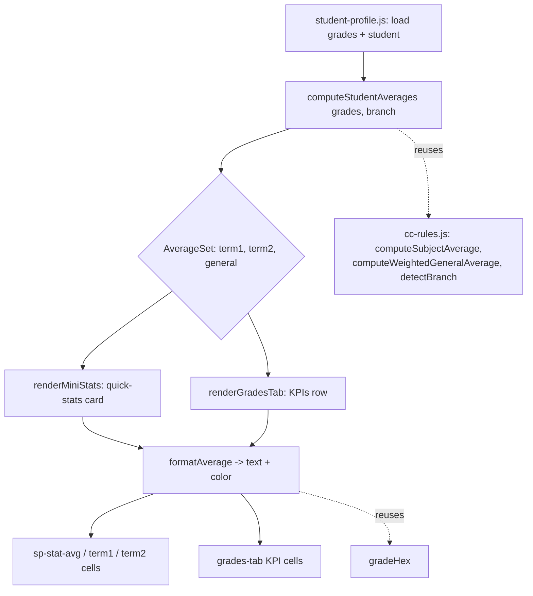

# Design Document

## Overview

This feature reworks how academic averages are computed and displayed on the student profile
page (`student-profile-prototype.html`, driven by `js/pages/student-profile.js`). Today both the
"إحصائيات سريعة" quick-stats card and the grades-tab KPIs row show a single "المعدل العام" value
that is produced by pooling **all** grade records from both school terms into one set of per-subject
averages. The displayed number therefore corresponds to no single term and is ambiguous.

The new behavior computes three averages independently and presents all three in both views:

- **معدل الدورة 1** (Term_1_Average) — weighted general average from Term 1 records only.
- **معدل الدورة 2** (Term_2_Average) — weighted general average from Term 2 records only.
- **المعدل العام** (General_Average) — the mean of the *available* term averages (50/50), or the
  single available term when only one exists, rounded to 2 decimals.

Scope is strictly presentational and computational on the profile page. Grade storage, entry,
sync, IPC, and the database are untouched. All averaging continues to flow through the existing
`computeSubjectAverage`, `computeWeightedGeneralAverage`, and `detectBranch` helpers in
`js/cc-rules.js`, with `gradeHex` used for color coding.

### Source-of-truth findings (grounding)

Reading the current code confirmed the following facts that the design builds on:

- The real page file in the repo is `student-profile-prototype.html`; a separate
  `student-profile.html` does not currently exist. The design targets the prototype file and any
  future `student-profile.html` that mirrors it. Both share the same DOM contract
  (`sp-stat-avg`, `sp-stat-subjects`, `sp-stat-absence`, `sp-grades-content`).
- `renderMiniStats()` and `renderGradesTab()` in `js/pages/student-profile.js` each independently
  perform the same pooled computation: dedup by `subject||semester`, group by base subject via
  `ccBaseSubject(normalizeSubjectName(...))`, build `subjectAvgsArr` with `computeSubjectAverage`,
  detect branch via `detectBranch(student.section || student.class_name)`, then call
  `computeWeightedGeneralAverage(subjectAvgsArr, branch)`.
- Grade records expose `subject`, `grade` (0–20), and `semester` (`1`, `2`, or `0`/null/other).
- `gradeHex(val)` returns a color for any numeric input but has **no guard** for null/undefined or
  out-of-range values (it would resolve to the lowest-tier red), so the display layer must gate
  color application explicitly.
- A downstream consumer, `bmUpdateRisk()` in the prototype, reads the general average via
  `parseFloat(document.getElementById('sp-stat-avg').textContent) || 0`. A non-numeric placeholder
  parses to `NaN` and falls back to `0`, so `sp-stat-avg` must remain populated with either a
  numeric general average or a non-numeric placeholder.

### Two requirement conflicts surfaced during design

While grounding the design I found two places where the acceptance criteria contradict each other.
Both are resolved here following the implementation intent stated for this feature; they are
flagged so the requirements can be reconciled if the resolution is wrong.

1. **General average when exactly one term is available.** Requirement 2.5 states that if *either*
   term average is unavailable, General_Average is unavailable. Requirement 3.2 states that when
   *exactly one* term average is available, General_Average equals that single term. These cannot
   both hold. This design follows **Requirement 3** (the requirement that explicitly defines how
   General_Average is derived) and the feature intent: "mean of available term averages, or the
   single available term." General_Average is therefore unavailable only when **both** terms are
   unavailable.
2. **Placeholder character.** Requirement 4 specifies the em dash "—" for the quick-stats card,
   while Requirements 2 and 5 specify the hyphen "-" for the grades tab and term values.
   Requirement 6.4 requires the placeholder to appear **identically** in both views. To satisfy the
   consistency requirement, the design uses a single placeholder constant in both places. The
   chosen character is "—" (em dash); see Design Decisions.

## Architecture

The change is contained entirely within the renderer page logic. No new modules, IPC channels, or
storage are introduced.



The key architectural move is to **extract a single pure computation function** that both render
paths call, replacing the two duplicated inline computations. This guarantees the quick-stats card
and the grades tab always agree (Requirement 6.1), and isolates the term-partitioning logic so it
can be property-tested without a DOM.

### Layering

- **Computation layer (pure, testable):** `computeStudentAverages(grades, branch)` and its helper
  `computeTermAverage(termGrades, branch)`. These take plain data and return plain data; no DOM,
  no globals beyond the `cc-rules.js` helpers.
- **Formatting layer (pure, testable):** `formatAverage(value)` returns the display string and an
  optional color, encapsulating the null/range/placeholder/color rules.
- **Render layer (DOM):** `renderMiniStats()` and `renderGradesTab()` consume the two pure layers
  and write into the DOM. The HTML in `student-profile-prototype.html` gains two new
  quick-stats rows for the term averages.

## Components and Interfaces

### 1. `computeTermAverage(termGrades, branch)` — new, pure

Computes the weighted general average for a single term's records, reusing the existing helpers.

- **Input:** `termGrades` — array of grade records already filtered to one term; `branch` — the
  branch code from `detectBranch` (may be `null`).
- **Behavior:** mirrors the current grouping logic — dedup by `subject||semester`, group by base
  subject via `ccBaseSubject(normalizeSubjectName(subject))`, compute each subject average with
  `computeSubjectAverage`, then combine with `computeWeightedGeneralAverage(subjectAvgsArr, branch)`.
- **Output:** a number rounded to 2 decimals in `[0, 20]`, or `null` when `termGrades` is empty or
  yields no usable subject averages.

### 2. `computeStudentAverages(grades, branch)` — new, pure

Top-level entry point used by both render functions.

- **Input:** `grades` — all of the student's grade records; `branch` — branch code.
- **Behavior:**
  1. Partition `grades` into `term1 = semester === 1` and `term2 = semester === 2`, discarding any
     record whose `semester` is `0`, null, missing, or not strictly `1`/`2`.
  2. `term1Avg = computeTermAverage(term1, branch)` (null if no term-1 records).
  3. `term2Avg = computeTermAverage(term2, branch)` (null if no term-2 records).
  4. Derive `generalAvg` (see Data Models / General average rule).
- **Output:** `{ term1: number|null, term2: number|null, general: number|null }`.

### 3. `formatAverage(value)` — new, pure

Maps an average value to its display representation, centralizing Requirements 4.4–4.7 and 5.4–5.7.

- **Input:** `value` — `number | null`.
- **Output:** `{ text: string, color: string|null }`:
  - When `value` is a finite number within `[0, 20]`: `text = value.toFixed(2)`,
    `color = gradeHex(value)`.
  - Otherwise (null, undefined, non-finite, or out of range): `text = AVG_PLACEHOLDER`,
    `color = null` (no grade color applied).

### 4. `renderMiniStats(grades, absences, student)` — modified

- Replaces the inline pooled computation with a call to `computeStudentAverages`.
- Populates three average cells in the quick-stats card using `formatAverage`:
  - `sp-stat-avg` ← General_Average (kept populated for the print/risk consumer — Requirement 6.2).
  - `sp-stat-term1` (new) ← Term_1_Average, labelled "معدل الدورة 1".
  - `sp-stat-term2` (new) ← Term_2_Average, labelled "معدل الدورة 2".
- Color is applied only when `formatAverage` returns a non-null color.
- `sp-stat-subjects` and `sp-stat-absence` behavior is unchanged.

### 5. `renderGradesTab(student, rawGrades)` — modified

- Replaces the inline pooled computation with the same `computeStudentAverages` result.
- The KPIs row gains "معدل الدورة 1" and "معدل الدورة 2" KPIs alongside the existing
  "المعدل العام", each formatted via `formatAverage`.
- Existing KPIs (عدد المواد, عدد النقط, أعلى نقطة, أدنى نقطة) and the per-subject/per-semester
  breakdown below the KPIs are unchanged (Requirement 5.6).

### 6. HTML markup — modified (`student-profile-prototype.html`)

The `.sp-mini-stats` block gains two rows before/after the existing general-average row:

```html
<div class="sp-mini-stat">
    <h4>معدل الدورة 1</h4>
    <div class="val" id="sp-stat-term1">—</div>
</div>
<div class="sp-mini-stat">
    <h4>معدل الدورة 2</h4>
    <div class="val" id="sp-stat-term2">—</div>
</div>
```

The existing `sp-stat-avg` row (المعدل العام) is retained. RTL/right-alignment is inherited from
the existing card styling (Requirement 4.8); no layout rewrite is needed.

## Data Models

### Grade record (existing, unchanged)

```text
GradeRecord {
  subject:  string        // may carry "(فرض N)" / "(الأنشطة المندمجة)" suffixes
  grade:    number        // 0–20
  semester: 1 | 2 | 0 | null | other   // 1 = Term 1, 2 = Term 2, else unspecified
}
```

### AverageSet (new, in-memory only)

```text
AverageSet {
  term1:   number | null   // rounded to 2 decimals, in [0,20], or null if unavailable
  term2:   number | null
  general: number | null
}
```

`null` is the single canonical representation of "unavailable" across the computation layer. The
formatting layer is the only place that converts `null` (or an out-of-range number) into the
display placeholder.

### Term partition rule

A record belongs to Term 1 iff `Number(semester) === 1`, to Term 2 iff `Number(semester) === 2`.
Every other value (`0`, `null`, `undefined`, `''`, `NaN`, `3`, …) is excluded from **both** terms
and from the general average (Requirements 1.4, 2.4, 3.5).

### General average rule (resolves the R2.5 / R3.2 conflict)

Given `term1` and `term2` (each `number | null`):

```text
if term1 != null AND term2 != null:  general = round2((term1 + term2) / 2)   // R3.1
elif term1 != null XOR term2 != null: general = round2(the available one)    // R3.2
else:                                 general = null                          // R3.3
then: if general != null AND (general < 0 OR general > 20): general = null     // R3.6
```

Because term averages already carry their canonical rounded value in `[0, 20]`, computing
`general` from them makes the quick-stats and grades-tab values identical by construction
(Requirement 6.1), and keeps `general` within `[0, 20]` whenever it is non-null (Requirement 3.4).
`round2(x) = Math.round(x * 100) / 100`.

### Placeholder constant

```text
AVG_PLACEHOLDER = "—"   // em dash, used identically in both views (R6.4)
```

### Design Decisions

- **One pure computation shared by both views.** Eliminates the current duplicated logic so the two
  views cannot drift, directly satisfying Requirement 6.1 and easing testing.
- **`null` for unavailable, placeholder only at the edge.** Keeps computation arithmetic clean and
  prevents accidental `0`-vs-empty confusion called out in Requirement 1.6.
- **General derived from the rounded term averages.** Guarantees `general` equals the mean of the
  exact numbers shown for the terms, so users can verify the arithmetic visually.
- **Single placeholder constant "—".** Reconciles the R4 ("—") vs R2/R5 ("-") inconsistency in
  favor of Requirement 6.4 (identical placeholder in both views). The em dash was chosen because it
  is the placeholder explicitly named for the quick-stats card (R4.6/4.7) and it parses to `NaN`
  for the existing `bmUpdateRisk()` consumer, preserving the no-numeric-average behavior
  (Requirements 6.2–6.4). If the hyphen is preferred, only the constant changes.
- **Color gating in `formatAverage`.** Because `gradeHex` has no null/range guard, color is applied
  only for in-range numeric values (Requirements 4.5–4.7, 5.5, 5.7).

## Correctness Properties

*A property is a characteristic or behavior that should hold true across all valid executions of a
system — essentially, a formal statement about what the system should do. Properties serve as the
bridge between human-readable specifications and machine-verifiable correctness guarantees.*

The computation layer (`computeStudentAverages`, `computeTermAverage`) and the formatting layer
(`formatAverage`) are pure functions, which makes them well suited to property-based testing. The
properties below were derived from the prework analysis; redundant criteria were consolidated.

### Property 1: Term average isolation (model-based)

*For any* set of grade records and any branch, `computeStudentAverages(grades, branch).term1` SHALL
equal the weighted general average computed from **only** the records with `semester === 1`
(grouped into per-subject averages via `computeSubjectAverage` and combined via
`computeWeightedGeneralAverage`), and `.term2` SHALL equal that computed from **only** the records
with `semester === 2`.

**Validates: Requirements 1.1, 1.2, 1.3, 1.5**

### Property 2: Unspecified-semester records are excluded (metamorphic)

*For any* set of grade records and any branch, inserting any number of additional records whose
`semester` is not strictly `1` or `2` (e.g. `0`, `null`, `''`, `3`, `"x"`) SHALL NOT change
`term1`, `term2`, or `general`.

**Validates: Requirements 1.4, 2.4, 3.5**

### Property 3: An empty term yields no value (not zero)

*For any* branch, if a term has zero records after partitioning, that term's average SHALL be
`null` (an explicit no-value result), never `0`.

**Validates: Requirements 1.6, 2.1, 2.2, 2.3**

### Property 4: General-average derivation

*For any* `term1` and `term2` produced by `computeStudentAverages`:
- when **both** are non-null, `general` SHALL equal `round2((term1 + term2) / 2)`;
- when **exactly one** is non-null, `general` SHALL equal `round2` of that available term;
- when **both** are null, `general` SHALL be `null`.

**Validates: Requirements 3.1, 3.2, 3.3** (encodes the resolution of the Requirement 2.5 conflict)

### Property 5: General-average range invariant

*For any* set of grade records and any branch, the returned `general` SHALL be either `null` or a
number within the inclusive range `[0, 20]`; a value that would fall outside `[0, 20]` SHALL be
returned as `null`.

**Validates: Requirements 3.4, 3.6**

### Property 6: Display format contract

*For any* input `value`, `formatAverage(value)` SHALL return `{ text: value.toFixed(2),
color: gradeHex(value) }` when `value` is a finite number within `[0, 20]`, and otherwise (null,
undefined, non-finite, or out of range) SHALL return `{ text: AVG_PLACEHOLDER, color: null }`.

**Validates: Requirements 4.4, 4.5, 4.6, 4.7, 5.4, 5.5, 5.7, 6.3**

### Property 7: Cross-view consistency

*For any* set of grade records and any branch, the formatted text used for Term_1_Average,
Term_2_Average, and General_Average in the quick-stats card SHALL be identical to the corresponding
formatted text used in the grades tab (including the placeholder when a value is unavailable),
because both views are derived from the same `computeStudentAverages` result and the same
`formatAverage` function.

**Validates: Requirements 6.1, 6.4**

## Error Handling

The feature performs no I/O and introduces no new failure modes; "errors" here are degenerate or
malformed inputs that must resolve to a predictable display rather than throwing.

- **No grades at all / no grades for a term:** the computation returns `null` for the affected
  averages; the formatting layer renders `AVG_PLACEHOLDER`. The existing "لا توجد نقط مسجلة لهذا
  التلميذ" empty state in `renderGradesTab` is retained for the no-grades case.
- **Records with unspecified `semester`:** silently excluded from all averages (Property 2). They
  continue to appear in the per-subject/per-semester breakdown unchanged, since that breakdown is
  out of scope.
- **Non-finite or out-of-range `grade` values:** `computeSubjectAverage` already ignores
  non-finite grades; the range invariant (Property 5) nulls any general average that would escape
  `[0, 20]`, so no out-of-range number is ever displayed or read by the print consumer.
- **Missing `branch` (`detectBranch` returns null):** `computeWeightedGeneralAverage` falls back to
  coefficient `1` for every subject (existing behavior); computation still succeeds.
- **Missing helper functions:** the render functions retain the existing
  `typeof fn === 'function'` guards so the page degrades gracefully if `cc-rules.js` failed to load.
- **Downstream print/risk consumer (`bmUpdateRisk`)**: `sp-stat-avg` always contains either a
  2-decimal numeric string or the non-numeric placeholder. `parseFloat(placeholder)` is `NaN`,
  which the consumer already coerces to `0` via `|| 0`, preserving current behavior
  (Requirements 6.2–6.4).

## Testing Strategy

A dual approach is used: property-based tests for the pure computation and formatting layers, and
example/DOM tests for the rendering and label requirements.

### Property-based tests

- A property-based testing library for the JavaScript stack will be used (e.g. **fast-check** with
  the project's test runner). Properties are NOT hand-rolled.
- Each property runs a **minimum of 100 iterations**.
- Each test is tagged with a comment referencing its design property, in the format:
  **Feature: student-profile-term-averages, Property {number}: {property_text}**.
- Each of Properties 1–7 is implemented by a **single** property-based test.
- **Generators:** random grade records with `subject` drawn from a mix of known Moroccan subject
  names (Arabic and Latin, with/without `(فرض N)` and `(الأنشطة المندمجة)` suffixes), `grade` in
  `[0, 20]` (including boundaries and a few non-finite values for robustness), and `semester` drawn
  from `{1, 2, 0, null, '', 3, 'x'}` so partition/exclusion edge cases are exercised. Branch is
  drawn from the known branch codes plus `null`.

### Example and DOM tests

- **Labels present (Requirements 4.1–4.3, 5.1–5.3):** after rendering into a jsdom fixture of the
  quick-stats card and grades tab, assert the three labels ("معدل الدورة 1", "معدل الدورة 2",
  "المعدل العام") and their value cells exist.
- **Existing KPIs retained (Requirement 5.6):** assert the grades-tab KPIs row still renders
  عدد المواد, عدد النقط, أعلى نقطة, and أدنى نقطة.
- **Print consumer contract (Requirements 6.2, 6.4):** assert `sp-stat-avg` holds the formatted
  general value when available, and the placeholder (with `parseFloat(...)` resolving to `NaN`)
  when unavailable.
- **Helper reuse (Requirement 6.5):** a focused unit test confirms `computeTermAverage` delegates
  to `computeWeightedGeneralAverage`/`computeSubjectAverage` rather than reimplementing the math.

### Out of scope for automated tests

- RTL direction and right-aligned label/value pairs (Requirement 4.8) are inherited from existing
  card CSS and verified by visual inspection.
