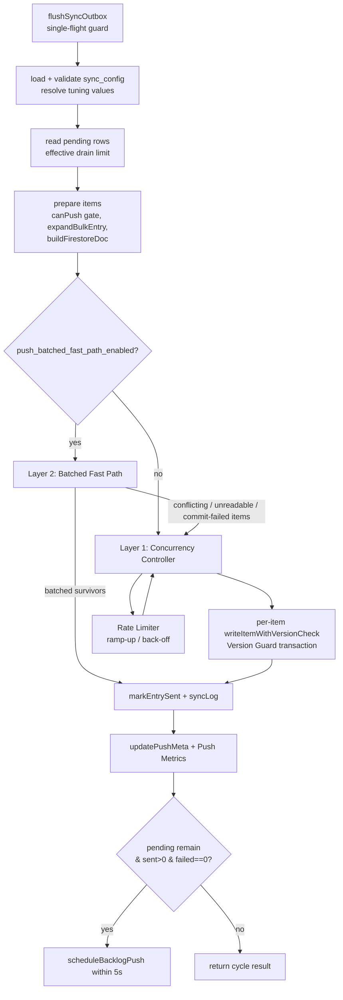

# Design Document

## Overview

The sync push path in `main/sync/engine.js` currently drains the local `sync_outbox`
one document at a time. Each pending row is `await`ed inside a sequential `for` loop
(`flushPreparedItems` / `flushExpandedEntries`), and every document opens its own
Firestore `runTransaction` to perform the optimistic version guard
(`writeItemWithVersionCheck`). With ~200ms round-trip latency per document, throughput
is effectively ~5 docs/sec, so the ~47,301 currently-pending rows take hours to clear.

This design improves throughput in two layers while preserving the existing correctness
model **exactly**:

- **Layer 1 — Bounded-Concurrency Parallel Push (primary).** Replace the sequential
  per-item loop with a bounded concurrency pool that dispatches multiple
  `writeItemWithVersionCheck` transactions in flight at once. A rate limiter ramps the
  active concurrency up on sustained success and backs it off (with exponential delay)
  when Firestore signals throttling. The per-document version guard is unchanged. The
  per-cycle drain limit is raised while a backlog exists.

- **Layer 2 — Batched Fast Path (optional, structural).** For the common no-conflict
  case, bulk-read remote versions with chunked `documentId() in [...]` queries, compare
  versions locally, commit non-conflicting survivors via Firestore `writeBatch`
  (`{ merge: true }`, ≤500 ops/commit), and route any conflicting or unreadable item
  back to the per-document version-guard transaction. Disabled by default; gated on
  `sync_config.push_batched_fast_path_enabled`.

The optimistic version guard, conflict detection (`logVersionConflict`), phantom-conflict
reconciliation (`reconcileUnreconciledRow`), role-based push authority (`canPush`),
bulk-entry expansion (`expandBulkEntry`), self-origin/device-hash handling, the
single-flight guard, and all `markEntrySent` side effects are preserved with no data loss
and no silent overwrites.

### Goals

- Drain a 47,301-row backlog to zero within 30 minutes under nominal conditions (Req 6.6).
- Sustain ≥50 docs/sec with Layer 1 at the default cap (Req 6.5), ≥200 docs/sec with
  Layer 2 on predominantly non-conflicting data (Req 7.9).
- Zero schema migrations; backward-compatible config with documented defaults (Req 9).

### Non-Goals

- No use of Firestore server-only `BulkWriter` or `firebase-admin` (client SDK only).
- No change to the pull path, conflict-resolution merge semantics, or capture layer.
- No raw request-rate tuning; adaptation is expressed purely through bounded transaction
  concurrency.

## Architecture

The push cycle keeps its existing top-level shape (`flushSyncOutbox` → read pending rows →
prepare items → dispatch → record metrics → schedule follow-up). The change is the
**dispatch stage**: a sequential loop becomes a concurrency-controlled dispatcher, with an
optional batched pre-stage in front of it.



### Component responsibilities

- **Push_Engine (`flushSyncOutbox`)** — orchestrates the cycle, single-flight guard,
  config resolution, drain-limit selection, metrics, and follow-up scheduling.
- **Item preparation** — reuses `processOutboxRow` logic: `canPush` gate, `expandBulkEntry`
  for bulk rows, `buildFirestoreDoc`. Produces `{ entryId, item }` prepared records.
- **Concurrency_Controller** — dispatches prepared records to `writeItemWithVersionCheck`
  with bounded in-flight parallelism; collects per-item outcomes.
- **Rate_Limiter** — owns the active concurrency limit; ramps up `+5` per clean group,
  halves on throttle, sleeps with exponential back-off, resets the throttle counter on
  recovery.
- **Batched_Fast_Path** — bulk-reads versions, partitions items into batchable survivors
  vs. guard-routed items, commits survivors via `writeBatch`, routes failures back.
- **Version_Guard (`writeItemWithVersionCheck`)** — unchanged transaction-based read-before-write.
- **Push_Metrics** — per-cycle counters/timing recorded via `updatePushMeta` plus structured logging.

### Why bounded concurrency (not request-rate tuning)

A client Electron app must never run hundreds of concurrent Firestore transactions.
Firestore's "ramp up gradually, back off on throttle" guidance is implemented here as a
ceiling on simultaneously in-flight transactions: start at 10, step `+5`, cap at 20
(absolute ceiling 50). This keeps the implementation simple and observable while respecting
the service.

## Components and Interfaces

All new logic lives in `main/sync/engine.js` (plus focused, exportable helpers for unit
and property testing). No new tables, no DDL.

### Config resolution: `resolvePushTuning(config)`

Pure function that reads the four new `sync_config` keys and returns validated tuning
values, applying documented defaults for absent/invalid values (Req 2, 7.8, 9.2, 9.3).

```js
// returns: {
//   initialConcurrency,   // int >= 1, default 10
//   maxConcurrency,       // int in [1, 50], default 20
//   backlogBatchSize,     // int, default 1000, clamped to <= 5000
//   batchedFastPathEnabled // boolean, default false
// }
function resolvePushTuning(config) { /* ... */ }
```

Resolution rules:

- `push_concurrency`: absent / non-numeric / non-integer / `< 1` → `10`.
- `push_concurrency_max`: absent / non-numeric / non-integer / `< 1` → `20`; then clamped
  to the absolute ceiling `50` (Req 2.7).
- Effective initial concurrency is clamped to `≤ maxConcurrency` (Req 2.5) and `≥ 1`.
- `push_backlog_batch_size`: absent / non-numeric / `< push_batch_size` → `1000`;
  then clamped to `≤ 5000` (Req 6.1, 6.2).
- `push_batched_fast_path_enabled`: parsed as boolean; absent or non-boolean → `false`
  (Req 7.8, 9.3). Accepts SQLite-style truthy (`1`, `'1'`, `true`, `'true'`).
- If a documented default cannot be applied due to an implementation error, initialization
  aborts before any push work begins, surfacing the failing key (Req 9.4).

### Effective drain limit: `resolveDrainLimit(config, pendingCount, tuning)`

```js
// Backlog exists when pendingCount > push_batch_size.
//   backlog:    min(backlogBatchSize, 5000)
//   steady:     push_batch_size (default 100)
function resolveDrainLimit(config, pendingCount, tuning) { /* ... */ }
```

(Req 6.1, 6.4.) The existing `readPendingOutboxBatch(db, maxRetries, limit)` is reused with
this limit.

### Rate_Limiter (state object)

A small mutable controller created per background run (Req 3.1).

```js
function createRateLimiter(tuning) {
  return {
    active: tuning.initialConcurrency,   // current active concurrency limit
    max: tuning.maxConcurrency,
    consecutiveThrottles: 0,
    // called after a group settles with no throttle observed
    onGroupSuccess(),     // active = min(active + 5, max); consecutiveThrottles = 0
    // called when a group observed a throttling error
    onThrottle(),         // active = max(1, floor(active / 2)); consecutiveThrottles += 1
    backoffDelayMs(),     // min(1000 * 2^(consecutiveThrottles - 1), 60000)
  };
}
```

- `onGroupSuccess` increments by 5 up to the cap and never beyond (Req 3.2, 3.3); it also
  resets `consecutiveThrottles` to zero after recovery (Req 3.6).
- `onThrottle` halves the active limit with a floor of 1 (Req 3.4).
- `backoffDelayMs` computes `1000 * 2^(n-1)` capped at `60000` ms (Req 3.5).
- `active` is held in `[1, max]` at all times (Req 2.6).

### Concurrency_Controller: `runConcurrentGroup(items, limit, worker)`

Bounded-parallelism dispatcher. Maintains at most `limit` in-flight promises; as each
settles, it pulls the next item. **All dispatched items in a group are allowed to settle —
items are never cancelled** (Req 1.4). Returns the per-item outcomes in input order plus a
flag indicating whether any throttling error was observed.

```js
// worker(item) => Promise<outcome>, outcome is the writeItemWithVersionCheck result
// returns { outcomes: outcome[], throttled: boolean }
async function runConcurrentGroup(items, limit, worker) { /* ... */ }
```

The push proceeds group-by-group: a group of up to `limit` items is dispatched, the
controller waits for the entire group to settle, the Rate_Limiter is updated from the
group result, and (on throttle) the back-off delay is awaited before the next group
(Req 1.1, 1.3, 3.x).

### Per-item outcome handling: `applyItemOutcome(db, prepared, result, ctx)`

Extracts the existing branch logic from `flushPreparedItems` into a single function so both
Layer 1 and Layer 2 fall-through use identical semantics (Req 1.3, 4.x):

- `result.success` → `markEntrySent`, collect for syncLog.
- `result.conflict && result.equivalent` → `markEntrySent(remoteVersion)` (Req 4.2).
- `result.conflict && !result.equivalent` → `reconcileUnreconciledRow`; if not handled,
  `logVersionConflict` (Req 4.3).
- throttle → leave row `pending` (not failed) (Req 3.7); record throttle indicator.
- `isAccessDenied` → mark cause, signal abort to be evaluated **after** the group settles
  (Req 1.4, 4.5).
- any other failure → `markEntryFailed` with cause, retained for retry (Req 1.4).
- no `markEntrySent` side effects for any failed/throttled/denied item (Req 4.8).

### Throttle detection: `isThrottleError(err)`

`writeItemWithVersionCheck` is extended so its catch branch sets `isThrottle: true` when
`err.code ∈ { 'resource-exhausted', 'unavailable', 'aborted' }` (Req 3.8, 3.4). Today it
hard-codes `isThrottle: false`; this is the only change to that function.

```js
function isThrottleError(err) {
  return ['resource-exhausted', 'unavailable', 'aborted'].includes(err && err.code);
}
```

### Batched_Fast_Path (Layer 2)

Only invoked when `tuning.batchedFastPathEnabled` is true (Req 7.8). Operates on prepared
items already past `canPush` and `expandBulkEntry`.

1. **Bulk read** — group items by collection path, then chunk document ids into queries of
   **≤30 ids** using `query(collection(...), where(documentId(), 'in', chunk))` +
   `getDocs` (Req 7.1).
2. **Partition** — for each item, find its remote version from the bulk-read snapshot:
   - local version **strictly greater** than remote → **batchable survivor** (Req 7.2).
   - remote version `≥` local, OR item not found / unreadable / chunk read failed →
     **route to Version_Guard** (Req 4.4, 7.4, 7.5).
3. **Commit** — group survivors into `writeBatch` commits of **≤500 ops** with
   `set(ref, payload, { merge: true })` (Req 7.3). On a successful commit, apply
   `markEntrySent` side effects and collect syncLog entries identical to the per-document
   path (Req 7.7).
4. **Commit failure** — if a `writeBatch` commit fails for any reason, **re-route every
   item in that commit** to the Version_Guard transaction; nothing in a failed commit is
   marked sent (Req 7.6).
5. **Residual** — all guard-routed items (partition + bulk-read-failed + commit-failed)
   flow into the Layer 1 Concurrency_Controller (Req 4.4, 7.4, 7.5, 7.6).

```js
// returns {
//   sentItems,        // items committed via writeBatch (already markEntrySent)
//   guardRoutedItems  // prepared records to push through Layer 1
// }
async function runBatchedFastPath(db, firestoreDb, preparedItems, ctx) { /* ... */ }
```

Firestore Web SDK primitives used: `writeBatch`, `where`, `documentId`, `getDocs`
(added to the existing `firebase/firestore` import). No `BulkWriter`, no `firebase-admin`.

### Push_Metrics

Per-cycle metrics object, recorded at cycle end and surfaced through the existing
`updatePushMeta` plus structured `console` logs (Req 8):

```js
// {
//   sent, failed, skipped, pending,        // counts (8.1)
//   durationMs,                            // cycle duration (8.1)
//   throughput,                            // sent / (durationMs/1000), 0 if duration 0 (8.2, 8.3)
//   throttleErrors,                        // count observed this cycle (8.5)
//   concurrencyChanges: [{ to, reason }],  // 'ramp-up' | 'throttle-backoff' (8.4)
// }
```

`updatePushMeta` continues to set `last_push_at` and `last_push_error` (Req 8.6). On a
failed syncLog batch write, `last_push_error` records the "other devices may not receive
changes" condition (Req 8.7); if writing that error state itself fails, a fallback log
captures the failed batch-write condition (Req 8.8).

### Background timer (unchanged behavior, restated)

`startSyncPushBackground` keeps driving the timer from
`sync_config.sync_interval_minutes` clamped to `[1, 30]`, default 5 (Req 9.6), and the
`_flushRunning` single-flight guard remains active so cycles never overlap (Req 9.5).

## Data Models

No schema changes. Existing tables are used as-is (Req 9.1).

### `sync_config` (existing row, id = 1) — tuning keys

| Key | Type | Default | Constraint |
|-----|------|---------|------------|
| `push_concurrency` | integer | 10 | `>= 1`; effective value clamped `<= push_concurrency_max` |
| `push_concurrency_max` | integer | 20 | `>= 1`, clamped to absolute ceiling 50 |
| `push_backlog_batch_size` | integer | 1000 | `>= push_batch_size`; clamped `<= 5000` |
| `push_batched_fast_path_enabled` | boolean | false | truthy/falsey parse |
| `push_batch_size` | integer | 100 | existing steady-state limit |
| `sync_interval_minutes` | integer | 5 | clamped `[1, 30]` (existing) |
| `max_retries` | integer | 10 | existing |
| `last_push_at` / `last_push_error` | text | — | existing metrics fields |

### Prepared item (in-memory)

The `{ entryId, item }` record produced by preparation, where `item` is the
`buildFirestoreDoc` output: `{ collectionPath, documentId, entityType, entityId, data,
version, operation, rowSyncId, deviceHash, schoolYear, updatedAt }`.

### Item outcome (in-memory)

The `writeItemWithVersionCheck` result, extended with a populated `isThrottle`:
`{ success, conflict?, equivalent?, remoteData?, remoteVersion?, remoteDeviceHash?,
isAccessDenied?, isThrottle?, error?, errorName? }`.

### `sync_outbox`, `sync_id_map`, `sync_conflicts`

Unchanged. Row status transitions (`pending` → `sent` / `failed` / `pending`-retained) and
`markEntrySent` side effects (bump `sync_id_map.version`, resolve related
`sync_conflicts`) are exactly as today.

## Correctness Properties

*A property is a characteristic or behavior that should hold true across all valid
executions of a system — essentially, a formal statement about what the system should do.
Properties serve as the bridge between human-readable specifications and machine-verifiable
correctness guarantees.*

We use property-based testing here because the core logic is made of pure, deterministic
functions (config resolution, rate-limiter math, drain-limit and interval clamping, version
comparison, id/commit chunking) and dispatch behavior that can be validated against a
deterministic mock Firestore. The strongest guarantees are
**model-based**: the parallel and batched paths must produce the same outcomes and side
effects as the original sequential per-document path. Throughput targets (6.5, 6.6, 7.9)
are benchmarks, not properties, and are covered by the Testing Strategy.

Each property below is implemented as a single property-based test running ≥100 iterations.

### Property 1: Tuning resolution invariants

*For any* `sync_config` (including absent, non-numeric, non-integer, out-of-range, or
valid values), `resolvePushTuning` returns tuning such that
`1 <= initialConcurrency <= maxConcurrency <= 50`, with `initialConcurrency = 10` when
`push_concurrency` is invalid, `maxConcurrency = 20` when `push_concurrency_max` is invalid,
`initialConcurrency` clamped down to `maxConcurrency` when configured higher, and
`batchedFastPathEnabled = false` when its key is absent or non-boolean.

**Validates: Requirements 2.1, 2.2, 2.3, 2.4, 2.5, 2.6, 2.7, 7.8, 9.2, 9.3**

### Property 2: Backlog drain-limit resolution

*For any* `sync_config` and pending count, the effective drain limit equals
`min(backlogBatchSize, 5000)` when `pendingCount > push_batch_size`, and equals
`push_batch_size` otherwise; an absent / non-numeric / `< push_batch_size`
`push_backlog_batch_size` resolves to the default `1000` before clamping.

**Validates: Requirements 6.1, 6.2, 6.4**

### Property 3: Sync interval clamp

*For any* `sync_config.sync_interval_minutes` value, the resolved background interval is the
value clamped to the inclusive range `[1, 30]`, defaulting to `5` when absent or out of range.

**Validates: Requirements 9.6**

### Property 4: Concurrency never exceeds the active limit

*For any* set of prepared items and any active limit `L` in `[1, 50]`, the number of worker
operations simultaneously in flight during `runConcurrentGroup` never exceeds `L`, and every
item is processed exactly once.

**Validates: Requirements 1.1**

### Property 5: Parallel dispatch matches the sequential reference

*For any* set of prepared items and any fixed deterministic remote state, dispatching through
the Concurrency_Controller produces the same multiset of per-item terminal outcomes (sent,
equivalent-conflict accepted, reconciled, failed) and the same final `sync_outbox`,
`sync_id_map`, and `sync_conflicts` state as the original sequential per-document
implementation, with the Version_Guard applied to every item.

**Validates: Requirements 1.2, 1.3**

### Property 6: Partial-failure isolation and full settlement

*For any* group containing an arbitrary mix of successes, failures, throttles, and at most
one access-denied, every dispatched item reaches exactly one terminal outcome (no item is
cancelled), each failed item is retained for retry with its failure cause recorded, all
non-failed items are unaffected by sibling failures, and any access-denied abort is acted on
only after every item in the group has settled.

**Validates: Requirements 1.4, 4.5**

### Property 7: syncLog batch equals the sent set

*For any* settled group, the multiset of items passed to `writeSyncLogWithRetry` equals
exactly the multiset of items marked sent in that group.

**Validates: Requirements 1.5**

### Property 8: Rate-limiter transitions and bounds

*For any* sequence of group results (each either "clean" or "throttled") applied to a rate
limiter, the active concurrency limit stays within `[1, maxConcurrency]` after every event;
a clean group increases it by exactly 5 up to but never beyond the cap and resets the
consecutive-throttle counter to zero; a throttled group sets it to `max(1, floor(active/2))`
and increments the consecutive-throttle counter.

**Validates: Requirements 2.6, 3.1, 3.2, 3.3, 3.4, 3.6**

### Property 9: Back-off delay formula

*For any* consecutive-throttle count `n >= 1`, the back-off delay equals
`min(1000 * 2^(n-1), 60000)` milliseconds.

**Validates: Requirements 3.5**

### Property 10: Throttle-error detection

*For any* error whose `code` is `resource-exhausted`, `unavailable`, or `aborted`, the
write result's throttle indicator is `true`; for any other error code (excluding
`permission-denied`, which is handled as access-denied) it is `false`.

**Validates: Requirements 3.8**

### Property 11: Outcome-to-status and side-effect mapping

*For any* dispatched item, its resulting `sync_outbox` status matches its outcome class —
sent → `sent`, throttled → `pending`, non-terminal failure → `pending` (retry), terminal
failure → `failed` — and `markEntrySent` side effects (bump `sync_id_map.version`, resolve
related `sync_conflicts`) are applied if and only if the item was sent.

**Validates: Requirements 3.7, 4.8**

### Property 12: Strict version-greater write rule across all paths

*For any* item with local version `vL` and observed remote version `vR`, a write (per-document
transaction set, or inclusion in a `writeBatch`) occurs if and only if `vL > vR`; when
`vL <= vR` no unconditional write is performed.

**Validates: Requirements 4.1, 7.2, 7.4**

### Property 13: Equivalent-conflict acceptance

*For any* item whose remote version is `>=` its local version and whose remote data is
byte-equivalent to the local data, the entry is marked sent using the remote version.

**Validates: Requirements 4.2**

### Property 14: Non-equivalent conflict reconciliation then logging

*For any* item whose remote version is `>=` its local version and whose remote data is not
equivalent, `reconcileUnreconciledRow` is invoked, and when it does not handle the item the
conflict is recorded via `logVersionConflict`.

**Validates: Requirements 4.3**

### Property 15: Side-effect equivalence regardless of push path

*For any* item successfully sent, the `markEntrySent` side effects and the syncLog entry are
identical whether the item was committed via the Batched_Fast_Path, dispatched through the
Layer 1 transaction, or produced by bulk expansion — matching the single-item reference path.

**Validates: Requirements 4.7, 5.3, 7.7**

### Property 16: Abort preserves side effects for written items only

*For any* cycle that aborts on access-denied, `markEntrySent` side effects exist for exactly
the items already written before the abort and for no item that had not yet been written.

**Validates: Requirements 4.6**

### Property 17: Push-authority gating

*For any* prepared entry, when `canPush(table_name, role)` returns false the entry is excluded
from dispatch, its `sync_outbox` row is left unchanged, and it is not marked sent.

**Validates: Requirements 5.1**

### Property 18: Fallback routing to the Version_Guard

*For any* item that the Batched_Fast_Path cannot evaluate (missing/unreadable bulk-read
version), any item in a group whose bulk read failed, and any item in a `writeBatch` commit
that failed, the item is routed to the per-document Version_Guard transaction and is never
marked sent without a successful guarded write.

**Validates: Requirements 4.4, 7.5, 7.6**

### Property 19: Bounded, covering chunking

*For any* set of document ids and any positive chunk size `s` (30 for bulk reads, 500 for
batch commits), the chunking partitions the set into groups each of size `<= s` whose union
equals the original set with no duplicates and no omissions.

**Validates: Requirements 7.1, 7.3**

### Property 20: Disabled fast path routes everything through Layer 1

*For any* set of prepared items, when `push_batched_fast_path_enabled` is false or absent the
push performs no bulk-read and no `writeBatch`, makes no version-comparison or batch-routing
decision, and dispatches every item through the Layer 1 bounded-concurrency path.

**Validates: Requirements 7.8**

### Property 21: Follow-up scheduling predicate

*For any* cycle-end state `(pendingCount, sentCount, failedCount)`, a follow-up push is
scheduled via `scheduleBacklogPush` (within 5 seconds) if and only if `pendingCount > 0` and
`sentCount > 0` and `failedCount == 0`.

**Validates: Requirements 6.3**

### Property 22: Throughput metric computation

*For any* cycle with `sentCount` documents and `durationMs`, the recorded throughput equals
`sentCount / (durationMs / 1000)` when `durationMs > 0` and equals `0` when `durationMs == 0`.

**Validates: Requirements 8.2, 8.3**

### Property 23: Single-flight guard

*For any* number of overlapping `flushSyncOutbox` invocations, at most one push cycle body
executes at a time; the remaining invocations return immediately as skipped.

**Validates: Requirements 9.5**

## Error Handling

The design preserves the existing error model and adds bounded-concurrency-aware handling.

### Per-item errors (within a group)

- **Version conflict (equivalent):** marked sent at the remote version; no error surfaced
  (Req 4.2, Property 13).
- **Version conflict (non-equivalent):** routed through `reconcileUnreconciledRow`; if
  unhandled, recorded via `logVersionConflict` and the entry retained (Req 4.3, Property 14).
- **Throttling error** (`resource-exhausted` / `unavailable` / `aborted`): item left
  `pending` for retry, result flagged `isThrottle: true`; the group's throttle observation
  drives the Rate_Limiter (halve + back-off) (Req 3.4–3.8, Properties 8–11).
- **Access-denied** (`permission-denied`): the item's cause is recorded; the cycle stops
  initiating new groups after the current group settles, and the abort is surfaced to the
  caller (Req 4.5, Properties 6, 16). No items are cancelled mid-flight.
- **Other failures** (build failure, transient network): `markEntryFailed` with cause;
  retained for retry subject to `max_retries` (Req 1.4, Property 11). No `markEntrySent`
  side effects (Req 4.8).

### Layer 2 (batched) errors

- **Bulk-read failure for a group:** all items in that group fall back to the Version_Guard
  transaction (Req 7.5, Property 18).
- **Per-item unreadable version:** that item falls back to the Version_Guard (Req 4.4, 7.4,
  Property 18).
- **`writeBatch` commit failure:** every item in the commit is re-routed to the
  Version_Guard so nothing is marked sent without a guarded write (Req 7.6, Property 18).

### Cycle-level and configuration errors

- **Invalid / absent tuning keys:** rejected and replaced with documented defaults; the
  cycle continues without error (Req 9.2, 9.3, Property 1).
- **Default cannot be applied (implementation error):** initialization aborts before any
  push work begins and surfaces the failing key; the engine never proceeds with an undefined
  tuning value (Req 9.4).
- **syncLog batch write failure:** `last_push_error` records the "other devices may not
  receive these changes" condition via `updatePushMeta` (Req 8.7). If recording that error
  state itself fails, a fallback `console.error` captures the failed batch-write condition
  so the error is never silently lost (Req 8.8).
- **Single-flight:** overlapping invocations short-circuit via `_flushRunning`; no concurrent
  cycles ever run (Req 9.5, Property 23).

### Bulk expansion errors

- **Zero expanded documents:** the originating entry is marked sent and no documents are
  dispatched (Req 5.4).
- **Expansion failure:** the originating entry is left unmarked, no documents are dispatched,
  and the error is surfaced (Req 5.5).

## Testing Strategy

### Dual approach

- **Property-based tests** (≥100 iterations each) validate the 23 universal properties above.
- **Unit / example tests** cover concrete scenarios, edge cases, and error branches that are
  not universal: reading a valid `push_concurrency` (Req 2.1), initialization at the
  configured initial value (Req 3.1), `expandBulkEntry` invocation ordering (Req 5.2), zero
  and failed expansion (Req 5.4, 5.5), metric recording fields (Req 8.1), concurrency-change
  and throttle-count recording (Req 8.4, 8.5), `updatePushMeta` persistence (Req 8.6), the
  duration-zero throughput edge (Req 8.3), the init-abort fail-safe (Req 9.4), and the
  syncLog-error fallback (Req 8.8).

### Property-based testing setup

- **Library:** `fast-check` with the existing JavaScript test runner (the project's
  `npm test`). PBT will not be implemented from scratch.
- **Iterations:** each property test configured with `{ numRuns: 100 }` minimum.
- **Tagging:** each property test is tagged with a comment in the form
  `// Feature: sync-push-throughput-optimization, Property {number}: {property text}`.
- **Mocking:** a deterministic in-memory mock Firestore provides `runTransaction`, `getDocs`,
  `writeBatch`, and configurable per-document remote versions/data and injectable errors
  (throttle, permission-denied, commit failure, read failure). A real in-memory
  `better-sqlite3` database seeded with `sync_outbox` / `sync_id_map` / `sync_conflicts` /
  `sync_config` rows backs the side-effect assertions. This keeps 100+ iterations
  fast and side-effect-free.
- **Model-based properties (5, 15):** a reference sequential implementation (the current
  `flushPreparedItems` per-item loop) runs against the same mock state as the new dispatcher;
  assertions compare resulting DB state and outcome multisets.

### Integration and benchmark tests (not PBT)

- **Throughput benchmarks (Req 6.5, 6.6, 7.9):** simulated-latency mock Firestore
  (median ~200ms per transaction) over a backlog of ≥1000 (and a large-backlog
  ≥47,301-row) sample; assert ≥50 docs/sec at the default cap, ≥200 docs/sec with the
  batched fast path on ≥95% non-conflicting data, and a 47,301-row drain completing within
  30 minutes excluding back-off time. These are run as opt-in benchmarks, not in the default
  property suite.
- **No-DDL check (Req 9.1):** an integration assertion that a full push cycle issues no
  `CREATE` / `ALTER` / `DROP` statements against the database.

### Test focus boundaries

- Property tests own universal input coverage (versions, concurrency limits, config spaces,
  failure mixes); unit tests own concrete branches and persistence wiring; benchmarks own
  performance targets. Avoid duplicating property coverage with redundant example tests.
