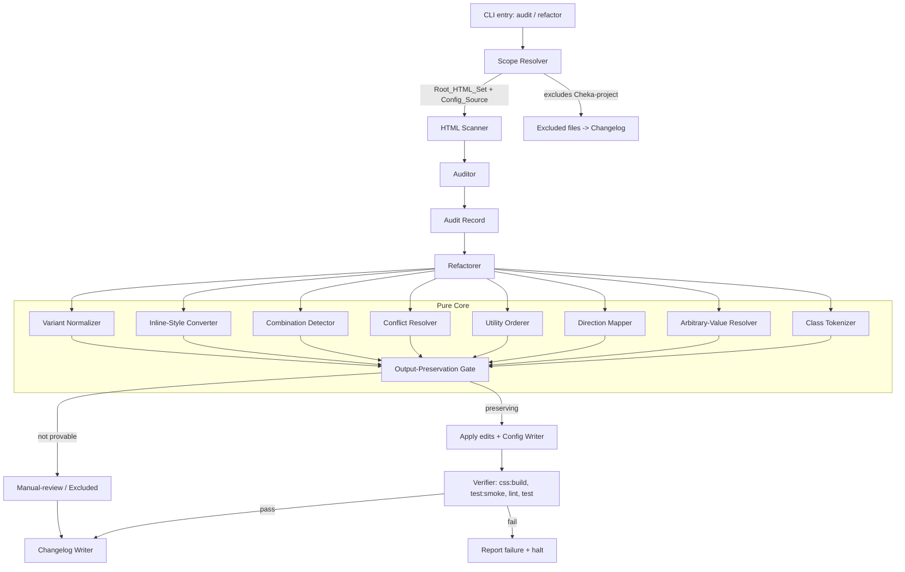

# Design Document

## Overview

The Tailwind CSS Standardization feature is a **Node.js tooling pipeline** that audits, refactors, and normalizes Tailwind CSS v4 usage across the Pencil2 renderer. The project uses a CSS-first Tailwind v4 setup (`css/tailwind-input.css`, no `tailwind.config.js`) compiled by PostCSS into `css/tailwind-output.css`. Utility classes live inline in 47 root-level `.html` files; design tokens live in the `@theme` block; reusable classes live in `@layer components`; dark mode is driven by `@variant dark (&:where([data-theme="dark"], [data-theme="dark"] *))`.

The tool (the **Standardization_Tool**) is built from two cooperating capabilities — the **Auditor** (read-only detection) and the **Refactorer** (output-preserving transformation) — plus a **Verifier** that gates every change behind the existing build and test suites, a **Scope Resolver** that excludes the `Cheka-project/` mirror subtree, and a **Changelog** writer.

The single most important non-functional constraint is **zero observable change**: every transformation must preserve each element's computed CSS in both light and dark themes and across all five breakpoints, or it must not be applied. The design therefore favors a **deterministic, conservative core**: the only changes applied automatically are those the tool can prove are output-preserving by construction (set-preserving reorders, equivalent token substitution, bijective physical→logical mapping, computed-style-equal component extraction). Everything uncertain is retained verbatim and recorded as a manual-review or excluded item.

### Research Notes & Key Findings

The following findings from the existing codebase shape the design:

- **PBT is already supported.** `fast-check@^4.8.0` is a dev dependency. The core normalization logic is pure string/data transformation, which is an ideal PBT target.
- **The smoke suite enforces invariants the tool must keep green.** `tests/smoke.js` `runLegacyCssSmoke()` asserts **zero `<style>` blocks** in every root HTML file and that no legacy CSS file is referenced; `runTailwindOutputSmoke()` asserts the compiled stylesheet exists, is > 1000 bytes, and contains `--color-primary`; `runNoCdnSmoke()` forbids CDN URLs. These map directly to Requirements 7.4, 11.4, and the no-CDN policy.
- **Build/verify commands.** `npm run css:build` (PostCSS + cssnano in production), `npm run test:smoke`, `npm run lint` (ESLint over `main/**`, `preload.js`, `js/pages/*.js`, `tests/**`), and `npm test` (`tests/run-all.js`). These are the gates for Requirement 11.
- **The config source mixes three concerns.** `@theme` tokens, a large `@layer components` block (starting ~line 4061), and a sizeable **carry-forward** legacy CSS region. New tokens/classes must be inserted into the correct region only (Requirement 10).
- **Dark mode is token-driven.** `[data-theme='dark']` overrides custom properties, so most components respond to dark mode automatically through `var(--color-*)`. This means a token-referencing replacement that is light-equivalent is almost always dark-equivalent too — but the tool must still verify both, never assume.
- **Many inline styles are JS-generated.** A large share of `style="..."` occurrences are inside JavaScript template literals (e.g. `style="width:${...}%"`), which are runtime-dynamic and must be excluded from conversion (Requirement 7.2).
- **The mirror subtree is real and substantial.** `Cheka-project/` contains ~142 HTML/CSS files mirroring root files; all must be excluded (Requirement 12).
- **No `tailwind.config.*` exists**, confirming the CSS-first invariant (Requirement 10.3/10.4).

## Architecture

The tool runs as a CLI pipeline under `tools/tailwind-standardize/` and is invoked per directory. It is structured into a **pure core** (deterministic, side-effect-free, the PBT surface) and an **I/O shell** (file system, process execution).



### Execution Model

1. **Scope resolution** — resolve the `Root_HTML_Set` (`*.html` at workspace root) and the `Config_Source`. Explicitly exclude every path under `Cheka-project/`. If the mirror subtree cannot be located, halt before any change (Req 12.5).
2. **Audit phase (read-only)** — scan each root HTML file exactly once, produce an `AuditRecord` grouped by directory (Req 1).
3. **Refactor phase (per directory, transactional)** — for each finding, run the relevant pure transform, pass the result through the **Output-Preservation Gate**, apply only provably-safe edits, then run the **Verifier**. On any verification failure, halt before processing further directories (Req 11.7).
4. **Config writes** — token and component-class definitions are written only into the `@theme` and `@layer components` regions respectively (Req 10).
5. **Changelog** — emit a single changelog covering every processed directory, new tokens/classes, and all manual-review/excluded items (Req 13).

### Output-Preservation Gate (central safety mechanism)

Every candidate edit is validated before it is written. The gate computes the **effective declaration set** of an element before and after the edit. For class-attribute edits this is derived deterministically from the utility→declaration mapping in the configured theme; for component-class extraction and inline-style conversion it compares the resolved declarations (including resolution of `var(--token)` references) in both the light context and the `[data-theme="dark"]` context. If the before/after declaration sets are not provably identical, the edit is rejected, the original markup is retained verbatim, and the element is recorded as a manual-review (or excluded) item. This single gate backs Requirements 2.5, 4.5, 6.4, 9.5, and the preservation halves of 3, 7, and 8.

## Components and Interfaces

All core components are pure and deterministic. They accept plain data and return plain data, with no file system or process access. The I/O shell calls them.

### Scope Resolver

```
resolveScope(workspaceRoot) -> {
  rootHtmlSet: string[],        // absolute paths of *.html at root
  configSource: string,         // path to css/tailwind-input.css
  mirrorSubtree: string | null, // path to Cheka-project/, or null if absent
  excludedFiles: string[],      // every file under the mirror subtree
}
```

- `isInScope(path)` returns `true` only for files in `rootHtmlSet ∪ {configSource}` and `false` for any path under `mirrorSubtree` (Req 12.1, 12.2).
- If `mirrorSubtree` resolves to `null` when the workspace is expected to contain it, the shell halts before any normalization and records the condition (Req 12.5).

### HTML Scanner

```
scan(fileText) -> {
  classOccurrences: ClassOccurrence[], // one per element with a class attribute
  inlineStyles: InlineStyleOccurrence[],
  styleBlocks: StyleBlockOccurrence[],
  dynamicRegions: Range[],  // spans inside <script> / template literals
}
```

Each occurrence carries an **element locator** `{ filePath, line, tag }` that uniquely identifies the element (Req 1.3–1.7). The scanner marks occurrences originating inside `<script>` blocks or JS template literals as `dynamic` so the converter can exclude them (Req 7.2).

### Class Tokenizer

```
tokenize(classAttr) -> ClassToken[]
ClassToken = {
  raw: string,            // e.g. "md:hover:bg-primary"
  variants: string[],     // ["md", "hover"]
  responsiveVariant: string | null,  // "md"
  stateVariant: string | null,       // "hover"
  base: string,           // "bg-primary"
  property: string | null,// resolved CSS property the utility sets
  category: Category,     // layout|spacing|sizing|colors|effects|transforms|uncategorized
  isArbitrary: boolean,   // bracket-notation literal
  arbitraryValue: string | null,
}
serialize(tokens) -> classAttr   // inverse, preserves exact token strings
```

`tokenize`/`serialize` form a round-trip pair so reorders never alter token strings (Req 5.3).

### Arbitrary-Value Resolver

```
resolveArbitrary(token, themeIndex) -> {
  action: 'replace-existing' | 'add-token' | 'retain',
  tokenName?: string,        // existing or proposed token name
  replacement?: ClassToken,  // utility referencing the token/scale
  computedValue: string,     // normalized computed value
}
```

- Normalizes the arbitrary literal to a canonical computed value (e.g. `mt-[16px]` → `1rem` if root font-size context applies) and compares against `themeIndex` (tokens + spacing/sizing scale) by exact computed value (Req 3.1, 3.4).
- A recurrence index (value → set of files) decides `add-token` (≥2 files) vs `retain` + manual-review (<2 files, no token) (Req 3.2, 3.5).

### Direction Mapper

```
PHYSICAL_TO_LOGICAL: Map<string, string>  // pl-*→ps-*, pr-*→pe-*, ml-*→ms-*, mr-*→me-*, left-*→start-*, right-*→end-*, ...
mapPhysical(token) -> { logical: ClassToken } | { retain: true, reason }
```

A total function over physical-direction utilities: any utility without an entry is retained and recorded (Req 8.5). Mapping is value-preserving (only the axis keyword changes), so RTL/LTR computed positions are preserved (Req 8.2, 8.3).

### Utility Orderer

```
order(tokens) -> ClassToken[]
```

Stable sort by category in the sequence layout → spacing → sizing → colors → effects → transforms, then uncategorized. Within a category the original left-to-right order is preserved (Req 5.4, 5.5). Variant-prefixed utilities are placed immediately after their non-prefixed counterpart, responsive variant before state variant (Req 5.2). The output is always a permutation of the input multiset (Req 5.3).

### Conflict Resolver

```
resolveConflicts(tokens) -> {
  kept: ClassToken[],
  removed: ClassToken[],
  undecidable: ClassToken[],   // -> manual-review
}
```

Within one variant+breakpoint context, when two utilities set the same CSS property, the later (winning) one is kept and the overridden one removed; exact-duplicate utilities are de-duplicated to one instance (Req 6.1, 6.3). Utilities under different variant/breakpoint contexts are always retained (Req 6.2). If a deterministic winner cannot be identified, both are retained and the element is recorded for manual review (Req 6.4). The operation is idempotent.

### Combination Detector

```
detectCombinations(occurrences) -> CombinationFinding[]
CombinationFinding = { utilitySet: string[], locations: ElementLocator[] }
```

Combinations are compared as **sets** (order-independent) of ≥2 utilities; a combination appearing at ≥2 distinct locations is a candidate for a component class (Req 1.6, 4.1).

### Component-Class Synthesizer

```
synthesizeComponentClass(utilitySet, componentLayerIndex) -> {
  className: string,           // conforms to existing naming conventions
  declaration: string,         // uses @apply / token references
} | { collision: true }
```

Generates a `@layer components` entry using `@apply` or `var(--token)` references consistent with existing entries (Req 4.2, 4.3). A name collision with a differing definition is reported, never redefined (Req 4.x, 10.8).

### Inline-Style Converter

```
convertInlineStyle(occurrence, themeIndex) -> {
  action: 'convert' | 'exclude',
  utilities?: ClassToken[],
  reason?: string,   // 'dynamic' | 'not-expressible'
}
```

Static styles expressible by existing utilities/tokens with identical computed rendering are converted; dynamic (JS-set) or inexpressible styles are excluded and recorded (Req 7.1, 7.2, 7.3, 7.6).

### Variant Normalizer

```
normalizeVariants(occurrences) -> { edits, manualReview }
```

Uses only configured breakpoint prefixes (`sm: md: lg: xl: 2xl:`); a required bracket-notation breakpoint triggers manual-review instead of introducing an arbitrary value (Req 9.1, 9.2). For groups of same-type elements sharing the same non-variant utility set where at least one declares a `hover:` utility, that hover utility is propagated to the rest of the group (Req 9.3).

### Config Writer (I/O shell)

Writes new tokens **only** into `@theme` and new component classes **only** into `@layer components`; re-expresses carry-forward rules and removes the duplicated legacy rule (Req 10.1, 10.2, 10.6). Halts with an error on identifier collision (Req 10.8) or if a JS-based Tailwind config is detected (Req 10.4).

### Verifier (I/O shell)

```
verify(scope) -> { ok: boolean, failedCommand?: string }
```

Runs `npm run css:build`, then `npm run test:smoke`, `npm run lint`, and `npm test`. Build failure leaves the previous `tailwind-output.css` intact (Req 11.2); lint must stay ≤ the pre-refactor baseline (Req 11.5); any failure reports the failing command and halts before the next directory (Req 11.7).

### Changelog Writer (I/O shell)

Emits a single changelog grouped by directory (including directories with 0 changes), listing new tokens, new component classes, and every manual-review/excluded item with classification and reason; categories are drawn from the predefined normalization category set (Req 13).

## Data Models

```
ElementLocator = { filePath: string, line: number, tag: string }

FindingCategory =
  | 'arbitrary-value' | 'physical-direction' | 'inline-style'
  | 'duplicate-combination' | 'conflict-override'

AuditFinding = {
  category: FindingCategory,
  locator: ElementLocator,
  detail: string,            // e.g. the arbitrary literal, the conflicting utilities
}

SkippedFile = { filePath: string, reason: string }   // read/parse failure (Req 1.2)

AuditRecord = {
  byDirectory: {
    [dirRelPath: string]: {
      findings: AuditFinding[],
      counts: { [category in FindingCategory]: number },
    }
  },
  skippedFiles: SkippedFile[],
  totalFindings: number,
  noFindings: boolean,       // true => explicit "no non-conforming usage" (Req 1.9)
}

NormalizationCategory =
  | 'arbitrary-to-token' | 'magic-number-to-scale' | 'combination-to-component'
  | 'utility-ordering' | 'conflict-removal' | 'inline-style-elimination'
  | 'physical-to-logical' | 'variant-normalization' | 'carry-forward-reexpression'

ChangeRecord = { filePath: string, category: NormalizationCategory, locator: ElementLocator }

TokenDefinition = { name: string, value: string, origin: string }       // origin = file/dir
ComponentClassDefinition = { name: string, declaration: string, origin: string }

ReviewClassification = 'manual-review' | 'excluded'
ReviewReasonCategory =
  | 'no-token-and-rare' | 'name-collision' | 'output-would-change'
  | 'dynamic-inline-style' | 'not-expressible' | 'arbitrary-breakpoint'
  | 'direction-independent-effect' | 'no-logical-equivalent' | 'undecidable-conflict'

ReviewItem = {
  classification: ReviewClassification,
  reasonCategory: ReviewReasonCategory,
  locator: ElementLocator,
  detail: string,
}

Changelog = {
  byDirectory: { [dirRelPath: string]: { changeCounts: Record<NormalizationCategory, number> } },
  newTokens: TokenDefinition[],
  newComponentClasses: ComponentClassDefinition[],
  reviewItems: ReviewItem[],
  mirrorExclusion: { excludedFileCount: number },   // Req 12.3
}
```

The `byDirectory` map always includes every processed directory, even with all-zero counts (Req 13.2).

## Correctness Properties

*A property is a characteristic or behavior that should hold true across all valid executions of a system — essentially, a formal statement about what the system should do. Properties serve as the bridge between human-readable specifications and machine-verifiable correctness guarantees.*

The normalization core is pure and deterministic, which makes it an ideal property-based-testing surface. The properties below are consolidated from the prework analysis (redundant preservation/ordering/conflict criteria merged). Each is universally quantified and references the acceptance criteria it validates. External-process verification (the build/test suites) and human-intent judgments are covered by the Testing Strategy as integration/example tests, not as properties.

### Property 1: Occurrence detection is complete, coverage-exact, and locator-accurate

*For any* Root_HTML_Set, the Auditor visits each file exactly once and, for every Arbitrary_Value, Physical_Direction_Utility, and Inline_Style present, records exactly one finding carrying an element locator (line number and tag name) that resolves back to the originating element.

**Validates: Requirements 1.1, 1.3, 1.4, 1.5**

### Property 2: Audit resilience under unreadable files

*For any* file set in which an arbitrary subset cannot be read or parsed, the audit completes without aborting, records each unreadable file as a skipped file with a failure reason, and still scans every readable file.

**Validates: Requirements 1.2**

### Property 3: Duplicate-combination detection is order-independent and exhaustive

*For any* set of two or more utilities that appears (in any declaration order) at two or more distinct element locations, the Auditor records exactly one duplicate-combination finding listing every location where it occurs.

**Validates: Requirements 1.6**

### Property 4: Conflict findings identify the conflicting utilities

*For any* class attribute containing two utilities that set the same CSS property under the same variant and breakpoint context, the Auditor records a conflict finding with the element locator and the specific conflicting utility classes.

**Validates: Requirements 1.7**

### Property 5: Audit aggregation is sound

*For any* set of findings, the per-directory per-category counts in the audit record sum to the total number of findings of that category across all files.

**Validates: Requirements 1.8**

### Property 6: Output-preservation safety gate

*For any* candidate normalization edit, if the edit would change the affected element's effective computed declaration set in either the light context or the `[data-theme="dark"]` context (at any configured breakpoint or interaction state), then the original markup is retained byte-for-byte and the element is recorded as a manual-review (or excluded) item; otherwise the edit may be applied.

**Validates: Requirements 2.1, 2.3, 2.5, 4.4, 4.5, 6.5, 7.6, 9.4, 9.5**

### Property 7: Utility ordering is a stable, category-sequenced permutation

*For any* class attribute, the reordered output is a permutation of the original token multiset (no token added, removed, or duplicated), ordered by the category sequence layout → spacing → sizing → colors → effects → transforms with uncategorized utilities last, where each variant-prefixed utility is placed immediately after its non-prefixed counterpart (responsive variant before state variant) and utilities sharing a category — and uncategorized utilities among themselves — preserve their original left-to-right relative order.

**Validates: Requirements 5.1, 5.2, 5.3, 5.4, 5.5**

### Property 8: Conflict and duplicate resolution is correct, idempotent, and preserving

*For any* class attribute, conflict resolution keeps exactly the winning utility for each same-property/same-context group, removes the overridden one, retains all same-property utilities that live under different variant/breakpoint contexts, reduces exact-duplicate utilities to a single instance, leaves both utilities unchanged and records a manual-review item when no deterministic winner exists, preserves the element's effective computed declarations, and yields no further change when applied a second time.

**Validates: Requirements 6.1, 6.2, 6.3, 6.4, 6.5**

### Property 9: Arbitrary-value substitution is value-equivalent and threshold-correct

*For any* Arbitrary_Value or magic-number value, if its normalized computed value equals an existing Design_Token or configured spacing/sizing scale entry, it is replaced by the utility referencing that token/scale with the computed value preserved; if it has no matching token and recurs in two or more files, a new Design_Token is created and every occurrence is replaced; and if it has no matching token and recurs in fewer than two files, it is retained and recorded as a manual-review item identifying the file, element context, and value.

**Validates: Requirements 3.1, 3.2, 3.3, 3.4, 3.5**

### Property 10: Generated identifiers conform to conventions and never overwrite differing definitions

*For any* new Design_Token or component class the tool generates, its name conforms to the established naming convention (casing, prefix, delimiter) of existing entries; and *for any* proposed identifier that matches an existing entry whose definition differs, the tool does not redefine the existing entry and records the collision (as a manual-review item or halting error).

**Validates: Requirements 3.6, 3.7, 4.3, 10.8**

### Property 11: Component-class consolidation is equivalent and convention-conforming

*For any* utility combination appearing at two or more locations whose component-class substitution preserves every affected element's computed declarations, the tool defines exactly one component class — expressed with `@apply` or `var(--token)` references consistent with existing Component_Layer entries — and replaces each occurrence with it.

**Validates: Requirements 4.1, 4.2**

### Property 12: Physical→logical mapping is total and position-preserving

*For any* Physical_Direction_Utility, if it has a Logical_Property_Utility equivalent it is replaced by that equivalent with the inline-start, inline-end, top, and bottom computed positions preserved in both the RTL and LTR contexts; and if it has no logical equivalent it is retained unchanged and recorded as an excluded item identifying the file, utility, and reason.

**Validates: Requirements 8.1, 8.2, 8.3, 8.5**

### Property 13: Inline-style elimination invariants hold

*For any* conversion run over the Root_HTML_Set: every static inline style expressible by existing utilities/tokens with identical computed rendering is replaced; every dynamic (JS-set) or inexpressible static inline style is retained and recorded as an excluded item with its element and reason category; the resulting count of `<style>` blocks is zero; and the count of remaining `style` attributes equals the count of recorded excluded items.

**Validates: Requirements 7.1, 7.2, 7.3, 7.4, 7.5, 7.6**

### Property 14: Variant normalization stays within the configured system

*For any* normalization output, every introduced responsive prefix belongs to the configured set (`sm: md: lg: xl: 2xl:`); any case that would require a bracket-notation breakpoint retains the original markup and is recorded as a manual-review item; and for any group of same-type elements sharing the same non-variant utility set in which at least one element declares a `hover:` utility, that hover utility is present on every element of the group after normalization.

**Validates: Requirements 9.1, 9.2, 9.3**

### Property 15: Configuration changes are contained in the CSS-first source

*For any* set of new Design_Tokens and component classes, every token is written only within the `@theme` block, every component class only within the `@layer components` block, and any dark-mode styling is expressed only through the existing `@variant dark` / `[data-theme="dark"]` mechanism — with no token or component definition placed in any other file or location and no alternative dark-mode mechanism introduced.

**Validates: Requirements 10.1, 10.2, 10.5**

### Property 16: JavaScript-based Tailwind configuration is rejected

*For any* project state in which a `tailwind.config.js` or other JavaScript-based Tailwind configuration is detected, the tool halts the configuration change, produces an error indicating JS-based configuration is not permitted, and leaves the Config_Source unmodified.

**Validates: Requirements 10.4**

### Property 17: Carry-forward rules are re-expressed and recorded

*For any* Carry_Forward_CSS rule whose styling is duplicated by a Design_Token or Component_Layer entry, the tool re-expresses the rule as that token/component, removes the duplicated carry-forward rule, and records a changelog entry identifying the original rule and its replacement.

**Validates: Requirements 10.6, 10.7**

### Property 18: Refactoring scope is exclusive to root files and the config source

*For any* run, the set of modified files is a subset of the Root_HTML_Set plus the Config_Source; no file under the Mirror_Subtree is modified; any mirror file selected for processing is skipped and left unchanged; and the changelog records the mirror exclusion together with the count of excluded files.

**Validates: Requirements 12.1, 12.2, 12.3, 12.4**

### Property 19: Changelog is complete and sound

*For any* run, the changelog includes every processed directory (recording count 0 where nothing changed), lists every new Design_Token and every new component class with its originating file or directory, lists every manual-review and excluded item with its classification and reason category, and uses only categories drawn from the predefined normalization category set.

**Validates: Requirements 13.2, 13.3, 13.4, 13.5, 13.6**

## Error Handling

| Condition | Requirement | Behavior |
|---|---|---|
| Root HTML file unreadable/unparsable | 1.2 | Record as skipped file with reason; continue scanning remaining files. |
| Normalization edit not provably output-preserving | 2.5, 4.5, 6.4, 9.5 | Retain original markup verbatim; record manual-review item; never apply. |
| Arbitrary value with no token, recurs < 2 files | 3.5 | Retain; record manual-review item with file/context/value. |
| Token name collision with differing value | 3.7, 10.8 | Do not redefine; record collision (manual-review) / halt definition with error. |
| Bracket-notation breakpoint required | 9.2 | Retain original; record manual-review item. |
| JS-based Tailwind config detected | 10.4 | Halt config change; emit error; leave Config_Source unmodified. |
| `npm run css:build` non-zero / build errors | 11.2 | Report failed command; leave previous `tailwind-output.css` unchanged. |
| `test:smoke` / `lint` (> baseline) / `test` failure | 11.7 | Report which command failed; halt before further directory refactoring. |
| Mirror subtree cannot be located/resolved | 12.5 | Halt before any normalization; record the unresolved-scope condition in the changelog. |
| Changelog cannot be produced | 13.7 | Retain all refactored files unchanged; return an error indicating the changelog was not generated. |

All verification runs operate on a per-directory transaction boundary: edits for a directory are only finalized after the Verifier passes; a failure halts the pipeline with the prior good state intact.

## Testing Strategy

### Dual approach

- **Property-based tests** (using `fast-check`, already a dev dependency) verify the universal properties of the pure core (Properties 1–19). Generators produce randomized class attributes, token tables, HTML fragments with embedded findings, file sets, and carry-forward rule sets.
- **Unit / example tests** cover concrete scenarios and boundary cases that are not universal: the explicit no-findings audit record (Req 1.9), a human-flagged direction-independent physical utility retained as excluded (Req 8.4), an unresolvable mirror subtree halt (Req 12.5), and a changelog-write failure path (Req 13.7).
- **Integration tests** cover the external-process gates that do not vary meaningfully with input: `npm run css:build` succeeds and emits the stylesheet (Req 11.1, 11.2), `npm run test:smoke` passes (Req 11.3), `npm run lint` stays at or below the recorded baseline (Req 11.5), `npm test` passes (Req 11.6), and a forced failure reports the correct command and halts (Req 11.7).
- **Smoke checks** reuse the existing `tests/smoke.js` invariants: compiled stylesheet contains `--color-primary` (Req 11.4), zero `<style>` blocks in root HTML (Req 7.4), no JS Tailwind config present (Req 10.3), and no-CDN policy.

### Property test configuration

- Each property is implemented as a **single** `fast-check` property test running a **minimum of 100 iterations**.
- Generators must cover edge inputs by construction: empty/whitespace class attributes, non-ASCII/Arabic text, RTL content, attribute-bearing tags, duplicate and shuffled utilities, mixed light/dark token references, and inline styles inside JS template literals.
- Each property test is tagged with a comment referencing its design property in the form:
  `// Feature: tailwind-css-standardization, Property {number}: {property_text}`

### Verification flow per directory

1. Apply only gate-approved edits for the directory.
2. Run `npm run css:build`; on failure, restore and report (Req 11.2).
3. Run `npm run test:smoke`, `npm run lint`, `npm test`; on any failure, report the failed command and halt (Req 11.7).
4. On success, append the directory's changes to the changelog and proceed to the next directory.

### Out of scope for property testing

Rendered-pixel comparison (Req 2.1/2.3 at the visual level), interaction equivalence (Req 2.2), and the breakpoint/theme enumeration of the comparison harness (Req 2.4) are validated through the Output-Preservation Gate property plus a small set of representative integration checks on actual refactored pages, since pixel/DOM rendering depends on the Electron runtime rather than the pure core.
