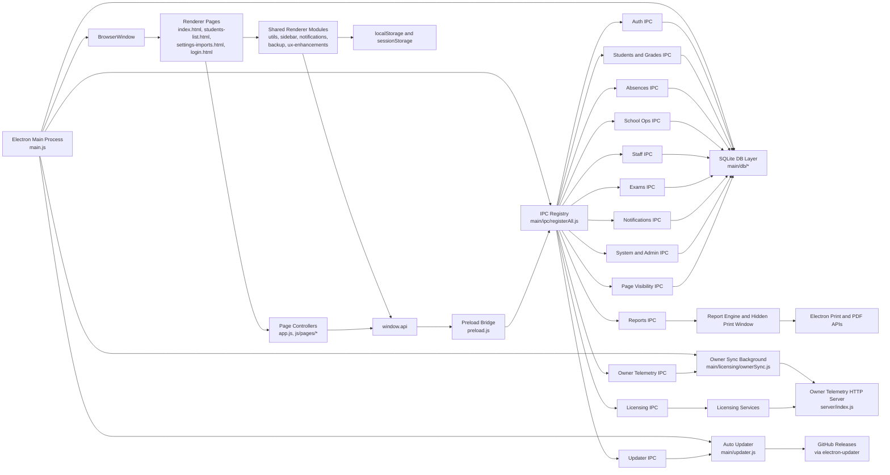

# Components Architecture Breakdown: Runtime App Scope

## Summary

This project is a multi-page Electron desktop application with a layered, multi-process architecture:

- Electron main process boots the app, owns the SQLite connection, registers IPC handlers, starts licensing sync, and initializes auto-update.
- Preload bridge exposes a constrained `window.api` surface to renderer pages.
- Renderer pages are plain HTML pages with shared UI modules plus page-specific controllers.
- Domain logic is grouped behind IPC modules that mostly talk directly to a single local SQLite database.
- A separate owner telemetry HTTP server exists in the repo and is used by the licensing and telemetry subsystem.

Primary architectural pattern in use:

- Electron main/preload/renderer split
- Layered architecture
- Page-controller style renderer
- Service-oriented backend modules behind IPC

This is not a strict MVC application and not a microservices architecture.

## Entry Points

| Entry point | Role | Key files |
| --- | --- | --- |
| Electron app bootstrap | Opens DB, registers IPC, starts sync and updater, creates main window | [`main.js`](main.js) |
| Secure renderer bridge | Exposes `window.api.*` contract from main to renderer | [`preload.js`](preload.js) |
| Dashboard renderer | Main HTML shell plus dashboard controller | [`index.html`](index.html), [`app.js`](app.js), [`js/pages/dashboard-init.js`](js/pages/dashboard-init.js) |
| Login renderer | Auth entry for privileged actions | [`login.html`](login.html) |
| Other page renderers | Domain pages such as students, imports, grades, and teachers | [`students-list.html`](students-list.html), [`js/pages/students-list.js`](js/pages/students-list.js), [`js/pages/settings-imports.js`](js/pages/settings-imports.js), [`js/pages/grades-sheets.js`](js/pages/grades-sheets.js), [`js/pages/teachers-performance.js`](js/pages/teachers-performance.js) |
| Owner telemetry server | Separate Node HTTP service for fleet and license telemetry | [`server/index.js`](server/index.js) |

## Major Components

| Component | Responsibilities | Depends on / talks to | Key files |
| --- | --- | --- | --- |
| Main process bootstrap | App lifecycle, BrowserWindow creation, DB init, IPC registration, background services | DB layer, IPC registry, owner sync, updater | [`main.js`](main.js) |
| Preload API bridge | Safe renderer access to IPC via `window.api` | `ipcRenderer`, main-process handlers | [`preload.js`](preload.js) |
| Renderer shared shell | Auth guard, role gating, page visibility, sidebar injection, notifications UI, backup UI, theme, shortcuts, quick-nav | `window.api`, DOM, `localStorage`, `sessionStorage` | [`js/utils.js`](js/utils.js), [`js/sidebar.js`](js/sidebar.js), [`js/notifications.js`](js/notifications.js), [`js/backup.js`](js/backup.js), [`js/ux-enhancements.js`](js/ux-enhancements.js) |
| Renderer page controllers | Page-specific queries, filtering, rendering, import/export, print actions | Shared shell, `window.api.*`, local vendor libs | [`app.js`](app.js), [`js/pages`](js/pages) |
| IPC registry | Central composition point for backend capabilities | Individual IPC modules | [`main/ipc/registerAll.js`](main/ipc/registerAll.js) |
| Auth and session subsystem | Login, session binding per renderer sender, role enforcement helpers | Users table, password hashing | [`main/ipc/auth.js`](main/ipc/auth.js), [`main/auth/password.js`](main/auth/password.js) |
| Student and academic data IPC | Students, grades, settings, stats, lookup catalogs | SQLite | [`main/ipc/students.js`](main/ipc/students.js) |
| Absence IPC | Student absences, summaries, section and month stats, top absentee queries, correspondence | SQLite | [`main/ipc/absences.js`](main/ipc/absences.js) |
| School operations IPC | Student files and student movement workflows | SQLite | [`main/ipc/schoolOps.js`](main/ipc/schoolOps.js) |
| Staff IPC | Teachers and teacher absences | SQLite | [`main/ipc/staff.js`](main/ipc/staff.js) |
| Exams IPC | Exams, proctors, rooms, supervised tests | SQLite | [`main/ipc/exams.js`](main/ipc/exams.js) |
| System and admin IPC | Users, logs, print and export helpers, backup and restore, page visibility defaults | SQLite, Electron dialogs and printing, filesystem | [`main/ipc/system.js`](main/ipc/system.js) |
| Page visibility IPC | Persistent page enable and disable map for admin-controlled navigation | SQLite | [`main/ipc/pageVisibility.js`](main/ipc/pageVisibility.js) |
| Reports subsystem | Unified document assembly, identity, letterhead, footer, security, printing via hidden window | Print window, report fragments, identity storage | [`main/ipc/reports.js`](main/ipc/reports.js), [`main/reports/engine.js`](main/reports/engine.js), [`main/print-window.js`](main/print-window.js) |
| Notifications subsystem | Event validation, channel routing, template rendering, persistence, delivery to toast, center, native, and email adapters | Notifications DB table, BrowserWindow event delivery | [`main/ipc/notifications.js`](main/ipc/notifications.js), [`main/notifications/dispatcher.js`](main/notifications/dispatcher.js), [`main/notifications/store.js`](main/notifications/store.js), [`main/notifications/delivery.js`](main/notifications/delivery.js) |
| Licensing subsystem | Device fingerprinting, offline activation, plan and device limits, grace-period validation | SQLite licensing tables, owner sync, app version, device info | [`main/ipc/licensing.js`](main/ipc/licensing.js), [`main/licensing/service.js`](main/licensing/service.js), [`main/licensing/trialService.js`](main/licensing/trialService.js), [`main/licensing/deviceFingerprint.js`](main/licensing/deviceFingerprint.js), [`main/licensing/offlineKey.js`](main/licensing/offlineKey.js) |
| Owner sync and telemetry client | Stores sync config, queues and flushes telemetry events, fetches remote overview and devices | SQLite owner-sync tables, remote HTTP service | [`main/ipc/ownerTelemetry.js`](main/ipc/ownerTelemetry.js), [`main/licensing/ownerSync.js`](main/licensing/ownerSync.js) |
| Auto-updater | Checks GitHub releases, downloads updates, pushes updater status to renderer | `electron-updater`, GitHub Releases | [`main/updater.js`](main/updater.js), [`main/ipc/updater.js`](main/ipc/updater.js) |
| Database layer | Holds persistent state, schema creation, migrations, DB path management | `better-sqlite3`, Electron `userData` path | [`main/db/context.js`](main/db/context.js), [`main/db/init.js`](main/db/init.js), [`main/db/schema.js`](main/db/schema.js), [`main/db/migrations.js`](main/db/migrations.js) |
| Owner telemetry server | Receives registration and heartbeat events and serves device overview and device list | HTTP, JSON file store, token auth | [`server/index.js`](server/index.js) |

## Responsibilities And Relationships

### 1. Main process layer

[`main.js`](main.js) is the top-level orchestrator. On `app.whenReady()` it:

1. initializes the SQLite database
2. registers all IPC handlers
3. starts owner-sync background behavior
4. creates the main BrowserWindow
5. initializes auto-update

This makes the main process the operational core of the application.

### 2. Preload boundary

[`preload.js`](preload.js) is the supported renderer-to-main gateway.

It exposes grouped APIs such as:

- `students`, `grades`, `absences`, `teachers`, `exams`
- `reports`, `notifications`, `system`
- `auth`, `users`
- `licensing`, `ownerTelemetry`
- `updater`

It also exposes push-style subscriptions for:

- `notifications.onToast`
- `notifications.onCenterUpdate`
- `updater.onStatus`

So the preload layer acts as both:

- a request/response IPC facade
- an event subscription bridge

### 3. Renderer layer

The renderer is a multi-page app without a bundler. Each HTML page directly includes shared scripts and optionally a page-specific controller.

Shared renderer responsibilities:

- auth and role guard
- page visibility filtering
- sidebar injection and navigation
- notification bell, dropdown, and toasts
- backup modal and workflow
- theme, keyboard shortcuts, and quick navigation
- print preview and update UI helpers

Representative page responsibilities:

- [`app.js`](app.js): dashboard data load, school-year switching, stats, charts, owner telemetry summary
- [`js/pages/students-list.js`](js/pages/students-list.js): search, filter, sort, pagination, modal details, print and export
- [`js/pages/settings-imports.js`](js/pages/settings-imports.js): file ingestion, XLSX and FET parsing, bulk persistence, backup actions
- [`js/pages/grades-sheets.js`](js/pages/grades-sheets.js): class and subject retrieval, student list loading, report printing
- [`js/pages/teachers-performance.js`](js/pages/teachers-performance.js): teacher metrics derived from grades, absences, and settings

### 4. Backend domain modules

The backend logic is grouped by school-management domain and wired into IPC.

Important relationship: these modules are not isolated service classes. In most cases they:

- read and write directly with SQL
- enforce authorization at the handler
- return data straight to renderer callers

That means the effective layering is:

```text
renderer -> preload -> IPC handler -> SQL
```

rather than:

```text
renderer -> controller -> service -> repository
```

### 5. Persistence layer

The app uses a single SQLite database located under Electron `userData`.

Core tables include:

- `students`
- `grades`
- `absences`
- `correspondence`
- `student_files`
- `student_movements`
- `teachers`
- `teacher_absences`
- `exams`
- `exam_proctors`
- `exam_rooms`
- `tests`
- `settings`
- `system_logs`
- `users`
- `notifications`
- additional licensing, owner-sync, and page-visibility tables

This database is the main source of truth for the runtime application.

### 6. Cross-cutting enforcement

Authorization is split across two layers:

- renderer-side gating in [`js/utils.js`](js/utils.js)
- main-side enforcement in IPC handlers via `requireRole(...)`

Renderer restrictions are convenience and navigation controls. Main-process checks are the actual enforcement boundary.

## Data And Control Flow

### Core app boot flow

1. Electron starts [`main.js`](main.js)
2. DB opens and schema and migrations run
3. IPC handlers are registered
4. Main window loads [`index.html`](index.html)
5. Shared renderer scripts initialize auth, theme, sidebar, and notifications
6. Dashboard controller requests data through `window.api`
7. Main-process IPC queries SQLite and returns results
8. Renderer renders stats, charts, and cards

### Standard page request flow

```text
HTML page
  -> shared renderer scripts initialize shell
  -> page controller attaches events
  -> page controller calls window.api.<domain>.<method>()
  -> preload forwards with ipcRenderer.invoke(...)
  -> matching ipcMain.handle(...) runs
  -> handler queries or updates SQLite or delegates to a service module
  -> result returns to renderer
  -> DOM updates, toast, modal, or table render
```

### Import flow

1. `settings-imports.html` loads [`js/pages/settings-imports.js`](js/pages/settings-imports.js)
2. User selects files or drops them into the import UI
3. Renderer dynamically loads bundled `XLSX` if needed
4. Renderer parses and normalizes spreadsheet or FET data
5. Renderer calls bulk IPC methods such as:
   - `students.addBulk`
   - `grades.saveBulk`
   - `absences.saveBulk`
6. Main handlers perform transactional SQLite writes
7. Renderer logs system events and updates UI state

### Report and print flow

1. Renderer page calls `window.api.reports.printDocument(...)`
2. [`main/ipc/reports.js`](main/ipc/reports.js) forwards to the report engine
3. Report engine assembles:
   - letterhead
   - footer
   - security bar and reference
   - watermark
   - body HTML
4. Engine calls `printHTML(...)`
5. [`main/print-window.js`](main/print-window.js) creates a hidden `BrowserWindow`
6. The window loads generated HTML with the app CSS
7. Electron prints, previews, or exports PDF

### Notification flow

1. Renderer or backend triggers `notifications:send`
2. Notification dispatcher validates and normalizes the event
3. Router resolves channels
4. Templates render channel-specific output
5. Center notifications are persisted in SQLite
6. Delivery adapters emit to:
   - renderer toast event
   - renderer notification center event
   - native and email adapters where configured
7. [`js/notifications.js`](js/notifications.js) updates badge, panel, and toast UI

### Licensing and owner telemetry flow

1. Main app starts owner-sync background work
2. Licensing service computes device fingerprint and local license state
3. Activation and validation events are queued for owner sync
4. Owner sync posts to telemetry endpoints such as:
   - `/api/telemetry/register`
   - `/api/telemetry/heartbeat`
5. Admin dashboard requests telemetry overview and devices via ownerTelemetry IPC
6. Main app fetches remote telemetry summary and returns it to renderer

### Auto-update flow

1. Main process initializes `electron-updater`
2. Updater checks GitHub Releases
3. Updater emits status events to renderer on `updater:status`
4. Renderer UX module listens via `window.api.updater.onStatus(...)`
5. User can trigger download and install through updater IPC methods

## Visual Representation



## External Integrations

| Integration | How it is used | Evidence |
| --- | --- | --- |
| `better-sqlite3` | Local embedded database | [`package.json`](package.json), [`main/db/init.js`](main/db/init.js) |
| Electron IPC, `BrowserWindow`, dialog, and print APIs | Core desktop runtime, hidden print windows, save dialogs, app lifecycle | [`main.js`](main.js), [`preload.js`](preload.js), [`main/print-window.js`](main/print-window.js), [`main/ipc/system.js`](main/ipc/system.js) |
| `electron-updater` plus GitHub Releases | Update checks, downloads, install | [`main/updater.js`](main/updater.js), [`package.json`](package.json) |
| Owner telemetry HTTP service | Device registration, heartbeat, overview and devices dashboard | [`main/licensing/ownerSync.js`](main/licensing/ownerSync.js), [`server/index.js`](server/index.js) |
| Local vendor `Chart.js` | On-demand chart rendering in renderer | [`app.js`](app.js), [`vendor/chart.min.js`](vendor/chart.min.js) |
| Local vendor `XLSX` | On-demand import and export parsing | [`app.js`](app.js), [`js/pages/settings-imports.js`](js/pages/settings-imports.js), [`vendor/xlsx.full.min.js`](vendor/xlsx.full.min.js) |
| Local Font Awesome and bundled fonts | UI icons and fonts | [`index.html`](index.html), [`vendor/fontawesome/css/all.min.css`](vendor/fontawesome/css/all.min.css), [`vendor/fonts`](vendor/fonts) |
| Google Fonts CDN and Cloudflare Font Awesome CDN | Used by generated print documents | [`main/print-window.js`](main/print-window.js) |
| Figma MCP capture script | Loaded on dashboard page only | [`index.html`](index.html) |

## Existing Public Interfaces

### Renderer-to-main public interface

The effective internal API surface is `window.api` from [`preload.js`](preload.js).

Major namespaces exposed:

- `students`, `classes`, `subjects`
- `grades`, `stats`
- `absences`, `absence`, `correspondence`
- `studentFiles`, `studentMovements`
- `teachers`, `teacherAbsences`, `teacherAbsence`
- `exams`, `examProctors`, `proctors`, `examRooms`, `rooms`, `tests`, `timetable`
- `reports`
- `systemLogs`, `system`
- `auth`, `users`
- `licensing`, `ownerTelemetry`
- `notifications`
- `updater`
- `pageVisibility`

This bridge is the main contract boundary between renderer code and privileged backend logic.

## Important Changes Or Additions To Public APIs, Interfaces, Or Types

None. This document is an analysis of the existing architecture only.

## Verification Scenarios Covered

The breakdown was grounded against these runtime scenarios:

1. Boot scenario
   - verified app startup path from Electron entry to first renderer window
2. IPC boundary scenario
   - verified `window.api` namespaces and matching registered IPC modules
3. Persistence scenario
   - verified that core business domains persist to a single SQLite DB
4. Auth and authorization scenario
   - verified renderer gating plus main-process role enforcement split
5. Print and report scenario
   - verified report engine to hidden-window print and export pipeline
6. Notification push scenario
   - verified request/response IPC plus event push back into renderer
7. Telemetry scenario
   - verified separate owner telemetry server and app-side client usage
8. Update scenario
   - verified main-process updater with renderer status subscription

## Assumptions And Defaults Chosen

- Scope is runtime app only.
- Included:
  - Electron main process
  - preload bridge
  - renderer pages and shared UI modules
  - SQLite data layer
  - licensing, reports, notifications, updater
  - owner telemetry server because the app is wired to it
- Excluded from the breakdown:
  - tests
  - generated timetable output files
  - one-off scripts
  - local skill folders
  - build artifacts
- `firebase-config.js` exists, but it is not wired into the runtime entrypoints covered here.
- The architecture reflects what is currently implemented, including legacy compatibility aliases in the preload API surface.
