# Pencil2 Database Schema

**Engine:** SQLite (`better-sqlite3`)  
**Connection:** `main/db/context.js` — WAL mode, FK enforcement, busy_timeout=5000ms  
**Init:** `main/db/schema.js` (initial `createTables()`) + `main/db/migrations.js` (evolving schema via `schema_migrations`)

---

## 🧭 Entity-Relationship Diagram

```mermaid
erDiagram
    %% ===== CORE =====
    students {
        int id PK
        text code UK
        text full_name
        text family_name
        text birth_date
        text birth_place
        text gender
        text section
        text school_year
        text status
        text registration_type
        datetime created_at
    }
    grades {
        int id PK
        int student_id FK
        text student_code
        int teacher_id FK
        text subject
        real grade
        int semester
        text teacher_name
        text level
        text section
        text school_year
        datetime created_at
    }
    absences {
        int id PK
        int student_id FK
        text student_code
        date absence_date
        text month
        text absence_type
        int hours
        real days
        text reason
        text school_year
        datetime created_at
    }
    correspondence {
        int id PK
        int student_id FK
        text student_code
        text letter_type
        date letter_date
        int total_hours
        text school_year
        int printed
        datetime created_at
    }
    student_files {
        int id PK
        int student_id FK
        text doc_key
        int is_present
        text school_year
        datetime updated_at
    }
    student_movements {
        int id PK
        int student_id FK
        text movement_type
        text from_section
        text to_section
        date movement_date
        text notes
        text school_year
        datetime created_at
    }
    student_profile_data {
        int id PK
        int student_id
        text student_code
        text tab_key
        text data_json
        text school_year
        datetime updated_at
        text updated_by
    }
    student_risk_snapshot {
        int id PK
        int student_id FK
        text student_code
        int risk_score
        text risk_level
        text school_year
        datetime updated_at
        text updated_by
    }
    student_orientation {
        int id PK
        text student_code
        text full_name
        text gender
        text section
        text level
        text origin_stream
        text choice_1
        text choice_2
        text choice_3
        text assigned_stream
        text decision_status
        real average
        int rank_num
        text notes
        text school_year
        datetime created_at
        datetime updated_at
    }

    %% ===== FACULTY =====
    teachers {
        int id PK
        text ppr UK
        text cin
        text full_name
        text full_name_fr
        text subject
        text specialty_subject
        text gender
        text birth_date
        text birth_place
        text phone
        text email
        text address
        text grade
        text cadre
        int echelon
        text hire_date
        text marital_status
        text function_title
        text position
        text statut
        text diploma_school
        text diploma_professional
        text seniority_admin
        text seniority_grade
        text echelon_date
        text titularization_date
        real total_hours
        real overtime_hours
        real num_classes
        int is_surplus
        text source
        text school_year
        int active
        datetime created_at
    }
    teacher_aliases {
        int id PK
        int teacher_id FK
        text alias_name
        text alias_normalized
        text source
        text school_year
        datetime created_at
    }
    teacher_absences {
        int id PK
        int teacher_id FK
        date absence_date
        text reason
        int justified
        text replacement_teacher
        text school_year
        datetime created_at
    }
    staff_attendance {
        int id PK
        int teacher_id FK
        text teacher_name
        text subject
        date attendance_date
        text type
        int late_duration
        text arrival_time
        text reason
        text notes
        text absence_period
        text school_year
        datetime created_at
    }

    %% ===== EXAMS =====
    exams {
        int id PK
        text title
        text section
        text subject
        date exam_date
        text exam_time
        text school_year
        datetime created_at
    }
    exam_proctors {
        int id PK
        int exam_id FK
        int teacher_id FK
        text teacher_name
        text teacher_name_fr
        text room
        text school_year
        text date
        text session
        text cin
        text som
        text gender
        text specialty
        text workplace
        datetime created_at
    }
    exam_rooms {
        int id PK
        text room_name
        int capacity
        text equipment
        text school_year
        datetime created_at
    }
    exam_invitations {
        int id PK
        text school_year
        int teacher_id FK
        text teacher_name
        datetime sent_at
        text notes
        datetime created_at
    }
    exam_attendance {
        int id PK
        text school_year
        text session_key
        text session_label
        text session_date
        int teacher_id FK
        text teacher_name
        text role
        text status
        text notes
        datetime recorded_at
    }
    exam_config_data {
        int id PK
        text school_year
        text config_key
        text data_json
        datetime updated_at
    }
    exam_count_rules {
        text level_code PK
        text subject PK
        int exam_count
        datetime updated_at
    }
    tests {
        int id PK
        text title
        text section
        text subject
        int teacher_id FK
        text teacher_name
        text status
        date test_date
        text school_year
        datetime created_at
    }

    %% ===== SUPPORT =====
    compensation_tracking {
        int id PK
        date absence_date
        text teacher_name
        int teacher_id FK
        text section
        text period_slot
        text period_time
        text subject
        int compensated
        text compensated_date
        text reason
        text notes
        text school_year
        datetime created_at
    }
    support_sessions {
        int id PK
        int teacher_id FK
        text teacher_name
        text subject
        text section
        text room
        text session_date
        text time_from
        text time_to
        real duration_hours
        text attendance_status
        text school_year
        text created_at
    }

    %% ===== TAGS & LOGS =====
    system_tags {
        int id PK
        text tag_date
        text entity_type
        int entity_id
        text entity_name
        text tag_key
        text tag_label
        text details
        text note_group
        text note_text
        text school_year
        datetime created_at
    }
    system_logs {
        int id PK
        text action
        text details
        text entity_type
        text entity_id
        datetime created_at
    }
    inspectors {
        int id PK
        text first_name
        text last_name
        text specialty
        text phone
        text email
        text status
        text last_visit_date
        text notes
        text school_year
        datetime created_at
    }
    notifications {
        text id PK
        text type
        text severity
        text title
        text body
        text icon
        int read
        int created_at
        text meta
    }
    name_aliases {
        int id PK
        text entity_type
        int canonical_id
        text alias_text
        text alias_normalized
        text source
        text school_year
        real confidence
        text created_at
    }

    %% ===== TIMETABLE =====
    timetable_data {
        int id PK
        text school_year
        text data_json
        datetime updated_at
    }

    %% ===== INSTITUTION =====
    institution_config {
        int id PK
        text code_etablissement
        text massar_code
        text institution_name
        int setup_completed
        text setup_mode
        text setup_device_hash
        int onboarding_version
        datetime onboarding_completed_at
        datetime created_at
        datetime updated_at
    }
    device_otp {
        int id PK
        text otp_hash
        text massar_code
        text created_by_device
        datetime expires_at
        text used_by_device
        datetime used_at
        text status
    }
    linked_devices {
        int id PK
        text device_hash UK
        text device_name
        text os_platform
        text app_version
        text linked_by
        datetime linked_at
        datetime last_seen_at
        datetime revoked_at
        text status
    }
    school_identity {
        text key PK
        text value
        int updated_at
    }
    school_events {
        int id PK
        text event_date
        text event_type
        text details
        text event_time
        text school_year
        datetime created_at
    }
    settings {
        text key PK
        text value
    }

    %% ===== USERS =====
    users {
        int id PK
        text name
        text email UK
        text role
        text password_hash
        text firebase_uid UK
        text auth_source
        int email_verified
        text invite_status
        datetime last_login_at
        text last_auth_mode
        text pin_hash
        int pin_failed_attempts
        int disabled
        int must_change_password
        datetime created_at
    }
    page_visibility {
        text page_key PK
        int is_visible
        datetime updated_at
    }
    page_role_access {
        text page_key PK
        text role PK
        int allowed
        datetime updated_at
    }
    app_meta {
        text key PK
        text value
    }

    %% ===== LICENSING =====
    license_plans {
        text code PK
        text name
        int max_devices
        datetime created_at
    }
    licenses {
        int id PK
        text license_key_hash UK
        text key_hint
        text plan_code FK
        text status
        datetime expires_at
        int offline_grace_days
        int requires_online_validation
        datetime last_validated_at
        text metadata
        datetime created_at
        datetime updated_at
    }
    license_activations {
        int id PK
        int license_id FK
        text device_hash
        text fingerprint_vector
        text device_name
        text os_platform
        text app_version
        datetime first_seen_at
        datetime last_seen_at
        datetime revoked_at
    }
    license_events {
        int id PK
        int license_id FK
        text event_type
        text details
        datetime created_at
    }

    %% ===== SYNC =====
    sync_config {
        int id PK
        int enabled
        int sync_interval_minutes
        text device_hash
        text device_name
        text school_id_hash
        text school_id
        int retention_days
        text last_capture_error
        text firebase_functions_url
        text firebase_project_id
        text firebase_api_key
        text firebase_auth_domain
        text firebase_app_id
        text firebase_storage_bucket
        text firebase_messaging_sender_id
        text firebase_email
        text firebase_credential
        text auth_lambda_url
        text aws_region
        datetime last_push_at
        text last_push_error
        int push_batch_size
        int max_retries
        text license_key
        text pull_cursor
        datetime last_pull_at
        text last_pull_error
        int snapshot_interval_minutes
        datetime last_snapshot_at
        text last_snapshot_error
        datetime updated_at
    }
    sync_outbox {
        int id PK
        text table_name
        text row_sync_id
        text operation
        text row_data
        text school_year
        text status
        int retries
        datetime last_attempt_at
        datetime sent_at
        text last_error
        datetime created_at
    }
    sync_id_map {
        text row_sync_id PK
        text table_name
        int local_id
        int version
        text ancestor_data
    }
    sync_pull_state {
        text table_name PK
        text last_pulled_at
        text last_pull_error
        datetime updated_at
    }
    sync_conflicts {
        int id PK
        text table_name
        text row_sync_id
        text entity_type
        text local_data
        text remote_data
        int remote_version
        text remote_device_hash
        int local_outbox_id
        text status
        text resolution
        text ancestor_data
        text conflicting_fields
        text resolution_method
        text resolved_data
        datetime resolved_at
        datetime created_at
    }
    sync_snapshots {
        text row_sync_id PK
        text table_name
        text checksum
        datetime updated_at
    }

    %% ===== OWNER SYNC =====
    owner_sync_config {
        int id PK
        text server_url
        text owner_token
        text write_token
        text read_token
        int enabled
        int heartbeat_interval_minutes
        datetime last_sync_at
        text last_error
        datetime updated_at
    }
    owner_sync_outbox {
        int id PK
        text event_type
        text payload
        text status
        int retries
        datetime last_attempt_at
        datetime sent_at
        text last_error
        datetime created_at
    }

    schema_migrations {
        text version PK
        datetime applied_at
    }

    %% ===== RELATIONSHIPS =====

    %% STUDENTS → children
    students ||--o{ grades : "student_id"
    students ||--o{ absences : "student_id"
    students ||--o{ correspondence : "student_id"
    students ||--o{ student_files : "student_id"
    students ||--o{ student_movements : "student_id"
    students ||--o{ student_risk_snapshot : "student_id"
    students ||--o{ student_orientation : "logical (code+year)"

    %% TEACHERS → children
    teachers ||--o{ grades : "teacher_id (SET NULL)"
    teachers ||--o{ tests : "teacher_id (SET NULL)"
    teachers ||--o{ staff_attendance : "teacher_id (SET NULL)"
    teachers ||--o{ exam_proctors : "teacher_id (SET NULL)"
    teachers ||--o{ compensation_tracking : "teacher_id (SET NULL)"
    teachers ||--o{ support_sessions : "teacher_id (SET NULL)"
    teachers ||--o{ exam_invitations : "teacher_id (SET NULL)"
    teachers ||--o{ exam_attendance : "teacher_id (SET NULL)"
    teachers ||--o{ teacher_aliases : "teacher_id CASCADE"
    teachers ||--o{ teacher_absences : "teacher_id CASCADE"

    %% EXAMS → children
    exams ||--o{ exam_proctors : "exam_id CASCADE"

    %% LICENSES → children
    license_plans ||--o{ licenses : "plan_code"
    licenses ||--o{ license_activations : "license_id"
    licenses ||--o{ license_events : "license_id"
```



---

## 🔗 Foreign Key Reference

Every foreign key constraint in the database, with cardinality and delete behaviour.

| Parent | Child | FK Column(s) | Delete | Type |
|--------|-------|-------------|--------|------|
| `students` | `grades` | `student_id` | `CASCADE` | 1:N |
| `students` | `absences` | `student_id` | `CASCADE` | 1:N |
| `students` | `correspondence` | `student_id` | `CASCADE` | 1:N |
| `students` | `student_files` | `student_id` | `CASCADE` | 1:N |
| `students` | `student_movements` | `student_id` | `CASCADE` | 1:N |
| `students` | `student_risk_snapshot` | `student_id` | `CASCADE` | 1:N |
| `teachers` | `grades` | `teacher_id` | `SET NULL` | 1:N |
| `teachers` | `tests` | `teacher_id` | `SET NULL` | 1:N |
| `teachers` | `staff_attendance` | `teacher_id` | `SET NULL` | 1:N |
| `teachers` | `exam_proctors` | `teacher_id` | `SET NULL` | 1:N |
| `teachers` | `compensation_tracking` | `teacher_id` | `SET NULL` | 1:N |
| `teachers` | `support_sessions` | `teacher_id` | `SET NULL` | 1:N |
| `teachers` | `exam_invitations` | `teacher_id` | `SET NULL` | 1:N |
| `teachers` | `exam_attendance` | `teacher_id` | `SET NULL` | 1:N |
| `teachers` | `teacher_aliases` | `teacher_id` | `CASCADE` | 1:N |
| `teachers` | `teacher_absences` | `teacher_id` | `CASCADE` | 1:N |
| `exams` | `exam_proctors` | `exam_id` | `CASCADE` | 1:N |
| `license_plans` | `licenses` | `plan_code` | — | 1:N |
| `licenses` | `license_activations` | `license_id` | — | 1:N |
| `licenses` | `license_events` | `license_id` | — | 1:N |

> **Logical relationships** (not enforced as FK but used in queries):
> - `students.code` ↔ `grades.student_code` (dual-key pattern)
> - `students.code` ↔ `absences.student_code`
> - `students.code` ↔ `correspondence.student_code`
> - `students.code` ↔ `student_profile_data.student_code`
> - `students.code` ↔ `student_risk_snapshot.student_code`
> - `students.code` ↔ `student_orientation.student_code`
> - `teachers.id` ↔ `staff_attendance.teacher_id`
> - `teachers.id` ↔ `exam_proctors.teacher_id`
> - `teachers.id` ↔ `compensation_tracking.teacher_id`
> - `teachers.id` ↔ `support_sessions.teacher_id`
> - `teachers.id` ↔ `exam_invitations.teacher_id`
> - `teachers.id` ↔ `exam_attendance.teacher_id`

---

## 📍 Domain Relationship Map

```
┌─────────────────────────────────────────────────────┐
│                   STUDENT DOMAIN                     │
│                                                      │
│  ┌──────────┐  1   ┌──────────────┐                 │
│  │ students │──────│ grades       │(teacher_id too) │
│  │          │──────│ absences     │                  │
│  │  id (PK) │──────│ correspondence│                  │
│  │  code    │──────│ student_files │                  │
│  │  school_ │──────│ student_movements│               │
│  │  year    │──────│ student_risk_ │                  │
│  │          │       │ snapshot     │                  │
│  │          │  log. └──────────────┘                  │
│  │          │──────│ student_profile_data  (code)     │
│  │          │──────│ student_orientation    (code)    │
│  └──────────┘                                        │
└─────────────────────────────────────────────────────┘

┌─────────────────────────────────────────────────────┐
│                   TEACHER DOMAIN                     │
│                                                      │
│  ┌──────────┐  1   ┌──────────────┐                 │
│  │ teachers │──────│ teacher_aliases   CASCADE       │
│  │          │──────│ teacher_absences  CASCADE       │
│  │  id (PK) │──────│ grades            SET NULL      │
│  │  ppr     │──────│ tests             SET NULL      │
│  │  school_ │──────│ staff_attendance  SET NULL      │
│  │  year    │──────│ exam_proctors     SET NULL      │
│  │          │──────│ compensation_     SET NULL      │
│  │          │       │   tracking                     │
│  │          │──────│ support_sessions  SET NULL      │
│  │          │──────│ exam_invitations  SET NULL      │
│  │          │──────│ exam_attendance   SET NULL      │
│  └──────────┘                                        │
└─────────────────────────────────────────────────────┘

┌─────────────────────────────────────────────────────┐
│                    EXAM DOMAIN                       │
│                                                      │
│  ┌──────────┐  1   ┌──────────────┐                 │
│  │  exams   │──────│ exam_proctors CASCADE          │
│  │          │       │  (also → teachers SET NULL)    │
│  └──────────┘                                        │
│                                                      │
│  ┌──────────────────┐                                │
│  │ exam_rooms       │ (standalone)                   │
│  ├──────────────────┤                                │
│  │ exam_invitations │ → teachers SET NULL            │
│  ├──────────────────┤                                │
│  │ exam_attendance  │ → teachers SET NULL            │
│  ├──────────────────┤                                │
│  │ exam_config_data │ (key-value per year)           │
│  ├──────────────────┤                                │
│  │ exam_count_rules │ PK(level_code, subject)        │
│  └──────────────────┘                                │
└─────────────────────────────────────────────────────┘

┌─────────────────────────────────────────────────────┐
│                  LICENSING DOMAIN                    │
│                                                      │
│  ┌──────────────┐   1   ┌──────────┐                 │
│  │ license_plans│───────│ licenses │                 │
│  └──────────────┘       │          │                 │
│                          │          │── license_activ.│
│                          │          │── license_events│
│                          └──────────┘                 │
└─────────────────────────────────────────────────────┘

┌─────────────────────────────────────────────────────┐
│                  SYNC INFRASTRUCTURE                  │
│                                                      │
│  sync_config (1) ── sync_outbox                      │
│                   ── sync_id_map                     │
│                   ── sync_pull_state                 │
│                   ── sync_conflicts                  │
│                   ── sync_snapshots                  │
│                                                      │
│  owner_sync_config (1) ── owner_sync_outbox          │
└─────────────────────────────────────────────────────┘
```

---

## 🛡️ Exam Center — Independence Contract

The exam center (`exams`, `exam_proctors`, `exam_rooms`, `exam_invitations`, `exam_attendance`, `exam_config_data`, `exam_count_rules`, `tests`) is **self-contained by default**. Reading teacher/student data from the DB is permitted **only** as an explicit one-time import that produces an independent **snapshot**; the exam center is **never** coupled to `teachers`/`students` via a live read-time join/merge. See `docs/plans/2026-07-20-exam-center-independence-plan.md`.

The four rules:

| # | Rule | Meaning in code |
|---|------|-----------------|
| **C1** | Independent by default | Exam-center reads/writes must not require rows in `teachers`/`students` to function. Every teacher-linked exam table carries a name snapshot and supports `teacher_id IS NULL`. |
| **C2** | Fetch is allowed, but only via an explicit whitelist | Reading `teachers`/`students` is permitted only at the enumerated import/assign entry points (see plan §3), and each read copies the needed fields into the exam row (snapshot). |
| **C3** | Merge is forbidden | No read-time `JOIN teachers` / `JOIN students` whose result the UI depends on. Display comes from the stored snapshot columns. (Internal joins within the exam domain — e.g. `exam_proctors → exams` — are allowed.) |
| **C4** | Fetch is not available outside the whitelist | New code must not add ad-hoc reads of `teachers`/`students` into exam paths. Enforced by a grep guard test. |

Notes:
- The `teacher_id` FKs on `exam_proctors`/`exam_invitations`/`exam_attendance`/`tests` are **optional references** (`ON DELETE SET NULL`, nullable); the exam center operates on the stored name snapshots and tolerates unmatched/absent teachers.
- There is currently **no link between exams and `students`**. If candidate-student linkage is added later it must follow the same fetch-to-snapshot rule: add snapshot columns (e.g. `candidate_code`, `candidate_name`) populated by an explicit import that reads `students` once, with at most an optional nullable id reference. **Never** add a hard FK to `students` and **never** join `students` in exam read paths.

---

## 📋 Table Details (alphabetical)

### `absences`
Student absence records. Month-level aggregation with unique constraint.

**Relationships:** M:1 `students` via `student_id` (CASCADE). Logical: `student_code` used alongside ID.

| Column | Type | Notes |
|--------|------|-------|
| `id` | INTEGER PK | Auto-increment |
| `student_id` | INTEGER | FK → `students(id)` ON DELETE CASCADE |
| `student_code` | TEXT | Denormalized lookup |
| `absence_date` | DATE | |
| `month` | TEXT | |
| `absence_type` | TEXT | Default `'unjustified'` |
| `hours` | INTEGER | Default 0 |
| `days` | REAL | Default 0 |
| `reason` | TEXT | |
| `school_year` | TEXT | |
| `created_at` | DATETIME | Default `CURRENT_TIMESTAMP` |

**Indexes:** `idx_absences_year_code`, `idx_absences_year_month`, `idx_absences_unique` (student_code, month, school_year, absence_type UNIQUE)

---

### `app_meta`
Key-value metadata store (e.g. applied defaults version). Standalone.

| Column | Type | Notes |
|--------|------|-------|
| `key` | TEXT PK | |
| `value` | TEXT | |

---

### `compensation_tracking`
Tracking compensation sessions for missed classes.

**Relationships:** M:1 `teachers` via `teacher_id` (SET NULL).

| Column | Type | Notes |
|--------|------|-------|
| `id` | INTEGER PK | Auto-increment |
| `absence_date` | TEXT NOT NULL | |
| `teacher_name` | TEXT NOT NULL | |
| `teacher_id` | INTEGER | FK → `teachers(id)` ON DELETE SET NULL |
| `section` | TEXT NOT NULL | |
| `period_slot` | TEXT NOT NULL | |
| `period_time` | TEXT | |
| `subject` | TEXT | |
| `compensated` | INTEGER | Default 0 |
| `compensated_date` | TEXT | |
| `reason` | TEXT | |
| `notes` | TEXT | |
| `school_year` | TEXT NOT NULL | |
| `created_at` | DATETIME | Default `CURRENT_TIMESTAMP` |

**Constraints:** `UNIQUE(absence_date, teacher_name, section, period_slot, school_year)`  
**Indexes:** `idx_compensation_date_year`, `idx_compensation_pending`, `idx_compensation_year_teacher`

---

### `correspondence`
Correspondence letters sent for student absences.

**Relationships:** M:1 `students` via `student_id` (CASCADE).

| Column | Type | Notes |
|--------|------|-------|
| `id` | INTEGER PK | Auto-increment |
| `student_id` | INTEGER | FK → `students(id)` ON DELETE CASCADE |
| `student_code` | TEXT | |
| `letter_type` | TEXT | |
| `letter_date` | DATE | |
| `total_hours` | INTEGER | |
| `school_year` | TEXT | |
| `printed` | INTEGER | Default 0 |
| `created_at` | DATETIME | Default `CURRENT_TIMESTAMP` |

**Indexes:** `idx_correspondence_year`

---

### `device_otp`
One-time passwords for device linking. Standalone (references `massar_code` logically).

| Column | Type | Notes |
|--------|------|-------|
| `id` | INTEGER PK | Auto-increment |
| `otp_hash` | TEXT NOT NULL | |
| `massar_code` | TEXT NOT NULL | |
| `created_by_device` | TEXT | |
| `expires_at` | DATETIME NOT NULL | |
| `used_by_device` | TEXT | |
| `used_at` | DATETIME | |
| `status` | TEXT | Default `'active'` |

**Indexes:** `idx_device_otp_massar_status`

---

### `exam_attendance`
Attendance tracking for exam sessions.

**Relationships:** M:1 `teachers` via `teacher_id` (SET NULL).

| Column | Type | Notes |
|--------|------|-------|
| `id` | INTEGER PK | Auto-increment |
| `school_year` | TEXT NOT NULL | |
| `session_key` | TEXT NOT NULL | |
| `session_label` | TEXT | |
| `session_date` | TEXT | |
| `teacher_id` | INTEGER | FK → `teachers(id)` ON DELETE SET NULL |
| `teacher_name` | TEXT NOT NULL | |
| `role` | TEXT | Default `'proctor'` |
| `status` | TEXT | Default `'present'`, CHECK IN (`'present'`, `'absent'`, `'late'`, `'excused'`) |
| `notes` | TEXT | |
| `recorded_at` | DATETIME | Default `CURRENT_TIMESTAMP` |

**Partial unique:** `uidx_exam_attendance_teacher` (school_year, session_key, teacher_id) WHERE teacher_id IS NOT NULL  
**Partial unique:** `uidx_exam_attendance_name` (school_year, session_key, teacher_name) WHERE teacher_id IS NULL

---

### `exam_config_data`
JSON configuration blobs per exam config key. Standalone.

| Column | Type | Notes |
|--------|------|-------|
| `id` | INTEGER PK | Auto-increment |
| `school_year` | TEXT NOT NULL | |
| `config_key` | TEXT NOT NULL | |
| `data_json` | TEXT NOT NULL | |
| `updated_at` | DATETIME | Default `CURRENT_TIMESTAMP` |

**Constraints:** `UNIQUE(school_year, config_key)`  
**Indexes:** `idx_exam_config_year`

---

### `exam_count_rules`
Number of exams per level/subject. Standalone.

| Column | Type | Notes |
|--------|------|-------|
| `level_code` | TEXT NOT NULL | PK part |
| `subject` | TEXT NOT NULL | PK part |
| `exam_count` | INTEGER NOT NULL | CHECK 1–12 |
| `updated_at` | DATETIME | Default `CURRENT_TIMESTAMP` |

**PK:** `(level_code, subject)`

---

### `exam_invitations`
Teacher invitations to exam supervision.

**Relationships:** M:1 `teachers` via `teacher_id` (SET NULL).

| Column | Type | Notes |
|--------|------|-------|
| `id` | INTEGER PK | Auto-increment |
| `school_year` | TEXT NOT NULL | |
| `teacher_id` | INTEGER | FK → `teachers(id)` ON DELETE SET NULL |
| `teacher_name` | TEXT NOT NULL | |
| `sent_at` | DATETIME | |
| `notes` | TEXT | |
| `created_at` | DATETIME | Default `CURRENT_TIMESTAMP` |

**Partial unique:** `uidx_exam_invitations_teacher` (school_year, teacher_id) WHERE teacher_id IS NOT NULL  
**Partial unique:** `uidx_exam_invitations_name` (school_year, teacher_name) WHERE teacher_id IS NULL

---

### `exam_proctors`
Proctor-to-exam assignments.

**Relationships:** M:1 `exams` via `exam_id` (CASCADE). M:1 `teachers` via `teacher_id` (SET NULL).

| Column | Type | Notes |
|--------|------|-------|
| `id` | INTEGER PK | Auto-increment |
| `exam_id` | INTEGER | FK → `exams(id)` ON DELETE CASCADE |
| `teacher_id` | INTEGER | FK → `teachers(id)` ON DELETE SET NULL |
| `teacher_name` | TEXT | |
| `teacher_name_fr` | TEXT | |
| `room` | TEXT | |
| `school_year` | TEXT | |
| `date` | TEXT | |
| `session` | TEXT | |
| `cin` | TEXT | |
| `som` | TEXT | |
| `gender` | TEXT | |
| `specialty` | TEXT | |
| `workplace` | TEXT | |
| `created_at` | DATETIME | Default `CURRENT_TIMESTAMP` |

**Indexes:** `idx_exam_proctors_year`

---

### `exam_rooms`
Room definitions. Standalone.

| Column | Type | Notes |
|--------|------|-------|
| `id` | INTEGER PK | Auto-increment |
| `room_name` | TEXT NOT NULL | |
| `capacity` | INTEGER | Default 0 |
| `equipment` | TEXT | |
| `school_year` | TEXT | |
| `created_at` | DATETIME | Default `CURRENT_TIMESTAMP` |

**Indexes:** `idx_exam_rooms_year`

---

### `exams`
Exam event definitions.

**Relationships:** 1:N `exam_proctors` via `exam_id` (CASCADE).

| Column | Type | Notes |
|--------|------|-------|
| `id` | INTEGER PK | Auto-increment |
| `title` | TEXT NOT NULL | |
| `section` | TEXT | |
| `subject` | TEXT | |
| `exam_date` | DATE | |
| `exam_time` | TEXT | |
| `school_year` | TEXT | |
| `created_at` | DATETIME | Default `CURRENT_TIMESTAMP` |

**Indexes:** `idx_exams_year_date`

---

### `grades`
Student grades, linked to both students and teachers.

**Relationships:** M:1 `students` via `student_id` (CASCADE). M:1 `teachers` via `teacher_id` (SET NULL).

| Column | Type | Notes |
|--------|------|-------|
| `id` | INTEGER PK | Auto-increment |
| `student_id` | INTEGER | FK → `students(id)` ON DELETE CASCADE |
| `student_code` | TEXT | Denormalized lookup key |
| `teacher_id` | INTEGER | FK → `teachers(id)` ON DELETE SET NULL |
| `subject` | TEXT | |
| `grade` | REAL | |
| `semester` | INTEGER | |
| `teacher_name` | TEXT | Denormalized snapshot |
| `level` | TEXT | |
| `section` | TEXT | |
| `school_year` | TEXT | |
| `created_at` | DATETIME | Default `CURRENT_TIMESTAMP` |

**Indexes:** `idx_grades_year_code`, `idx_grades_year_subject`, `idx_grades_year_teacher`, `idx_grades_unique` (student_code, subject, semester, school_year UNIQUE)

---

### `inspectors`
Pedagogical inspector records. Standalone.

| Column | Type | Notes |
|--------|------|-------|
| `id` | INTEGER PK | Auto-increment |
| `first_name` | TEXT NOT NULL | |
| `last_name` | TEXT NOT NULL | |
| `specialty` | TEXT NOT NULL | |
| `phone` | TEXT | Default `''` |
| `email` | TEXT | Default `''` |
| `status` | TEXT | Default `'نشط'` |
| `last_visit_date` | TEXT | Default `''` |
| `notes` | TEXT | Default `''` |
| `school_year` | TEXT NOT NULL | |
| `created_at` | DATETIME | Default `CURRENT_TIMESTAMP` |

**Indexes:** `idx_inspectors_year`, `idx_inspectors_specialty`

---

### `institution_config`
Singleton institution record.

**Relationships:** Singleton (CHECK id=1). Logically linked to `sync_config.school_id` and `device_otp.massar_code`.

| Column | Type | Notes |
|--------|------|-------|
| `id` | INTEGER PK | CHECK(id=1) — singleton |
| `code_etablissement` | TEXT | Massar code |
| `massar_code` | TEXT | Descriptive editable code |
| `institution_name` | TEXT | |
| `setup_completed` | INTEGER | Default 0 |
| `setup_mode` | TEXT | |
| `setup_device_hash` | TEXT | |
| `onboarding_version` | INTEGER | Default 1 |
| `onboarding_completed_at` | DATETIME | |
| `created_at` | DATETIME | Default `CURRENT_TIMESTAMP` |
| `updated_at` | DATETIME | Default `CURRENT_TIMESTAMP` |

---

### `license_activations`
Device activations per license.

**Relationships:** M:1 `licenses` via `license_id` (—).

| Column | Type | Notes |
|--------|------|-------|
| `id` | INTEGER PK | Auto-increment |
| `license_id` | INTEGER NOT NULL | FK → `licenses(id)` |
| `device_hash` | TEXT NOT NULL | |
| `fingerprint_vector` | TEXT | |
| `device_name` | TEXT | |
| `os_platform` | TEXT | |
| `app_version` | TEXT | |
| `first_seen_at` | DATETIME | Default `CURRENT_TIMESTAMP` |
| `last_seen_at` | DATETIME | Default `CURRENT_TIMESTAMP` |
| `revoked_at` | DATETIME | |

**Constraints:** `UNIQUE(license_id, device_hash)`

---

### `license_events`
Audit trail for license lifecycle.

**Relationships:** M:1 `licenses` via `license_id` (—).

| Column | Type | Notes |
|--------|------|-------|
| `id` | INTEGER PK | Auto-increment |
| `license_id` | INTEGER | FK → `licenses(id)` |
| `event_type` | TEXT NOT NULL | |
| `details` | TEXT | |
| `created_at` | DATETIME | Default `CURRENT_TIMESTAMP` |

---

### `license_plans`
License plan definitions.

**Relationships:** 1:N `licenses` via `plan_code`.

| Column | Type | Notes |
|--------|------|-------|
| `code` | TEXT PK | `'basic'`, `'pro'`, `'business'` |
| `name` | TEXT NOT NULL | |
| `max_devices` | INTEGER NOT NULL | CHECK ≥ 1 |
| `created_at` | DATETIME | Default `CURRENT_TIMESTAMP` |

---

### `licenses`
Issued licenses.

**Relationships:** M:1 `license_plans` via `plan_code`. 1:N `license_activations`, 1:N `license_events`.

| Column | Type | Notes |
|--------|------|-------|
| `id` | INTEGER PK | Auto-increment |
| `license_key_hash` | TEXT UNIQUE NOT NULL | |
| `key_hint` | TEXT | |
| `plan_code` | TEXT NOT NULL | FK → `license_plans(code)` |
| `status` | TEXT NOT NULL | Default `'active'` |
| `expires_at` | DATETIME | |
| `offline_grace_days` | INTEGER | Default 14 |
| `requires_online_validation` | INTEGER | Default 0 |
| `last_validated_at` | DATETIME | |
| `metadata` | TEXT | JSON |
| `created_at` | DATETIME | Default `CURRENT_TIMESTAMP` |
| `updated_at` | DATETIME | Default `CURRENT_TIMESTAMP` |

---

### `linked_devices`
Known linked device records. Standalone.

| Column | Type | Notes |
|--------|------|-------|
| `id` | INTEGER PK | Auto-increment |
| `device_hash` | TEXT UNIQUE NOT NULL | |
| `device_name` | TEXT | |
| `os_platform` | TEXT | |
| `app_version` | TEXT | |
| `linked_by` | TEXT | |
| `linked_at` | DATETIME | |
| `last_seen_at` | DATETIME | |
| `revoked_at` | DATETIME | |
| `status` | TEXT | Default `'active'` |

**Indexes:** `idx_linked_devices_status`

---

### `name_aliases`
Generic entity alias resolution (extends teacher_aliases). Standalone entity.

| Column | Type | Notes |
|--------|------|-------|
| `id` | INTEGER PK | Auto-increment |
| `entity_type` | TEXT NOT NULL | |
| `canonical_id` | INTEGER NOT NULL | |
| `alias_text` | TEXT NOT NULL | |
| `alias_normalized` | TEXT NOT NULL | |
| `source` | TEXT NOT NULL | |
| `school_year` | TEXT | |
| `confidence` | REAL | Default 1.0 |
| `created_at` | TEXT | Default `datetime('now')` |

**Constraints:** `UNIQUE(entity_type, alias_normalized, school_year)`  
**Indexes:** `idx_name_aliases_lookup`

---

### `notifications`
In-app notifications. Standalone.

| Column | Type | Notes |
|--------|------|-------|
| `id` | TEXT PK | UUID |
| `type` | TEXT NOT NULL | |
| `severity` | TEXT NOT NULL | |
| `title` | TEXT | |
| `body` | TEXT | |
| `icon` | TEXT | |
| `read` | INTEGER | Default 0 |
| `created_at` | INTEGER NOT NULL | Unix ms |
| `meta` | TEXT | JSON |

**Indexes:** `idx_notifications_created`, `idx_notifications_read`

---

### `owner_sync_config`
Singleton owner sync config for multi-device linking. Standalone.

| Column | Type | Notes |
|--------|------|-------|
| `id` | INTEGER PK | CHECK(id=1) — singleton |
| `server_url` | TEXT | |
| `owner_token` | TEXT | |
| `write_token` | TEXT | |
| `read_token` | TEXT | |
| `enabled` | INTEGER | Default 0 |
| `heartbeat_interval_minutes` | INTEGER | Default 360 |
| `last_sync_at` | DATETIME | |
| `last_error` | TEXT | |
| `updated_at` | DATETIME | Default `CURRENT_TIMESTAMP` |

---

### `owner_sync_outbox`
Outbound event queue for owner sync. Standalone.

| Column | Type | Notes |
|--------|------|-------|
| `id` | INTEGER PK | Auto-increment |
| `event_type` | TEXT NOT NULL | |
| `payload` | TEXT NOT NULL | JSON |
| `status` | TEXT NOT NULL | Default `'pending'` |
| `retries` | INTEGER | Default 0 |
| `last_attempt_at` | DATETIME | |
| `sent_at` | DATETIME | |
| `last_error` | TEXT | |
| `created_at` | DATETIME | Default `CURRENT_TIMESTAMP` |

**Indexes:** `idx_owner_sync_outbox_status_id`

---

### `page_role_access`
Per-page role-based access rules.

**Relationships:** Logical reference to `page_visibility.page_key`.

| Column | Type | Notes |
|--------|------|-------|
| `page_key` | TEXT NOT NULL | PK part |
| `role` | TEXT NOT NULL | PK part |
| `allowed` | INTEGER NOT NULL | Default 1 |
| `updated_at` | DATETIME | Default `CURRENT_TIMESTAMP` |

**PK:** `(page_key, role)`

---

### `page_visibility`
Per-page visibility toggle. Standalone.

| Column | Type | Notes |
|--------|------|-------|
| `page_key` | TEXT PK | e.g. `'staff-daily-report.html'` |
| `is_visible` | INTEGER NOT NULL | Default 1 |
| `updated_at` | DATETIME | Default `CURRENT_TIMESTAMP` |

**Indexes:** `idx_page_visibility_visible`

---

### `schema_migrations`
Tracks which migrations have been applied. Standalone.

| Column | Type | Notes |
|--------|------|-------|
| `version` | TEXT PK | e.g. `'2026-07-068-student-orientation'` |
| `applied_at` | DATETIME | Default `CURRENT_TIMESTAMP` |

---

### `school_events`
Calendar events/holidays. Standalone.

| Column | Type | Notes |
|--------|------|-------|
| `id` | INTEGER PK | Auto-increment |
| `event_date` | TEXT NOT NULL | |
| `event_type` | TEXT NOT NULL | |
| `details` | TEXT | |
| `event_time` | TEXT | |
| `school_year` | TEXT NOT NULL | |
| `created_at` | DATETIME | Default `CURRENT_TIMESTAMP` |

**Indexes:** `idx_school_events_date`

---

### `school_identity`
Key-value store for school identity info (names, logos, seals, signatures). Standalone.

| Column | Type | Notes |
|--------|------|-------|
| `key` | TEXT PK | e.g. `'school_name'`, `'logo_base64'` |
| `value` | TEXT NOT NULL | Default `''` |
| `updated_at` | INTEGER | Default `strftime('%s','now') * 1000` |

---

### `settings`
General key-value configuration. Standalone.

| Column | Type | Notes |
|--------|------|-------|
| `key` | TEXT PK | e.g. `'currentSchoolYear'` |
| `value` | TEXT | |

---

### `staff_attendance`
Unified staff attendance (absences and tardiness).

**Relationships:** M:1 `teachers` via `teacher_id` (SET NULL).

| Column | Type | Notes |
|--------|------|-------|
| `id` | INTEGER PK | Auto-increment |
| `teacher_id` | INTEGER | FK → `teachers(id)` ON DELETE SET NULL |
| `teacher_name` | TEXT | Denormalized |
| `subject` | TEXT | |
| `attendance_date` | DATE NOT NULL | |
| `type` | TEXT NOT NULL | Default `'absence'` |
| `late_duration` | INTEGER | |
| `arrival_time` | TEXT | |
| `reason` | TEXT | |
| `notes` | TEXT | |
| `absence_period` | TEXT | Default `'full_day'` |
| `school_year` | TEXT | |
| `created_at` | DATETIME | Default `CURRENT_TIMESTAMP` |

**Indexes:** `idx_staff_attendance_year`, `idx_staff_attendance_date`  
**Partial unique:** `uidx_staff_attendance_absence` (WHERE type='absence'), `uidx_staff_attendance_late` (WHERE type='late')

---

### `student_files`
Document checklist for each student.

**Relationships:** M:1 `students` via `student_id` (CASCADE).

| Column | Type | Notes |
|--------|------|-------|
| `id` | INTEGER PK | Auto-increment |
| `student_id` | INTEGER NOT NULL | FK → `students(id)` ON DELETE CASCADE |
| `doc_key` | TEXT NOT NULL | |
| `is_present` | INTEGER | Default 0 |
| `school_year` | TEXT | |
| `updated_at` | DATETIME | Default `CURRENT_TIMESTAMP` |

**Constraints:** `UNIQUE(student_id, doc_key, school_year)`

---

### `student_movements`
Student transfers between sections.

**Relationships:** M:1 `students` via `student_id` (CASCADE).

| Column | Type | Notes |
|--------|------|-------|
| `id` | INTEGER PK | Auto-increment |
| `student_id` | INTEGER NOT NULL | FK → `students(id)` ON DELETE CASCADE |
| `movement_type` | TEXT NOT NULL | |
| `from_section` | TEXT | |
| `to_section` | TEXT | |
| `movement_date` | DATE NOT NULL | |
| `notes` | TEXT | |
| `school_year` | TEXT | |
| `created_at` | DATETIME | Default `CURRENT_TIMESTAMP` |

---

### `student_orientation`
School orientation / guidance choices (التوجيه المدرسي).

**Relationships:** Logical M:1 `students` via `student_code` (no FK).

| Column | Type | Notes |
|--------|------|-------|
| `id` | INTEGER PK | Auto-increment |
| `student_code` | TEXT NOT NULL | |
| `full_name` | TEXT | |
| `gender` | TEXT | |
| `section` | TEXT | |
| `level` | TEXT | |
| `origin_stream` | TEXT NOT NULL | |
| `choice_1` | TEXT | |
| `choice_2` | TEXT | |
| `choice_3` | TEXT | |
| `assigned_stream` | TEXT | |
| `decision_status` | TEXT | |
| `average` | REAL | |
| `rank_num` | INTEGER | |
| `notes` | TEXT | |
| `school_year` | TEXT NOT NULL | |
| `created_at` | DATETIME | Default `CURRENT_TIMESTAMP` |
| `updated_at` | DATETIME | Default `CURRENT_TIMESTAMP` |

**Constraints:** `UNIQUE(student_code, school_year)`  
**Indexes:** `idx_student_orientation_year`, `idx_student_orientation_origin`, `idx_student_orientation_section`

---

### `student_profile_data`
Tab-based student profile data stored as JSON blobs.

**Relationships:** Logical M:1 `students` via `student_code` (no FK). `student_id` is a dead column.

| Column | Type | Notes |
|--------|------|-------|
| `id` | INTEGER PK | Auto-increment |
| `student_id` | INTEGER NOT NULL | (dead column — student_code is real key) |
| `student_code` | TEXT NOT NULL | |
| `tab_key` | TEXT NOT NULL | CHECK IN (`'economic'`, `'social'`, `'health'`, `'followup'`, `'guidance'`) |
| `data_json` | TEXT NOT NULL | Default `'{}'` |
| `school_year` | TEXT NOT NULL | |
| `updated_at` | DATETIME | Default `CURRENT_TIMESTAMP` |
| `updated_by` | TEXT | |

**Constraints:** `UNIQUE(student_code, tab_key, school_year)`  
**Indexes:** `idx_student_profile_student`

---

### `student_risk_snapshot`
Risk assessment snapshots per student.

**Relationships:** M:1 `students` via `student_id` (CASCADE).

| Column | Type | Notes |
|--------|------|-------|
| `id` | INTEGER PK | Auto-increment |
| `student_id` | INTEGER | FK → `students(id)` ON DELETE CASCADE |
| `student_code` | TEXT NOT NULL | |
| `risk_score` | INTEGER | |
| `risk_level` | TEXT | |
| `school_year` | TEXT NOT NULL | |
| `updated_at` | DATETIME | Default `CURRENT_TIMESTAMP` |
| `updated_by` | TEXT | |

**Constraints:** `UNIQUE(student_code, school_year)`  
**Indexes:** `idx_student_risk_snapshot_year_level` (school_year, risk_level)

---

### `students`
Core student records. Dual-keyed by `id` (PK) and `(code, school_year)` (UNIQUE).

**Relationships:** 1:N with `grades`, `absences`, `correspondence`, `student_files`, `student_movements`, `student_risk_snapshot`. Logical 1:N with `student_profile_data`, `student_orientation`.

| Column | Type | Notes |
|--------|------|-------|
| `id` | INTEGER PK | Auto-increment |
| `code` | TEXT | Student code (optional, part of unique) |
| `full_name` | TEXT NOT NULL | |
| `family_name` | TEXT | |
| `birth_date` | TEXT | |
| `birth_place` | TEXT | |
| `gender` | TEXT | |
| `section` | TEXT | |
| `school_year` | TEXT | |
| `status` | TEXT | Default `'active'` |
| `registration_type` | TEXT | Default `'new'` |
| `created_at` | DATETIME | Default `CURRENT_TIMESTAMP` |

**Constraints:** `UNIQUE(code, school_year)`  
**Indexes:** `idx_students_year` (school_year), `idx_students_code_year` (code, school_year)

---

### `support_sessions`
Extra support/remidial sessions.

**Relationships:** M:1 `teachers` via `teacher_id` (SET NULL).

| Column | Type | Notes |
|--------|------|-------|
| `id` | INTEGER PK | Auto-increment |
| `teacher_id` | INTEGER | FK → `teachers(id)` ON DELETE SET NULL |
| `teacher_name` | TEXT | |
| `subject` | TEXT NOT NULL | |
| `section` | TEXT NOT NULL | |
| `room` | TEXT | |
| `session_date` | TEXT NOT NULL | |
| `time_from` | TEXT NOT NULL | |
| `time_to` | TEXT NOT NULL | |
| `duration_hours` | REAL | |
| `attendance_status` | TEXT NOT NULL | CHECK IN (`'full'`, `'partial'`, `'absent'`) |
| `school_year` | TEXT NOT NULL | |
| `created_at` | TEXT | Default `datetime('now')` |

**Unique index:** `idx_support_sessions_unique` (teacher_id, session_date, time_from, section, school_year)  
**Indexes:** `idx_support_sessions_year`, `idx_support_sessions_teacher`

---

### `sync_conflicts`
Conflict records from bidirectional sync. Standalone (references table names + row_sync_ids logically).

| Column | Type | Notes |
|--------|------|-------|
| `id` | INTEGER PK | Auto-increment |
| `table_name` | TEXT NOT NULL | |
| `row_sync_id` | TEXT NOT NULL | |
| `entity_type` | TEXT NOT NULL | |
| `local_data` | TEXT | JSON |
| `remote_data` | TEXT NOT NULL | JSON |
| `remote_version` | INTEGER NOT NULL | |
| `remote_device_hash` | TEXT NOT NULL | |
| `local_outbox_id` | INTEGER | |
| `status` | TEXT NOT NULL | Default `'unresolved'`, CHECK IN (`'unresolved'`, `'resolved'`) |
| `resolution` | TEXT | CHECK IN (`'local'`, `'remote'`, `'merged'`) |
| `ancestor_data` | TEXT | JSON |
| `conflicting_fields` | TEXT | JSON |
| `resolution_method` | TEXT | |
| `resolved_data` | TEXT | JSON |
| `resolved_at` | DATETIME | |
| `created_at` | DATETIME | Default `CURRENT_TIMESTAMP` |

**Indexes:** `idx_sync_conflicts_status`, `idx_sync_conflicts_row`

---

### `sync_config`
Singleton sync configuration. Standalone.

| Column | Type | Notes |
|--------|------|-------|
| `id` | INTEGER PK | CHECK(id=1) — singleton |
| `enabled` | INTEGER | Default 0 |
| `sync_interval_minutes` | INTEGER | Default 10 |
| `device_hash` | TEXT | |
| `device_name` | TEXT | |
| `school_id_hash` | TEXT | |
| `school_id` | TEXT | |
| `retention_days` | INTEGER | Default 7 |
| `last_capture_error` | TEXT | |
| `firebase_functions_url` | TEXT | Default `''` |
| `firebase_project_id` | TEXT | Default `''` |
| `firebase_api_key` | TEXT | Default `''` |
| `firebase_auth_domain` | TEXT | Default `''` |
| `firebase_app_id` | TEXT | Default `''` |
| `firebase_storage_bucket` | TEXT | Default `''` |
| `firebase_messaging_sender_id` | TEXT | Default `''` |
| `firebase_email` | TEXT | |
| `firebase_credential` | TEXT | |
| `auth_lambda_url` | TEXT | |
| `aws_region` | TEXT | Default `'us-east-1'` |
| `last_push_at` | DATETIME | |
| `last_push_error` | TEXT | |
| `push_batch_size` | INTEGER | Default 100 |
| `max_retries` | INTEGER | Default 10 |
| `license_key` | TEXT | |
| `pull_cursor` | TEXT | |
| `last_pull_at` | DATETIME | |
| `last_pull_error` | TEXT | |
| `snapshot_interval_minutes` | INTEGER | Default 30 |
| `last_snapshot_at` | DATETIME | |
| `last_snapshot_error` | TEXT | |
| `updated_at` | DATETIME | Default `CURRENT_TIMESTAMP` |

---

### `sync_id_map`
Local ID ↔ sync ID mapping with version tracking. Standalone.

| Column | Type | Notes |
|--------|------|-------|
| `row_sync_id` | TEXT PK | |
| `table_name` | TEXT NOT NULL | |
| `local_id` | INTEGER NOT NULL | |
| `version` | INTEGER | Default 0 |
| `ancestor_data` | TEXT | JSON |

**Constraints:** `UNIQUE(table_name, local_id)`

---

### `sync_outbox`
Outbound sync event queue. Standalone.

| Column | Type | Notes |
|--------|------|-------|
| `id` | INTEGER PK | Auto-increment |
| `table_name` | TEXT NOT NULL | |
| `row_sync_id` | TEXT NOT NULL | |
| `operation` | TEXT NOT NULL | CHECK IN (`'PUT'`, `'DEL'`) |
| `row_data` | TEXT | JSON |
| `school_year` | TEXT | |
| `status` | TEXT NOT NULL | Default `'pending'` |
| `retries` | INTEGER | Default 0 |
| `last_attempt_at` | DATETIME | |
| `sent_at` | DATETIME | |
| `last_error` | TEXT | |
| `created_at` | DATETIME | Default `CURRENT_TIMESTAMP` |

**Indexes:** `idx_sync_outbox_status_id`, `idx_sync_outbox_created_at`, `idx_sync_outbox_conflict_check`

---

### `sync_pull_state`
Track last pull per table. Standalone.

| Column | Type | Notes |
|--------|------|-------|
| `table_name` | TEXT PK | |
| `last_pulled_at` | TEXT | |
| `last_pull_error` | TEXT | |
| `updated_at` | DATETIME | Default `CURRENT_TIMESTAMP` |

---

### `sync_snapshots`
Checksum snapshots for integrity checking. Standalone.

| Column | Type | Notes |
|--------|------|-------|
| `row_sync_id` | TEXT PK | |
| `table_name` | TEXT NOT NULL | |
| `checksum` | TEXT NOT NULL | |
| `updated_at` | DATETIME | Default `CURRENT_TIMESTAMP` |

**Indexes:** `idx_sync_snapshots_table`

---

### `system_logs`
Audit log. Standalone.

| Column | Type | Notes |
|--------|------|-------|
| `id` | INTEGER PK | Auto-increment |
| `action` | TEXT NOT NULL | |
| `details` | TEXT | |
| `entity_type` | TEXT | |
| `entity_id` | TEXT | |
| `created_at` | DATETIME | Default `CURRENT_TIMESTAMP` |

**Indexes:** `idx_system_logs_entity`, `idx_system_logs_action`

---

### `system_tags`
Daily observation tagging system with @mention autocomplete.

**Relationships:** Polymorphic entity references (`entity_type` + `entity_id`/`entity_name` → teachers, sections, inspectors, subjects).

| Column | Type | Notes |
|--------|------|-------|
| `id` | INTEGER PK | Auto-increment |
| `tag_date` | TEXT NOT NULL | YYYY-MM-DD |
| `entity_type` | TEXT NOT NULL | CHECK IN (`'teacher'`, `'section'`, `'general'`, `'inspector'`, `'subject'`) |
| `entity_id` | INTEGER | |
| `entity_name` | TEXT NOT NULL | |
| `tag_key` | TEXT NOT NULL | e.g. `educational_activity` |
| `tag_label` | TEXT NOT NULL | Arabic display label |
| `details` | TEXT | Legacy single-tag details |
| `note_group` | TEXT | UUID linking rows of same note |
| `note_text` | TEXT | Full note text with @mentions |
| `school_year` | TEXT NOT NULL | |
| `created_at` | DATETIME | Default `CURRENT_TIMESTAMP` |

**Partial unique:** `uidx_system_tags_standalone` (tag_date, entity_type, entity_id, entity_name, tag_key, school_year) WHERE note_group IS NULL  
**Partial unique:** `uidx_system_tags_note_entity` (note_group, entity_type, entity_id, entity_name) WHERE note_group IS NOT NULL  
**Indexes:** `idx_system_tags_date`, `idx_system_tags_entity`

---

### `teacher_absences`
Teacher absence records.

**Relationships:** M:1 `teachers` via `teacher_id` (CASCADE).

| Column | Type | Notes |
|--------|------|-------|
| `id` | INTEGER PK | Auto-increment |
| `teacher_id` | INTEGER NOT NULL | FK → `teachers(id)` ON DELETE CASCADE |
| `absence_date` | DATE NOT NULL | |
| `reason` | TEXT | |
| `justified` | INTEGER | Default 1 |
| `replacement_teacher` | TEXT | |
| `school_year` | TEXT | |
| `created_at` | DATETIME | Default `CURRENT_TIMESTAMP` |

**Indexes:** `idx_teacher_absences_year`

---

### `teacher_aliases`
Canonical name → alias mapping for fuzzy teacher matching.

**Relationships:** M:1 `teachers` via `teacher_id` (CASCADE).

| Column | Type | Notes |
|--------|------|-------|
| `id` | INTEGER PK | Auto-increment |
| `teacher_id` | INTEGER NOT NULL | FK → `teachers(id)` ON DELETE CASCADE |
| `alias_name` | TEXT NOT NULL | |
| `alias_normalized` | TEXT NOT NULL | |
| `source` | TEXT | |
| `school_year` | TEXT NOT NULL | |
| `created_at` | DATETIME | Default `CURRENT_TIMESTAMP` |

**Constraints:** `UNIQUE(teacher_id, school_year, alias_normalized)`  
**Indexes:** `idx_teacher_aliases_lookup`, `idx_teacher_aliases_teacher`

---

### `teachers`
Comprehensive teacher records with ministry fields.

**Relationships:** 1:N with `teacher_aliases` (CASCADE), `teacher_absences` (CASCADE), `grades` (SET NULL), `tests` (SET NULL), `staff_attendance` (SET NULL), `exam_proctors` (SET NULL), `compensation_tracking` (SET NULL), `support_sessions` (SET NULL), `exam_invitations` (SET NULL), `exam_attendance` (SET NULL).

| Column | Type | Notes |
|--------|------|-------|
| `id` | INTEGER PK | Auto-increment |
| `ppr` | TEXT | Personal file number |
| `cin` | TEXT | National ID |
| `full_name` | TEXT NOT NULL | Arabic full name |
| `full_name_fr` | TEXT | French full name |
| `subject` | TEXT | |
| `specialty_subject` | TEXT | |
| `gender` | TEXT | |
| `birth_date` | TEXT | |
| `birth_place` | TEXT | |
| `phone` | TEXT | |
| `email` | TEXT | |
| `address` | TEXT | |
| `grade` | TEXT | Grade/rank |
| `cadre` | TEXT | Cadre |
| `echelon` | INTEGER | |
| `hire_date` | TEXT | |
| `marital_status` | TEXT | |
| `function_title` | TEXT | |
| `position` | TEXT | |
| `statut` | TEXT | |
| `diploma_school` | TEXT | |
| `diploma_professional` | TEXT | |
| `seniority_admin` | TEXT | |
| `seniority_grade` | TEXT | |
| `echelon_date` | TEXT | |
| `titularization_date` | TEXT | |
| `total_hours` | REAL | |
| `overtime_hours` | REAL | |
| `num_classes` | REAL | |
| `is_surplus` | INTEGER | Default 0 — surplus flag |
| `source` | TEXT | Default `'manual'` |
| `school_year` | TEXT | |
| `active` | INTEGER | Default 1 |
| `created_at` | DATETIME | Default `CURRENT_TIMESTAMP` |

**Indexes:** `idx_teachers_year`, `idx_teachers_ppr_year` (ppr, school_year) — partial unique WHERE ppr IS NOT NULL

---

### `tests`
Classroom test definitions.

**Relationships:** M:1 `teachers` via `teacher_id` (SET NULL).

| Column | Type | Notes |
|--------|------|-------|
| `id` | INTEGER PK | Auto-increment |
| `title` | TEXT NOT NULL | |
| `section` | TEXT | |
| `subject` | TEXT | |
| `teacher_id` | INTEGER | FK → `teachers(id)` ON DELETE SET NULL |
| `teacher_name` | TEXT | |
| `status` | TEXT | Default `'planned'` |
| `test_date` | DATE | |
| `school_year` | TEXT | |
| `created_at` | DATETIME | Default `CURRENT_TIMESTAMP` |

**Indexes:** `idx_tests_year_teacher`

---

### `timetable_data`
JSON timetable blob per school year. Standalone.

| Column | Type | Notes |
|--------|------|-------|
| `id` | INTEGER PK | Auto-increment |
| `school_year` | TEXT NOT NULL | |
| `data_json` | TEXT NOT NULL | |
| `updated_at` | DATETIME | Default `CURRENT_TIMESTAMP` |

**Constraints:** `UNIQUE(school_year)`

---

### `users`
Application user accounts. Standalone (no FK to other tables).

| Column | Type | Notes |
|--------|------|-------|
| `id` | INTEGER PK | Auto-increment |
| `name` | TEXT NOT NULL | |
| `email` | TEXT UNIQUE | |
| `role` | TEXT | Default `'staff'` → upgraded to `'principal'` |
| `password_hash` | TEXT | |
| `firebase_uid` | TEXT | Unique when non-empty |
| `auth_source` | TEXT | Default `'local'` |
| `email_verified` | INTEGER | Default 0 |
| `invite_status` | TEXT | Default `'active'` |
| `last_login_at` | DATETIME | |
| `last_auth_mode` | TEXT | |
| `pin_hash` | TEXT | |
| `pin_failed_attempts` | INTEGER | Default 0 |
| `disabled` | INTEGER | Default 0 |
| `must_change_password` | INTEGER | Default 0 |
| `created_at` | DATETIME | Default `CURRENT_TIMESTAMP` |

**Indexes:** `uidx_users_firebase_uid` (partial unique), `idx_users_auth_source`, `idx_users_invite_status`

---

## 📊 Summary

| Domain | # Tables | Key Tables |
|--------|----------|------------|
| Student Core | 7 | `students`, `grades`, `absences`, `correspondence`, `student_files`, `student_movements`, `student_profile_data` |
| Student Extended | 2 | `student_risk_snapshot`, `student_orientation` |
| Faculty | 4 | `teachers`, `teacher_aliases`, `teacher_absences`, `staff_attendance` |
| Exams & Tests | 9 | `exams`, `exam_proctors`, `exam_rooms`, `exam_invitations`, `exam_attendance`, `exam_config_data`, `exam_count_rules`, `tests` |
| Academic Support | 2 | `compensation_tracking`, `support_sessions` |
| Tags & Logging | 4 | `system_tags`, `system_logs`, `inspectors`, `notifications`, `name_aliases` |
| Timetable | 1 | `timetable_data` |
| Users & Access | 4 | `users`, `page_visibility`, `page_role_access`, `app_meta` |
| Institution | 6 | `institution_config`, `device_otp`, `linked_devices`, `school_identity`, `school_events`, `settings` |
| Licensing | 4 | `license_plans`, `licenses`, `license_activations`, `license_events` |
| Sync Engine | 7 | `sync_config`, `sync_outbox`, `sync_id_map`, `sync_pull_state`, `sync_conflicts`, `sync_snapshots` |
| Owner Sync | 2 | `owner_sync_config`, `owner_sync_outbox` |
| Migration | 1 | `schema_migrations` |
| **Total** | **53** | |

**Delete policy summary:**
- `CASCADE` → students → grades, absences, correspondence, student_files, student_movements, student_risk_snapshot
- `CASCADE` → teachers → teacher_aliases, teacher_absences
- `CASCADE` → exams → exam_proctors
- `SET NULL` → teachers → grades, tests, staff_attendance, exam_proctors, compensation_tracking, support_sessions, exam_invitations, exam_attendance

---

*Generated from `main/db/schema.js` and `main/db/migrations.js`. Last updated: 2026-07-20.*
