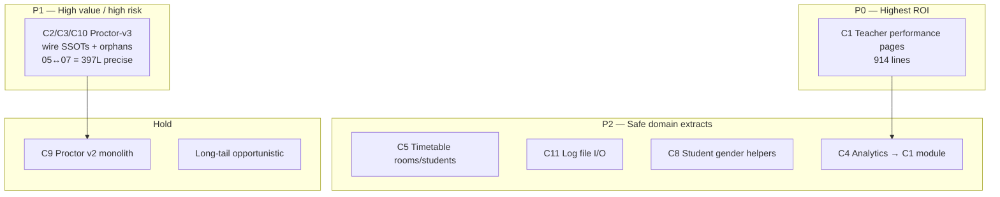
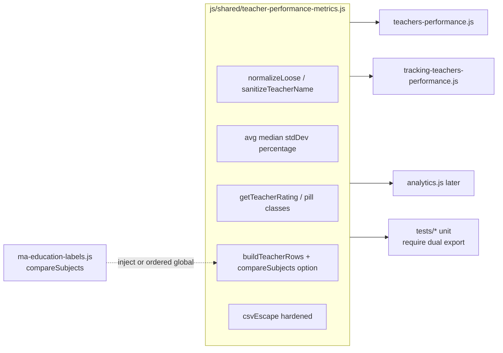
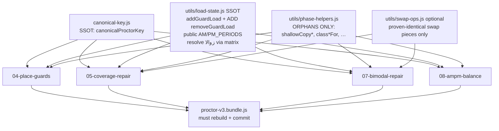
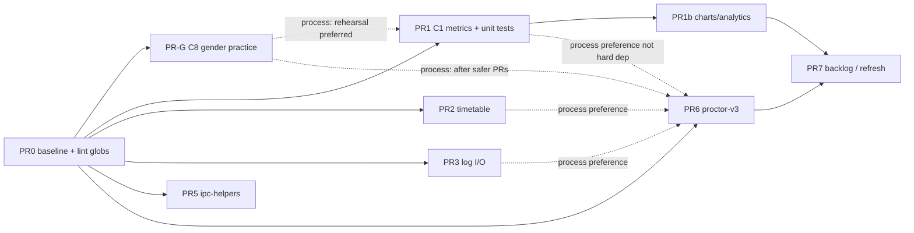

# Design: Find & Centralize Duplicate Functions

| Field | Value |
|-------|-------|
| **Document title** | Find & Centralize Duplicate Functions |
| **Author** | TBD (engineering) |
| **Date** | 2026-07-10 |
| **Revised** | 2026-07-10 (post-review) |
| **Status** | Draft — inventory + plan only; **no code changes until PR1 gates cleared** |
| **Related stack** | Electron 35, Node.js main, vanilla multi-page renderers, better-sqlite3 |
| **Baseline report** | `D:\gestionScholaire3\.jscpd-report\jscpd-report.json` (regenerate; prefer in-repo inventory under `docs/plans/`) |
| **Scope** | Process, inventory, incremental refactor plan (not a product feature) |

---

## Overview

The codebase has measurable structural duplication: **jscpd** on app JS (`main/`, `js/`, `preload.js`, `app.js`) reports **137 clones**, **3,042 duplicated lines (3.87%)**, across **158 files / 78,648 lines**. The bulk is not random noise—it concentrates in a few high-value pairs, especially:

1. Teacher performance pages (`teachers-performance.js` ↔ `tracking-teachers-performance.js`, **914 dup lines / 23 clones**)
2. Proctor v3 repair phases (`05-coverage-repair.js` ↔ `07-bimodal-repair.js` = **397 lines / 7 clones**; plus other cross-phase pairs—see C2 rollup note)
3. Timetable view pages (rooms ↔ students), diagnostics log I/O, student gender helpers, and a few main-process boilerplate patterns

This design completes **Steps 1–3** of the requested workflow (detect, report, plan), defines an **execution protocol** for Step 4, and breaks work into **reviewable PRs**. No refactors are implemented in this document.

**Guiding principle:** centralize by **domain responsibility**, not into a mega-`utils.js`. Prefer small modules under `js/shared/`, existing algorithm homes under `js/algorithms/proctor-v3/` (especially `canonical-key.js` and `utils/load-state.js`), and **existing domain folders under `main/`** (e.g. `main/diagnostics/`). Do **not** invent a catch-all `main/lib/`. Preserve exact behavior; flag differences instead of silently merging them.

---

## Background & Motivation

### Current state

- **Architecture:** `renderer (HTML + js/pages/*.js) → preload.js (window.api) → main/ipc/*.js → SQLite`
- **No page bundler:** shared renderer code must be loaded via ordered `<script>` tags
- **Proctor v3 dual path:** Node tests/`require` sources under `js/algorithms/proctor-v3/`; production UI loads **`js/algorithms/proctor-v3.bundle.js`** (built via `npm run build:v3-bundle`)
- **Existing shared modules (do not dump new logic into one Utils file):**
  - `js/utils.js` — FilterManager, PERIOD_MAP, `MORNING_HOUR_MAP` / `AFTERNOON_HOUR_MAP`, schedule helpers (**already large; avoid growing**)
  - `js/message-system.js`, `js/print-system.js`
  - `js/shared/timetable-move-logic.js`, `js/shared/timetable-utils.js`
  - `js/data/system-tag-types.js`, `js/data/ma-education-labels.js` (includes `compareSubjects`)
  - `main/ipc/ipc-helpers.js` — `handleRead` / `handleWrite` / `handleWriteSoftAuth`
  - `main/teachers/identity.js` — main-process teacher alias normalization (**different** from renderer `sanitizeTeacherName`)
  - Proctor SSOT (already exist; phases currently reimplement locals):  
    `js/algorithms/proctor-v3/canonical-key.js` (`canonicalProctorKey`),  
    `js/algorithms/proctor-v3/utils/load-state.js` (`addGuardLoad`, etc.)

### Pain points

| Pain | Evidence |
|------|----------|
| Bugfixes land on one page only | e.g. CSV formula-injection hardening exists in `tracking-teachers-performance.js` `csvEscape` but **not** in `teachers-performance.js` |
| Algorithm phases reimplement SSOT helpers | Local `canonicalKeyOf` / load +/- instead of `canonicalProctorKey` / `load-state.js` |
| Timetable UI modules are copy-forked | `RoomTimetable` / `StudentTimetable` share discovery, theme observer, print, hard-coded hour labels |
| Diagnostics I/O reinvented twice | `rotateIfNeeded`, `stripSensitive`, `safeParse`, userData logs path in `error-log.js` and `conflict-forensics.js` |
| Review cost | Same logic reviewed N times; drift is hard to spot without tooling |
| Lint/format blind spots | `npm run lint` / `format` globs omit `js/shared/**` today |

### Why now

A clean jscpd baseline already exists. Dedup can be sequenced by **ROI × risk** with existing test harnesses (`npm run test:smoke`, `npm test`, `npm run test:v3`, `tests/error-log-unit.test.js`, extensive proctor suite) plus **new Node unit tests** for pure shared extracts.

---

## Goals & Non-Goals

### Goals

1. **Inventory** duplicate/near-duplicate **clusters** (not 137 raw clones) with type, priority, confidence, and intentional/legacy flags
2. **Propose** domain-owned shared homes and extraction shape (pure functions vs IIFE/service), **reusing existing SSOTs** before adding new modules
3. **Define** an incremental, approval-gated refactor protocol: one cluster per commit/PR (strict sub-slices allowed), tests after each, behavioral-diff matrix required
4. **Preserve** product behavior and public IPC/preload contracts
5. **Lower** long-term maintenance cost without a framework migration
6. **Program exit:** land core P0–P2 clusters (**C1**, **C2/C3**, **C5**, **C8**, **C11**); **C4** (analytics consumer) and C10 are optional follow-ups; P3 optional; long-tail opportunistic only

### Non-Goals

- Mass rewrite or “cleanup sprint” across unrelated files
- Framework migration (React/Vue/etc.) or introducing a renderer bundler as a prerequisite
- Renaming public APIs purely for style
- Dumping all shared code into `js/utils.js` or inventing `main/lib/`
- Deduplicating `vendor/`, `node_modules/`, or HTML-only cosmetics (except regenerating **required** `proctor-v3.bundle.js` when v3 sources change)
- Silencing jscpd by raising thresholds without addressing real clusters
- Changing proctor fairness/algorithm semantics “while we’re here”
- Auto-refactoring without human approval per cluster
- Merging student gender helpers with teacher-list gender semantics

---

## Step 1 — Stack Detection & Tooling

### Primary stack (verified)

| Layer | Technology |
|-------|------------|
| Desktop shell | Electron 35 |
| Main process | Node.js, CommonJS `require` |
| Renderer | Vanilla multi-page HTML + `js/pages/*.js` (no bundler) |
| IPC | `preload.js` contextBridge → `window.api` |
| DB | `better-sqlite3` |
| CSS | Tailwind CSS v4 (out of scope for this dedup pass) |
| Tests | Node test runners under `tests/`, smoke IPC parity |

### Scope of scan (app code only)

**Include:** `main/**/*.js`, `js/**/*.js` (app modules), `preload.js`, `app.js`  
**Exclude:** `node_modules/`, `dist/`, `vendor/`, `**/*.bundle.js`, Firebase/infra node_modules  
**Deferred (Defer-OK):** inline scripts inside HTML pages (note only; not jscpd-targeted in baseline)

### Tooling recommendation

| Tool | Role | When |
|------|------|------|
| **jscpd** (primary) | Token/line clone detection | Already run; re-run after each major PR |
| **Manual + semantic review** (secondary) | Same responsibility, different tokens | Per cluster before extract |
| **Characterization tests then extract** | Lock current pure behavior before move | **Required for C1; required for C2 pure helpers** |
| **Dual export** (renderer shared modules) | `module.exports` + `window` attach so Node tests run without Electron | PR1, PR4 (C8), etc. |
| **ESLint complexity / max-lines** (optional later) | Prevent re-growth of page scripts | Post-stabilization |
| **Existing unit/PBT tests** | Regression gates | `tests/proctor-v3/*`, `tests/error-log-unit.test.js`, `tests/smoke.js` |

**Recommended jscpd command (baseline + regression):**

```bash
npx jscpd main js preload.js app.js \
  --min-lines 10 --min-tokens 50 \
  --reporters console,json \
  --output .jscpd-report \
  --ignore "**/node_modules/**,**/dist/**,**/*.bundle.js,**/vendor/**"
```

**npm script (PR0):** `"dup:report": "npx jscpd main js preload.js app.js --min-lines 10 --min-tokens 50 --reporters console,json --output .jscpd-report --ignore \"**/node_modules/**,**/dist/**,**/*.bundle.js,**/vendor/**\""`

**Baseline metrics (2026-07-10, verified against `jscpd-report.json`):**

| Metric | Value |
|--------|-------|
| Files | 158 |
| Lines | 78,648 |
| Clones | 137 |
| Duplicated lines | 3,042 (3.87%) |
| Duplicated tokens | 17,101 (4.20%) |
| Report path | `.jscpd-report/jscpd-report.json` (local regenerate; **in-repo SoT** = `docs/plans/` inventory — see PR0) |

**Confidence model for this design:**

| Confidence | Meaning |
|------------|---------|
| **High** | Large jscpd clones + matching function names + spot-check confirmed |
| **Medium** | Multiple smaller clones or structural IIFE twins; need line-by-line before merge |
| **Low** | Boilerplate / intentional phase structure / possible false positive |
| **Legacy / intentional** | Leave alone or deprecate rather than extract |

---

## Step 2 — Duplicate Inventory Report

> **No code was modified for this inventory.** Clusters below group jscpd clones into **actionable units**. Priority ≈ total duplicated lines in the pair (size × repetition proxy). Type: **exact** | **near-duplicate** | **semantic**.

### Cluster summary table

| ID | Cluster | Type | Clones | Dup lines | Priority | Confidence | Action stance |
|----|---------|------|--------|-----------|----------|------------|---------------|
| C1 | Teacher performance pages | near + exact | 23 | **914** | **P0** | High | Extract shared metrics helpers + mandatory unit tests |
| C2 | Proctor-v3 coverage ↔ bimodal repair | near | 7 | **397** | **P1** | High | Wire phases to existing SSOTs + orphan helpers only |
| C3 | Proctor-v3 place-guards ↔ coverage (+ other phases) | near | 5+ | **104+** | **P1** | High | Same as C2 (not a separate grab-bag) |
| C4 | Analytics ↔ teachers-performance helpers | near | 5 | **98** | **P2** | High | Fold pure helpers into C1 module (follow-up PR) |
| C5 | Timetable rooms ↔ students | near | 6 | **97** | **P2** | High | Shared view helpers; hour maps from `utils.js` only |
| C6 | ipc-helpers internal (error logging wrap) | near | 3 | **74** | **P3** | High | Small internal DRY; low user impact |
| C7 | teachers-performance internal self-dups | near | 4 | **73** | **P2** | Medium | Local extract inside page or with C1 |
| C8 | student-profile.js ↔ students-list gender helpers | exact/near | 5 | **71** | **P2** | High | `js/shared/gender.js` (students only; HTML: `student-profile-prototype.html`) |
| C9 | proctor-distribution-v2 internal | near | 4 | **66** | **—** | High | **LEGACY / leave** unless deprecating v2 |
| C10 | Proctor-v3 orchestrator ↔ phase bootstrap | near | many | ~50–59 **each pair** | **P1** | Medium | Shared state clone / prelude; **not summed into one budget** |
| C11 | error-log ↔ conflict-forensics log I/O | near/exact | 2 | **51** | **P2** | High | `main/diagnostics/log-file-io.js` |
| C12 | main/ipc/auth.js internal | near | 3 | **44** | **P3** | Medium | Optional local DRY |
| C13 | js/utils.js internal | near | 3 | **38** | **P3** | Medium | Optional; extract-out only—no net growth |
| C14 | settings-imports ↔ timetable | near | 2 | **37** | **P3** | Medium | Review before extract |
| C15 | staff-attendance ↔ staff-daily-report | near | 2 | **29** | **P3** | Medium | Small; optional |
| C16 | timetable.js ↔ ux-enhancements | near | 2 | **28** | **P3** | Low–Med | Likely UI pattern; careful |
| C17 | Other long-tail pairs | mixed | rest | &lt;30 each | backlog | Low | Opportunistic only |

**C2/C3/C10 rollup note:** “~400+” is a **planning rollup**, not a single exclusive jscpd budget. Pairs overlap (same phase lines can appear in multiple pair rows). **PR6 success** = before/after table of **named pairs** (at minimum `05↔07` 397L, `04↔05` 104L) after re-run of `dup:report`—not “reduce by 400+.”

---

### C1 — Teacher performance pages (P0, 914 lines)

**Files:**

- `js/pages/teachers-performance.js`
- `js/pages/tracking-teachers-performance.js`
- Related: `js/pages/analytics.js` (C4) shares the same pure helpers

**Product context (intentional fork, accidental shared body):**

| Page | HTML | Sidebar title | Role |
|------|------|---------------|------|
| Indicators report | `teachers-performance.html` | تقرير أداء الأساتذة | Multi-teacher ranking, charts, export, print |
| Tracking follow-up | `tracking-teachers-performance.html` | متابعة الأداء | Single-teacher focus + compensation/support + system tags |

Permissions treat both as first-class pages (`main/auth/permissions.js`). They are **not** dead copies of each other, but large pure/compute layers are copy-pasted.

**Representative shared functions (names confirmed):**

| Function | Responsibility | Purity note |
|----------|----------------|-------------|
| `studentIdentity` | Stable student key from grade rows | Pure |
| `normalizeLoose` | Unicode/Arabic diacritic-insensitive normalize | Pure |
| `sanitizeTeacherName` | Reject non-teacher noise tokens / section codes | Pure |
| `parseDateMs`, `formatDateTime` | Date helpers (`ar-MA`) | Pure (locale fixed) |
| `avg`, `median`, `stdDev`, `percentage` | Stats | Pure |
| `toLatinDigits`, `extractExamNumber` | Exam subject parsing | Pure |
| `csvEscape` | CSV cell quoting | Pure; **behavior diff** (see below) |
| `getTeacherRating`, `getPassRatePillClass`, `getAvgPillClass` | Rating/UI class mapping | Pure |
| `buildTeacherRows` | Aggregate grades → teacher metric rows | **Soft global:** sorts subjects with `typeof compareSubjects === 'function' ? compareSubjects : localeCompare`. `compareSubjects` comes from `js/data/ma-education-labels.js`. **Not fully pure** unless comparator is injected via options. |
| `renderKpis`, `renderKpisBySubject`, `getBestSubject` | KPI construction (DOM-coupled in places) | Page-local or later slice |
| Chart lifecycle helpers | ensure/destroy/a11y | Optional shared module |
| Card/charts/state line | Presentation | Page-local |

**Largest single clones:**

| Lines | A | B |
|------|---|---|
| 120 | `teachers-performance.js:274-393` | `tracking-teachers-performance.js:279-375` |
| 112 | `:395-506` | `:382-493` |
| 90 | `:626-715` | `:570-659` |
| 80 | `:1381-1460` | `:1132-1203` |
| 63 | `:850-912` | `:658-720` |

**Type:** mostly **exact/near** on pure helpers; **near** on DOM-facing chart/KPI code.

**Critical behavioral difference (do not silently merge) — worked example for behavioral-diff matrix:**

```393:396:js/pages/teachers-performance.js
function csvEscape(value) {
    const str = String(value ?? '');
    return '"' + str.replace(/"/g, '""') + '"';
}
```

```375:383:js/pages/tracking-teachers-performance.js
function csvEscape(value) {
    let str = String(value ?? '');
    // Neutralize spreadsheet formula injection: values starting with = + - @ (or
    // leading tab/CR) can be executed as formulas by Excel/LibreOffice.
    if (/^[=+\-@\t\r]/.test(str)) {
        str = "'" + str;
    }
    return '"' + str.replace(/"/g, '""') + '"';
}
```

| function | equal? | delta summary | resolution |
|----------|--------|---------------|------------|
| `csvEscape` | no | tracking prefixes `'` for `[=+\-@\t\r]`; indicators only quote | **shared = hardened** (Gate 0 for PR1; KD11 default) |

**Semantic note:** `main/teachers/identity.js` → `normalizeTeacherName` is **not** the same algorithm as renderer `normalizeLoose`/`sanitizeTeacherName`. Do **not** force-merge main ↔ renderer without a dedicated design.

**Mandatory automated tests (C1):** Node unit tests under `tests/` for extracted pure API (at least `normalizeLoose`, `sanitizeTeacherName`, hardened `csvEscape`, `getTeacherRating`, `buildTeacherRows` on a small fixture; `buildTeacherRows` with and without injected `compareSubjects`). Manual Appendix B smoke is **secondary**.

---

### C2 / C3 / C10 — Proctor-v3 phase helpers (P1, high value, high risk)

**Primary pair (precise jscpd):**  
`js/algorithms/proctor-v3/phases/05-coverage-repair.js` ↔ `07-bimodal-repair.js`  
**397 lines / 7 clones**; largest single clone **161 lines** at `05:117-277` ↔ `07:130-272`.

**Duplicated helper set currently local to phases (names confirmed):**

- `isPlainObject`, `shallowCopyState`, `shallowCopyRow`
- `periodFromHalfdayKey`, `dayKeyFromHalfdayKey`
- **`canonicalKeyOf`** — **reimplements** `canonicalProctorKey` from `canonical-key.js` (trimmed `cin` else `__idx_N`)
- `buildProctorIndex`
- **`decrementGuardLoad` / `incrementGuardLoad`** — **near** `load-state.js` `addGuardLoad`, but **not equivalent APIs** (see PR6 sub-step matrix below)
- `donorStillInSession`, `donorStillInHalfday`
- `classLowerFor`, `classUpperFor`
- Swap plumbing: `canSwap`, `applySwap` (and find-swap variants that **diverge** by phase goal)
- Local phase **`AM_PERIODS` / `PM_PERIODS`** — diverge from load-state (see below)

**Cross-phase pairs (each tracked separately for PR6 before/after):** `04↔05` (104L), `05↔08`, orchestrator↔`08`/`09`/`10` (~50–59L each), etc.

**Existing SSOTs (must be sources of truth, not peers of a parallel copy):**

| Module | Owns today |
|--------|------------|
| `js/algorithms/proctor-v3/canonical-key.js` | `canonicalProctorKey`, `buildKeyAdapter`, `toCanonical` |
| `js/algorithms/proctor-v3/utils/load-state.js` | LoadState create/entry; **`addGuardLoad` / `addDutyLoad` / `addReserveLoad` only** (no public decrement); `AM_PERIODS`/`PM_PERIODS` currently under **`_internals` only** |
| `js/algorithms/proctor-v3/utils/prng.js` | PRNG |

**Verified API gaps (do not “blindly rename” phase helpers to `addGuardLoad`):**

| function / set | equal? | delta summary | resolution |
|----------------|--------|---------------|------------|
| `incrementGuardLoad(loadState, key, period)` vs `addGuardLoad(loadState, key, halfdayKey, dayKey, sessionKey, period)` | near | Different **arity**; extra args on `addGuardLoad` are informational/unused for counting | Prefer thin wrapper or call `addGuardLoad` with placeholders; **characterization tests** on mutators before move |
| `decrementGuardLoad(loadState, key, period)` | n/a in load-state | **No decrement API** in `load-state.js` today | **Extend** load-state with `removeGuardLoad` (or symmetric `decrementGuardLoad`) as part of PR6 step 2 — do not leave a third path in phases |
| phase `PM_PERIODS` vs load-state | **no** | Phase local often `['مساء','PM','afternoon']` (**omits `زوالا`**); load-state is `['مساء','زوالا','PM','afternoon']` | **Decision required in PR6 matrix:** adopt SSOT including `زوالا` (**preferred** + targeted tests for AM/PM bucketing) **or** preserve phase set with explicit **BEHAVIOR DIFF** / temporary local period set. Naively switching sets **changes** bucketing for `زوالا` sessions |
| `AM_PERIODS` / `PM_PERIODS` visibility | n/a | load-state exposes periods only via `_internals` | **Promote to public exports** from `load-state.js` in step 2 so phases do not redeclare sets |

**Extraction strategy (ordered):**

1. **Delete** local `canonicalKeyOf`; `require` / use `canonicalProctorKey` (thin alias only if name stability needed for `_internals` tests)
2. **Extend** `utils/load-state.js`:
   - Add **`removeGuardLoad` / decrement** counterpart(s) matching phase swap needs
   - **Promote** `AM_PERIODS` / `PM_PERIODS` to **public** exports (not only `_internals`)
   - Resolve **`زوالا`** period-set decision via behavioral-diff matrix + characterization tests on load mutators **before** deleting phase locals
   - Do **not** re-copy load math into a grab-bag `phase-helpers.js`
3. **Only then** put true cross-phase orphans in `utils/phase-helpers.js` and/or `utils/swap-ops.js`: e.g. `shallowCopyState`/`shallowCopyRow`, `classLowerFor`/`classUpperFor`, proven-identical swap plumbing pieces
4. **Do not merge** `findSwap` (coverage) with `findSwapForPair` / `findRebalancingSwap` (bimodal)

**Live load path (mandatory):** `exams-proctors.html` loads **`proctor-v3.bundle.js`**, not individual phase files. Any source change requires `npm run build:v3-bundle` and committing the regenerated bundle. `test:v3` alone does **not** prove the bundle matches sources.

**Type:** **near-duplicate** — same scaffolding, different objective functions (`multiStepCoverageRepair` vs `bimodalRepair`).

**Also:** `js/algorithms/proctor-distribution-v2.js` still loaded by `exams-proctors.html` alongside the v3 bundle. Internal v2 clones (C9) stay out of scope.

---

### C5 — Timetable rooms ↔ students (P2, 97 lines)

**Modular sources (jscpd targets):** `js/pages/timetable-rooms.js` (`RoomTimetable` IIFE), `js/pages/timetable-students.js` (`StudentTimetable` IIFE)

**Live modular load path (verified):** **only `timetable.html`** includes those scripts and initializes them on tab switch (`RoomTimetable.init` / `StudentTimetable.init` from `js/pages/timetable.js`). **PR2 must edit `timetable.html`**, not invent standalone script tags on pages that do not load the modules.

**Standalone HTML fork (out of C5 jscpd scope):** `timetable-rooms.html` and `timetable-students.html` still appear in nav / page registry but embed large **inline** `<script>` copies (different DOM IDs; flat `h1`–`h8` `defaultHourLabels`). They do **not** load `js/pages/timetable-rooms.js` / `timetable-students.js`. PR2 **does not** fix standalone pages by only touching modular `js/pages/*`. Options (follow-up, not required for C5 DoD):

- Delete or redirect standalone pages to `timetable.html` rooms/students tabs, **or**
- A later pass to extract shared helpers into standalone HTML as well (inline HTML remains Defer-OK for baseline jscpd)

**Shared concepts (modular modules):**

- Arabic `days` array
- **Hard-coded** `defaultHourLabels` H1–H4 (morning only) in modular JS — **must be removed** in favor of global `MORNING_HOUR_MAP` / `AFTERNOON_HOUR_MAP` (or `resolveSlotTime`) from `js/utils.js` (project SSOT; never redefine H1–H4 strings in `timetable-view.js`)
- FET hour discovery sets (`morningSet` / `afternoonSet`)
- Theme `MutationObserver` re-render
- `PrintSystem.preview` landscape print wiring
- Nested loop over `timetableData.timetables` → day → period → hour

**Type:** **near-duplicate** structural twins with different index keys (`roomsIndex` vs `classesIndex`).

**Script order on `timetable.html`:** `js/utils.js` → `js/shared/timetable-view.js` → `js/pages/timetable-students.js` / `timetable-rooms.js` (before or with existing `timetable.js` as today).

**Existing related shared:** `js/shared/timetable-utils.js`, `js/shared/timetable-move-logic.js` — extend this family, do not reinvent under `utils.js`.

---

### C8 — Student gender / presentation helpers (P2, 71 lines)

**JS modules (consumers only):** `js/pages/student-profile.js`, `js/pages/students-list.js`

**HTML hosts (verified):** `students-list.html`, **`student-profile-prototype.html`** (there is **no** `student-profile.html` in the live page registry / permissions / menu map). Profile page key is `student-profile-prototype`.

**Functions:** `isMale`, `isFemale`, `getGenderLabel` / icons (profile), avatar color hashing patterns (partial).

**Domain:** gender **string** values (`m`/`f`/`male`/`female`/`ذكر`/`أنثى`).

Comments already admit sharing: `// Gender helpers (shared with students-list.js)`.

**Type:** **exact/near**, high confidence, low risk.

**Non-consumers (do not fold into `js/shared/gender.js` without a separate cluster):**

| File | API shape | Semantics |
|------|-----------|-----------|
| `js/pages/teachers-list.js` | `isMale(t)` / `isFemale(t)` on **teacher object** | Codes `1`/`2` via `includes`, plus Arabic labels — **different domain** |

If ever shared, use distinct APIs (`isMaleGender(value)` vs `isMaleTeacher(record)`), not a silent merge into student helpers.

**Tests:** recommended Node unit tests for `isMale`/`isFemale`/`getGenderLabel` edge cases when extracting.

---

### C11 — Diagnostics / forensics log I/O (P2, 51 lines)

**Files:**

- `main/diagnostics/error-log.js` — `rotateIfNeeded`, `stripSensitive`, `safeParse`, path under `userData/logs/app-errors.log`
- `main/sync/conflict-forensics.js` — same rotate/strip/parse; path `sync-conflicts.log`; gated by `SYNC_CONFLICT_FORENSICS`

**Type:** **near-exact** on I/O helpers; **domain-specific** on record shape and enablement.

**Tests:** `tests/error-log-unit.test.js` must keep passing; add forensics unit tests if extracting shared rotate.

**Slight diffs to preserve:**

- `stripSensitive`: error-log clones arrays; forensics object-only spread
- Constants: `MAX_LOG_BYTES`, `MAX_ROTATED_FILES`, `SENSITIVE_FIELDS` may differ per module

---

### C6 — `ipc-helpers.js` internal (P3, 74 lines)

**File:** `main/ipc/ipc-helpers.js`

`handleRead`, `handleWrite`, `handleWriteSoftAuth` each embed the same try/catch → `error-log.logAppError` → structured failure response. Auth/session paths correctly differ.

**Type:** **near-duplicate** error-path boilerplate. Safe extract of `_logIpcError(channel, err)` helper **within the same file**—no new public surface required.

---

### C4 — Analytics overlap (P2, 98 lines)

**Files:** `js/pages/analytics.js` ↔ `teachers-performance.js`

Shared: Chart.js load pattern, `normalizeLoose` / `sanitizeTeacherName`, stats helpers.

Fold into the same module as C1 in a **follow-up PR** (not PR1 first slice); analytics becomes a third consumer.

---

### C9 — Proctor v2 internal (skip / legacy)

**File:** `js/algorithms/proctor-distribution-v2.js` (monolith, still referenced)

**Stance:** Do **not** invest in internal v2 dedup unless product deprecates v2. Prefer v3 SSOT wiring (C2).

---

### Long-tail / lower priority (C12–C17)

| Area | Notes |
|------|-------|
| `main/ipc/auth.js` internal | Repeated response construction; local helper only |
| `js/utils.js` internal | Prefer extract-out if touching; avoid net growth |
| `settings-imports.js` ↔ `timetable.js` | Import/timetable bridging snippets; verify semantic equality |
| `staff-attendance.js` ↔ `staff-daily-report.js` | Small date/filter patterns |
| `timetable.js` ↔ `ux-enhancements.js` | UI enhancement overlap; may be intentional |
| `app-admin` / `settings-users` | Admin UI patterns |
| Self-dups in analytics charts | Local extract inside page |

---

### Inventory mermaid (priority map)



---

## Step 3 — Centralization Plan

### Placement rules

1. **By responsibility**, not by “is shared”
2. **Do not grow** `js/utils.js` for new domains — **PR checklist: no new exports added to `js/utils.js`**
3. **Reuse existing SSOTs first** (proctor: `canonical-key.js`, `load-state.js`; times: `MORNING_HOUR_MAP` / `AFTERNOON_HOUR_MAP`)
4. **Renderer modules (new):** prefer **dual export** — `module.exports` for Node tests + global attach for pages; load via ordered `<script>` tags. **Legacy** `js/shared/*` files (`timetable-utils.js`, `timetable-move-logic.js`, etc.) use flat globals only; **do not rewrite them** in this program for dual-export consistency. Optional later cleanup is out of scope.
5. **Main modules:** CommonJS `require` / `module.exports` under **existing** `main/<domain>/` folders — **not** a new `main/lib/`
6. **Pure first:** extract pure functions before DOM/Chart glue; document soft globals (`compareSubjects`)
7. **Flag diffs:** behavioral-diff matrix required for any near-duplicate

### Proposed module map

| Cluster | Proposed home | Shape | Consumers |
|---------|---------------|-------|-----------|
| C1 pure metrics & strings | `js/shared/teacher-performance-metrics.js` | Dual export: `module.exports` + `window.TeacherPerformanceMetrics`; inject `compareSubjects` via options for `buildTeacherRows` | teachers-performance, tracking-teachers-performance; analytics in follow-up |
| C1 chart lifecycle (optional) | `js/shared/chart-lifecycle.js` | Dual export helpers for Chart.js ensure/destroy/a11y | same + analytics |
| C2/C3/C10 | **(1)** `canonical-key.js` (existing) **(2)** `utils/load-state.js` (extend) **(3)** `utils/phase-helpers.js` and/or `utils/swap-ops.js` **only for orphans** | CommonJS; phases `require` SSOTs | 04, 05, 07, 08, 09, … + **mandatory** `proctor-v3.bundle.js` rebuild |
| C5 | `js/shared/timetable-view.js` | Helpers only; **must use** `MORNING_HOUR_MAP` / `AFTERNOON_HOUR_MAP` / `resolveSlotTime` from `utils.js` — **no local H1–H4 maps** | Modular: `timetable-rooms.js` / `timetable-students.js` via **`timetable.html` only** (standalone HTML is a separate inline fork) |
| C8 | `js/shared/gender.js` | Pure student gender-string helpers; dual export (new-module convention) | `students-list.html` + **`student-profile-prototype.html`** → page JS (**not** teachers-list) |
| C11 | `main/diagnostics/log-file-io.js` | `resolveUserDataLogPath`, `rotateIfNeeded`, `safeParse`, `stripSensitive(fields)` | error-log, conflict-forensics |
| C6 | keep in `main/ipc/ipc-helpers.js` | private `logIpcFailure(channel, err)` | self only |
| C9 | **no new module** | leave | — |

### Lint / format / CI coverage (hard requirement)

Today’s `package.json` globs:

```text
lint/format: main/**/*.js, preload.js, js/backup.js, js/pages/*.js, tests/**/*.js
```

**`js/shared/**` is not linted.** PR0 **must** expand `lint` and `format` to include at least:

- `js/shared/**/*.js`

Recommended (if not intentionally excluded for historical reasons):

- `js/data/**/*.js`
- `js/algorithms/**/*.js` (or at least document why algorithms stay out of format/lint)

**DoD:** first PR that adds `js/shared/` fails CI if globs were not updated. This is **not** optional.

`main/diagnostics/log-file-io.js` is already covered by `main/**/*.js`.

### Renderer load pattern (no bundler)

**Performance pages — script order:**

```html
<script src="js/utils.js" defer></script>
<script src="js/data/ma-education-labels.js"></script>
<!-- compareSubjects available before metrics if not injected -->
<script src="js/shared/teacher-performance-metrics.js" defer></script>
<script src="js/pages/teachers-performance.js" defer></script>
```

Prefer **injecting** `compareSubjects` into `buildTeacherRows(grades, { compareSubjects })` so Node tests do not depend on script order; still keep HTML order correct for any global fallback.

**Timetable (modular host = `timetable.html` only):**

```html
<script src="js/utils.js" defer></script>
<script src="js/shared/timetable-view.js" defer></script>
<script src="js/pages/timetable-students.js" defer></script>
<script src="js/pages/timetable-rooms.js" defer></script>
<!-- existing timetable.js / other scripts as today -->
```

Do **not** assume `timetable-rooms.html` / `timetable-students.html` load these modules (they use inline scripts today).

### Extraction layering (C1)



**Leave page-local:** DOM ids, event binding, page titles, tracking-only system-tag / compensation cards, multi-teacher comparison table specifics.

### Proctor-v3 extraction layering (SSOTs first)



**Do not** put `canonicalKeyOf` or load +/- reimplementations inside `phase-helpers.js`. **Do not** assume phase `incrementGuardLoad` ≡ `addGuardLoad` without the arity/decrement/period-set matrix.

### Main log I/O extraction

```js
// main/diagnostics/log-file-io.js (proposed surface)
module.exports = {
  resolveUserDataLogPath, // (fileName) => path under userData/logs or cwd/logs
  rotateIfNeeded,         // (filePath, { maxBytes, maxRotated })
  stripSensitive,         // (data, sensitiveFields)
  safeParse,
  truncate                // if both need it
};
```

Domain modules keep: enable flags, record builders, public `logAppError` / `logConflictForensics` APIs.

---

## Step 4 — Execution Protocol

### Gates

0. **Gate 0 — PR1 security/product checkboxes (defaults from KD unless product rejects):**
   - [ ] **csvEscape harden-for-both:** adopt tracking’s formula-injection neutralization on shared export (security-positive behavior change; note in PR body / CHANGELOG if project tracks user-visible hardening)
   - [ ] **Two pages stay separate** with one shared library (KD5)
1. **This design approved** (or silence-ack: engineers may proceed on **Key Decision defaults** when product owners do not override Blockers)
2. **Per-cluster approval** before coding (or sub-slice plan approved)
3. **One cluster (or strict sub-slice) per commit**; one logical cluster per PR with ordered commits when large
4. **No drive-by** edits outside the cluster files + new shared module + HTML script tags + required lint/format/test/bundle artifacts

### Per-cluster procedure

1. **Write characterization / unit tests** for pure functions to be moved (mandatory C1; recommended C8; C2 for any newly extracted pure helpers)
2. **Diff the two (or N) implementations** and fill the **behavioral-diff matrix** (template below)
3. **If unsure about behavior** → stop and ask (do not guess)
4. **Extract** shared module with dual export where renderer-bound
5. **Update call sites**; delete local copies
6. **Update HTML** `<script>` tags (renderer) or `require` paths (main)
7. **Expand lint/format globs** if new paths (PR0 / first shared file)
8. **Run tests** (cluster-appropriate suite)
9. **Re-run jscpd** (required PR0, C1, C2, and final chore PR)
10. **PR description** includes matrix + before/after jscpd for targeted pairs
11. **Commit:** `refactor(dedup): extract <cluster-id> <short-name>`

### Behavioral-diff matrix (required artifact)

For any cluster with ≥1 near-duplicate, PR body **must** include:

| function | equal? | delta summary | resolution (shared / wrapper / ask) |
|----------|--------|---------------|-------------------------------------|
| `csvEscape` | no | tracking hardens `[=+\-@\t\r]`; indicators do not | **shared** (hardened) — Gate 0 |
| `findSwap` vs `findSwapForPair` | no | different search policies | **wrapper / leave phase-local** |
| … | | | |

Rules:

| Situation | Action |
|-----------|--------|
| Identical pure logic | Extract once → resolution `shared` |
| Same intent, one side has bugfix/security fix | Adopt fixed version → `shared` + PR note |
| Product-intentional difference | Keep separate wrappers → `wrapper` |
| Algorithm policy difference (proctor) | Share only true commons → phase-local for policies |
| Unknown | **Ask** → resolution `ask`; block merge |

### Test commands (minimum per area)

| After work on | Commands / gates |
|---------------|------------------|
| Any PR | `npm run lint`, `npm run test:smoke` |
| PR0 | lint/format globs expanded; `dup:report` documented; inventory doc committed |
| **C1 (mandatory)** | **New** `tests/teacher-performance-metrics*.test.js` (or equivalent) covering pure API; lint; smoke; Appendix B secondary |
| C8 | Recommended unit tests for gender helpers + smoke + manual |
| C5 | smoke via **`timetable.html`** rooms/students tabs; assert no local period maps in modular JS; standalone HTML not in C5 DoD |
| C11 | `tests/error-log-unit.test.js` (+ forensics tests if added) |
| **C2/C3/C10** | `npm run test:v3`, full `npm test` before merge; **`npm run build:v3-bundle`** + commit bundle; jscpd before/after named pairs |
| C6 | smoke (IPC parity) |

### Definition of done (cluster)

- [ ] Shared module lives in agreed path (or existing SSOT extended)
- [ ] All listed call sites updated; locals deleted
- [ ] HTML scripts ordered correctly (renderer)
- [ ] Dual export + **mandatory unit tests** for pure C1 extract (recommended for C8)
- [ ] `lint`/`format` globs cover new paths
- [ ] **No new exports on `js/utils.js`**
- [ ] No public `window.api` / IPC channel changes
- [ ] Behavioral-diff matrix in PR body
- [ ] Tests green for cluster
- [ ] jscpd: targeted pair(s) reduced (or justified partial) — named pairs for PR6
- [ ] **PR6 only:** bundle rebuilt and committed; note that `test:v3` ≠ bundle freshness

### Program exit criteria

Program is **done** when:

1. **P0:** C1 pure extract landed with unit tests + hardened `csvEscape` (or documented product reject)
2. **P2 core:** **C5**, **C8**, **C11** landed (modular C5 via `timetable.html`)
3. **P1:** **C2/C3** landed with SSOT wiring (including load-state API gaps closed) + bundle rebuild + v3 tests; **C10** optional if still valuable after C2
4. **C4** (analytics wiring / chart lifecycle): **optional follow-up** — program is **not** incomplete without it
5. **P3 (optional):** C6 and small internals
6. **Long-tail C12–C17** and standalone timetable HTML inline fork: opportunistic only—no thrash
7. Inventory doc updated in PR0; **final chore PR** re-runs `dup:report` and updates metrics table

**Vanity % thresholds are informational only**—do not block or celebrate solely on “under X%.”

---

## Alternatives Considered

### A1 — Mega `js/utils.js` dump

| Pros | Cons |
|------|------|
| One script tag | File already ~3k lines; violates project guidance; high conflict rate |

**Rejected.**

### A2 — Introduce a bundler for shared renderer modules

| Pros | Cons |
|------|------|
| Real ESM imports | Out of scope; large platform change |

**Deferred.** Script tags + dual export for tests.

### A3 — Only delete “dead” duplicates; leave active forks

| Pros | Cons |
|------|------|
| Zero behavior risk | C1 continues to drift (`csvEscape`) |

**Rejected as sole strategy.** Use for C9/v2 only.

### A4 — Full merge of teachers-performance + tracking into one page

| Pros | Cons |
|------|------|
| Maximum dedup | Two nav entries, permissions, distinct UX |

**Rejected.** Share libraries; keep pages.

### A5 — Copy proctor helpers into each phase forever (status quo)

| Pros | Cons |
|------|------|
| Zero short-term algorithm risk | Local reimplementation of SSOTs; 161-line clones |

**Accepted only until PR6**; then wire SSOTs + orphans.

### A6 — Characterization tests then extract (required technique)

| Pros | Cons |
|------|------|
| Locks behavior before move; enables Node tests without Electron; standard low-risk extract | Slightly more upfront work |

**Accepted as required technique for C1 and for any newly extracted pure proctor helpers—not an optional product direction.** Workflow: write tests against current duplicated pure functions (or freeze fixtures) → extract → tests still pass → delete locals.

---

## Security & Privacy Considerations

| Topic | Detail | Severity |
|-------|--------|----------|
| CSV injection | Unify `csvEscape` on hardened tracking version (**Gate 0 / PR1**) | Medium — fix-forward; user-visible export change |
| Log redaction | Shared `stripSensitive` must accept field list; do not weaken domain field sets | High if mishandled |
| Auth wrappers | C6 must not bypass `requireRole` / soft-auth logging | High if mishandled |
| Proctor fairness | Incorrect shared `canSwap`/bounds → unfair distributions | Critical — tests + no policy merge |
| Bundle drift | Stale `proctor-v3.bundle.js` while tests pass on sources | High — mandatory rebuild |
| No secrets in shared modules | Keep diagnostics/sync tokens out of renderer shares | Standard |

---

## Observability

| Signal | How |
|--------|-----|
| Clone baseline | **In-repo SoT:** `docs/plans/…-duplicate-inventory.md` with metrics + cluster table; `dup:report` regenerates `.jscpd-report/` (prefer **gitignore** full JSON unless CI diffs it) |
| Regression | Optional later CI budget on `duplicatedLines` (Defer-OK); not required for PR0–PR1 |
| Runtime | error-log / forensics JSONL unchanged at public API |
| Algorithm | proctor diagnostics shape + `tests/proctor-v3/*` |
| Bundle | Optional future smoke: rebuild and `git diff --exit-code` on bundle |

---

## Rollout Plan

1. **PR0** — tooling, lint/format globs, inventory doc, `dup:report`
2. **PR-G (C8)** — small gender extract as script-tag rehearsal
3. **PR1a/PR1b/PR1c** — C1 sub-slices with mandatory unit tests
4. **PR2 / PR3 / PR5** — independent domain extracts
5. **PR6** — proctor SSOT wiring + orphans + **bundle rebuild** (process: after safer PRs; dedicated reviewer)
6. **Final chore** — re-run jscpd; update inventory metrics
7. **Rollback** — revert single PR/commit
8. **Feature flags** — not required for pure moves

---

## Risks

| Risk | Severity | Mitigation |
|------|----------|------------|
| Behavior drift between pages | High | Behavioral-diff matrix; pure extracts; Gate 0 for csvEscape |
| Missing `<script>` / wrong order | High | Documented order; C8 practice PR first; dual export tests independent of HTML; correct HTML hosts (`student-profile-prototype.html`, `timetable.html`) |
| Editing wrong timetable HTML for C5 | High | Modular consumers only on `timetable.html`; standalone pages are inline forks outside C5 DoD |
| Proctor fairness regressions | Critical | SSOT reuse; no policy merges; `test:v3` + full test; **bundle rebuild** |
| Third identity/load path in proctor | High | Never re-copy `canonicalProctorKey` / load mutators into phase-helpers |
| Naive load-state swap (`زوالا` / arity / missing decrement) | High | PR6 matrix rows; extend `removeGuardLoad`; promote public periods; characterization tests first |
| `js/utils.js` grows further | Medium | **Required review checkbox:** no new exports on utils |
| Lint misses `js/shared` | High | PR0 expands globs |
| Test coverage gaps on renderer | High (was under-mitigated) | **Mandatory** Node unit tests for C1 pure API; characterization-first (A6) |
| teachers-list gender wrong-merge | Medium | Explicit non-consumer list on C8 |
| `buildTeacherRows` sort order change | Medium | Inject `compareSubjects`; test with/without |
| Concurrent feature work on performance pages | Medium | Land C1 early; short-lived branch |
| Vanity jscpd % thrash | Low | Program exit criteria; named-pair budgets for PR6 |

---

## Open Questions

### Blockers for PR1 (must clear or silence-ack KD defaults)

| # | Question | Default if silence-ack |
|---|----------|------------------------|
| B1 | **csvEscape:** harden formula injection on **both** performance pages when extracting? | **Yes** (KD11) — Gate 0 checkbox |
| B2 | **Two pages stay separate** with shared library (not single-page merge)? | **Yes** (KD5) |

### Defer-OK (do not block PR0–PR1)

| # | Question | Default / note |
|---|----------|----------------|
| D1 | Proctor v2 leave alone vs deprecate? | Leave alone (KD7); only v3 work |
| D2 | Shared folder `js/shared/` vs domain-specific? | **`js/shared/`** (KD3) |
| D3 | HTML inline duplicates later? | Out of scope for this program |
| D4 | Analytics as PR1 consumer vs follow-up? | **Follow-up** (PR1b after pure C1) |
| D5 | Proctor extract timing? | After safer PRs + dedicated reviewer (process preference) |
| D6 | CI jscpd budget now? | Manual `dup:report` until post-P1 stability |

Implementing engineers **may proceed on Key Decision defaults** when product owners silence-ack the design; only B1/B2 require explicit override if product disagrees.

---

## Key Decisions

| # | Decision | Rationale |
|---|----------|-----------|
| KD1 | jscpd is the primary detector; manual semantic review secondary | Baseline verified; semantics need humans |
| KD2 | Work in **clusters**, not raw clones | Reviewable, prioritizable, maps to PRs |
| KD3 | **No mega-utils / no `main/lib/`**; domain modules under `js/shared/`, existing `proctor-v3` SSOTs + orphan utils, `main/diagnostics/` (and other existing `main/<domain>/`) | Aligns with repo; avoid catch-all folders |
| KD4 | **New** renderer shared modules: script tags + **dual export** for Node tests; main via **require**. Legacy flat-global `js/shared/*` need not be rewritten | No bundler; testable pure modules without mass-churning old shared files |
| KD5 | Teacher performance is **two pages, one library** | Product nav/permissions; max dedup without UX merge |
| KD6 | Proctor: **reuse `canonical-key.js` + `load-state.js` first**; orphan helpers only in phase-helpers/swap-ops; never phase policies | Avoid third identity/load path + fairness risk |
| KD7 | Proctor **v2 internal dedup is non-goal** until deprecation | Cost/risk vs value |
| KD8 | **One cluster per PR**; **strict sub-slices / ordered commits** allowed for large clusters (C1) | User constraint; bisectable mid-PR |
| KD9 | Behavioral diffs use **required matrix template**; unknowns block merge | Safety |
| KD10 | Prefer pure functions before DOM/Chart; document soft globals | Lower risk; analytics reuse |
| KD11 | Security-positive unification (csvEscape) is **Gate 0 default approve** unless product rejects | Hardening is intentional |
| KD12 | Inventory + lint/format glob expansion first (PR0) before behavior PRs | Audit trail + CI completeness |
| KD13 | **Mandatory Node unit tests** for C1 pure extract; characterization-first (A6) | Smoke does not cover metrics |
| KD14 | **PR6 must** `build:v3-bundle` and commit bundle | Live UI load path |
| KD15 | Program exit = **C1 + C2/C3 + C5 + C8 + C11** (+ inventory refresh); **C4 optional**; long-tail opportunistic | Avoid thrash; align Goal 6 with exit criteria |

---

## References

- Baseline JSON (local): `D:\gestionScholaire3\.jscpd-report\jscpd-report.json`
- In-repo inventory target: `docs/plans/` (see PR0)
- Project architecture: `Claude.md`, `Agents.md`
- Shared patterns: `js/data/system-tag-types.js`, `js/data/ma-education-labels.js`, `js/shared/timetable-utils.js`
- Main teacher identity (do not conflate): `main/teachers/identity.js`
- Proctor SSOT: `js/algorithms/proctor-v3/canonical-key.js`, `utils/load-state.js`
- Proctor bundle: `js/algorithms/proctor-v3.bundle.js`, `npm run build:v3-bundle`, `scripts/build-proctor-v3-bundle.js`
- Proctor v2 still live: `exams-proctors.html`, `js/algorithms/proctor-distribution-v2.js`
- Error log tests: `tests/error-log-unit.test.js`
- IPC helpers: `main/ipc/ipc-helpers.js`

---

## PR Plan

Ordered for **practice → value → risk**. Each PR is independently revertable.

### PR0 — Tooling, lint/format globs, inventory SoT (no behavior change)

| Field | Content |
|-------|---------|
| **Title** | `chore(dedup): jscpd script, lint shared globs, duplicate inventory doc` |
| **Files / components** | `package.json` (`dup:report`; expand `lint` + `format` to `js/shared/**/*.js`, optionally `js/data/**`, `js/algorithms/**`); **new** `docs/plans/2026-07-10-duplicate-inventory.md` (cluster table + command + metrics — **in-repo SoT**); optionally `.gitignore` entry for `.jscpd-report/` if full JSON not committed; **no** app logic |
| **Dependencies** | None |
| **Description** | Establish regenerate command, CI lint coverage for future shared modules, short inventory doc. Prefer **not** committing the full jscpd JSON (noisy fragments) unless team wants CI artifact diffing. Zero runtime impact. |

### PR-G — Student gender helpers first (script-tag rehearsal)

| Field | Content |
|-------|---------|
| **Title** | `refactor(dedup): extract student gender helpers (C8)` |
| **Files** | **New** `js/shared/gender.js` (dual export — **new-module convention**); `js/pages/student-profile.js`, `js/pages/students-list.js`; HTML: **`students-list.html`**, **`student-profile-prototype.html`** (not `student-profile.html`); recommended `tests/gender-helpers.test.js` |
| **Dependencies** | PR0 (lint globs) |
| **Description** | Small high-confidence extract to prove dual export + script order + lint path. **Do not** touch `teachers-list.js` gender. |

### PR1 — Teacher performance pure metrics (sub-sliced commits)

| Field | Content |
|-------|---------|
| **Title** | `refactor(dedup): extract teacher performance metrics helpers (C1 pure)` |
| **Files** | **New** `js/shared/teacher-performance-metrics.js` (dual export); `js/pages/teachers-performance.js`, `js/pages/tracking-teachers-performance.js`; HTML script tags (`ma-education-labels` before metrics if global fallback); **mandatory** `tests/teacher-performance-metrics*.test.js` |
| **Dependencies** | PR0; prefer PR-G already merged as rehearsal |
| **Gate 0** | csvEscape harden-for-both (default yes); two pages remain separate |
| **Ordered commits (required inside PR):** | **1a** strings/stats/`normalizeLoose`/`sanitizeTeacherName`/`csvEscape` hardened + unit tests + HTML script tag · **1b** rating/pill helpers · **1c** `buildTeacherRows` with **injected** `compareSubjects` option + tests with/without comparator |
| **Description** | Characterization tests first (A6). Leave DOM/chart renderers local. Document soft global. Behavioral-diff matrix includes csvEscape. Lint + smoke + unit tests; Appendix B secondary. |

### PR1b — Chart lifecycle + analytics consumer (optional follow-up)

| Field | Content |
|-------|---------|
| **Title** | `refactor(dedup): chart lifecycle helpers; wire analytics (C4)` |
| **Files** | Optional `js/shared/chart-lifecycle.js`; `analytics.js` + `analytics.html`; residual shared bits |
| **Dependencies** | PR1 |
| **Description** | Second slice of C1/C4; smaller review surface. |

### PR2 — Timetable rooms/students view helpers

| Field | Content |
|-------|---------|
| **Title** | `refactor(dedup): extract shared timetable view helpers (C5)` |
| **Files** | **New** `js/shared/timetable-view.js`; `js/pages/timetable-rooms.js`, `js/pages/timetable-students.js`; **`timetable.html`** script order (`utils.js` → `timetable-view.js` → students/rooms modules). **Not** `timetable-rooms.html` / `timetable-students.html` (inline forks; out of C5 DoD unless separate follow-up) |
| **Dependencies** | PR0; independent of PR1 |
| **Description** | Hour discovery, sorting, theme-observer helper, print defaults for **modular** consumers. **Must use** `MORNING_HOUR_MAP` / `AFTERNOON_HOUR_MAP` / `resolveSlotTime` from `utils.js`. **Forbidden:** redefine H1–H4 label maps in the shared module. Keep Room vs Student IIFEs. Smoke via `timetable.html` tabs. Standalone HTML remain a known product fork until redirect/extract follow-up. |

### PR3 — Diagnostics log file I/O

| Field | Content |
|-------|---------|
| **Title** | `refactor(dedup): extract shared log file I/O (C11)` |
| **Files** | **New** `main/diagnostics/log-file-io.js`; `main/diagnostics/error-log.js`; `main/sync/conflict-forensics.js`; `tests/error-log-unit.test.js` (+ forensics tests if needed) |
| **Dependencies** | PR0; independent |
| **Description** | Share rotate/path/parse/redaction without changing public log APIs or field sets. |

### PR5 — ipc-helpers error path micro-DRY

| Field | Content |
|-------|---------|
| **Title** | `refactor(dedup): dry ipc-helpers error logging (C6)` |
| **Files** | `main/ipc/ipc-helpers.js` only |
| **Dependencies** | None critical |
| **Description** | Internal helper only; preserve auth semantics; smoke test. |

### PR6 — Proctor-v3 SSOT wiring + orphan helpers (highest risk)

| Field | Content |
|-------|---------|
| **Title** | `refactor(dedup): proctor-v3 phases use canonical-key and load-state; extract orphans (C2/C3/C10)` |
| **Files** | Phases `04`/`05`/`07`/`08`/`09` as needed; **extend** `utils/load-state.js` (**required** for decrement + public period sets); optional **new** `utils/phase-helpers.js` / `utils/swap-ops.js` (orphans only); **must** run `npm run build:v3-bundle` and commit `js/algorithms/proctor-v3.bundle.js`; `tests/proctor-v3/*` + characterization tests for load mutators |
| **Dependencies** | **Code:** PR0 only. **Process:** prefer after PR-G/PR1/PR2/PR3; dedicated reviewer |
| **Description** | **Sub-steps (ordered):** (1) Replace local `canonicalKeyOf` with `canonicalProctorKey`. (2) Load-state alignment **with matrix** — not blind rename: extend `removeGuardLoad`/decrement; promote public `AM_PERIODS`/`PM_PERIODS`; resolve **`زوالا`** (adopt SSOT preferred + tests, or document BEHAVIOR DIFF); thin-wrap arity differences (`incrementGuardLoad` 3-arg vs `addGuardLoad` 6-arg). Characterization tests on load mutators **before** deleting phase locals. (3) Extract only proven-identical orphans. Do **not** unify find-swap policies. Do **not** touch v2. Full `test:v3` + `npm test`. **jscpd before/after table for named pairs** (at least `05↔07`, `04↔05`). **DoD:** bundle committed; `test:v3` ≠ bundle freshness. |

### PR7 — Backlog / final inventory refresh

| Field | Content |
|-------|---------|
| **Title** | `chore(dedup): refresh inventory metrics` / optional `refactor(dedup): <cluster>` |
| **Files** | Update `docs/plans/…-duplicate-inventory.md`; optional C7/C12–C16 |
| **Dependencies** | After core PRs as relevant |
| **Description** | Final metrics; long-tail only if high-churn and approved. |

### PR dependency graph



**Legend:** solid arrows = hard/code dependencies; dotted = process preference (dedicated review, lower risk first). PR6 has **no hard code dependency** on PR1–PR3.

---

## Appendix A — Suggested API sketch (C1)

Dual-export sketch (names may match locals for minimal churn):

```js
// js/shared/teacher-performance-metrics.js
(function (root, factory) {
  const api = factory();
  if (typeof module === 'object' && module.exports) {
    module.exports = api;
  }
  root.TeacherPerformanceMetrics = api;
})(typeof globalThis !== 'undefined' ? globalThis : this, function () {
  function normalizeLoose(value) { /* … */ }
  function sanitizeTeacherName(value) { /* … */ }
  function studentIdentity(record) { /* … */ }
  function avg(values) { /* … */ }
  function median(values) { /* … */ }
  function stdDev(values) { /* … */ }
  function percentage(part, whole) { /* … */ }
  function toLatinDigits(input) { /* … */ }
  function extractExamNumber(subjectRaw) { /* … */ }
  /** Hardened: neutralize spreadsheet formula injection (tracking behavior). */
  function csvEscape(value) { /* … */ }
  function getTeacherRating(avgScore, passRate) { /* … */ }
  function getPassRatePillClass(rate) { /* … */ }
  function getAvgPillClass(avgScore) { /* … */ }

  /**
   * @param {object[]} grades
   * @param {{ compareSubjects?: (a: string, b: string) => number }} [options]
   * Soft dependency: if options.compareSubjects omitted, falls back to
   * global compareSubjects when typeof === 'function', else localeCompare.
   * Callers should inject from ma-education-labels for stable ordering.
   */
  function buildTeacherRows(grades, options) { /* … */ }

  return {
    normalizeLoose,
    sanitizeTeacherName,
    studentIdentity,
    avg,
    median,
    stdDev,
    percentage,
    toLatinDigits,
    extractExamNumber,
    csvEscape,
    getTeacherRating,
    getPassRatePillClass,
    getAvgPillClass,
    buildTeacherRows
  };
});
```

---

## Appendix B — Manual smoke checklist (secondary UX gate)

- [ ] `teachers-performance.html`: load year, run analysis, KPIs, CSV export (spot-check formula-like cells), print  
- [ ] `tracking-teachers-performance.html`: select teacher, KPIs, charts, tags, CSV  
- [ ] **`timetable.html`**: rooms tab + students tab — select entity, theme toggle, print; times match morning/afternoon maps (primary C5 smoke)  
- [ ] Standalone `timetable-rooms.html` / `timetable-students.html`: **not** in C5 DoD; optional sanity only if a follow-up touches them  
- [ ] `students-list.html` + **`student-profile-prototype.html`**: gender labels/icons unchanged  
- [ ] Dark theme + school-year switch where applicable  

---

## Appendix C — PR review checklist (required)

- [ ] No new exports added to `js/utils.js`
- [ ] Behavioral-diff matrix present if any near-duplicate
- [ ] Lint/format cover touched paths (`js/shared/**` after PR0)
- [ ] Pure **new** shared modules: dual export + unit tests (C1 mandatory); legacy flat-global shared files not rewritten
- [ ] Proctor PR: SSOTs reused; load-state API gaps closed (decrement, public periods, `زوالا` decision); bundle rebuilt + committed
- [ ] csvEscape Gate 0 acknowledged for C1
- [ ] teachers-list gender not folded into student `gender.js`
- [ ] C8 HTML is `student-profile-prototype.html` (not `student-profile.html`)
- [ ] C5 HTML host is `timetable.html` (standalone rooms/students HTML out of DoD unless follow-up)

---

*End of design document (post-review revision). Implementation waits on Gate 0 / KD silence-ack and PR sequencing.*
