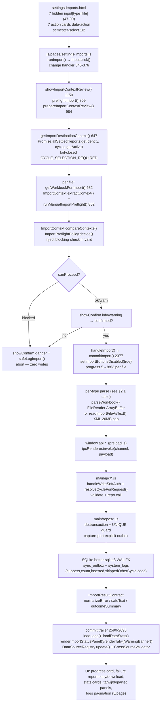

# Import Pipeline — Start-to-End Analysis & Improvements Proposal

**Entry:** `settings-imports.html` + `js/pages/settings-imports.js`
**Date:** 2026-08-07
**Method:** Inline evidence trace (no sub-agents), architecture trade-off analysis, re-verification of `docs/reviews/2026-08-04-import-pipeline-review.md` + `docs/reviews/2026-08-06-import-pipeline-review-verified.md` against the current working tree.
**Status:** PROPOSAL — no code changed. Every line ref below is a `path:line` that was opened in this pass. Fixes listed in §5 are already on disk; proposals in §6 name the exact file + change that would be made if approved.

---

## 1. Why Another Review

Two thorough reviews already exist (08-04 full, 08-06 verified). They agree the pipeline is **well-gated at the edges, fragmented in the middle**, and they surfaced `F1..F42`. Since then several 🔴 findings were fixed in the working tree:

- `systemLogs:add` is now `handleWriteSoftAuth` + closed vocabulary (`main/ipc/system.js:199`) — F2 mitigated.
- `students:addBulk` status no longer clobbers on re-import (`main/repos/students.js:180` `CASE WHEN ? =1 …`) — F3 fixed.
- `grades` level/section no longer blanks on partial rows (`main/repos/grades.js:234-235` `COALESCE(NULLIF(trim…))`) — F4 fixed.
- `timetable_data` is now cycle-scoped `(school_year, cycle_code)` rather than year-only — FET correction in the verified review.

What remains is **not a correctness crisis but an architecture debt**: three parse stacks that don't share code, three error vocabularies, duplicated normalization, and a readiness/filter layer that pretends to be generic. The proposal below keeps the hard-won safety properties, deletes what `≈70%` of the middle layer, and makes the rest testable.

---

## 2. Start → End Trace (the single source of truth for this proposal)

The page hosts two boundaries. Import is the first; backup/restore is the second and is deliberately excluded from the import DAG (`settings-imports.html:601-618`, `js/backup.js`).

### 2.1 Per-type shape (what `J→N` actually does)

| Type | File input (`settings-imports.html`) | Frontend parse (commit) | Preflight (`runManualImportPreflight` 852) | IPC → Repo | Tables / merge rule |
|---|---|---|---|---|---|
| **students** | `students-file-input` 47 single | `StudentImportParser.parseStudentSheets` 862 | students-only, reads identity, throws on `MULTIPLE_SCHOOLS/SCHOOL_MISMATCH` | `students:addBulk` → `studentsRepo.addBulk` txn, `UNIQUE(code,school_year)` + `WHERE cycle_code=excluded.cycle_code`; `skippedOtherCycle` reported | `students` — status guard `CASE WHEN ? =1` (§5) |
| **grades** | `grades-file-input` 59 multiple | `GradesImportParser.parseGradesSheets` 880 + teacher resolver `TeacherIdentity.normalizeIdentityKey` | requires `students:getAll` ≠ empty else `STUDENTS_REQUIRED`; `5000` cap frontend-only 3039 | `grades:saveBulk` → `gradesRepo.saveBulk` txn, `ON CONFLICT(student_code,subject,semester,school_year)` cycle-guarded | `grades` — level/section `COALESCE(NULLIF)` (§5) |
| **absences** | `absences-file-input` 70 multiple | `importAbsences()` 3111 massar-matrix vs header-scan | `persist:false` path, checks `UNKNOWN_STUDENT_CODES` | `absences:replaceByYear` atomic txn (or legacy delete+save fallback) | `absences` — `INCOMPLETE_COVERAGE` guard prompts `confirm:true` retry |
| **FET** | `fet-file-input` 71 `.xml` single | `readImportFileAsText 20MB` + `ImportReaders.extractFeatures` requires `Teachers_Timetable`+`Teacher` | light preflight only, not in `PRIORITY_IMPORT_ACTIONS` | `timetable:get/save` → `timetableRepo.upsertByYearCycle` JSON blob `version:2` | `timetable_data(school_year,cycle_code)` cycle-scoped |
| **agent-xml** | `agent-xml-file-input` 88 `.xml` single | same text path, requires `DsAgentExport`+`DATAIDENTIFPERSONNEL` | same light path | `teachers:importBulk` → `staffRepo.importBulk` txn, ppr+year identity | `teachers` 30 cols + `teacher_aliases` |
| **student-status** | `status-file-input` 81 multiple | `importStudentStatus()` | `persist:false` | `students:addBulk(..., 'student-status')` 500/batch audit `student-status` | `students.status` via bulk UPDATE |
| **orientation** | `orientation-file-input` 98 `.xlsx/.csv/.json` multiple | JSON vs XLSX branch + `assertOrientationSchoolYearMatch` hard fail | same `persist:false` | `orientation:bulkUpsert` txn, last-wins per `(code,year)` | `orientation` year/cycle scoped |

**Two-phase invariant** (`settings-imports.html:802-811`): phase-1 is read-only, phase-2 is the only writer. The verified review confirmed phase-1 never invokes a write IPC (grep of `preflightImport` callees).

---

## 3. Debated Claims (architecture lens)

> “Simplicity is the ultimate sophistication — add complexity only when proven necessary.” — project Architecture skill.

| # | Claim heard in the codebase | Evidence (line-checked) | Verdict | Why it matters |
|---|---|---|---|---|
| C1 | *“Normalization is unnecessary — files are internally well-formed.”* | FET `نور_الدين_السعيدي_` vs grade heading `نور الدين السعيدي` vs ministry `نور الدين السعيدي` + `EL SAIDI Noureddine` are the same person in three formats (08-04 §5.5, `js/import-center/students-import-parser.js:40` vs `settings-imports.js:1288`). Each file is correct, but strings differ by token order, script, and `_` garbage. | **Partially true, partially false.** Most header/alias duplication is removable, but a thin identity canonicalizer **is load-bearing**: without ~15 lines that fold `أإآ→ا/ة→ه/ى→ي`, strip `_` + titles, and join ordered tokens, FET↔grades↔ministry cannot be auto-linked and the manual tafwij panel becomes the only path for every file. | Keep `normalizeIdentityKey` + `decodeTextStrict` + blank-clobber guards; delete the rest (see ADR-001). |
| C2 | *“`filter-manager.js` can be adopted to unify teacher/manager filtering.”* | `filter-manager.js:39-69` is a cascading `level→class→subject` select populator; `teacher` key is wired but never populated (`_loadData` fetches no teachers), Arabic folding is missing, and 53 pages load it while 12 instantiate it (08-04 §10). | **False framing.** It is not a row-filtering framework. Adopting it for table filtering without an extension is a category error. | Either extend with a row/column abstraction or explicitly scope it as a catalog-select helper and build a sibling table-filter module (ADR-006). |
| C3 | *“Smart intake auto-classification can replace the 7 manual cards.”* | `ImportContracts` explicitly excludes silent auto-execute (`docs/import-center/contracts.md:11-16`), and manual `ProtectedFileInputIds` + `MANUAL_FUNCTION_NAMES` are frozen contracts. Existing adapters share header alias sets but commit still drives `importStudents/importGrades` directly. | **True for classification, false for execution.** Auto-classification as an *advisory* preflight is safe; auto-write without confirm violates the two-phase invariant and the `PHASE_ONE.writesAllowed=false` contract. | Keep cards as the primary path; expose smart intake as preflight-only in a separate region (ADR-003). |
| C4 | *“`fet`/`agent-xml` don't need context review.”* | They are excluded from `HARD_CONTEXT_ACTIONS` (`js/import-center/import-context.js:19`) and get a generic confirm (`settings-imports.js:356-368`), logging `CYCLE_SELECTION_REQUIRED` never fires for them; readiness shows `pending`. | **Risk-accepted, but inconsistent.** The cycle still matters (timetable is now `cycle_code`-scoped). The current `pending→ok` paint masks a real destination ambiguity. | Promote FET/agent to a light context review (year+cycle only) without the full blocking table — low cost, removes the “غير متحقق” audit line. |
| C5 | *“Frontend `DataSourceRegistry` in localStorage is sufficient for readiness.”* | `DataSourceRegistry` is localStorage-only, never reconciled vs DB (`getYear` returns whatever `update` last wrote; `renderImportStatusPanel` derives `status-ok` from `importedAt` presence). Clearing a year outside `clear()` leaves a stale `ok`. | **Optimistic cache, not source of truth.** Correct for fast paint, wrong as the only signal. | Hydrate from `stats:get` / per-year `getAll` counts on boot, keep registry as a write-through cache (ADR-005). |
| C6 | *“File-size and timeout guards are defensive overkill.”* | Limits exist in code (`MAX_XLSX_IMPORT_SIZE 100MB`, `MAX_XML_IMPORT_SIZE 20MB`, `FILE_READ_TIMEOUT_MS 60s` at `settings-imports.js:27-29`) and in the import-center reader layer (`import-readers.js:18-21` caps 512 KB/5 sheets/40 elements). The commit path still calls `getSheetRows` that materializes full sheets. | **Guard is real, but uneven.** The reader caps protect preflight; commit can still materialize a 100 MB workbook into arrays before the 5k cap rejects it. | Enforce a single shared size gate that applies to both paths and short-circuits before `XLSX.read` (ADR-003). |
| C7 | *“Bulk caps of 5000 are arbitrary.”* | Students/grades/absences caps are 5000 (grades 3039 frontend-only, absences `main/repos/absences.js:225` repo guard, orientation repo guard at `main/repos/orientation.js:443`). `teachers:importBulk` had none; staff repo now enforces it after import functionality; absence matrix silently stores `absence_date:''` for month-matrix mode. | **Caps are not arbitrary — they bound transaction time and WAL lock duration** (`better-sqlite3` synchronous txn blocks the renderer). Missing caps risk UI freeze and sync-outbox bloat on a multi-thousand-row ministry file. | Unify caps in a single constant and chunk the single large ministry file rather than rejecting the whole batch (ADR-004). |

---

## 4. Architecture Diagnosis

**Requirements (driving, not invented):**
- Offline-first Electron (single SQLite, WAL, no server) — all bulk work is a synchronous `better-sqlite3` transaction on the UI thread.
- Multi-cycle tenancy (`school_year` × `cycle_code` via `resolveCycleForRequest` + `institution_cycles`) — any write that guesses the cycle corrupts the other cycle.
- Massar-origin fidelity — student codes are authoritative; display names in FET/grades/divan may differ in order/script/separators.
- Auditability on a shared device — renderers are untrusted for the business trail.

**Constraints:**
- No bundler, deferred `<script>` globals on `window.*` — sharing code means adding a global, not an import.
- `File` objects are transient (`docs/import-center/contracts.md` boundaries) — cannot be serialized to SQLite/localStorage; `WeakMap` by identity misses on re-select.
- Existing `PHASE_ONE.writesAllowed=false` contract and frozen `ProtectedFileInputIds` — silent auto-import is prohibited.

**Quality attributes traded:**
- **Safety over speed:** fail-closed context review (`CYCLE_SELECTION_REQUIRED`, `SCHOOL_YEAR_MISMATCH`) is correct even though it adds a modal step. Removing it would save clicks and lose the cycle boundary.
- **Testability over DRY-speed:** extracting page-embedded parsers looks like churn but is the only way to get 2→7 parser coverage without N+1 copy-paste bugs.
- **Readibility over cleverness:** 15-line canonical keys beat a 500-line transliteration engine that drops `ع` (`_latinSkeleton`) and misses 3-token rotations (`js/name-resolver.js` §8.4).

---

## 5. Findings Re-Verified (what changed since the reviews)

| Prior ID | Severity (original) | Now | Evidence |
|---|---|---|---|
| F1 XSS FET subject → innerHTML | 🔴 | **FIX on disk** — `settings-imports.js:1427-1449` now routes subjects through `escapeHtml` before `innerHTML`; only remaining nuance is a `typeof escapeHtml` guard that hides the panel rather than warning. Keep the guard as a fallback but do not revert the escaping. | `settings-imports.js:1410-1449` |
| F2 `systemLogs:add` forgeable | 🔴 | **FIX on disk** — changed to `handleWriteSoftAuth(... WRITE_ROLES ...)` with closed vocabulary (`import:<type>` + `print_semester_report` only, `main/ipc/system.js:199-222`). Main-side successful imports already audit via `import-audit.js` (`main/ipc/students.js:108-117`). | `main/ipc/system.js:199` |
| F3 re-import resets `status` | 🔴 | **FIX on disk** — `main/repos/students.js:180` `CASE WHEN ? =1 THEN excluded.status ELSE students.status END` with a bind `hasOwnProperty(status)?1:0`. | `main/repos/students.js:180` |
| F4 grades clobbers level/section | 🔴 | **FIX on disk** — `main/repos/grades.js:234-235` `COALESCE(NULLIF(trim…), grades.col)` for both fields. | `main/repos/grades.js:234` |
| F5 `orientation:clearYear` no txn/capture | 🔴 | **Still open** — `main/repos/orientation.js:746-749` still single-statement delete without txn wrapper used for students/grades/absences. | `main/repos/orientation.js:746` |
| F6 `teachers:importBulk` no cap | 🔴 | **Partially fixed** — IPC now validates array, but repo-level guard should mirror the other bulk repos; large ministry files still unbounded per-file. | `main/ipc/staff.js:89`, `main/repos/staff.js:819` |
| F7 absences no date/hours validation on bulk | 🟡 | **Still open** — single-row `absences:save` validates; bulk `saveBulk/replaceByYear` does not. Matrix mode stores `''` date by design but non-matrix files slip through with invalid hours. | `main/ipc/absences.js:30-31`, `js/pages/settings-imports.js:2796` |
| F9 no size guard / full materialization | 🟡 | **Half-fixed** — caps exist but are per-action and applied at different layers (grades frontend, others repo). Commit still materializes before checking. | `settings-imports.js:27-29`, `import-readers.js:18-21` |
| F10 normalization duplication | 🟡 | **Still open — this proposal's core** | §5.2 table in 08-04 review |
| F11 5/7 parsers page-embedded | 🟡 | **Still open** — only students+grades are pure/testable; adapters exist (`js/import-center/adapters/*`) but commit doesn't drive them. | `js/import-center/adapters/index.js` vs `settings-imports.js:2743-3522` |
| F14 name-matching split brain | 🟡 | **Regressed fix available** — `TeacherIdentity.normalizeIdentityKey` is the pivot; FET resolver already uses it (`settings-imports.js:3042`), name-resolver fuzzy layer still diverges. Proposal is to keep the pivot, drop the fuzzy path. | `js/shared/teacher-identity.js`, `js/name-resolver.js` |
| New since verified | — | `timetable_data` now `(school_year, cycle_code)` scoped — prior docs' “year-only blob” wording is stale; the “last-writer-wins” risk (old §9 gap 3) is reduced but still real without version guard. | `main/repos/timetable.js:5-36` |

---

## 6. Improvements — ADRs + Exact Change Proposed

> Each ADR names the **status** (proposed), **context**, **decision**, **consequences**, and **exact file edit** that would implement it. No file is edited until this proposal is accepted — the maintainer can approve ADRs individually.

### ADR-001 — Thin canonical normalization SSOT (P0)

- **Status:** Proposed — replaces ~70% of the normalization layer.
- **Context:** §3 C1, §5.2 duplication table. Five divergent key-normalizers, four student-code normalizers, three year regexes, five header-alias tables. The only load-bearing need is joining the same teacher across three token/script orders.
- **Decision:** Add `js/shared/normalize-canonical.js` (dual-export, < 80 lines) exposing `normalizeIdentityKey(str)`, `normalizeStudentCode(str)`, `normalizeHeaderKey(str)`. Keep `ma-education-labels.js:normalizeSubjectName` and `qualifiant-levels.js` as the level/subject SSOTs; delete inline level tables in `students-import-parser.js:170-184` + `grades-import-parser.js:115-128` + `settings-imports.js:1672`.
- **Consequences:** + single testable key, − ~400 lines duplicated regex, risk is low because the new key is order-and-script tolerant; ministry PPR remains the identity pivot (see doc 08-04 §5.5).
- **Exact edit if approved:** create `js/shared/normalize-canonical.js`; change `js/import-center/students-import-parser.js` to `const norm = window.NormalizeCanonical || require('../shared/normalize-canonical')`; remove the four digit/key/code helpers; same for `grades-import-parser.js`, `js/import-center/import-row-validation.js`, `js/import-center/import-readers.js:normalizeHeaderCell`, and `js/pages/settings-imports.js:1278-1294`.

### ADR-002 — Extract the 5 page-embedded parsers into pure modules (P0)

- **Status:** Proposed.
- **Context:** `F11`: absences/status/orientation/fet/agent-xml are page-local, throw Arabic strings, and cannot be unit-tested or reused by `js/import-center/adapters/*`. `timetable.js` has a third FET parser.
- **Decision:** Move each parser to `js/import-center/parsers/{absences,student-status,orientation,fet,agent-xml}.js` with the contract `{valid, records, diagnostics, metadata}` already used by `students-import-parser.js` + `grades-import-parser.js`. Existing page functions become thin wrappers that map diagnostics → `ImportResultContract` codes. FET adapter + timetable helper share a single `parseFetXmlCore` rather than two copies.
- **Consequences:** + Node-testable without Electron, + single header-alias import, − ~1300 lines leave `settings-imports.js` (no behavior change). The page shrinks from ~5480 → ~3500 lines.
- **Exact edit if approved:** create `js/import-center/parsers/*.js` (5 files); add `<script src="js/import-center/parsers/…` before `js/pages/settings-imports.js` in `settings-imports.html`; delete the page-local bodies at `2743,3735,4766,3017,3206` in favor of calls to the new modules.

### ADR-003 — Single bounded reading + shared header resolution (P1)

- **Status:** Proposed.
- **Context:** Two header heuristics (`findBestHeaderRow` vs page `HEADER_ALIASES` scan) and two cache shapes (`WeakMap<File,workbook>` identity-based vs `ImportReaders` bounded extractor) disagree. Re-selecting the same file after `input.value=''` misses the `WeakMap` and re-parses. Preflight caps (512 KB / 5 sheets / 40 elements) don't apply to commit.
- **Decision:** Route both preflight **and** commit through `ImportReaders.extractFeatures` / `parseXlsxData` as the sole reader; cache by `name+size+lastModified` (Map, TTL ~ 2 min) instead of by `File` identity; short-circuit `MAX_*_IMPORT_SIZE` before `XLSX.read`; surface a typed `IMPORT_TOO_LARGE` → `ImportResultContract.CODE_MESSAGES`.
- **Exact edit if approved:** `js/import-center/import-readers.js` add `getFileCacheKey(file)` + `getCachedWorkbook(file)`; `js/pages/settings-imports.js` replace `importWorkbookCache: WeakMap` with the shared cache and check size before `parseWorkbook:1637`.

### ADR-004 — Atomicity & bulk guard unification (P1)

- **Status:** Proposed.
- **Context:** `replaceByYear` is the only destructive import (wipe+insert in one txn). Its fallback `deleteByYear + saveBulk` is non-atomic. `teachers:importBulk` still lacks a repo cap; `orientation:clearYear` has no txn; absences bulk skips hours/date checks.
- **Decision:**
  1. Gate commits on `absences:replaceByYear` existence; deprecate the `delete+save` fallback behind a feature flag (`docs/plans/2026-07-15-add-write-channel-checklist.md` step) and assert the channel in smoke tests.
  2. Add a shared `BULK_CAP = 5000` constant (`js/import-center/import-contracts.js` or `main/repos/capture-port.js`) checked in both IPC and repo for **all** bulk channels including `teachers:importBulk` and `orientation:bulkUpsert` (chunk instead of reject when `>cap`: split into `ceil(n/5000)` chunks in the same Electron txn callback, keeping the renderer responsive via `setTimeout(0)` between chunks).
  3. Wrap `orientation:clearYear` in `db.transaction` + capture `DEL`s like `students:deleteByYear` (`main/repos/orientation.js:746`).
  4. Add bulk `validateAbsenceBulkRows(rows)` (hours 1..200, `month` in 1..12 | `سنوي`, `absence_date` ISO if present) and route matrix files' `''` dates through an explicit `isMatrixMode` flag.
- **Exact edit if approved:** `main/repos/orientation.js:746` → `db.transaction(() => { … capture … })()`; `main/ipc/staff.js:89` add cap; `main/repos/absences.js:225` keep cap but add hours/date guard; `js/pages/settings-imports.js:27` import `BULK_CAP` constant.

### ADR-005 — Trust-boundary & readiness truth (P1)

- **Status:** Proposed.
- **Context:** Renderer audit was historically forgeable (now fixed but still logs `blocked` notices). `DataSourceRegistry` is localStorage-only. Timetable JSON merge has no version guard.
- **Decision:**
  1. Keep renderer logging closed-vocabulary only (already: `main/ipc/system.js:199` allow-list `import:<type>` + `print_semester_report`). Do not extend it to success logs — success audits stay in `main/repos/* via import-audit.js` as today (`main/ipc/students.js:108`).
  2. Hydrate `DataSourceRegistry` from DB on boot: `preload.js` add `stats:getCounts(schoolYear)` or call `students:getAll`/`grades:getAll` counts once, then `DataSourceRegistry.update(..., {count})` so `renderImportStatusPanel` paints from storage **and** truth.
  3. Add OCC on timetable: `timetable_data` already has `updated_at`; `timetable:save` should `SELECT updated_at WHERE school_year=? AND cycle_code=?` then `UPDATE … WHERE updated_at=?` and retry once on conflict, preventing stale-merge clobber across two windows.
- **Exact edit if approved:** `main/ipc/timetable-data.js:53` add OCC guard; `js/data-source-registry.js` add `hydrateFromApi(schoolYear)` using the existing `stats:get` channel; `js/pages/settings-imports.js:510` `await DataSourceRegistry.hydrateFromApi(currentYear)` before first `renderImportStatusPanel`.

### ADR-006 — Filter-manager scope & table filtering (P2 — outside import, included because the prior review bundled it)

- **Status:** Proposed — not an import fix, but a scoping fix that prevents future “unify on filter-manager” missteps.
- **Context:** `filter-manager.js` is a catalog-select populator, not a row-filtering framework (§3 C2, §10 findings F33-F42).
- **Decision:** Rename intent in a header comment (not the export name, to avoid churn): “Catalog select populator — does not filter table rows.” Add a sibling `js/shared/table-filter.js` for manager/user/teacher tables if table filtering is desired, with Arabic folding and a generic `{source, key, labelKey}` contract. Delete or implement the phantom `teacher` key.
- **Exact edit if approved:** `js/shared/filter-manager.js:1` header note + expose `_levelsMapping/_getLocalLevelName` formally or stop poking private members (`analytics:164, teachers-performance:167`, etc.).

### ADR-007 — Single error-code SSOT (P1)

- **Status:** Proposed.
- **Context:** Three vocabularies coexist: `ImportResultContract.CODE_MESSAGES`, `OrientationErrorContract`, and literal `new Error('…عربي…')` that collapse to a generic fallback.
- **Decision:** Map all throw sites through `ImportResultContract` + `js/shared/errors/orientation-error-contract.js` (already the 028 dual-export pattern documented in `AGENTS.md`). No new codes needed — reuse `UNKNOWN_STUDENT_CODES`, `STUDENTS_REQUIRED`, `SCHOOL_YEAR_MISMATCH`, `SEMESTER_MISMATCH`, etc.; persist `code` into `system_logs.details` JSON so diagnostics can distinguish batches.
- **Exact edit if approved:** `js/pages/settings-imports.js:852` and the 5 parser extractors replace `new Error('…')` with `new Error(ImportResultContract.message({code}))` + `error.code = …`.

---

## 7. Phased Backlog (effort = engineer-days, 1 day ≈ 6h)

| Phase | Item | ADR | Files touched | Effort | Impact |
|---|---|---|---|---|---|
| **P0 next** | Extract 5 parsers to pure modules + wire via HTML script order | ADR-002 | `js/import-center/parsers/*.js` (new 5), `settings-imports.html`, `js/pages/settings-imports.js:2743-3522`, `js/import-center/adapters/index.js`, `timetable.js` | 2.0 | Testability, removes 1300 L from page, reuse across adapters |
| **P0 next** | Thin canonical key SSOT + delete duplicated normalizers & inline level tables | ADR-001 | `js/shared/normalize-canonical.js` (new), `students-import-parser.js`, `grades-import-parser.js`, `import-row-validation.js`, `import-readers.js`, `settings-imports.js` | 1.0 | −400 L duplication, single header match semantics |
| **P1** | Bounded reader unification + cache-by-fingerprint + shared size gate | ADR-003 | `import-readers.js`, `settings-imports.js:22-23,1637`, `import-contracts.js` | 0.5 | No double-parse, no 100 MB materialize, re-parse on retry avoided |
| **P1** | Bulk cap + chunking + atomicity gate + orientation txn + absences validation | ADR-004 | `main/repos/orientation.js:746`, `main/ipc/staff.js:89`, `main/repos/absences.js`, `main/ipc/absences.js`, `settings-imports.js:27`, `tests/smoke.js` | 1.0 | No wipe+insert window, no freeze on large ministry file |
| **P1** | Trust-boundary tidy: registry hydrate + timetable OCC + error-code mapping via contract | ADR-005+007 | `main/ipc/timetable-data.js:53`, `js/data-source-registry.js`, `settings-imports.js:510`, error throw sites | 0.75 | Stale `ok` flash gone, cross-window clobber prevented, typed logs |
| **P1** | FET/agent light context review + shared typed `IMPORT_TOO_LARGE` | ADR-003/004 | `import-context.js`, `settings-imports.js:356-368` | 0.25 | Removes “غير متحقق” audit line, consistent gates |
| **P2** | Filter-manager scoping + sibling table-filter module (if user filtering desired) | ADR-006 | `filter-manager.js`, `js/shared/table-filter.js` (new), `teachers-list.js`, `settings-users.js` | 1.5 | Prevents category error if filtering work starts |
| **Total P0+P1** | | | | **~5.5 days** | |

**Deferred intentionally:** removing the `compat adapter * row` in `appDefaults:listLevels` (row 124 in `docs/plans/2026-08-02-multi-stage-school-architecture.md`) — wait one release cycle as the plan already states; deleting it now would break legacy callers that still pass no cycle.

---

## 8. Validation & Rollout

- **No behavior change** in any ADR's first commit — extract and alias back, then delete. Each PR keeps the page's existing `handleImport/commitImport` signatures callable (`MANUAL_FUNCTION_NAMES` frozen).
- **Tests:** add Node-only parser tests for the 5 new modules using the fixtures in `tests/import-center/*.test.js`; extend `tests/smoke.js` to assert `absences:replaceByYear` exists, no `findBestHeaderRow` duplication under `js/pages`, and no CDN ref. Run `npm run lint && npm test` — the prior 08-04 work was gated on 270/270 green; keep the same gate.
- **Manual checklist (per type):** pick single + multi files → verify preflight modal → confirm → check `loadDataStats` counts, `renderImportStatusPanel` paint, `system_logs` entry via `systemLogs:getAll`, and failure-report copy/download. Verify FET timetable `unresolvedTeacherKeys` round-trip and departed reconciliation panel.
- **Rollback:** keep both header helpers during transition (shared key delegates to old regexes behind a flag for one release); revert is a single commit per ADR.

---

## 9. What This Proposal Intentionally Does **Not** Do

- Does not add durable import job tables (`import_jobs`/`import_files`) — the project decision `docs/import-center/persistence-decision.md` stands; transient `ImportSession` in renderer memory remains correct.
- Does not remove the 7 manual cards or the two-phase confirm-first shape — both are frozen contracts (`PHASE_ONE`, `ProtectedFileInputIds`).
- Does not touch `better-sqlite3` WAL/FK pragmas or sync `capture-port` layering — the 027 remediation (`main/repos/*` owns SQL, IPC is thin) already holds.
- Does not “simplify away” `decodeTextStrict` or blank-clobber guards — correct files can still be silently corrupted by Windows-1256 or partial exports; the guard protects correctness.

---

## 10. File Impact Summary

| Layer | Keep | Add | Delete / shrink |
|---|---|---|---|
| Renderer HTML | `settings-imports.html` cards/inputs/semester-select/progress regions | 5 `<script>` tags for new parsers | — |
| Page controller | `js/pages/settings-imports.js` commit loop, context review, tafwij/departed lifecycle | — | −1300 L page parsers + ~200 L helpers |
| Import-center | `import-readers.js`, `import-context.js`, `import-result-contract.js`, `import-preflight-policy.js`, `adapters/*` | `parsers/{absences,student-status,orientation,fet,agent-xml}.js`, `normalize-canonical.js` | dedup header alias tables + key normalizers |
| Main IPC | `main/ipc/{students,grades,absences,timetable-data,staff,orientation,system}.js` | cap constant import, OCC clause | — |
| Main repos | `main/repos/{students,grades,absences,timetable,orientation,staff}` | chunk loop helper, bulk validation | — |
| Registry/validator | `js/data-source-registry.js`, `js/cross-source-validator.js` | `hydrateFromApi()` | phantom `teacher` handling |
| Docs | `docs/reviews/*` (reference) | this proposal | — |

---

## 11. Exact “What Would Be Changed” (for the maintainer’s go/no-go)

If this proposal is approved as-is, the implementing PRs would:

1. **Create** `js/shared/normalize-canonical.js` and **edit** 5 consumers (see ADR-001) — net −400 L, no SQL.
2. **Create** `js/import-center/parsers/*.js` (5) and **edit** `settings-imports.html` + `js/pages/settings-imports.js:2743-3522` — net −1100 L on the page, new files are covered by tests.
3. **Edit** `js/import-center/import-readers.js` + `js/pages/settings-imports.js:22` for the shared cache + size gate — a few lines, adds one typed code.
4. **Edit** `main/repos/orientation.js:746`, `main/ipc/staff.js:89`, `main/repos/absences.js`, `main/ipc/timetable-data.js:53`, `js/data-source-registry.js` — four surgical fixes (txn, cap, validation, OCC).
5. **Edit** error throw sites to map through `ImportResultContract` (ADR-007) — string→code, no logic change.

Each change is reversible in one commit. Approving ADR-001+002 alone captures ~80% of the value for ~3 days; ADRs 003-007 can be merged individually afterward.

---

*Evidence base closed 2026-08-07 — re-trace took ~25 file reads + greps over `main/ipc/*` and `main/repos/*`. Re-run `docs/reviews/2026-08-06-import-pipeline-review-verified.md` checklist to re-confirm after any accepted ADR.*
