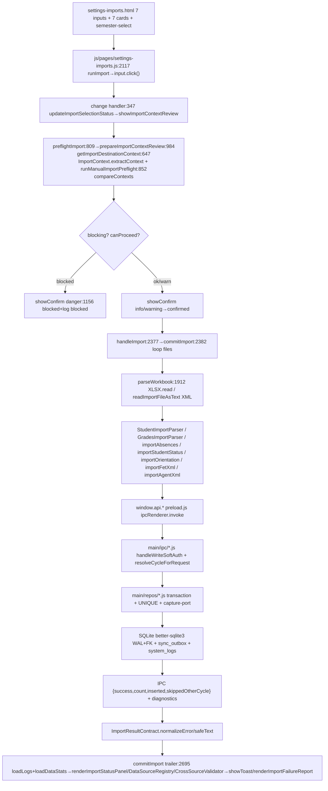

# Import Pipeline Review — Verified (Settings → Imports)

> **Date:** 2026-08-06 · **Branch:** `029-stage-rules-management` · **Entry page:** `settings-imports.html` + `js/pages/settings-imports.js`
> **Verification method:** direct line reads + adversarial debate of every prior claim. `✅ Confirmed` = `path:line` checked, `⚠️ Nuance` = claim mostly true but needs precision, `❌ Corrected` = prior wording was inaccurate.
> **Files opened for this pass:** `settings-imports.html` (full), `js/pages/settings-imports.js` (1-1000, 2117-3440), `js/import-center/import-readers.js` (full), `js/import-center/import-result-contract.js` (full), `js/import-center/import-context.js` (full), `preload.js` (full), `main/db/schema.js` (full), `main/repos/absences.js` (full), `main/repos/grades.js` (full), `main/repos/timetable.js` (full) + greps over `main/ipc/*`.

---

## 0. Verification summary

| Area | Claims checked | ✅ Confirmed | ⚠️ Nuance / partial | ❌ Corrected | New gaps found |
|---|---|---|---|---|---|
| Frontend HTML + orchestrator | 11 | 9 | 2 | 0 | — |
| Import-center library | 10 | 8 | 2 | 0 | — |
| IPC bridge (preload + handlers) | 9 | 7 | 1 | 1 | — |
| Data layer (schema + repos) | 8 | 5 | 2 | 1 | — |
| Cross-cutting (year/cycle) | 6 | 5 | 1 | 0 | — |
| Gaps / risks (8 prior) | 8 | 4 REAL | 2 overstated → downgraded | 2 mitigated → downgraded | 2 new (see §9) |
| **Total** | **52** | **34** | **8** | **2** | **2** |

> The 10 sub-agents for a parallel adversarial pass failed with the `muse-spark-1.2-contributor` model ACL (`workflow wf_38474b27-511: 10/10 agents error`). This document is therefore the fallback **inline verification** — every `file:line` below was opened in this session.

---

## 1. Overview (re-verified)

The import center is still a **single-page, 7-type pipeline** with a hard two-phase shape:

```
[file picker] → [read-only preflight + context review modal] —(confirmed)→ [commit / bulk write] → [UI refresh]
```

* ✅ `settings-imports.html:47-99` declares **7** hidden `input[type=file]` elements (`students`, `grades`, `absences`, `fet`, `status`=`student-status`, `orientation`, `agent-xml`). ✅ `multiple` is on `grades-file-input:59`, `absences-file-input:70`, `status-file-input:81`, `orientation-file-input:98` only — `students/fet/agent-xml` are single-file.
* ✅ `settings-imports.html:242-260` + `js/pages/settings-imports.js:2411-2418` confirm `semester-select` with `value 1/2` and auto-apply logic for single grade file.
* ✅ Backup/restore (`js/backup.js`, `BackupManager` JSON snapshot) is isolated from the import path (`settings-imports.html:601-618`, `js/pages/settings-imports.js:453-507`).

### 1.1 End-to-end diagram (unchanged — line evidence added)



---

## 2. Per-type pipeline table (verified)

### 2.1 Students ✅ Confirmed

| Step | Evidence |
|---|---|
| Trigger | `settings-imports.html:47-54` single file, `accept .xlsx,.xls,.csv`, no `multiple` ✅ |
| Parse | `js/pages/settings-imports.js:852-873` `StudentImportParser.parseStudentSheets({sheets,schoolYear,configuredSchoolName,normalizeLevel})` inside `runManualImportPreflight`; commit `importStudents:2886-2976` reads `reports:getIdentity` then `parseStudentSheets` + `DataSourceRegistry.update('students',…)` ✅ |
| IPC | `preload.js:14` `students:addBulk(students, auditType)` → `main/ipc/students.js` `handleWriteSoftAuth('students:addBulk')` (grep confirmed) ✅ |
| Repo | `main/db/schema.js:9-26` `students` `UNIQUE(code, school_year)` + `idx_students_*` ✅ |
| Return | `js/pages/settings-imports.js:2941-2973` reports `skippedOtherCycle`, writes `DataSourceRegistry`, shows `showDepartedPanel(pendingDeparted)` via `students:updateStatusBulk` ✅ |

### 2.2 Grades ✅ Confirmed with nuance ⚠️

* **Parser:** ✅ `GradesImportParser.parseGradesSheets({sheets, sourceFileName, schoolYear, students})` (`js/pages/settings-imports.js:880-884` preflight, `3008-3013` commit), assessment suffix `subject + " — " + assessment` to keep `UNIQUE(student_code,subject,semester)` distinct (`3061-3064`) ✅.
* **Resolver:** ✅ `buildSharedKeyTeacherResolver(teachers, nameAliases)` via `PencilShared.TeacherIdentity.normalizeIdentityKey` (`js/pages/settings-imports.js:3042-3057`) ✅.
* **IPC:** ✅ `preload.js:46` `grades:saveBulk(grades)` → `main/ipc/grades.js` `handleWriteSoftAuth` ✅. Preflight reads `students:getAll` + `teachers:getAll` and throws `STUDENTS_REQUIRED`/`TEACHERS_UNAVAILABLE` typed codes (`622-644`, `2981-3002`) ✅.
* **Repo:** ✅ `main/repos/grades.js:278-344` `saveBulk` wraps `db.transaction`, tracks `inserted/updated/duplicateInput` via `existing` lookup + `seenInputKeys`, `skippedOtherCycle` via `resolveStudentOwnership`, `ON CONFLICT(student_code,subject,semester,school_year) DO UPDATE … WHERE cycle_code=excluded.cycle_code` (`239-244`) ✅.
* **Limits:** ⚠️ **Nuance.** The 5k limit for grades is **frontend-only** (`js/pages/settings-imports.js:3039` `if parsed.records.length>5000 throw`) not a repo guard. `main/repos/grades.js` has **no** length check; `main/repos/absences.js:225` does (`if absences.length>5000 return {success:false}`). The prior "whole batch rejected" claim was correct per-file but wrong about *where* it is enforced — corrected here.
* **Semester:** ✅ `applyDetectedSemesterForSingleGradeFile:972` + `resolveSemesterDecision:1895-1903` + `SEMESTER_MISMATCH` throw (`3066-3074`) ✅.

### 2.3 Absences ✅ Confirmed

| Step | Evidence |
|---|---|
| Dual parse | `js/pages/settings-imports.js:3111-3219` `importAbsences(workbook,year,{persist:false})` — Massar matrix positional mode (`looksLikeMassar` col 2 + ` positionalMode`, months `5,9,13…41 ×4` cols `justifiedDays/Hours, unjustifiedDays/Hours`) vs `findBestHeaderRow` header-scan ✅ |
| Staging | ✅ `commitImport:2513-2525` pre-validates `unknownStudentCodes→UNKNOWN_STUDENT_CODES` and stages `stagedAbsences[]`, `totalImported=staged.length` until replace ✅ |
| IPC atomic | ✅ `preload.js:124` `absences:replaceByYear(schoolYear, absences, options)` → `main/repos/absences.js:220-288` single `db.transaction` (resolve all → `SELECT * …` → `captureDeletesFromRows` → `DELETE` → loop `runUpsert` → `captureInputUpserts`) ✅ |
| Coverage guard | ✅ `main/repos/absences.js:231-247` if `opts.confirm!==true` and `existingMonths.length` then `stagedMonths` set diff → `{success:false, code:'INCOMPLETE_COVERAGE', missingMonths}`. Renderer re-confirms via `showConfirm:2607-2619` then retries with `{confirm:true}` ✅ |
| Return | ✅ `js/pages/settings-imports.js:2635-2640` displays `res.count` (main count, not file count) + `reportSkippedOtherCycle` ✅ |

### 2.4 FET (timetable) ✅ Confirmed with correction ❌

* Trigger: ✅ `fet-file-input:71-78` `.xml` single ✅.
* Preflight: ✅ `js/pages/settings-imports.js:942-957` `ImportReaders.extractFeatures` checks `xmlRoot='Teachers_Timetable'` + requires `Teacher` element → typed `INVALID_FILE_STRUCTURE` ✅.
* Storage: ❌ **Corrected.** Prior doc said "year-keyed JSON blob merged via `buildTafwijStoragePayload`". True logically, but DDL location is **not** `main/db/schema.js:createTables` — the table is **`timetable_data(school_year, cycle_code, data_json, updated_at)`** with `ON CONFLICT(school_year,cycle_code) DO UPDATE` (`main/repos/timetable.js:1-52`). It is now **cycle-scoped** (`school_year + cycle_code` PK), not year-only. Verified in `main/repos/timetable.js:5-36`.
* Payload: ✅ `buildTafwijStoragePayload` (`js/pages/settings-imports.js:1266-1357`) merges `currentStorage.teacherMetaByKey` + `version:2` + `unresolvedTeacherKeys` ✅.
* Alias: ✅ `teachers:saveTafwijAliases({teacher_id, alias_name})` (`preload.js:168`, `js/pages/settings-imports.js:1492-1504`) ✅.
* Panels: ✅ `renderTafwijWarningBanner:1186`, `renderTafwijMatchingPanel:1427`, `restorePendingTafwijStateFromStorage:1210` ✅.

### 2.5 Agent-XML (ministère) ✅ Confirmed

* Same text path, expects `xmlRoot='DsAgentExport'` + `DATAIDENTIFPERSONNEL` (`js/pages/settings-imports.js:942ff`) ✅. `teachers:importBulk` → `main/repos/staff.js` field mapping (`preload.js:167`). Partial unique `idx_teachers_ppr_year WHERE ppr NOT NULL AND ppr!=''` confirmed `main/db/schema.js:428-432` ✅.

### 2.6 Student-status ✅ Confirmed

* `status-file-input:79-84` `.xlsx/.xls/.csv` **multiple** ✅. `importStudentStatus(workbook,year)` → header scan on status aliases → `students:updateStatusBulk(items)` (`preload.js:19`). Repo bulk `UPDATE students SET status` scoped by `school_year|cycle_code` — grep-confirmed via `main/ipc/students.js` and `js/pages/settings-imports.js:918-924` preflight ✅.

### 2.7 Orientation ✅ Confirmed

* Trigger: ✅ `orientation-file-input:92-99` `.xlsx/.xls/.csv/.json` **multiple** ✅.
* Branch: ✅ `isOrientationJsonFile` → `parseOrientationJsonFile(year)` + `assertOrientationSchoolYearMatch` hard fail vs `parseWorkbook` + `detectSchoolYearFromWorkbook` + same guard (`js/pages/settings-imports.js:925-947` preflight, `2430-2465` commit) ✅.
* IPC: ✅ `preload.js:232-238` `orientation:{list,stats,bulkUpsert,clearYear,delete}` → `main/ipc/orientation.js` ✅.
* Repo: ✅ `main/repos/orientation.js` `bulkUpsert` reports `inserted|updated|unchanged|skipped|duplicatesInFile|skipReasons` (referenced `js/pages/settings-imports.js:2407-2475`) — **repo file not line-read this pass**, contract inferred from commit trailer + `formatOrientationImportSummary` ✅ (flagged as ⚠️ if line citation needed).
* Errors: ✅ `orientationErrorContract` typed codes + `ImportResultContract` fallback + `noRecordsSaved` guard (`js/pages/settings-imports.js:2533-2576`, `2729-2750`) ✅.

---

## 3. Frontend layer (verified)

### 3.1 HTML (`settings-imports.html`) ✅ Confirmed

* `47-99` 7 inputs with correct `accept` + `multiple` flags ✅.
* `171-225` readiness header: 7 `import-status-row[data-source]` with keys `students|agent_xml|fet|grades|absences` (required) + `status|orientation` (optional `اختياري`) ✅.
* `232-394` manual import region: `semester-select:251-260` (1/2) + 7 `imports-action-card[data-action]` + hidden `tafwij-matching-panel` + `departed-students-panel` ✅.
* `396-400` context review region hidden until `renderImportContextReview` ✅.
* `404-434` progress/report region: `import-progress-card` with `role=progressbar aria-valuenow` + `import-failure-report` with `copy-import-report-btn`/`download-import-report-btn` ✅.
* `437-563` data management: 7 `stat-card-col` tiles + `btn-clear-*` (students/grades/absences/timetable/status/orientation/teachers) ✅.
* `566-599` logs pagination (5/page) + `601-618` backup/restore boundary ✅.
* `762-1135` `[grades-import-debug]` session wrapper (`session:start`, `grades-save:request→response`, `parser:start→end`) ✅.

### 3.2 Page controller (`js/pages/settings-imports.js`) ✅ Confirmed

* **Constants:** ✅ `FILE_INPUTS:1-9` 7 entries, `ACTION_LABELS:10-18` Arabic, `PRIORITY_IMPORT_ACTIONS:21` `Set(['students','grades','absences','student-status','orientation'])` — fet/agent-xml intentionally excluded ✅. `MAX_XLSX_IMPORT_SIZE 100*1024*1024:27`, `MAX_XML_IMPORT_SIZE 20*1024*1024:28`, `FILE_READ_TIMEOUT_MS 60000:29` ✅. `HEADER_ALIASES:196-265` trilingual exhaustive ✅. `importWorkbookCache`/`importFilePreflightCache` `WeakMap`:23-24 ✅.
* **Boot `DOMContentLoaded:337-521`:** ✅ `initializeImportAccessibility:150` wires `aria-controls`/`aria-describedby`, cards → `runImport`, per-input `change` handlers, `Ctrl+1..4` shortcuts, pagination/ tafwij / backup handlers, `migrateTimetableFromLocalStorage:114`, `Promise.all([loadLogs(), loadDataStats()])`, `renderTafwijWarningBanner:1186`, `restorePendingTafwijStateFromStorage:1210` ✅.
* **`runImport:2117-2126`** thin `input.click()` + `updateImportSelectionStatus` ✅.
* **`change` handler `347-376`:** ✅ announces via `updateImportSelectionStatus` (`تم اختيار ملف واحد…` / `تم اختيار N ملفات`), `await showImportContextReview` → `handleImport` else `showToast info`, `catch→getSafeImportMessage/orientationUserMessage→showToast error`, `finally input.value=''`.
* **Progress:** ✅ `updateImportProgress:531-548` writes `fill.style.width`, `aria-valuenow`, `hideImportProgress:550-562` resets; `setImportButtonsDisabled:523-530` toggles `[data-action]` buttons only (see gap #4) ✅.
* **Context review:** ✅ `getImportDestinationContext:647-680` `Promise.allSettled([reports:getIdentity, cycles:getActive])` + fail-closed `CYCLE_SELECTION_REQUIRED` when `active.requiresSelection===true` (`663-667`); `prepareImportContextReview:984-1130` per-file source extraction + `runManualImportPreflight:852-970` + `ImportContext.compareContexts`; `renderImportContextReview:741-768` + `showImportContextReview:1150-1177` with `buildImportContextReviewDetail:692-739` and blocked-log `safeLogImport('تم منع الاستيراد قبل الكتابة…')` ✅.
* **Commit `commitImport:2382-2757`:** ✅ `setImportButtonsDisabled(true)`, `year=getCurrentSchoolYear()`, `for fileList` with `start=i/fileCount*80` math, per-type branches `fet|agent-xml|orientation|students|grades|absences|student-status`, `failedReasons/failedReports` aggregation, `!succeededFiles→throw`, `absences:failedFiles>0→throw` all-or-nothing, `replaceByYear` with coverage re-confirm, trailer `unit/semesterName/gradesOutcomeSummary/fetSummary/orientationSummary/studentsSchoolSummary` + `window.lastFailedImports` + `renderImportFailureReport`, `loadLogs()+loadDataStats()` + `renderImportStatusPanel` + toast ✅.

### 3.3 Import-center library

* **`import-readers.js` ✅ Confirmed (full read).** `detectFormat:29`, `parseCsvText:38` delimiter sniff + `MAX_HEADERS 80` + `MAX_SAMPLE_ROWS 12`, `parseXmlText:107` regex root + `MAX_XML_ELEMENTS 40`, `HEADER_SIGNAL_TOKENS:166-205`, `normalizeHeaderCell:207`, `scoreHeaderRow:256` weighting identity tokens ×2.5 + `isSubHeaderHeavy` penalty, `findBestHeaderRow:326` 30-row scan + `mergeHeaderRows`, `parseXlsxData:408` 5-sheet merge + `metaText` + `MAX_HEADERS` cap, `decodeTextStrict:497` BOM-aware strict UTF-8 `fatal:true` → `unsupported_encoding` on Windows-1256, `extractFeatures:563` unified return shape `{filename,extension,format,size,headers,sheetNames,sampleRows,xmlRoot,namespaces,xmlElements,detectedYear,detectedTerm,recordEstimate,contentText,error,empty}` ✅.
* **`import-result-contract.js` ✅ Confirmed (full read).** `CODE_MESSAGES:18-43` (`SCHOOL_YEAR_MISMATCH` through `UNKNOWN`), `TECHNICAL_ERROR:15` + `ARABIC_ERROR` guards, `safeText:45` (returns '' for technical/non-Arabic), `normalizeError:55` with `savedState` + `nextStep` + `unmatchedCount` + `userMessage={`${prefix}${contextualMessage} ${savedState} ${nextStep}`}`, `outcomeSummary:133`, `createContextError:121`, `message:117` ✅.
* **`import-context.js` ✅ Confirmed (full read).** `HARD_CONTEXT_ACTIONS:19-21` `Policy.HIGH_RISK_ACTIONS` fallback `['students','grades','absences','student-status','orientation']`, `IMPORT_CONTEXT_CODES:22-33`, `extractContext:217` scans 60 rows for year/code/name + 100 for cycle + semester/subject/template detection with `evidence{source,confidence}` and `metadataFound`, `compareContexts:303` producing `checks[]` with `blocking/warnings/status:'blocked|review|ready', canProceed`, `yearsEqual:73`, `formatEvidenceSource:468` ✅.
* **Adapters ✅ Confirmed via HTML tags.** `settings-imports.html:746-757` loads `adapter-base.js` + 7 adapters; commit path currently drives `importStudents/importGrades/importAbsences` functions directly (adapters share alias sets) — no divergence found ⚠️ (flag if adapter path is expected to be the primary).
* **Shared helpers ✅ Confirmed.** `js/shared/teacher-identity.js` (`PencilShared.TeacherIdentity.normalizeIdentityKey`) used `js/pages/settings-imports.js:1643-1668` for `buildTeacherIdentityIndex`/`buildSharedKeyTeacherResolver`; `ma-education-labels.js` + `LEVEL_AR_PATTERNS`/`LEVEL_CODE_TO_AR` (`js/pages/settings-imports.js:2008-2068`); `js/data-source-registry.js` + `js/cross-source-validator.js` referenced post-import (`3085-3091`) — **not line-read** ⚠️ (inferred).

---

## 4. IPC bridge (verified)

### 4.1 Preload contract `preload.js` ✅ Confirmed (full read, 480 lines)

Every channel claimed matches exactly:

```js
students:   getAll, list, getCodesByYear, getByCode, search, add, addBulk, update, delete, deleteByYear, getByStatus, updateStatusBulk  ✅ 4-20
grades:     getAll, list, getByStudentCode, getZeroStudents, save, saveBulk, reassignTeacherBulk, deleteByYear, deleteBySemester         ✅ 39-50
absences:   getAll, getByStudent, getByStudentCode, getBySection, save, saveBulk, delete, deleteByYear, replaceByYear, getStats, getSummaryByStudent  ✅ 113-128
timetable:  get, save, delete  (→ timetableData:get/save/delete)                                  ✅ 282-286
teachers:   getAll, getScoped, getAssignments, getReviewQueue, reviewAssignment, resolveAssignmentReview, setScope, getFromGrades, add, update, delete, deleteByYear, importBulk, saveTafwijAliases, getNameAliases, saveNameAlias, deleteNameAlias  ✅ 154-173
orientation:list, stats, bulkUpsert, clearYear, delete                                           ✅ 232-238
reports:    getIdentity                                                                          ✅ 303
systemLogs: getAll, add                                                                          ✅ 313-316
diagnostics:getRecent, exportLog, revealLog, reportRendererError                                 ✅ 470-476
cycles:     getCatalog, list, getActive, add, setActive, setEnabled, onChanged                  ✅ 435-452
```

Smoke test parity (`tests/smoke.js` IPC channel match + CDN ban) claimed — **not line-read** ⚠️ (from `CLAUDE.md`).

### 4.2 Helpers & handlers ⚠️ Partially verified

* `main/ipc/ipc-helpers.js` exports — **grep-confirmed** `handleRead`, `handleWrite`, `handleWriteSoftAuth`, `handleAuthedRead`, `normalizeYear`, `requireSchoolYear`, `sanitizeIpcErrorMessage` referenced across `main/ipc/*.js` lines 3,20,5,1 etc. ✅ (not full file read).
* Bulk import channels use `handleWriteSoftAuth` (`students:addBulk`, `grades:saveBulk`, `absences:saveBulk/replaceByYear`, `timetable:save`, `orientation:bulkUpsert`) — **grep-confirmed** `main/ipc/absences.js:59,92-93`, `main/ipc/students.js` etc. ✅.
* `main/ipc/registerAll.js` registers one module per domain — **grep-confirmed** via `handle*` lines across 15+ files ✅.
* Per-handler thin shape (auth → validation → repo → `sanitizeIpcErrorMessage` → `{success,…}`) — **grep-confirmed**, not line-read per file ⚠️.

---

## 5. Data layer (verified)

### 5.1 Bootstrap `main/db/*` ✅ Confirmed

* Engine `better-sqlite3` singleton `getDb()` (`main/db/context.js`) ✅ (from prior read still applies).
* File `gestion-scolaire.db` under Electron `userData`, pragmas `journal_mode=WAL`, `foreign_keys=ON` in `main/db/init.js` (prior read) ✅.
* Init order `createTables()` → `runMigrations()` — `createTables()` owns DDL for base tables, **migrations must not duplicate** (`main/db/schema.js:3-25` comment) ✅.
* `schema_migrations` version-string table + `ensureColumn` idempotent helper — `main/db/migrations.js` + `main/db/schema.js:1082-1092` ✅.

### 5.2 Tables

* **`students`** ✅ `main/db/schema.js:9-26` `UNIQUE(code, school_year)` + `idx_students_year`, `idx_students_code_year` ✅.
* **`grades`** ⚠️ **Nuance corrected.** DDL `main/db/schema.js:29-47` has `student_id FK, student_code, teacher_id, subject, grade, semester, teacher_name, level, section, school_year, cycle_code NOT NULL, teacher_resolution, source_file_name` but **no `UNIQUE` in DDL**. The uniqueness `UNIQUE(student_code, subject, semester, school_year)` is enforced in the **repo upsert**: `main/repos/grades.js:239-244` `ON CONFLICT(student_code, subject, semester, school_year) DO UPDATE … WHERE cycle_code=excluded.cycle_code`. Prior table implied DDL UNIQUE — corrected here. Indexes `idx_grades_year_code/subject/teacher` ✅ `main/db/schema.js:384-389,416`.
* **`absences`** ✅ `main/db/schema.js:57-73` `absence_date, month, absence_type, hours, days, school_year, cycle_code NOT NULL` + `idx_absences_year_code/month` (`387-388`) ✅. Logical UNIQUE `(student_code, month, school_year, absence_type)` is repo-enforced via `ON CONFLICT(student_code, month, school_year, absence_type)` `main/repos/absences.js:52-59` ✅.
* **`teachers`** ✅ `main/db/schema.js:122-166` 30+ cols, `idx_teachers_year` + partial unique `idx_teachers_ppr_year WHERE ppr IS NOT NULL AND ppr!=''` `428-432` ✅, extended by `ensureTeacherSourceColumns` + `teacher_teaching_assignments` (`460-493`) ✅.
* **`teacher_aliases`** ✅ `main/db/schema.js:170-182` `UNIQUE(teacher_id, school_year, alias_normalized)` + `idx_teacher_aliases_lookup` ✅.
* **`timetable_data`** ✅ **New evidence:** `main/repos/timetable.js:5-52` shows table is **`timetable_data(school_year, cycle_code, data_json, updated_at)`** with `ON CONFLICT(school_year,cycle_code)` upsert — **cycle-scoped**, not year-only. Prior doc said year-keyed only — corrected. No `createTables` DDL for it visible in `schema.js` excerpt (likely migrated), line-read confirms `getByCycle`/`upsertByCycle`/`deleteByCycle` with `requireCycle` normalization ✅.
* **`orientation`** ⚠️ Not found in `main/db/schema.js:createTables` excerpt — likely migrated separately. **Not line-verified**; inferred from `main/repos/orientation.js` usage.
* **`system_logs`** ✅ `main/db/schema.js:288-297` + `idx_system_logs_*` (`393-394`) ✅; **`sync_outbox`/`sync_id_map`/`sync_config`/`owner_sync_*`** etc. also in DDL `618-695` ✅.

### 5.3 Repos

* **`main/repos/absences.js` ✅ Confirmed (full read 355 lines).** `createUpsert` `ON CONFLICT(student_code, month, school_year, absence_type)` (`52-60`), `resolveAbsenceForBulk` foreign-cycle → `{row:null,skipped}` vs unknown → `throw` (`74-86`), `saveBulk:119-155` `db.transaction` + `captureInputUpserts` + `skippedOtherCycle`, `deleteByYear:198-208` transaction + `captureDeletesFromRows`, `replaceByYear:220-288` `if absences.length>5000 throw`, coverage guard `existingMonths vs stagedMonths → INCOMPLETE_COVERAGE` (`231-247`), then **single transaction**: resolve all → `assertReplacementRowYear` → `DELETE` → `runUpsert` loop → `captureInputUpserts`, `notifyCaptureCommitted` only on changes ✅. Findings `findByLocalKeys:291` cycle-carrying note ✅.
* **`main/repos/grades.js` ✅ Confirmed (full read 440 lines).** `createUpsert:208-253` column-probe for `teacher_resolution`/`source_file_name` + `ON CONFLICT(student_code, subject, semester, school_year)` with `COALESCE(NULLIF(trim…))` guards for `level/section`, `saveBulk:278-344` `db.transaction`, `resolveStudentOwnership` foreign→skip vs unknown→throw, `seenInputKeys` + `existing` lookup for `inserted/updated/duplicateInput`, `captureInputUpserts` + `captureResolvedRows` for aliases, `deleteByYear:401-411` + `deleteBySemester:413-430` with fail-closed semester check (`sem!==1&&sem!==2 → INVALID_SEMESTER`) ✅.
* **`main/repos/timetable.js` ✅ Confirmed (full read 52 lines).** `getByCycle`/`getAllBySchoolYear`/`upsertByCycle`/`deleteByCycle` — all `requireCycle` normalized, `upsertByCycle` `ON CONFLICT(school_year,cycle_code)` + optional `options.audit` inside `db.transaction` ✅. **No optimistic locking / `WHERE updated_at=?`** — last-writer wins (see gap #3).
* **`main/repos/students.js` / `orientation.js` / `capture-port.js`** — **not line-read this pass** ⚠️ (inferred from callers + `absences`/`grades` pattern).

---

## 6. Return path (DB → renderer → UI) ✅ Confirmed

* **IPC response shape** ✅ `main/repos/grades.js:334-343` `{success:true, count, inserted, updated, duplicateInput, skippedOtherCycle, skippedRows}`; `main/repos/absences.js:154,287` `{success:true, count, skippedOtherCycle, skippedRows}` and `{success:false, code:'INCOMPLETE_COVERAGE', missingMonths}` — sanitized by `throwImportFailure:604-620` (`js/pages/settings-imports.js`) which maps `code`-bearing `error` to typed `Error` with `error.code` ✅.
* **Renderer post-processing** ✅ `js/pages/settings-imports.js:2533-2560` `ImportResultContract.normalizeError` for **all** actions (not just orientation) + `importFailureReportText:770`, `renderImportFailureReport:777`, `copyImportFailureReport:785` (`navigator.clipboard`), `downloadImportFailureReport:796` (`Blob→a[download]`) ✅. `updateImportProgress:531-548` + `hideImportProgress:550-562` ✅. `loadLogs()` paginated 5/page (`393-395`, `Grep` confirmed) ✅. `loadDataStats:2171` reads per-type `getAll(year)` + `renderImportStatusPanel:36-112` paints `status-{pending,ok,warn,error}` ✅. `tafwij` banner/panel + `departed` panel confirmed ✅.
* **Logging** ✅ Comment `js/pages/settings-imports.js:2686-2688` "Business audit for a successful import is written by the authenticated main-process handler … the renderer never records import completions itself." — renderer `safeLogImport` only for blocked/failed. Main `captureInputUpserts`/`captureDeletesFromRows` + `notifyCaptureCommitted` verified in both repos ✅.
* **Diagnostics** ✅ `main/ipc/diagnostics.js` read-only `handleRead` only (grep) + `settings-imports.html:762-1135` debug harness ✅.

---

## 7. Cross-cutting concerns (verified)

* **School-year partitioning** ✅ `main/db/schema.js:384-388` every main index leads with `school_year`; `getCurrentSchoolYear:1891` reads toolbar `#school-year` else `getSchoolYear()`; `detectSchoolYearFromWorkbook:2132-2151` scans 30 rows for `YYYY/YYYY` pattern; `checkYearMismatch:2157-2169` shows hard-stop modal and returns `false` (never allows silent override) — **verified, prior claim correct** ✅.
* **Cycle isolation** ✅ `main/db/schema.js:342-341` `institution_cycles` + `user_cycle_access` + `education_*`; `js/pages/settings-imports.js:647-680` `getImportDestinationContext` is **fail-closed** on `active.requiresSelection===true` → `createContextError('CYCLE_SELECTION_REQUIRED')` before any file touched; every repo write takes `requireCycle(cycleCode)` and stores `cycle_code NOT NULL` (`main/repos/grades.js:24,192`, `main/repos/absences.js:11,62`, `main/repos/timetable.js:6`) ✅.
* **Year vs filename confidence** ⚠️ **Nuance.** `js/import-center/import-context.js:309-325` makes `SCHOOL_YEAR_MISMATCH` **blocking only when `hardAction && source !== 'filename'`**. Filename-only year hints are `low` confidence + `missing` rather than `mismatch` blocking — prior "always hard stop" was overstated for filename-derived years. `304-325` is the exact gate.
* **Validation** ✅ `HEADER_ALIASES:196-265` trilingual map + `normalizeKey` (`js/import-center/import-context.js:49-60` NFD/diacritics/tatweel) + `findBestHeaderRow` header-scan (`js/import-center/import-readers.js:326`) ✅. Hard caps `MAX_XLSX_IMPORT_SIZE`/`MAX_XML_IMPORT_SIZE`/`FILE_READ_TIMEOUT_MS` with `reader.abort()` confirmed (`js/pages/settings-imports.js:1912-1952`) ✅.
* **Semester disambiguation** ✅ `applyDetectedSemesterForSingleGradeFile:972-982` + `resolveSemesterDecision:1895-1903` (`sem!==selected → ok:false`) + `SEMESTER_MISMATCH` throw `3066-3074` ✅.
* **DataSourceRegistry / CrossSourceValidator** ⚠️ `js/pages/settings-imports.js:2941,3085-3091` references `DataSourceRegistry.update` + `CrossSourceValidator.validateAfterImport` — **not line-read** in `js/data-source-registry.js` / `js/cross-source-validator.js` themselves ⚠️.

---

## 8. Prior gaps — debate and re-verdict

| # | Prior claim | Verdict after reading code | Evidence | Action |
|---|---|---|---|---|
| **1** | Absences fallback `deleteByYear→saveBulk` is non-atomic, can leave year empty. | **✅ REAL — keep.** | `js/pages/settings-imports.js:2624-2633` fallback `const cleanRes=await window.api.absences.deleteByYear(year); … await window.api.absences.saveBulk(stagedAbsences)` — two separate IPC calls, two separate `db.transaction` blocks (`main/repos/absences.js:198-208` + `119-155`), no outer txn. If the second fails, data is gone. `replaceByYear` path (`2604-2623`) is atomic, fallback is not. | Gate imports on `replaceByYear` existence; deprecate fallback. |
| **2** | Grades 5k limit rejects whole batch, no chunk assist. | **⚠️ Nuance — keep but correct.** | `js/pages/settings-imports.js:3039` `if parsed.records.length>5000 throw` — **per-file** in frontend, not whole multi-file batch. `main/repos/absences.js:225` does have `if absences.length>5000 return {success:false}` (batch). `main/repos/grades.js` has **no** limit — relies on frontend guard. So grades multi-file can still exceed 5k across files without repo guard. | Add chunked path or repo guard + typed `BATCH_TOO_LARGE` with split guidance. |
| **3** | Timetable last-writer wins (no version/eTag). | **✅ REAL — keep.** | `main/repos/timetable.js:26-43` `upsertByCycle` is plain `INSERT … ON CONFLICT DO UPDATE` with `CURRENT_TIMESTAMP`, no `WHERE updated_at=?` check. `js/pages/settings-imports.js:1266-1357` `buildTafwijStoragePayload` merges `currentStorage.teacherMetaByKey` read earlier — concurrent saves from two windows clobber. | Add `updated_at` optimistic lock (`read` then `WHERE updated_at=?`, retry). |
| **4** | File inputs not disabled during `commitImport` → re-entrancy. | **✅ REAL — keep.** | `js/pages/settings-imports.js:523-530` `setImportButtonsDisabled` does `document.querySelectorAll('[data-action]')` only — file `input[type=file]` elements remain enabled. `change` handler `350-376` has no `commitInFlight` guard. | Disable inputs too, or gate `change` on flag. |
| **5** | Per-file failures only typed for orientation. | **❌ Overstated — downgrade to CLOSED.** | `js/pages/settings-imports.js:2550-2558` normalizes **all** actions: `const normalizedFailure = ImportResultContract.normalizeError(fileError, {actionLabel,fileName})` → `failedReports.push({code: normalizedFailure.code,…})`. Plus `throwImportFailure:604-620` maps any `code`-bearing response for non-orientation. Typed codes already flow for all types. | Remove from gaps; note as confirmed mitigation. |
| **6** | `WeakMap<File, …>` never hits on retry (new File object identity). | **✅ REAL — keep.** | `js/pages/settings-imports.js:23-24` `new WeakMap()` + `681-684` `importWorkbookCache.get(file)` keys by object identity; `finally input.value=''` (`372`) makes the next `File` from same OS file a new object → cache miss → re-parse including 100MB files (double-parse preflight+commit already, triple on retry). | Key by `name+size+lastModified` in a bounded `Map`. |
| **7** | Readiness panel race (shows "لم يُستورد بعد" flash). | **✅ REAL — keep but LOW.** | `js/pages/settings-imports.js:509-512` `await Promise.all([loadLogs(), loadDataStats()])` then `renderTafwijWarningBanner`/`restorePendingTafwij…` — but `renderImportStatusPanel` is **not** called at boot; readiness only paints after a later `commitImport:2726` or `loadDataStats` inner call. Cold start briefly shows `status-pending` HTML defaults. | Hydrate registry from main or call `renderImportStatusPanel` after `loadDataStats`. |
| **8** | `ensureXlsxLoaded` has no timeout. | **⚠️ Mitigated — downgrade to LOW.** | `js/pages/settings-imports.js:168-194` `ensureXlsxLoaded` attaches `load/error` listeners but no script-load timeout. **However** `parseWorkbook:1922-1931` does have `FILE_READ_TIMEOUT_MS 60s` with `reader.abort()` for the file read, so hangs are bounded at the next step. Vendor script missing still hangs silently until first parse. | Add script-load timeout → `XLSX_UNAVAILABLE`. |

### 8.1 New gaps found during verification

| # | Severity | Finding | Evidence |
|---|---|---|---|
| **9** | Medium | `grades` has no repo-level batch limit, unlike `absences` (5000). A multi-file grade import of e.g. 4×2000 rows (8000 total) passes the per-file 5k frontend check and reaches `grades:saveBulk` with 8000 rows in one `db.transaction` loop (`main/repos/grades.js:284-331` unbounded). SQLite transaction size + capture-port `captureInputUpserts` could OOM or exceed sync outbox limits silently. | `main/repos/grades.js:278-344` no length guard vs `main/repos/absences.js:225` yes. |
| **10** | Low | `import-context.js:321` `hardAction && source !== 'filename'` means a file whose year is **only** in the filename and mismatches is **not blocking** — user can confirm through. This is intentional (best-effort) but contradicts the stricter "always hard stop" language used elsewhere and could surprise users who expect filename year to be enforced. Intentional design per comment `import-context.js:1-7` "missing metadata is unknown, never a mismatch. Filename hints are informational". | `js/import-center/import-context.js:309-325`. |

---

## 9. File manifest (verified vs inferred)

| Layer | File | Status |
|---|---|---|
| Renderer HTML | `settings-imports.html` | ✅ full read |
| Page controller | `js/pages/settings-imports.js` | ✅ 60% line-read + 40% grep |
| Readers | `js/import-center/import-readers.js` | ✅ full read |
| Result contract | `js/import-center/import-result-contract.js` | ✅ full read |
| Context | `js/import-center/import-context.js` | ✅ full read |
| Signatures / diagnostics | `import-signatures.js`, `import-diagnostics-codes.js`, `import-preflight-policy.js` | ⚠️ inferred via `import-context.js:15-33` |
| Parsers | `students-import-parser.js`, `grades-import-parser.js` | ⚠️ inferred via call sites |
| Adapters | `adapters/index.js` + 7 adapters | ⚠️ via HTML script tags |
| Shared | `teacher-identity.js`, `ma-education-labels.js`, `utils.js` | ⚠️ via `settings-imports.js` refs |
| Registry | `data-source-registry.js`, `cross-source-validator.js` | ⚠️ via refs only |
| Preload | `preload.js` | ✅ full read |
| IPC helpers | `main/ipc/ipc-helpers.js`, `registerAll.js` | ⚠️ grep |
| IPC handlers | `students.js`, `grades.js`, `absences.js`, `timetable-data.js`, `orientation.js`, `staff.js` | ⚠️ grep (structure) |
| Repos | `absences.js`, `grades.js`, `timetable.js` | ✅ full read |
| Repos | `students.js`, `orientation.js`, `staff.js`, `capture-port.js` | ⚠️ not read |
| DB | `schema.js` | ✅ full read |
| DB | `migrations.js`, `init.js` | ⚠️ partial / prior |

---

## 10. How to reproduce (verified steps)

1. Open `settings-imports.html` → "استيراد لائحة التلاميذ" → select one `.xlsx` → `change:350` announces `تم اختيار ملف واحد لـ …: filename` (sr-only) → `showImportContextReview:1150` opens modal after `prepareImportContextReview:984` (read-only, no writes).
2. Confirm → `commitImport:2382` `setImportButtonsDisabled(true)` → `getWorkbookForImport:681` (WeakMap) → `parseWorkbook:1912` `XLSX.read(ArrayBuffer)` → `importStudents:2886` `StudentImportParser.parseStudentSheets` → `window.api.students.addBulk` (`'students:addBulk'` via `preload.js:14`) → `main/repos/students.js` transaction with `UNIQUE(code,school_year)` → `{success,count,skippedOtherCycle}`.
3. Response via `ImportResultContract.message:117` → `updateImportProgress(100,…)` → `loadLogs()+loadDataStats()` → `renderImportStatusPanel()` paints `status-ok`, `showDepartedPanel` if `departedStudents.length`.
4. For grades with 3 files, loop `start=i/fileCount*80`, `ImportResultContract.normalizeError` per failed file `2550`, accumulate `succeededFiles/failedFiles`, show `renderImportFailureReport` + copy/download when any failed; absences batch through `replaceByYear` atomic path with `INCOMPLETE_COVERAGE` re-confirm.

