# Import Pipeline Review — Settings → Imports (`settings-imports.html`)

> **Date:** 2026-08-06 · **Branch:** `029-stage-rules-management` · **Scope:** all import paths from first file-picker click to SQLite and back to the renderer.
> **Entry page:** `settings-imports.html` (+ `js/pages/settings-imports.js`)
> **Reviewer note:** traced live on the working tree with uncommitted changes. File refs point at the on-disk state at review time.

---

## 1. Overview

The import center is a **single-page, multi-type pipeline**. 7 hidden `<input type=file>` elements (`settings-imports.html:47-99`) are triggered by 7 action cards (`data-action` = `students|grades|absences|fet|student-status|orientation|agent-xml`). Every type follows the same two-phase shape enforced since the context-review work:

```
[file picker] ──► [read-only preflight + context review modal] ──(confirmed)──► [commit / bulk write] ──► [UI refresh]
                     no IPC writes allowed in phase 1                    phase 2 does the only writes
```

A separate, unrelated **backup/restore** boundary lives in the same page (`BackupManager` via `js/backup.js`, `vendor/xlsx`-free JSON snapshot) — intentionally isolated from the data-feed pipeline (`settings-imports.html:601-618`, `js/pages/settings-imports.js:453-507`).

### 1.1 End-to-end diagram

```mermaid
flowchart TD
    A["settings-imports.html\n7 file inputs + 7 action cards\nsemester-select"] --> B["js/pages/settings-imports.js\nrunImport() → FILE_INPUTS[action].click()"]
    B --> C["change handler\nupdateImportSelectionStatus()\nshowImportContextReview(action, files)"]
    C --> D["preflightImport()\n→ prepareImportContextReview()\n  getImportDestinationContext()\n  ImportContext.extractContext()\n  runManualImportPreflight()\n  ImportContext.compareContexts()"]
    D --> E{"blocking checks?\ncanProceed?"}
    E -- blocked --> F["showConfirm(danger)\nlog blocked\nabort — no writes"]
    E -- ok/warn --> G["showConfirm(info/warning)\nawait confirmed"]
    G -- cancelled --> F
    G -- confirmed --> H["handleImport() → commitImport()\nloop files"]
    H --> I["per-file: parseWorkbook()\nXLSX.read(ArrayBuffer)\nor readImportFileAsText() for XML/CSV"]
    I --> J["type-specific parser/adapter\nStudentImportParser / GradesImportParser\nimportAbsences / importStudentStatus\nimportOrientation / importFetXml / importAgentXml"]
    J --> K["window.api.* IPC\npreload.js → ipcRenderer.invoke(channel, ...)"]
    K --> L["main/ipc/*.js handlers\nipc-helpers handleWrite/handleWriteSoftAuth\n+ auth + resolveCycleForRequest()"]
    L --> M["main/repos/*.js\nbetter-sqlite3 transaction\nUNIQUE checks / UNIQUE(student_code,semester,subject)\nUNIQUE(code,school_year)"]
    M --> N["SQLite (gestion-scolaire.db)\nbetter-sqlite3 singleton, WAL, FK pragmas\n+ sync capture-port + system_logs"]
    N --> O["IPC response {success, count, inserted, skippedOtherCycle, ...}\n+ diagnostics aggregation"]
    O --> P["ImportResultContract.normalizeError/safeText\nImportResultContract.outcomeSummary"]
    P --> Q["js/pages/settings-imports.js post-commit\nupdateImportProgress() → hide\nloadLogs() + loadDataStats()\nrenderImportStatusPanel() / renderTafwijWarningBanner()\nDataSourceRegistry.update() / CrossSourceValidator\nshowToast / renderImportFailureReport()"]
    Q --> R["UI: progress card, failure report, stats cards,\nimport-status-panel, tafwij/departed panels,\nimport-logs pagination, year labels"]
```



---

## 2. Per-type pipeline table

| Type | Trigger | Frontend parse path | IPC channel(s) | Repo / transaction | Table(s) | Return → UI effect |
|------|---------|---------------------|----------------|--------------------|----------|--------------------|
| **students** | `students-file-input` single file `.xlsx/.xls/.csv` | `parseWorkbook()` → `getSheetRows()` → `StudentImportParser.parseStudentSheets({sheets,schoolYear,configuredSchoolName,normalizeLevel})` (levels via `deriveLevelFromSection` + `EdCollegialLevels`, subject normalize via `js/utils.js`) | `students:addBulk(students[])` (`preload.js:14`) → `main/ipc/students.js` `handleWriteSoftAuth('students:addBulk')` | `main/repos/students.js` — `INSERT … ON CONFLICT(code,school_year) DO UPDATE`, detects departed (`existingCodes − importedCodes`), marks `registration_type='transferred_in'` when DB not empty; warns on `skippedOtherCycle` | `students` (`UNIQUE code,school_year`, `school_year` partition + `idx_students_*`) | `DataSourceRegistry.update('students', …)`, `renderImportStatusPanel()`, `showDepartedPanel()` for departed reconciliation → `students:updateStatusBulk` |
| **grades** | `grades-file-input` **multiple** | `getWorkbookForImport(file)` (cached `importWorkbookCache: WeakMap`) → `GradesImportParser.parseGradesSheets({sheets, sourceFileName, schoolYear, students})` + `buildSharedKeyTeacherResolver(teachers, nameAliases)` → assessment suffix `subject + " — " + assessment` to preserve `UNIQUE(student_code,subject,semester)` | `students:getAll` + `teachers:getAll` (preflight reads) → `grades:saveBulk(grades[])` (`preload.js:46`) → `main/ipc/grades.js` | `main/repos/grades.js` txn: pre-`semester` validation, `saveBulk` upserts per `(student_code,subject,semester,school_year,cycle_code)`, resolves `teacher_id` via `PencilShared.TeacherIdentity`, enforces 5k row cap, `teacher_resolution` flag | `grades` (`student_id FK`, `cycle_code NOT NULL`, `teacher_id`, `source_file_name`, composite indexes `idx_grades_year_*`) | Modal auto-sets `semester-select` for single-file (`applyDetectedSemesterForSingleGradeFile`), `DataSourceRegistry.update('grades')`, `CrossSourceValidator.validateAfterImport('grades')`, `reportSkippedOtherCycle` |
| **absences** | `absences-file-input` multiple | `importAbsences(workbook, schoolYear, {persist:false})` — dual path: **Massar matrix** positional mode (months 9-6 at fixed col offsets `startCol 5,9,13…41` × 4 cols justified days/hours, unjustified days/hours) vs **header-scan** `findBestHeaderRow` on `HEADER_ALIASES` | staging in `commitImport` → `absences:replaceByYear(schoolYear, absences[], {confirm?})` atomic (`preload.js:124`), fallback `deleteByYear` + `saveBulk` | `main/repos/absences.js` `replaceByYear` is a single txn (wipe + bulk insert); `INCOMPLETE_COVERAGE` check returns `missingMonths` → renderer re-confirms | `absences` (`absence_date, month, absence_type, hours,days`, `cycle_code NOT NULL`, `idx_absences_*`) + `correspondence` | `totalImported = res.count` (main count, not file count), `reportSkippedOtherCycle`, failure if any file in batch fails (all-or-nothing at replace) |
| **FET (timetable)** | `fet-file-input` `.xml` single | `readImportFileAsText(file, MAX_XML_IMPORT_SIZE 20MB)` → `ImportReaders.extractFeatures` checks `xmlRoot='Teachers_Timetable'` + requires `Teacher` element → `importFetXml(file)` → parses `tafwij:`-prefixed keys, `teacherMetaByKey`, `{timetables: {teacherKey: {day:{morning:{H1..H4}, afternoon:{H1..H4}}}}` | `timetable:get` / `timetable:save({school_year, data})` (`preload.js:283-285`) → `main/ipc/timetable-data.js` | `main/repos/timetable.js` — timetable stored as JSON blob keyed by school year (with `version:2`, `unresolvedTeacherKeys`, `teacherMetaByKey`); merged with existing on `buildTafwijStoragePayload` | `timetable` (year-keyed JSON) + `teacher_aliases` on alias save | `tafwij-matching-panel` + `tafwij-warning-banner` + `restorePendingTafwijStateFromStorage()`, `teachers:saveTafwijAliases({aliases:[{teacher_id, alias_name}]})` |
| **agent-xml (ministère)** | `agent-xml-file-input` `.xml` | Same text path, expects `xmlRoot='DsAgentExport'` + `DATAIDENTIFPERSONNEL` | `teachers:importBulk(teachers[])` (`preload.js:167`) → `main/ipc/staff.js` or `main/ipc/timetable-data.js` (legacy) | `main/repos/staff.js` — maps ministry fields → `teachers` rows (`scope_type`, `source_function_code`, `source_cycle_code`), de-dup via `ppr|cycle|year` | `teachers` (`FULL set of 30+ cols + scope_type`, `idx_teachers_year`, `idx_teachers_ppr_year` partial unique) + `teacher_teaching_assignments` | `teachers:saveTafwijAliases` reuse for later name reconciliation; stats via `loadDataStats()` |
| **student-status** | `status-file-input` multiple | `importStudentStatus(workbook, year)` → header scan on status aliases, maps `dropout|expelled|not_enrolled` | `students:updateStatusBulk(items)` (`preload.js:19`) or via `main/ipc/students.js` | `main/repos/students.js` `updateStatusBulk` — bulk `UPDATE students SET status=? WHERE id=?` filtered by `school_year|cycle_code` | `students.status` | `loadDataStats()` + `renderImportStatusPanel()` optional source |
| **orientation** | `orientation-file-input` `.xlsx/.xls/.csv/.json` multiple | Branch: `isOrientationJsonFile(file)` → `parseOrientationJsonFile(file, year)` + `assertOrientationSchoolYearMatch` **hard fail** vs `parseWorkbook()` + `detectSchoolYearFromWorkbook()` + same hard guard; then `importOrientation(file, year, workbook|json)` with `{persist:false}` in preflight | `orientation:bulkUpsert({schoolYear, rows})` + `orientation:clearYear` / `orientation:delete` (`preload.js:232-238`) → `main/ipc/orientation.js` | `main/repos/orientation.js` `bulkUpsert` txn — unique per `(student_code, school_year, cycle_code)`, reports `inserted|updated|unchanged|skipped|duplicatesInFile|skipReasons` | `orientation` (`cycle_code NOT NULL`) | `formatOrientationImportSummary()`, `orientationTotals.skipReasons` bucket, `ImportResultContract` + `orientationErrorContract` typed codes; multi-file failure uses `ImportResultContract.normalizeError` + `[code]` suffix |

---

## 3. Frontend layer deep dive

### 3.1 HTML (`settings-imports.html`)

- **Shell:** `lang=ar dir=rtl`, noscript fallback, `toast-container`, sidebar injected by `js/sidebar.js`.
- **File inputs:** 7 hidden `input[type=file]` each with accept filter (XLSX/CSV vs XML vs JSON) and dedicated `id`; only grades/absences/status/orientation have `multiple`.
- **Readiness header** (`#ic-readiness-region`): 7 `import-status-row` rows with `data-source` keys; renderer paints `status-{pending,ok,warn,error}` based on `DataSourceRegistry.getYear(y)` + `warnings[]` (`settings-imports.html:171-225`, `js/pages/settings-imports.js:36-112`). Optional rows (`status`, `orientation`) start as neutral.
- **Manual import region** (`#ic-manual-region`): `semester-select` (1/2) with help text, 7 `imports-action-card` buttons (`data-action`), `tafwij-matching-panel` + `departed-students-panel` (hidden, rendered on demand), a11y wiring via `initializeImportAccessibility()` (`aria-controls`, `aria-describedby` with `#imports-picker-help` + `#imports-selection-status` live region).
- **Context review region** (`#import-context-review-region`): hidden until preflight, `renderImportContextReview()` builds a summary + per-file `<details>` with `blocking/warning/match` diagnostics (`settings-imports.html:396-400`, `js/pages/settings-imports.js:741-768`).
- **Progress/report region** (`#ic-progress-region`): `import-progress-card` with `role=progressbar aria-valuenow`, and `import-failure-report` with copy/download (`importFailureReportText()`).
- **Data management** (`#ic-data-region`): 7 `stat-card` tiles with per-type delete buttons (`btn-clear-*`), each confirmed via `showConfirm()` then `window.api.*.deleteByYear`.
- **Log + backup**: paginated system logs (5/page) and backup/restore controls.

### 3.2 Page controller (`js/pages/settings-imports.js`, ~5480 lines)

This is the single most important file — the entire coordination point.

**Globals & constants:**
- `FILE_INPUTS` (`js/pages/settings-imports.js:1-9`) and `ACTION_LABELS` — mapping action→inputId & Arabic label.
- `PRIORITY_IMPORT_ACTIONS = Set(['students','grades','absences','student-status','orientation'])` — gated by context-review; `fet|agent-xml` bypass the hard year guard but still run a light preflight.
- Caches: `importWorkbookCache: WeakMap<File, {workbook, source}>` and `importFilePreflightCache: WeakMap<File,{action,schoolYear,result}>` to avoid double-parsing.
- Limits: `MAX_XLSX_IMPORT_SIZE 100MB`, `MAX_XML_IMPORT_SIZE 20MB`, `FILE_READ_TIMEOUT_MS 60s`.
- `HEADER_ALIASES` exhaustive trilingual map (French/Arabic/English) for robust header detection across Massar exports.

**Boot (`DOMContentLoaded` async):**
`initializeImportAccessibility()` → wire cards → wire `change` on each file input → wire keyboard `Ctrl+1..4` → wire pagination/delete/tafwij/backup handlers → `await migrateTimetableFromLocalStorage()` → `Promise.all([loadLogs(), loadDataStats()])` → `renderTafwijWarningBanner()` + `restorePendingTafwijStateFromStorage()`.

**`runImport(action)` (`:2117-2126`):** thin trigger — `input.click()` + `updateImportSelectionStatus()` (screen-reader announcement). Actual work is in the `change` handler.

**`change` handler (`:347-376`):**
```
on change → files[] → updateImportSelectionStatus()  // sr-only live region announcement
           → confirmed = await showImportContextReview(action, files)
             if !confirmed → toast info, return
           → await handleImport(action, files)
           catch → getSafeImportMessage / orientationUserMessage → showToast(error)
           finally → input.value = ''  // allow re-selecting same file
```

**Preflight & context review (`getImportDestinationContext`, `prepareImportContextReview`, `runManualImportPreflight`, `showImportContextReview`):**

1. `getImportDestinationContext(schoolYear)` (`:647-680`) — **read-only**, `Promise.allSettled([reports:getIdentity, cycles:getActive])` — throws typed `ImportResultContract.createContextError('DESTINATION_CONTEXT_UNAVAILABLE')` or `CYCLE_SELECTION_REQUIRED` (fail-closed when `requiresSelection===true`).
2. Per file: extract `source` context —
   - tabular (`xlsx/csv`): `getWorkbookForImport(file)` → `ImportContext.extractContext({SheetNames, getSheetRows}, fileName, {action})` — scans titles for year/cycle/level/section.
   - `fet|agent-xml`: `ImportReaders.extractFeatures(file)` → `xmlRoot/xmlElements/detectedYear` + synthesize `source`.
   - `orientation JSON`: `parseOrientationJsonFile(file, year)`.
   Cached to `importWorkbookCache`.
3. Per file: `runManualImportPreflight(action,file,schoolYear,workbook)` (`:852-970`) — **read-only**, no writes. Branches per action (enforces `TEACHERS_UNAVAILABLE/STUDENTS_REQUIRED` for grades, `UNKNOWN_STUDENT_CODES` check for absences, strict XML root checks for fet/agent). Results cached to `importFilePreflightCache`.
4. Grades extras: lift detected `semester|subject` from preflight metadata into `source`, auto-apply single-file semester → `destination.semester` (`:1049-1063`).
5. `ImportContext.compareContexts(source,destination,action)` — produces `checks[]` with `status/blocking/decision` and aggregates `blocking/warnings`. Failed preflight is injected as a blocking check (`:1067-1085`), plus grades student-roster dependency (`:1088-1096`).
6. `renderImportContextReview(review)` paints the region; `showImportContextReview()` builds `showConfirm` detail via `buildImportContextReviewDetail()` and returns `!!result.confirmed` (`:1150-1177`). Blocked cases are logged with `safeLogImport(action, 'تم منع الاستيراد قبل الكتابة …')`.

**Commit (`handleImport` → `commitImport` `:2377-2757`):** only reached after confirmed review.

- `setImportButtonsDisabled(true)` during commit.
- Loop `fileList` (`start = i/fileCount * 80` progress math) — per-file `updateImportProgress()` calls (`5% → 88%` across files).
- Per-action branches as in the per-type table; for `absences` only **stages** (`stageAbsences.push(...)`, `totalImported=staged.length`) until after loop.
- Failure aggregation: per-file `getSafeImportMessage` / `orientationUserMessage` → `failedReasons[]` + `failedReports[]` (normalized via `ImportResultContract.normalizeError`). Single-file failure re-throws raw; multi-file continues.
- Post-loop gates: if `!succeededFiles → throw`; if `action==='absences' && failedFiles>0 → throw` (no partial replace).
- **Absences atomic replace** (`:2594-2641`): `if (replaceByYear) { res=replaceByYear(year,staged); if(INCOMPLETE_COVERAGE) confirm then replaceByYear(year,staged,{confirm:true}); } else { deleteByYear + saveBulk }`. Uses `res.count` for display.
- Trailer: builds `unit` label, `semesterName`, `gradesOutcomeSummary (inserted/updated/duplicate/skipped)`, `fetSummary`, `orientationSummary`, `studentsSchoolSummary`; writes `window.lastFailedImports = {action, createdAt, files: failedReports}` + `renderImportFailureReport()` when any failed; `await loadLogs() + loadDataStats()`; `updateImportProgress(100, …)` + `hideImportProgress(900)`, toast success vs warning, `showDepartedPanel(pendingDeparted)` for students, `renderImportStatusPanel(currentYear)` finally.

**Post-commit UI effects still inside this file:**
- `loadDataStats()` (`:2171-…`) — `toolbar #school-year` value else `getCurrentSchoolYear()`, then per-type counts via `window.api.*.getAll(year)` with `'#'` fallbacks and `stats-year-label`.
- `renderImportStatusPanel(schoolYear)` — already described.
- `loadLogs()` + pagination (`goToImportLogsPage`, 5/page, `import-logs-*` controls).
- Tafwij lifecycle: `migrateTimetableFromLocalStorage` (once), `restorePendingTafwijStateFromStorage`, `renderTafwijMatchingPanel`, `buildTafwijStoragePayload`, `finalizePendingTafwijImport({saveAliases, keepUnresolved})` → `teachers:saveTafwijAliases` then `timetable:save`.
- Departed reconciliation: `showDepartedPanel(students)` → checkbox + per-row `<select>` + bulk apply + `students:updateStatusBulk`.

**Guards & sanitizers embedded:**
- `sanitizeTeacherName`/`isTeacherNoiseText`/`normalizeKey` filters noise headers (`ملاحظات`, `observation`, `note`, etc.).
- `normalizeStudentCode` delegates to `ImportCenterNormalize.normalizeStudentCode`.
- `validateGrade 0..20`, `validateAbsenceHours 1..200`.
- `detectSchoolYearFromWorkbook` (2024/2025 pattern) and `checkYearMismatch` (legacy non-priority fallback showing a hard-stop modal).
- `MAX_XLSX_IMPORT_SIZE`/`MAX_XML_IMPORT_SIZE`/`FILE_READ_TIMEOUT_MS` with `reader.abort()` + `setTimeout`.

---

## 4. Import-center library (`js/import-center/*`)

Loaded via `settings-imports.html:20-30, 46-60, 746-757` (deferred scripts, **no bundler** — globals on `window.*`).

### 4.1 Readers (`import-readers.js:1-710`)

Bounded, memory-capped extractor. No writes.

- `detectFormat(name,mime)` — extension/MIME sniff.
- `parseCsvText(text)` — delimiter sniff (`,` vs `;`), quoted-field parsing, `MAX_HEADERS 80`, `MAX_SAMPLE_ROWS 12`.
- `parseXmlText(text)` — regex root + namespace + `MAX_XML_ELEMENTS 40` element set, parsererror guard.
- `HEADER_SIGNAL_TOKENS` + `normalizeHeaderCell` → `scoreHeaderRow(cells)` weights identity tokens (`code/massar/cne` ×2.5) over generic labels, penalizes sub-header-heavy rows (`مبرر/غير مبرر`).
- `findBestHeaderRow(aoa, scanRows=30)` — scans 30 rows, merges Massar multi-level headers (months + `مبرر/غير مبرر` + `أيام/ساعات`) via `mergeHeaderRows`.
- `parseXlsxData(data)` — uses `window.XLSX` or `require('xlsx')`, iterates first 5 sheets, merges header rows, skips leftover sub-header rows, collects `metaText` (first 15 rows) for year extraction (`extractYearFromText`), `recordEstimate`, `headerRowIndex`.
- `decodeTextStrict(bytes)` — strict UTF-8 (`fatal:true`), BOM-aware (UTF-16 LE/BE, UTF-8 BOM). A mis-encoded file yields `unsupported_encoding` instead of mojibake — actionable for the user.
- `extractFeatures(file, options?)` — async unified entry; returns `{filename, extension, format, size, headers, sheetNames, sampleRows, xmlRoot, namespaces, xmlElements, detectedYear, detectedTerm, recordEstimate, contentText, error, empty}`. Three branches: CSV/XML/XLSX (XLSX fallback tries text/CSV when `xlsx` unavailable or file is CSV mislabelled).

### 4.2 Context & result contracts

- `js/import-center/import-context.js` — `ImportContext.extractContext(workbook,fileName,{action})` synthesizes `{schoolYear, institutionName, cycleLabel, cycleCode, levels, streams, sections, metadataFound, evidence{…}}` by scanning sheet meta (uses `ma-education-labels.js`, `cycles.js`, `collegial-levels.js`). `ImportContext.compareContexts(source,destination,action)` returns `{status:'blocked|review|ready', canProceed, blocking[], warnings[], checks[]}` consumed by `prepareImportContextReview`. `ImportContext.formatEvidenceSource` + `yearsEqual` helpers.

- `js/import-center/import-result-contract.js` — sanitized messaging boundary: `CODE_MESSAGES` map, `message(error,{actionLabel,fileName})`, `safeText`, `normalizeError`, `outcomeSummary(counters)`, `createContextError(code,context,{retryable,noRecordsSaved})`. Prevents raw stack/messages leaking to UI/logs.

- `js/import-center/import-signatures.js` + `import-diagnostics-codes.js` + `import-preflight-policy.js` / `import-preflight.js` — typed codes (`STUDENTS_REQUIRED`, `UNKNOWN_STUDENT_CODES`, `SCHOOL_YEAR_MISMATCH`, `SEMESTER_MISMATCH`, etc.) and preflight allow/block policy. Used by both frontend and IPC error paths.

- `js/import-center/students-import-parser.js` & `grades-import-parser.js` — sheet → record transforms (`parseStudentSheets` / `parseGradesSheets`) returning `{valid, records, sections, levels, schools, diagnostics, valid, counts{duplicateInputRows, skippedRows}}`. Grades parser emits `code ∈ {UNKNOWN_STUDENT, SEMESTER_UNRESOLVED, SUBJECT_UNRESOLVED, ASSESSMENT_UNRESOLVED, INVALID_GRADE}` mapped to IPC-level codes in `importGrades()`.

- `js/import-center/adapters/*` (`adapter-base.js`, `students-import-adapter.js`, `grades-import-adapter.js`, `absences-import-adapter.js`, `fet-import-adapter.js`, `agent-xml-import-adapter.js`, `student-status-import-adapter.js`, `orientation-import-adapter.js`, `adapters/index.js`) — thin normalizers per type used in the newer adapter path; the current committed page still drives `importStudents/importGrades/importAbsences` functions directly, but adapters share the same header-alias + normalize logic.

### 4.3 Helpers layered in

- `js/shared/dom-helpers.js`, `js/shared/filter-manager.js`, `js/shared/education/*` (qualifiant/collegial levels), `js/shared/teacher-identity.js` (`PencilShared.TeacherIdentity.normalizeIdentityKey` for alias resolution), `js/data/ma-education-labels.js` (level/subject translation), `js/utils.js` (`PERIOD_MAP`, `MORNING_HOUR_MAP`, `FilterManager`, `mergeConsecutivePeriods`, `normalizeLevelName` fallback), `js/data-source-registry.js` (readiness aggregates per year), `js/cross-source-validator.js` (post-import cross-type warnings), `js/name-resolver.js`, `js/shared/fet-import.js` (`getBaseClassName`).

---

## 5. IPC bridge (preload → main)

### 5.1 Preload contract (`preload.js`)

The **single source of truth** for what the renderer may call — declared via `contextBridge.exposeInMainWorld('api', {…})` with `contextIsolation:true`. Smoke test enforces exact parity between `preload.js` channels and `main/ipc/*.js` handlers.

Import-relevant channels exposed:

```js
// students  (preload.js:6-20)
students:{ getAll, list, getCodesByYear, getByCode, search, add, addBulk, update, delete, deleteByYear, getByStatus, updateStatusBulk }
// grades
grades:{ getAll, list, getByStudentCode, getZeroStudents, save, saveBulk, reassignTeacherBulk, deleteByYear, deleteBySemester }
// absences + correspondence
absences:{ getAll, getByStudent, getByStudentCode, getBySection, save, saveBulk, delete, deleteByYear, replaceByYear, getStats, getSummaryByStudent }
// timetable
timetable:{ get, save, delete }  // mapped as timetableData:get/save/delete in main
// teachers + aliases
teachers:{ getAll, getScoped, getAssignments, getReviewQueue, reviewAssignment, resolveAssignmentReview, setScope, getFromGrades, add, update, delete, deleteByYear, importBulk, saveTafwijAliases, getNameAliases, saveNameAlias, deleteNameAlias }
// orientation + misc
orientation:{ list, stats, bulkUpsert, clearYear, delete }
stats:{ get }
reports:{ getIdentity, getIdentityDiagnostics, updateIdentity, ... }
systemLogs:{ getAll, add }
diagnostics:{ getRecent, exportLog, revealLog, reportRendererError }
cycles:{ getCatalog, list, getActive, add, setActive, setEnabled, onChanged, onConfigurationChanged }
```

### 5.2 Registration & helper layer (`main/ipc/ipc-helpers.js`, `main/ipc/registerAll.js`)

- `main/ipc/registerAll.js` registers one module per domain — adding a new channel requires touching `main/ipc/[domain].js` + `main/ipc/registerAll.js` + `preload.js`; CI fails on mismatch (`tests/smoke.js`).

- `main/ipc/ipc-helpers.js` provides three wrappers replacing raw `ipcMain.handle`:

  | Wrapper | Auth | Typical use |
  |---------|------|-------------|
  | `handleRead` | none, injects `db` | `students:getAll`, `grades:getAll`, `timetable:get`, … |
  | `handleWrite` | role-based (`WRITE_ROLES = ['admin','principal','vice_principal','secretary','censeur']` etc.), injects `(db, event, ...args)` | `students:addBulk`, `grades:save`, single-row mutations |
  | `handleWriteSoftAuth` / `handleAuthedRead` | role + cycle guard via `resolveCycleForRequest(db, event)` + `requireSchoolYear()` + `normalizeYear()` | **all bulk import channels** (`students:addBulk`, `grades:saveBulk`, `absences:replaceByYear`, `timetable:save`, `orientation:bulkUpsert`, `teachers:importBulk`) |

  Soft-auth is intentional for bulk import — the renderer is already authenticated via session `Map<senderId, session>` in `main/auth/*`, but `handleWriteSoftAuth` adds cycle pinning (see §7).

### 5.3 Per-domain handlers (main IPC)

All are thin: **auth check → validation → repo call → `sanitizeIpcErrorMessage` → `{success, count, …}`**. Examples:

- `main/ipc/students.js` — `students:addBulk` validates array, calls `studentsRepo.bulkUpsert(db, students, resolveCycleForRequest(db,event))`, returns `{success, count, skippedOtherCycle, skippedRows}`.
- `main/ipc/grades.js` — `grades:saveBulk` validates each record (`grade 0..20`, required keys), calls `gradesRepo.saveBulk(db, grades, cycleCtx)`, returns `{success, count, inserted, updated, duplicateInput, skippedOtherCycle}`.
- `main/ipc/absences.js` — `absences:replaceByYear` is the atomically-guarded path: `BEGIN TRANSACTION; DELETE FROM absences WHERE school_year=? AND cycle_code=?; bulk INSERT; COMMIT`. If missing-month coverage detected, returns `{success:false, code:'INCOMPLETE_COVERAGE', missingMonths:[…]}` instead of deleting.
- `main/ipc/timetable-data.js` — `timetable:save({school_year, data})` `JSON.stringify(data)` → repo; reads via `timetable:get`.
- `main/ipc/orientation.js` — `orientation:bulkUpsert` guards `assertSchoolYearMatch` before repo call.
- `main/ipc/staff.js` — `teachers:importBulk` maps ministry payload → `teachers` rows.
- Logging on successful writes is done **in the repo/apply-hooks layer** (not by the renderer).

---

## 6. Data layer (repos → SQLite)

### 6.1 Database bootstrap (`main/db/context.js`, `init.js`, `schema.js`, `migrations.js`)

- Engine: `better-sqlite3` synchronous singleton `getDb()` (`main/db/context.js`).
- File: `gestion-scolaire.db` under Electron `userData`.
- Pragmas: `journal_mode=WAL`, `foreign_keys=ON` set at boot in `main/db/init.js`.
- Init order: `createTables()` → `runMigrations()` — migrations (19 versioned rows in `schema_migrations`, `ensureColumn` idempotent) must not duplicate DDL already in `createTables`.
- `createTables()` (`main/db/schema.js`) is the canonical DDL for all import tables (excerpted in §6.2) plus indexes and seed rows (`settings currentSchoolYear 2025/2026`, admin user `id=1`, `license_plans`, page visibility defaults).
- `main/repos/capture-port.js` is used for atomic bulk capture (change log for sync) — new domain SQL must go in `main/repos/`, not in IPC.

### 6.2 Tables touched by imports

| Table | Key columns | Constraints / Notes |
|-------|-------------|---------------------|
| `students` | `id, code, full_name, family_name, birth_date, birth_place, gender, section, level, school_name, school_year, status('active'|…), registration_type('new'|'transferred_in'), created_at` | `UNIQUE(code, school_year)` · `idx_students_year`, `idx_students_code_year` · every import query filters by `school_year` (+ cycle via `student_cycle` mapping in repos) |
| `grades` | `student_id FK, student_code, teacher_id, subject("Math — فرض 1"), grade, semester 1|2, teacher_name, level, section, school_year, cycle_code NOT NULL, teacher_resolution, source_file_name` | logical UNIQUE `(student_code, subject, semester, school_year, cycle_code)` enforced in repo upsert · `idx_grades_year_code`, `idx_grades_year_subject`, `idx_grades_year_teacher` |
| `absences` | `student_id FK, student_code, absence_date(date), month("1".."12"|"سنوي"), absence_type('justified'|'unjustified'), hours, days, reason, school_year, cycle_code NOT NULL` | `idx_absences_year_code`, `idx_absences_year_month`; `UNIQUE(student_code, month, school_year, absence_type)` conceptually (empty strings coerced) |
| `correspondence` | `student_id, student_code, letter_type, letter_date, total_hours, school_year, cycle_code, printed` | `idx_correspondence_year` |
| `teachers` | 30+ cols (`ppr, cin, full_name, full_name_fr, subject, gender, … total_hours, overtime_hours, active, source, scope_type, source_cycle_code, source_function_code…`) | `idx_teachers_year`, partial unique `idx_teachers_ppr_year WHERE ppr NOT NULL AND ppr!=''` · scope-aware |
| `teacher_aliases` | `teacher_id FK, alias_name, alias_normalized, source, school_year` | `UNIQUE(teacher_id, school_year, alias_normalized)` · `idx_teacher_aliases_lookup` |
| `teacher_teaching_assignments` | `teacher_id FK, school_year, cycle_code, level_code, section, subject_code, source, decision_source, confidence, is_active` | `UNIQUE(teacher_id, school_year, cycle_code, level_code, section, subject_code)` |
| `timetable` (JSON) | `school_year PK, data JSON` (keys: `version, teachers[], teacherMetaByKey{}, timetables{}, subjects[], classes[], unresolvedTeacherKeys[]`) | Year-keyed blob, merged on write via `buildTafwijStoragePayload`; WAL counts |
| `orientation` | `student_id FK?/student_code, school_year, cycle_code, stream, status, …` | Year/cycle scoped; bulkUpsert unique handling inside repo |
| `student_profile_data` | `student_id, student_code, tab_key CHECK('economic','social','health','followup','guidance'), data_json, school_year, cycle_code` | `UNIQUE(student_code,tab_key,school_year)` · `idx_student_profile_student` |
| `system_logs` | `action, details, entity_type, entity_id, created_at` | `idx_system_logs_entity`, `idx_system_logs_action`; read via `systemLogs:getAll(limit)` |
| Sync / licensing / config | `sync_outbox`, `sync_id_map`, `sync_config`, `owner_sync_*`, `institution_*`, `education_*`, `stage_rule_sets/*` | Present but outside the import hot path |

**Multi-tenancy:** `school_year TEXT` is the primary partition key on every main table (composite indexes lead with it); `cycle_code` is the secondary partition (single-cycle DBs store one; multi-cycle DBs pin via `institution_cycles` + `resolveCycleForRequest`).

### 6.3 Repos (`main/repos/*.js`)

- **Pattern:** `list/getAll(schoolYear,cycleCtx)` → `SELECT … WHERE school_year=? AND cycle_code=?`; **writes** go through `capture-port` for an auditable, re-playable row log (`sync_outbox`) and are wrapped in `db.transaction` callbacks. The repo owns the `UNIQUE` preflight (e.g., students deduplicate on `code`, grades deduplicate on `student_code+subject+semester`).
- `main/repos/students.js` — `bulkUpsert(students, cycleCtx)` dedups by `code`, does `INSERT OR REPLACE`/`UPSERT`, returns `{count, skippedOtherCycle, skippedRows}` where `skippedOtherCycle` counts rows whose existing student belongs to another cycle (leave untouched). `updateStatusBulk` for the departed panel.
- `main/repos/grades.js` — `saveBulk(grades, cycleCtx)` validates `cycle_code` not null, normalizes `student_code`/`subject`/`semester`, does per-row `INSERT … ON CONFLICT DO UPDATE`, returns `inserted|updated|duplicateInput`.
- `main/repos/absences.js` — `replaceByYear(schoolYear, absences, cycleCtx, {confirm})` does coverage check (`existingMonths − fileMonths`) before the `DELETE`; on `confirm:true` proceeds with `DELETE + bulk INSERT` in one txn. Also exposes `saveBulk` and `deleteByYear` for the legacy fallback.
- `main/repos/timetable.js` — year-keyed JSON get/save/delete; no per-row SQL.
- `main/repos/staff.js` / `teachers/identity.js` — ministry field mapping + `TeacherIdentity.normalizeIdentityKey` for alias joins.
- `main/repos/orientation.js` — `bulkUpsert(rows,cycleCtx)` dedupes `duplicatesInFile`, counts `inserted|updated|unchanged|skipped`, builds `skipReasons`.

---

## 7. Return path (DB → renderer → UI)

### 7.1 IPC response contract

All bulk import IPC handlers return a common-ish shape:

```js
{ success: true|false, count: number, inserted?, updated?, skippedOtherCycle?, skippedRows?, missingMonths?, code?: string, error?: string }
```

Failures are sanitized by `ipc-helpers.sanitizeIpcErrorMessage` to avoid leaking SQL/path details. Typed codes from `ImportResultContract.CODE_MESSAGES` + `orientationErrorContract` are preferred over free-form strings (`SCHOOL_YEAR_MISMATCH`, `SEMESTER_MISMATCH`, `UNKNOWN_STUDENT_CODES`, `INCOMPLETE_COVERAGE`, `STUDENTS_REQUIRED`, etc.). The helper `throwImportFailure(res, fallback)` in the renderer (`js/pages/settings-imports.js:604-620`) maps a `code`-bearing failure to a typed `Error` with `error.code`.

### 7.2 Renderer post-processing

- `ImportResultContract.normalizeError(err,{actionLabel,fileName})` → `{code, userMessage, failed, details}` and `ImportResultContract.message()` / `safeText()` guard every toast/detail.
- `updateImportProgress(percent,message,title)` writes `style.width`, `textContent`, `aria-valuenow` on `import-progress-card`; `hideImportProgress(delay)` resets.
- `renderImportFailureReport(report)` builds `importFailureReportText(report)` (`N. file: reason — counters`) plus **copy** (`navigator.clipboard.writeText`) and **download** (`Blob→a[download]`).
- `loadLogs()` re-reads `systemLogs:getAll` and paginates 5/page (`import-logs-prev/next`, `import-logs-counter/total`).
- `loadDataStats()` re-reads `students:getAll`, `grades:getAll`, `absences:getAll`, `timetable:get`, `orientation:stats`, etc. and writes the 7 stat cards; `renderImportStatusPanel(year)` repaints readiness; `renderTafwijWarningBanner()` + `renderTafwijMatchingPanel()` handle unresolved teacher keys; `showDepartedPanel()` offers per-student bulk status updates.

### 7.3 Logging & diagnostics

- **Business audit logs** for successful imports are written **in main** (`main/sync/apply-hooks*.js`, `main/repos/*` via `capture-port`), never by the renderer — the comment at `js/pages/settings-imports.js:2686-2688` makes this explicit. The renderer's `safeLogImport()` only logs blocked/failed attempts (non-authoritative).
- **Diagnostics channel** (`main/ipc/diagnostics.js`, `preload.js:470-476`) exposes `diagnostics:getRecent` (read-only, `handleRead` only — no writes per design) for the debug harnesses (`[grades-import-debug]` session wrapper at `settings-imports.html:762-1135`).
- **Notifications** (`main/notifications/*`, `preload.js:381-398`) surface `notification:toast` / `notification:center:update` but are not part of the import-commit loop.

---

## 8. Cross-cutting concerns

### 8.1 School-year & cycle isolation

- **Primary:** `getCurrentSchoolYear()` → `getSchoolYear()` (global, reads `#school-year` toolbar `<select>` else `localStorage`/`settings:get`) vs `detectSchoolYearFromWorkbook()` hard check — a mismatch is always a hard stop (`SCHOOL_YEAR_MISMATCH`), never a silent year swap. Priority actions (`students|grades|absences|status|orientation`) enforce it inside the context review modal; non-priority (`fet|agent-xml`) enforce it via `ImportReaders.detectedYear`.
- **Cycle:** `main/auth/resolve-cycle.js` + `main/auth/cycle-access.js` + `main/db/schema.js:ensureCycleReferenceSchema` implement `institution_cycles` + `user_cycle_access` (never synced, local-only). `cycles:getActive` returns `{cycle, context{ cycleCode }, requiresSelection}`; when `requiresSelection===true` in multi-cycle DBs, `getImportDestinationContext()` fails closed with `CYCLE_SELECTION_REQUIRED` before any file is touched. All repo writes take `resolveCycleForRequest(db,event).cycleCode` and write `cycle_code NOT NULL`; reads filter on it.

### 8.2 Validation layers

- **Header normalization** tolerant to `NFD`/diacritics/Arabic tatweel/case/spacing (`normalizeKey`, `normalizeHeaderCell`) + exhaustive `HEADER_ALIASES` trilingual map.
- **Row validation** via `students-import-parser`/`grades-import-parser` diagnostics (`errors` → block, `warnings` → allow with banner); hard caps (`grades 5k rows`, `MAX_XLSX_IMPORT_SIZE 100MB`, `MAX_XML_IMPORT_SIZE 20MB`, `FILE_READ_TIMEOUT_MS 60s`).
- **Cycle/identity:** every bulk channel goes through `handleWriteSoftAuth` + `requireSchoolYear` + `normalizeYear`.
- **Semester disambiguation** for grades: parser-detected vs UI-selected (`resolveSemesterDecision`), single-file auto-apply else hard `SEMESTER_MISMATCH`.

### 8.3 Diagnostics & UX contracts

- `ImportResultContract` is the single messaging boundary — all user-facing errors flow through `getSafeImportMessage` / `orientationUserMessage` → `showToast` / `showConfirm(detail)`.
- `DataSourceRegistry` + `CrossSourceValidator` provide post-import section/teacher/level coherence warnings (e.g., grades referencing sections absent from students list).

---

## 9. Gaps, risks & recommendations

| # | Severity | Finding | Why it matters | Recommendation |
|---|----------|---------|----------------|----------------|
| 1 | **High** | Absences atomicity depends on `replaceByYear` availability. The legacy `deleteByYear → saveBulk` fallback in `commitImport` is a two-step non-atomic sequence that can leave a year empty on mid-write failure. | Data loss window between DELETE and INSERT. | Gate imports on `replaceByYear` existence; deprecate the fallback behind a feature flag and add a migration smoke test asserting the channel exists. |
| 2 | **High** | `grades` bulk limit (5k) rejects whole batch; no file-split assist. | Large Massar extracts will fail with no actionable remediation beyond manual split (which risks duplicate `ON CONFLICT` behavior). | Add a paginated chunk path (e.g., 2k chunks in same txn) or a typed code `BATCH_TOO_LARGE` with guidance + a `showConfirm` offering chunked retry. |
| 3 | **High** | `timetable` is a year-keyed JSON blob with in-place merge (`buildTafwijStoragePayload` merges `currentStorage.teacherMetaByKey` keys). Concurrent saves from two tabs/windows can silently clobber stale reads. | Last-writer wins loss for `unresolvedTeacherKeys` / `timetables`. | Add optimistic locking via a version/eTag on the timetable row (read `updated_at` in `get`, write with `WHERE updated_at=?` check, retry on conflict). |
| 4 | **Medium** | `FILE_INPUTS` change handlers do not guard against re-entrancy while `commitImport` is in flight (`setImportButtonsDisabled(true)` disables cards but not a second file-drop/change that re-enters `showImportContextReview`). | Double modal / double commit. | Disable file inputs themselves in `setImportButtonsDisabled`, or gate the `change` handler on a `commitInFlight` flag with `showToast('import already running')`. |
| 5 | **Medium** | `orientation` multi-file failure uses `ImportResultContract.normalizeError` + a synthesized `noRecordsSaved:true` guard — but other types' per-file failures are aggregated only as free text (`failedReasons[]`) with no typed-code contract. | Automated diagnostics / telemetry cannot distinguish causes for non-orientation batches. | Normalize all import types through `ImportResultContract` typed codes (the helpers already exist); persist typed codes into `system_logs.details` JSON. |
| 6 | **Medium** | `importWorkbookCache` is a `WeakMap<File,…>` — re-selecting the same physical file after `input.value=''` yields a **new `File` object** (same name, different identity) so the cache never hits on retry; each retry re-parses. | Minor waste; 100MB files re-parse up to 2× per file (preflight + commit). | Cache by `file.name+file.size+file.lastModified` as a `Map` with TTL instead of by object identity, or keep `ArrayBuffer` in a short-lived `Map` guarded by size. |
| 7 | **Low** | Readiness panel reads `DataSourceRegistry.getYear(schoolYear)` which is hydrated from local storage / API — but `renderImportStatusPanel` is called before `loadLogs/loadDataStats` settle on cold start (race). | Transient "لم يُستورد بعد" flash for already-imported years. | Hydrate the registry from main on boot (`DataSourceRegistry.hydrateFromApi()`) or await `loadDataStats()` before the first `renderImportStatusPanel`. |
| 8 | **Low** | CSP/smoke test forbids CDN refs but the page still lazy-loads `vendor/xlsx.full.min.js` via a dynamic `<script>` appended in `ensureXlsxLoaded` — a slow/erroring load is handled but there is no timeout on script load itself. | Hanging import if the local vendor script is missing/corrupt. | Add a script-load timeout + typed code `XLSX_UNAVAILABLE` mapped to `ImportResultContract`. |

No security issues found beyond what the auth helpers already mitigate.

---

## 10. File manifest (by layer)

**Renderer — HTML & page controller**
- `settings-imports.html` — shell, 7 inputs, 7 cards, readiness/progress/data/log/backup regions, debug harness (`[grades-import-debug]`).
- `js/pages/settings-imports.js` — **orchestrator**: accessibility wiring, preflight/context review, per-type import helpers, commit loop, progress/log/stats rendering, tafwij/departed/backup handlers.

**Renderer — import-center library**
- `js/import-center/import-readers.js` — bounded CSV/XLSX/XML feature extraction, strict UTF-8.
- `js/import-center/import-context.js` (+ `import-preflight*.js`, `import-preflight-policy.js`, `import-signatures.js`) — source/destination context synthesis & comparison.
- `js/import-center/import-result-contract.js` (+ `import-diagnostics-codes.js`) — safe messaging + typed codes.
- `js/import-center/normalize.js` — `normalizeStudentCode` etc.
- `js/import-center/students-import-parser.js` — student sheets → records.
- `js/import-center/grades-import-parser.js` — grade sheets → records with diagnostics/assessment handling.
- `js/import-center/import-row-validation.js`, `import-row-validation.js` — per-row checks.
- `js/import-center/adapters/index.js` + `adapters/*.js` (7 adapters incl. `fet`, `agent-xml`, `orientation`, `student-status`) — newer adapter path, same alias sets.

**Renderer — shared**
- `js/shared/dom-helpers.js`, `js/shared/filter-manager.js`, `js/shared/education/qualifiant-levels.js`, `js/shared/education/collegial-levels.js`, `js/shared/teacher-identity.js`, `js/shared/fet-import.js` — levels/cycles/teacher identity.
- `js/data/ma-education-labels.js`, `js/utils.js` — labels & level/subject normalize fallbacks.
- `js/data-source-registry.js`, `js/cross-source-validator.js`, `js/name-resolver.js` — readiness aggregates & cross-type validation.
- `js/message-system.js`, `js/notifications.js`, `js/sidebar.js`, `js/ux-enhancements.js`, `js/backup.js`, `vendor/xlsx.full.min.js`.

**Bridge**
- `preload.js` — `window.api` contract (only IPC surface).
- `main/ipc/registerAll.js` — handler registry; smoke test parity gate.

**Main — IPC handlers**
- `main/ipc/grades.js`, `main/ipc/students.js`, `main/ipc/absences.js`, `main/ipc/timetable-data.js`, `main/ipc/staff.js`, `main/ipc/orientation.js`, `main/ipc/system-backup.js`, `main/ipc/diagnostics.js`, `main/ipc/cycles.js`, `main/ipc/cycle-access.js`, `main/ipc/ipc-helpers.js`.

**Main — repos & auth & sync**
- `main/repos/students.js`, `main/repos/grades.js`, `main/repos/absences.js`, `main/repos/timetable.js`, `main/repos/staff.js`, `main/repos/orientation.js`, `main/repos/capture-port.js`, `main/repos/cycles.js`, `main/repos/student-cycle.js`, `main/repos/stage-rules.js`.
- `main/auth/*` (`password`, `resolve-cycle`, `cycle-access`).
- `main/sync/{capture, apply-hooks*.js, entity-registry}`.

**Main — DB**
- `main/db/context.js` (singleton), `main/db/schema.js` (DDL + indexes), `main/db/migrations.js`, `main/db/init.js` (WAL + FK boot).

**Config & checks**
- `.github/workflows/ci.yml` — `npm ci → css:build → lint → test:smoke`.
- `tests/smoke.js` — IPC parity + CDN-ref ban + Tailwind output check.
- `page-visibility-defaults.json`, `settings` store, `Licensing` + `Sync` tables.

---

## 11. How to reproduce trace (quick checklist)

1. Open `settings-imports.html` → pick "استيراد لائحة التلاميذ" → select one `.xlsx`.
2. `change` fires → `updateImportSelectionStatus` announces `تم اختيار ملف واحد لـ …: filename` → `showImportContextReview` opens the modal (preflight is read-only).
3. Confirm → `handleImport('students', [File])` → `parseWorkbook` (`FileReader.readAsArrayBuffer` + `XLSX.read`) → `StudentImportParser.parseStudentSheets` → `window.api.students.addBulk(records)` (`ipcRenderer.invoke('students:addBulk')`).
4. Main: `main/ipc/students.js` `handleWriteSoftAuth` checks role + cycle → `main/repos/students.js` txn with `UNIQUE(code,school_year)` logic → SQLite write + `sync_outbox` capture.
5. IPC response `{success,count,skippedOtherCycle}` → `ImportResultContract.safeText` → `updateImportProgress(100,…)` → `loadLogs()` + `loadDataStats()` → `renderImportStatusPanel()` paints `status-ok`.
6. For grades repeating step 3 with 3 files, the commit loop stages each file's progress at `start+8`/`start+20`/`start+28`/`end`, accumulates `succeededFiles/failedFiles`, normalizes failures via `ImportResultContract.normalizeError`, and shows `renderImportFailureReport` plus copy/download when any failed.

